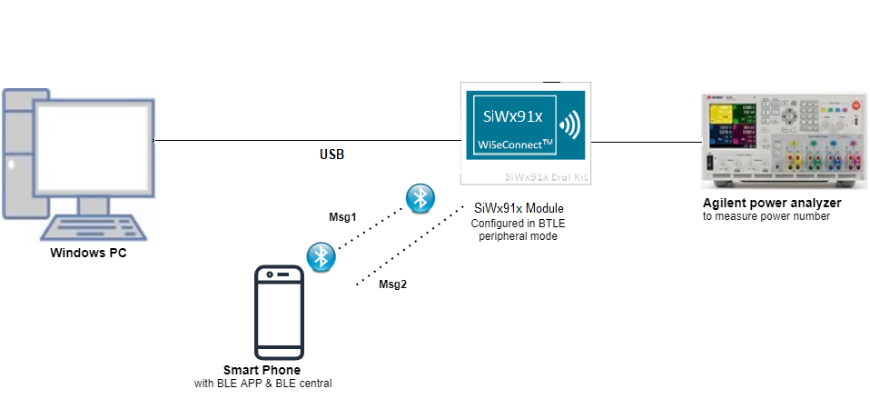
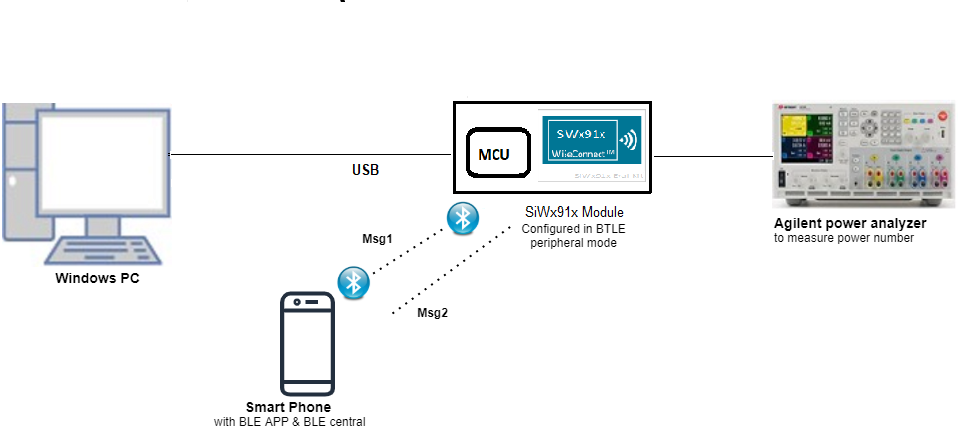
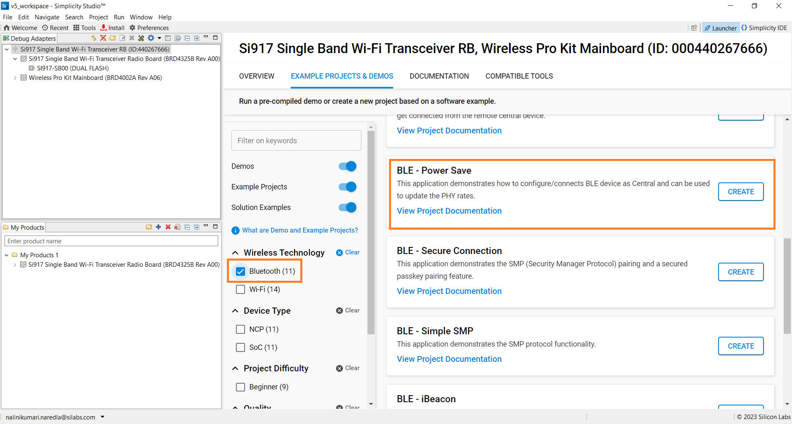
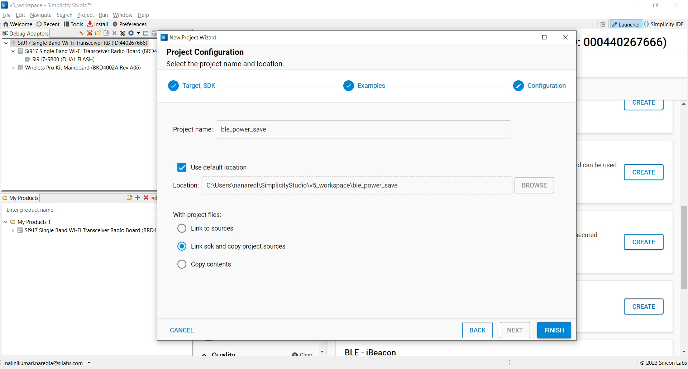
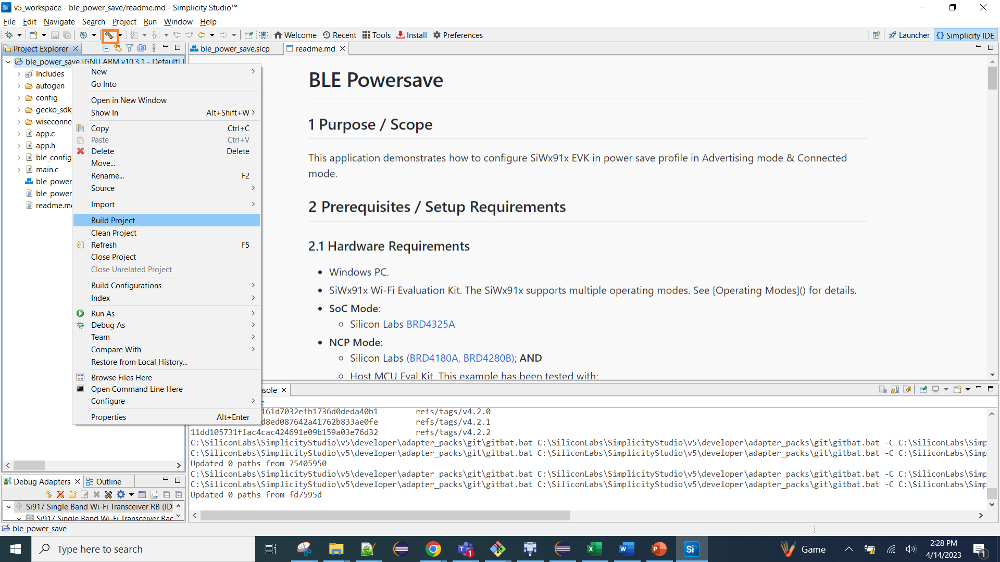
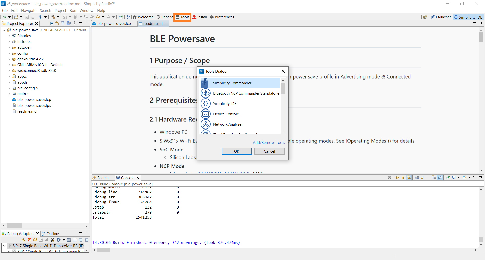
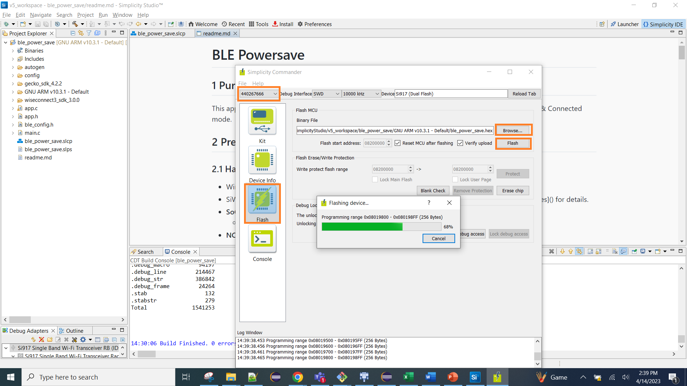
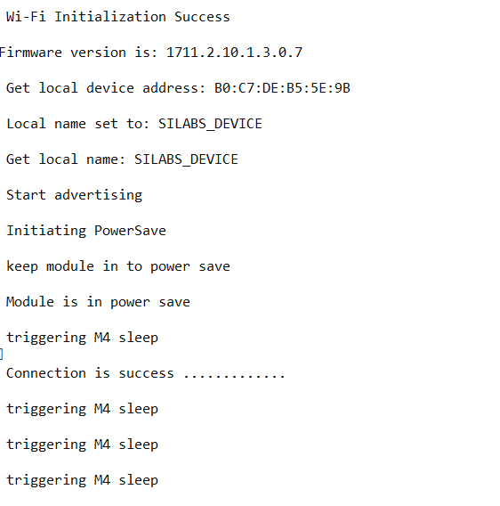

# BLE Powersave

## 1 Purpose / Scope

This application demonstrates how to configure SiWx91x in power save profile in Advertising mode & Connected mode.

## 2 Prerequisites / Setup Requirements

### 2.1 Hardware Requirements

- Windows PC.
- SiWx91x Wi-Fi Evaluation Kit. The SiWx91x supports multiple operating modes. See [Operating Modes]() for details.
- **SoC Mode**: 
  - Silicon Labs [BRD4325A BRD4280B, BRD4325G](https://www.silabs.com/)
- **NCP Mode**:
  - Silicon Labs [(BRD4180A, BRD4325B)](https://www.silabs.com/); **AND**
  - Host MCU Eval Kit. This example has been tested with:
  - Silicon Labs [WSTK + EFR32MG21](https://www.silabs.com/development-tools/wireless/efr32xg21-bluetooth-starter-kit)
- Agilent power analyzer

### 2.2 Software Requirements
    
- Embedded Development Environment
- Simplicity Studio IDE 
  - Download the [Simplicity Studio IDE](https://www.silabs.com/developers/simplicity-studio).
  
  - Follow the [Simplicity Studio user guide](https://docs.silabs.com/simplicity-studio-5-users-guide/1.1.0/ss-5-users-guide-getting-started/install-ss-5-and-software#install-ssv5) to install Simplicity Studio IDE.
  
- Download and install the Silicon Labs [EFR Connect App](https://www.silabs.com/developers/efr-connect-mobile-app) in the android smart phones for testing BLE applications. Users can also use their choice of BLE apps available in Android/iOS smart phones.

### 2.3 Setup Diagram
   
**SoC Mode :**

 

Follow the [Getting Started with SiWx91x SoC](https://docs.silabs.com/) guide to set up the hardware connections and Simplicity Studio IDE.
  
**NCP Mode :**  

 

Follow the [Getting Started with EFx32](https://docs.silabs.com/rs9116-wiseconnect/latest/wifibt-wc-getting-started-with-efx32/) guide to setup the hardware connections and Simplicity Studio IDE.

## 3 Project Environment

1. Ensure the SiWx91x loaded with the latest firmware following the [Getting started with a PC](https://docs.silabs.com/rs9116/latest/wiseconnect-getting-started)

2. Ensure the EFx32 and SiWx91x set up is connected to your PC.

3. Ensure the latest Gecko SDK along with the extension Si917 COMBO SDK is added to Simplicity Studio.

### 3.1 Creating the Project

#### 3.1.1 SoC Mode

1. Ensure the SiWx91x setup is connected to your PC.

- In the Simplicity Studio IDE, the SiWx91x SoC board will be detected under **Debug Adapters** pane as shown below.

   
   
- Studio should detect your board. Your board will be shown here. Click on the board detected and go to **EXAMPLE PROJECTS & DEMOS** section.  

- Filter for Bluetooth examples from the Gecko SDK added. For this, check the *Bluetooth* checkbox under **Wireless Technology** and select *BLE - Power Save* application.

   

- Click 'Create'. The "New Project Wizard" window appears. Click 'Finish'

  

#### 3.1.2 NCP Mode

1. Ensure the EFx32 and SiWx91x setup is connected to your PC.

- In the Simplicity Studio IDE, the EFR32 board will be detected under **Debug Adapters** pane as shown below.
   
   

- Ensure the latest Gecko SDK along with the WiSeConnect 3 extension is added to Simplicity Studio.

- Go to the 'EXAMPLE PROJECT & DEMOS' tab and select *BLE - Power Save* application.

- Click 'Create'. The "New Project Wizard" window appears. Click 'Finish'.

  

### 3.3 Setup for Application Prints

You can use either of the below USB to UART converters for application prints.

1. Set up using USB to UART converter board.

    - Connect Tx (Pin-6) to P27 on WSTK
    - Connect GND (Pin 8 or 10) to GND on WSTK

      

2. Setup using USB to UART converter cable.

    - Connect RX (Pin 5) of TTL convertor to P27 on WSTK
    - Connect GND (Pin1) of TTL convertor to GND on WSTK

      

**Tera term setup - for NCP and SoC modes**

1. Open the Tera Term tool. 
   - For SoC mode, choose the serial port to which USB to UART converter is connected and click on **OK**. 

     ****

   - For NCP mode, choose the J-Link port and click on **OK**.

     ****

2. Navigate to the Setup → Serial port and update the baud rate to **115200** and click on **OK**.

   ****

   ****

## 4 Application Build Environment

### 4.1 Configure the Application

The application can be configured to suit your requirements and development environment. Read through the following sections and make any changes needed.

**4.1** Open `ble_config.h` file and update/modify following macros

**4.1.1** User must update the below parameters

   ```c
   #define RSI_BLE_LOCAL_NAME       "SILABS_DEVICE"
   #define RSI_BLE_DEV_ADDR         "11:11:11:11:11:11"     // Address of the device to connect
   #define RSI_REMOTE_DEVICE_NAME   "SLAVE"                 // Remote Device Name to connect
   ```

   Configure the required mode `BLE_ROLE` using the below three macros 

   ```c
   #define PERIPHERAL_ROLE  0
   #define CENTRAL_ROL      1
   #define DUAL_MODE        2

   #define BLE_ROLE        PERIPHERAL_ROLE
   ```

   **To Enable Power Save**
   
   **PSP\_MODE** refers power save profile mode. The Silicon Labs device device supports following power modes in BTLE,
   
   **RSI_ACTIVE (0):** In this mode, the Silicon Labs device is active and power save is disabled.
   
   **RSI_SLEEP_MODE_2 (1):** This mode is applicable when the Silicon Labs device is in Advertising state as well as in connected state. In this sleep mode, SoC will go to sleep based on GPIO handshake or Message exchange, therefore handshake is required before sending data to the Silicon Labs device.
   
   **RSI_SLEEP_MODE_8 (8):** In this power mode, the Silicon Labs device goes to power save when it is in the unassociated state with the remote device. In this sleep mode, SoC will go to sleep based on GPIO handshake or Message exchange, therefore handshake is required before sending the command to the Silicon Labs device.

   ```c
   #define PSP_MODE                             RSI_SLEEP_MODE_2
   ```

   **Note:**
    For `RSI_SLEEP_MODE_2` and `RSI_SLEEP_MODE_8` modes, GPIO or Message based handshake can be selected using `RSI_HAND_SHAKE_TYPE` macro which is defined in `ble_config.h`
 
   **Note:**                                                                                                                               
 In this example,user can verify `RSI_SLEEP_MODE_2` with Message based handshake. If the user wants to verify other power modes,   
 the user has to change the application as well as GPIO handshake signals                                                              
  
   **PSP\_TYPE** refers power save profile type. The Silicon Labs device device supports following power save profile types in BTLE mode,
   **RSI\_MAX\_PSP (0):** In this mode, the Silicon Labs device device will be in Maximum power save mode. i.e Device will wake up for every DTIM beacon and do data Tx and Rx.

   ```c
   #define PSP_TYPE                             RSI_MAX_PSP
   ```

   **Following are the non-configurable macros in the application.**
  
   Following are the event numbers for advertising, connection and Disconnection events:

   ```c
   #define RSI_APP_EVENT_ADV_REPORT             0
   #define RSI_APP_EVENT_CONNECTED              1
   #define RSI_APP_EVENT_DISCONNECTED           2
   ```

   **Opermode command parameters**

   ```c
   #define RSI_FEATURE_BIT_MAP                  FEAT_SECURITY_OPEN
   #define RSI_TCP_IP_BYPASS                    RSI_DISABLE
   #define RSI_TCP_IP_FEATURE_BIT_MAP           TCP_IP_FEAT_DHCPV4_CLIENT
   #define RSI_CUSTOM_FEATURE_BIT_MAP           FEAT_CUSTOM_FEAT_EXTENTION_VALID
   #define RSI_EXT_CUSTOM_FEATURE_BIT_MAP       (EXT_FEAT_XTAL_CLK_ENABLE | EXT_FEAT_LOW_POWER_MODE)
   ```

   > **Note:**
 > If no memory configuration is specified, it will take EXT_FEAT_384K_MODE by default.

   `RSI_HAND_SHAKE_TYPE` is used to select GPIO or Message based handshake in RSI_SLEEP_MODE_2 and RSI_SLEEP_MODE_8 modes.

   ```c
   #define RSI_HAND_SHAKE_TYPE                  GPIO_BASED
   ```

   `RSI_SELECT_LP_OR_ULP_MODE` is used to select low power mode or ultra low power mode. Valid configurations are, RSI_LP_MODE or RSI_ULP_WITH_RAM_RET or RSI_ULP_WITHOUT_RAM_RET
   
   `RSI_LP_MODE`
   
   In this, the Silicon Labs device will be in Low power mode.
   
   `RSI_ULP_WITH_RAM_RET`
   
   In this, the Silicon Labs device will be in Ultra low power mode and it will remember the previous state after issuing power save mode command.

   `RSI_ULP_WITHOUT_RAM_RET`

   In this, the Silicon Labs device will be in Ultra low power mode and it will not remember the previous state after issuing power save mode command. After wakeup, the Silicon Labs device will give CARD READY indication and the user has to issue commands from wireless initialization.

   ```c
   #define RSI_SELECT_LP_OR_ULP_MODE            RSI_ULP_WITH_RAM_RET
   ```

### 4.2 Build the Application

- Follow the below steps for the successful execution of the application.

#### Build Project - SoC Mode

- Once the project is created, click on the build icon (hammer) to build the project (or) right click on project and click on Build Project.

   
      
#### Build Project - NCP Mode

   

### 4.3 Run and Test the application

#### 4.3.1 Load the Firmware

1. Click on Tools and Simplicity Commander as shown below.

   
   
2. Load the firmware image

- Select the board. 
- Browse the application image (.hex) and click on Flash button.

   

### 4.3.2 Running the SiWx91x Application

1. After the program gets executed, the Silicon Labs device  would be in Advertising state with configured power save the profile.

2. Connect any serial console for prints.

3. The Silicon Labs device will go to sleep and wakes up for every advertising interval and goes back to sleep after advertising. Refer the given below image for power save cycle in advertising mode.    
   
4. Open an EFR Connect App in the Smartphone and do Scan
   
5. In the App, Silicon Labs device will appear with the name configured in the macro **RSI\_BLE\_LOCAL\_NAME (Ex: "WLAN\_BLE\_SIMPLE")** or sometimes observed as the 
   Silicon Labs device as the internal name **"SILABS_DEVICE".** 
   
6. Initiate connection from the mobile App.
   
7. After successful connection, user can see the connected state in EFR connect app and also check the supported services by the Silicon Labs device.  
   
7. After successful connection, Silicon Labs device goes to sleep and wakes up for every connection interval. Check the below image for power save cycle after connection.
   
9. After successful program execution, if the Silicon Labs device is configured in PERIPHERAL_ROLE , the prints in teraterm looks as shown below.     
   
 **Note:** 

- Default configuration of connection interval of Central device (smartphone) is 18 ms. So, the Silicon Labs device  will wake up for every 18ms sec and goes back to sleep after advertise.                                                                                                                              
- Above power save profile image capture when it is in the idle state after successful connection. So, the user may not get same profile as shown above image.
   It will vary based on the traffic.                                                     

### 4.3.3 Application Output

  
