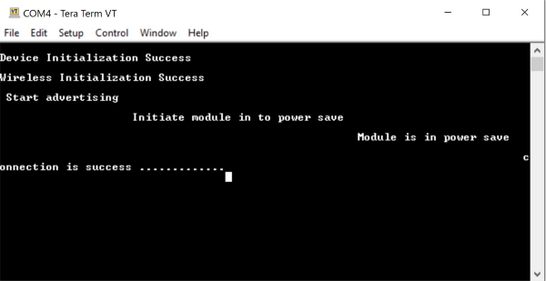

# BLE Powersave

## 1 Purpose / Scope

This application demonstrates how to configure SiWx91x in power save profile in Advertising mode & Connected mode.

## 2 Prerequisites / Setup Requirements

### 2.1 Hardware Requirements

- Windows PC.
- SiWx91x Wi-Fi Evaluation Kit. The SiWx91x supports multiple operating modes. See [Operating Modes]() for details.
- **SoC Mode**:
  - Silicon Labs [BRD4325A, BRD4325B, BRD4325C, BRD4325G, BRD4338A, BRD4340A](https://www.silabs.com/)
- **NCP Mode**:
  - Silicon Labs [BRD4180B](https://www.silabs.com/); **AND**
  - Host MCU Eval Kit. This example has been tested with:
  - Silicon Labs [WSTK + EFR32MG21](https://www.silabs.com/development-tools/wireless/efr32xg21-bluetooth-starter-kit)
- Agilent power analyzer

### 2.2 Software Requirements

- Embedded Development Environment
- Simplicity Studio IDE
  - Download the [Simplicity Studio IDE](https://www.silabs.com/developers/simplicity-studio).
  
  - Follow the [Simplicity Studio user guide](https://docs.silabs.com/simplicity-studio-5-users-guide/1.1.0/ss-5-users-guide-getting-started/install-ss-5-and-software#install-ssv5) to install Simplicity Studio IDE.
  
- Download and install the Silicon Labs [EFR Connect App](https://www.silabs.com/developers/efr-connect-mobile-app) in the android smart phones for testing BLE applications. Users can also use their choice of BLE apps available in Android/iOS smart phones.

### 2.3 Setup Diagram

**SoC Mode :**


**NCP Mode :**  


**NOTE**: 
The Host MCU platform (EFR32xG21) and the SiWx91x interact with each other through the SPI interface. 

Follow the [Getting Started with Wiseconnect3 SDK](https://docs.silabs.com/wiseconnect/latest/wiseconnect-getting-started/) guide to set up the hardware connections and Simplicity Studio IDE.

## 3 Project Environment

- Ensure the SiWx91x loaded with the latest firmware following the [Upgrade Si91x firmware](https://docs.silabs.com/wiseconnect/latest/wiseconnect-getting-started/getting-started-with-soc-mode#upgrade-si-wx91x-connectivity-firmware)

- Ensure the latest Gecko SDK along with the extension WiSeConnect3 is added to Simplicity Studio.

### 3.1 Creating the project

#### 3.1.1 SoC mode

- Ensure the SiWx91x set up is connected to your PC.

- In the Simplicity Studio IDE, the SiWx91x SoC board will be detected under **Debug Adapters** pane as shown below.

  ****

#### 3.1.2 NCP mode

- Ensure the EFx32 and SiWx91x set up is connected to your PC.

- In the Simplicity Studio IDE, the EFR32 board will be detected under **Debug Adapters** pane as shown below.

  ****

### 3.2 Importing the project

- Studio should detect your board. Your board will be shown here. Click on the board detected and go to **EXAMPLE PROJECTS & DEMOS** section 

#### SOC Mode

- Select **BLE - Power Save** test application

  ****

- Click 'Create'. The "New Project Wizard" window appears. Click 'Finish'

  ****

### 3.3 Set up for application prints

#### 3.3.1 Teraterm set up - for BRD4325A, BRD4325B, BRD4325C, BRD4325G, BRD4340A

You can use either of the below USB to UART converters for application prints.

1. Set up using USB to UART converter board.

   - Connect Tx (Pin-6) to P27 on WSTK
   - Connect GND (Pin 8 or 10) to GND on WSTK

   ****

2. Set up using USB to UART converter cable.

   - Connect RX (Pin 5) of TTL convertor to P27 on WSTK
   - Connect GND (Pin1) of TTL convertor to GND on WSTK

   ****

3. Open the Teraterm tool.

   - For SoC mode, choose the serial port to which USB to UART converter is connected and click on **OK**.

     ****

**Note:** For Other 917 SoC boards please refer section #3.3.2

#### 3.3.2 **Teraterm set up - for NCP and SoC modes**

1. Open the Teraterm tool.

- choose the J-Link port and click on **OK**.
    
    ****

2. Navigate to the Setup → Serial port and update the baud rate to **115200** and click on **OK**.

    ****

    ****

## 4 Application Build Environment

### 4.1 Configure the Application

The application can be configured to suit your requirements and development environment. Read through the following sections and make any changes needed.

**4.1.1**  In the Project explorer pane of the IDE, expand the **ble_power_save** folder and open the **ble_config.h** file. Configure the following parameters based on your requirements.    


- **SiWx91x BLE Device Configuration**

   ```c
   //BLE_ROLE refers to the SiWx91x device role, valid configurations are PERIPHERAL_ROLE, CENTRAL_ROLE & DUAL_ROLE.
   #define BLE_ROLE    PERIPHERAL_ROLE
   ```
   
- **Remote Peripheral device paramters**

  ```c
  // RSI_BLE_DEV_ADDR_TYPE refers to the address type of the remote device to connect.
  //! Based on address type of remote device, valid configurations are LE_RANDOM_ADDRESS and LE_PUBLIC_ADDRESS
 
	#define RSI_BLE_DEV_ADDR_TYPE                          LE_PUBLIC_ADDRESS 
  
  //RSI_BLE_DEV_ADDR refers to the address of the remote device to connect.
  
   #define RSI_BLE_DEV_ADDR                               "00:1E:7C:25:E9:4D" 
  
  //RSI_REMOTE_DEVICE_NAME refers to the name of remote device to which Silicon Labs device has to connect.

   #define RSI_REMOTE_DEVICE_NAME                         "SILABS_DEV" 
  ```
  
  **Note:** you required to configure either the `RSI_BLE_DEV_ADDR` or `RSI_REMOTE_DEVICE_NAME` of the remote device.
  
- **Power Save Configuration**
Configure "ENABLE_POWER_SAVE" parameter to enable power save mode.  
  
   ```c
   #define ENABLE_POWER_SAVE              1
   ```
   
   **Note:** If you are using the NCP-EXP-Board, refer the "**Powersave functionality with NCP expansion board**" section  the ***Getting started with SiWx91x NCP*** guide.

- **Power Save Modes**

   **PSP_MODE** refers power save profile mode. The Silicon Labs device device supports following power modes in BTLE,
   
   **RSI_ACTIVE (0):** In this mode, the Silicon Labs device is active and power save is disabled.
   
   **RSI_SLEEP_MODE_2 :** This mode is applicable when the Silicon Labs device is in Advertising state as well as in connected state. In this sleep mode, SoC will go to sleep based on GPIO handshake, therefore handshake is required before sending data to the Silicon Labs device.
   
   **RSI_SLEEP_MODE_8 :** In this power mode, the Silicon Labs device goes to power save when it is in the unassociated state with the remote device. In this sleep mode, SoC will go to sleep based on Message exchange, therefore handshake is required before sending the command to the Silicon Labs device.     
   
   **Note:** Default `RSI_SLEEP_MODE_2` with `MAX_PSP` is configured in the application.

-  **Opermode command parameters** 
  This configuration can be found in app.c as `config`	

   **Note:** `ble_config.h` and `app.c` files are already set with desired configuration in respective example folders you need not change for each example.

### 4.2 Build the Application

- Follow the below steps for the successful execution of the application.

#### Build Project - SoC Mode

- Once the project is created, click on the build icon (hammer) to build the project (or) right click on project and click on Build Project.

   

#### Build Project - NCP Mode

   

### 4.3 Run and Test the application

#### 4.3.1 Load the Firmware

1. Click on Tools and Simplicity Commander as shown below.

   

2. Load the firmware image

- Select the board.
- Browse the application image (.hex) and click on Flash button.

   

### 4.3.2 Running the SiWx91x Application
Application has the feasibility to configure the CENTRAL ROLE (or) PERIPHERAL ROLE (or) DUAL ROLE. Default, the application is configured in the **PERIPHERAL ROLE**
**Note:**      
- The provided mobile screenshots are from the 2.5.2 version of the EFR Connect app, it is recommended to use the latest version.

1. After the program gets executed, the Silicon Labs device  would be in Advertising state with configured power save the profile.

2. Connect any serial console for prints.

3. The Silicon Labs device will go to sleep and wakes up for every advertising interval and goes back to sleep after advertising. Refer the given below image for power save cycle in advertising mode.
       

4. Open an EFR Connect App in the Smartphone and do Scan

5. In the App, Silicon Labs device will appear with the name configured in the macro **RSI_BLE_LOCAL_NAME (Ex: "WLAN_BLE_SIMPLE")** or sometimes observed as the Silicon Labs device as the internal name **"SILABS_DEVICE".**
 

6. Initiate connection from the mobile App.

7. After successful connection, user can see the connected state in EFR connect app and also check the supported services by the Silicon Labs device.  
 

8. After successful connection, Silicon Labs device goes to sleep and wakes up for every connection interval. Check the below image for power save cycle after connection.
    

9. After successful program execution, if the Silicon Labs device is configured in PERIPHERAL_ROLE , the prints in teraterm looks as shown below.

 **Note:**

- Default configuration of connection interval of Central device (smartphone) is 18 ms. So, the Silicon Labs device  will wake up for every 18ms sec and goes back to sleep after advertise.
- Above power save profile image capture when it is in the idle state after successful connection. So, the user may not get same profile as shown above image.
It will vary based on the traffic.

### 4.3.3 Application Output

  

## **4.4 Current consumption measurement**

- **NCP**      
   - A Power meter can be used to measure the current consumption of SiWx91x NCP module.     
        
   - Negative probe of power meter should be connected to J2.1 pin and the positive probe should be connected to J2.2 pin.    
   -  Average current consumption of SiWx91x NCP module as measured with a power-meter.      
   

- **SoC**

   - Refer [AEM measurement](https://docs.silabs.com/) section in ***Getting Started with SiWx91x SoC*** guide for measuring current consumption of SiWx91x SoC module.    
    
 
**NOTE:** 
- The measured current may vary if the scenario is performed in open environment. 