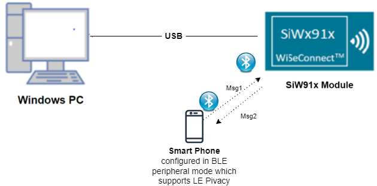
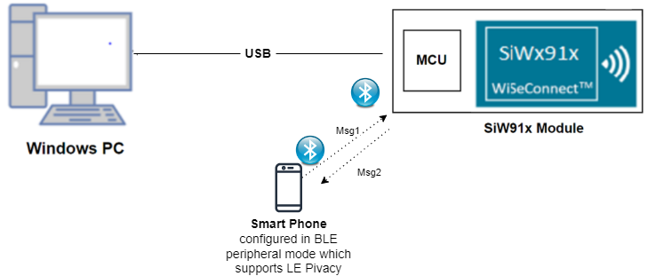
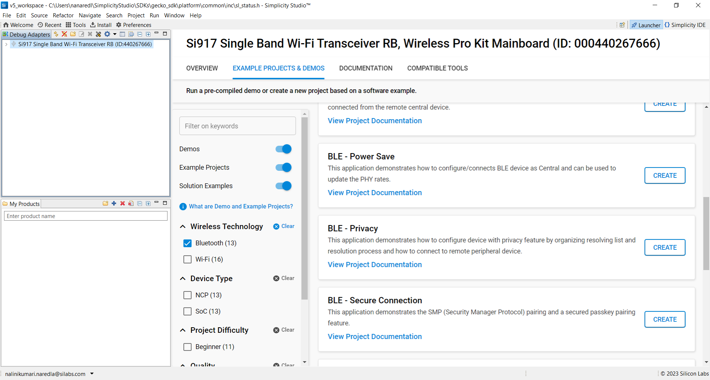
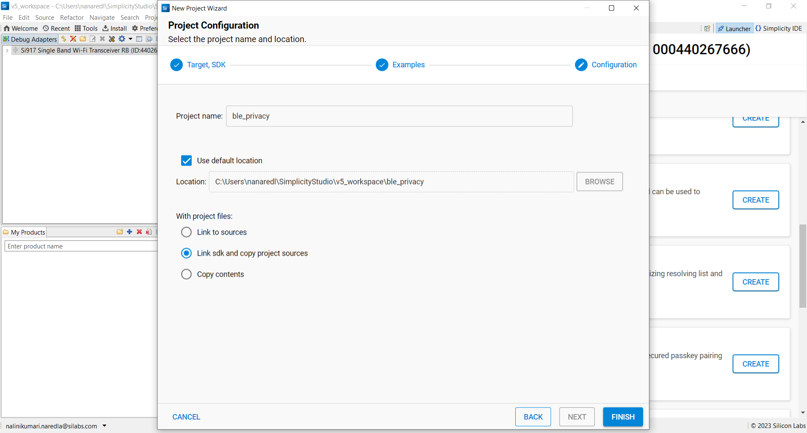
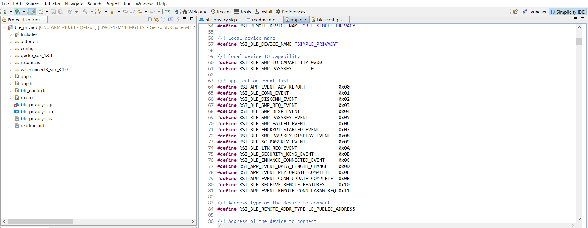
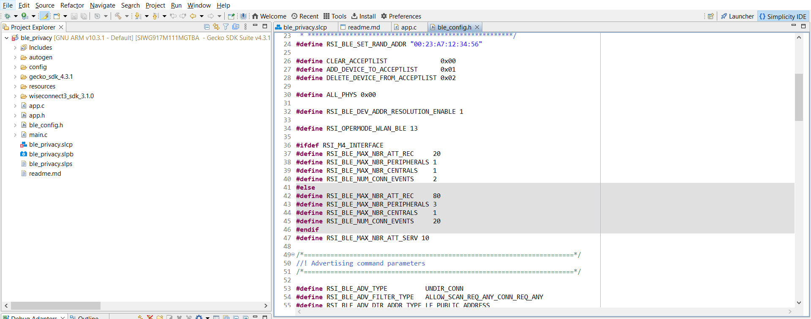
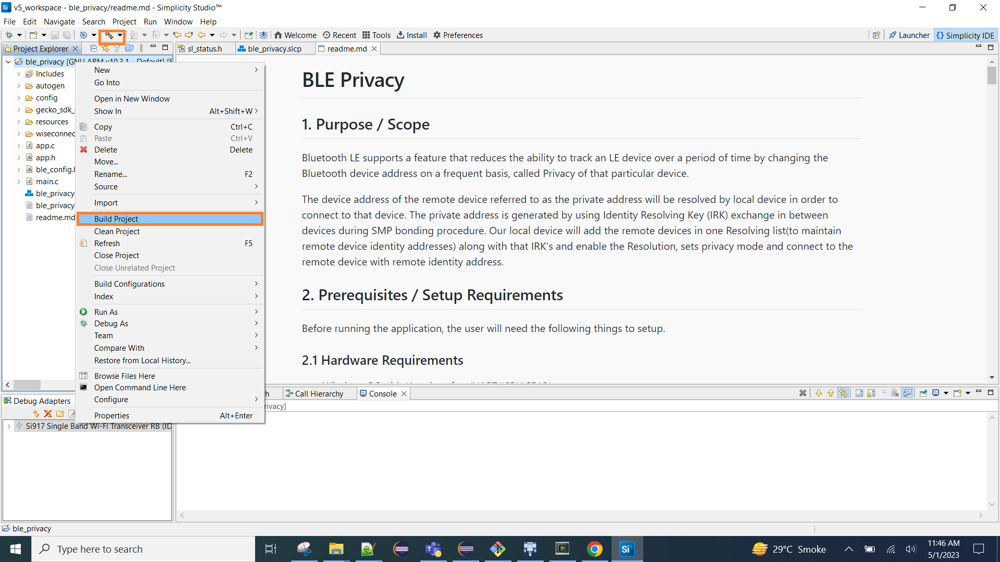
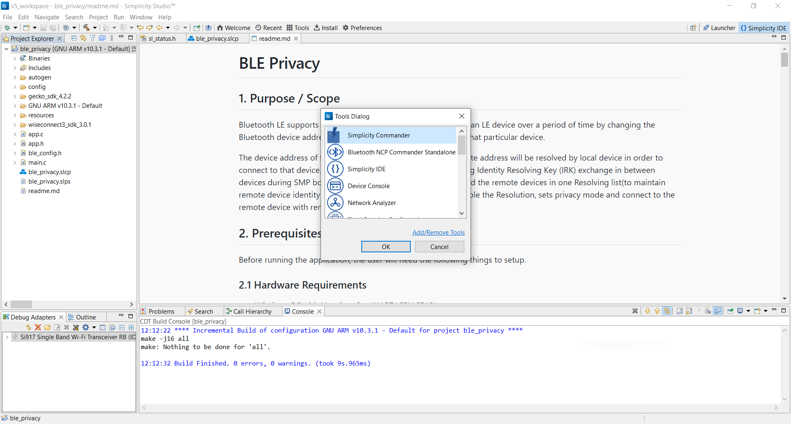
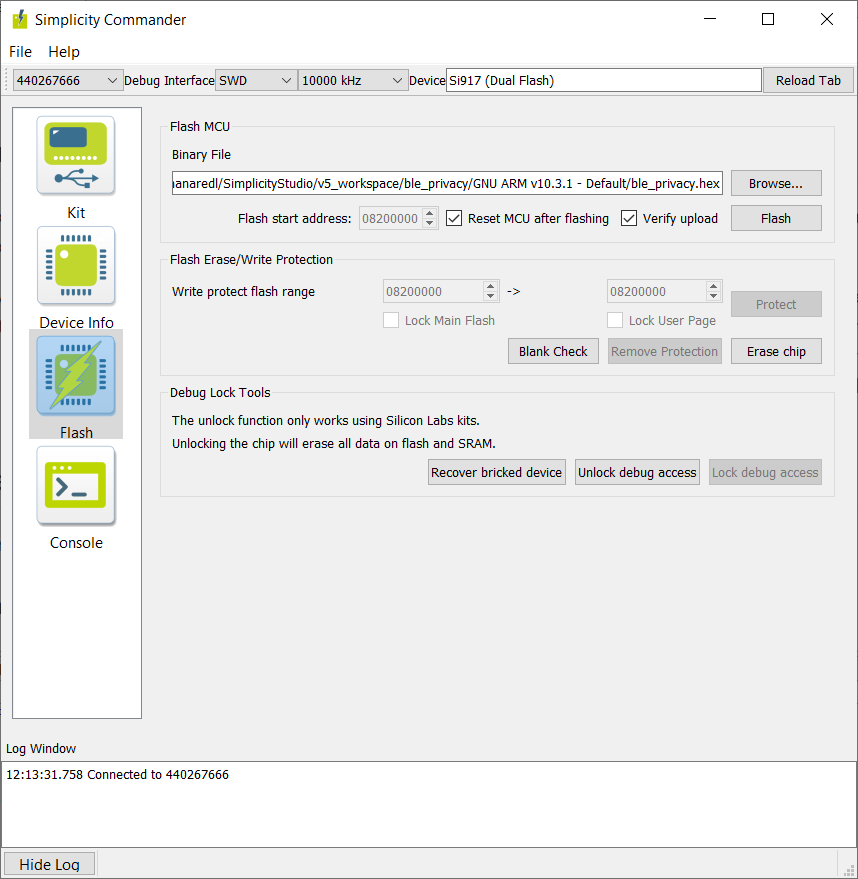

# BLE Privacy

## 1. Purpose / Scope

Bluetooth LE supports a feature that reduces the ability to track an LE device over a period of time by changing the Bluetooth device address on a frequent basis, called Privacy of that particular device.

The device address of the remote device referred to as the private address will be resolved by local device in order to connect to that device. The private address is generated by using Identity Resolving Key (IRK) exchange in between devices during SMP bonding procedure. Our local device will add the remote devices in one Resolving list(to maintain remote device identity addresses) along with that IRK's and enable the Resolution, sets privacy mode and connect to the remote device with remote identity address.

## 2. Prerequisites / Setup Requirements

Before running the application, the user will need the following things to setup.

### 2.1 Hardware Requirements

- Windows PC with Host interface(UART/ SPI/ SDIO).
  - SiWx91x Wi-Fi Evaluation Kit. The SiWx91x supports multiple operating modes. See [Operating Modes]() for details.
  - **SoC Mode**:
    - Silicon Labs [BRD4325A, BRD4325B, BRD4325C, BRD4325G, BRD4338A](https://www.silabs.com/)
  - **NCP Mode**:
    - Silicon Labs [BRD4180B](https://www.silabs.com/);
    - Host MCU Eval Kit. This example has been tested with:
      - Silicon Labs [WSTK + EFR32MG21](https://www.silabs.com/development-tools/wireless/efr32xg21-bluetooth-starter-kit)
- BLE peripheral device which supports privacy feature

### 2.2 Software Requirements

- Embedded Development Environment
  - For Silicon Labs EFx32, use the latest version of [Simplicity Studio](https://www.silabs.com/developers/simplicity-studio)

- Download and install the Silicon Labs [EFR Connect App](https://www.silabs.com/developers/efr-connect-mobile-app) in the android smart phones for testing BLE applications. Users can also use their choice of BLE apps available in Android/iOS smart phones.

### 2.3 Setup Diagram
  
- **SoC Mode :**

   

- **NCP Mode :**  
   

**NOTE**: 
- The Host MCU platform (EFR32xG21) and the SiWx91x interact with each other through the SPI interface. 

Follow the [Getting Started with Wiseconnect3 SDK](https://docs.silabs.com/wiseconnect/latest/wiseconnect-getting-started/) guide to set up the hardware connections and Simplicity Studio IDE.

## 3 Project Environment

- Ensure the SiWx91x loaded with the latest firmware following the [Upgrade Si91x firmware](https://docs.silabs.com/wiseconnect/latest/wiseconnect-getting-started/getting-started-with-soc-mode#upgrade-si-wx91x-connectivity-firmware)

- Ensure the latest Gecko SDK along with the extension WiSeConnect3 is added to Simplicity Studio.

### 3.1 Creating the project

#### 3.1.1 SoC mode

- Ensure the SiWx91x set up is connected to your PC.

- In the Simplicity Studio IDE, the SiWx91x SoC board will be detected under **Debug Adapters** pane as shown below.

  ****

#### 3.1.2 NCP mode

- Ensure the EFx32 and SiWx91x set up is connected to your PC.

- In the Simplicity Studio IDE, the EFR32 board will be detected under **Debug Adapters** pane as shown below.

  ****

### 3.2 Importing the project

- Studio should detect your board. Your board will be shown here. Click on the board detected and go to **EXAMPLE PROJECTS & DEMOS** section 

#### SOC Mode

- Select **BLE - Privacy** test application

  ****

- Click 'Create'. The "New Project Wizard" window appears. Click 'Finish'

  ****
  
### 3.3 Set up for application prints

#### 3.3.1 Teraterm set up - for BRD4325A, BRD4325B, BRD4325C, BRD4325G

You can use either of the below USB to UART converters for application prints.

1. Set up using USB to UART converter board.

   - Connect Tx (Pin-6) to P27 on WSTK
   - Connect GND (Pin 8 or 10) to GND on WSTK

   ****

2. Set up using USB to UART converter cable.

   - Connect RX (Pin 5) of TTL convertor to P27 on WSTK
   - Connect GND (Pin1) of TTL convertor to GND on WSTK

   ****

3. Open the Teraterm tool.

   - For SoC mode, choose the serial port to which USB to UART converter is connected and click on **OK**.

     ****

**Note:** For Other 917 SoC boards please refer section #3.3.2

#### 3.3.2 **Teraterm set up - for NCP and SoC modes**

1. Open the Teraterm tool.

- choose the J-Link port and click on **OK**.
    
    ****

2. Navigate to the Setup → Serial port and update the baud rate to **115200** and click on **OK**.

    ****

    ****

## 4. Application Build Environment

### 3.1 Project Setup

- **SoC Mode**
  - **Silicon Labs SiWx91x SoC**: Follow the [Getting Started with SiWx91x SoC](https://docs.silabs.com/) to setup the example to work with SiWx91x SoC and Simplicity Studio.
- **NCP Mode**
  - **Silicon Labs EFx32 Host** Follow the [Getting Started with EFx32](https://docs.silabs.com/rs9116-wiseconnect/latest/wifibt-wc-getting-started-with-efx32/) to setup the example to work with EFx32 and Simplicity Studio.
  
### 3.2 NCP Mode - Host Interface

By default, the application is configured to use the SPI bus for interfacing between Host platforms(EFR32MG21) and the SiWx91x EVK.

## 4. Application Build Environment

## 4.1 Application Configuration Parameters

The application can be configured to suit your requirements and development environment. Read through the following sections and make any changes needed.

**4.1.1** In the Project explorer pane of the IDE, expand the **ble_privacy** folder and open the **app.c** file. 



   - **BLE SMP Privacy configuration parameters**
   
      ```c
      //RSI_BLE_DEVICE_NAME refers the name of the Silicon Labs device to appear during scanning by remote devices.
      #define RSI_BLE_DEVICE_NAME                              "SIMPLE_PRIVACY"

      //RSI_BLE_PRIVACY_MODE refers the type of the privacy mode, Valid configurations are RSI_BLE_DEVICE_PRIVACY_MODE and RSI_BLE_NETWORK_PRIVACY_MODE
      #define RSI_BLE_PRIVACY_MODE RSI_BLE_DEVICE_PRIVACY_MODE

      //RSI_BLE_SMP_IO_CAPABILITY refers the IO capability of Silicon Labs device for SMP
      #define RSI_BLE_SMP_IO_CAPABILITY                        0x00

      //RSI_BLE_SMP_PASSKEY is smp passkey key from Silicon Labs device
      #define RSI_BLE_SMP_PASSKEY                              0

      //RSI_BLE_SET_RESOLVABLE_PRIV_ADDR_TOUT refers resolution timeout , that is the length of time the Controller uses a Resolvable Private Address before a new resolvable private address is generated and starts being used.
      #define RSI_BLE_SET_RESOLVABLE_PRIV_ADDR_TOUT           120

      //Process type refers the operation to be performed on the resolving list. valid configurations for the process type are
      #define RSI_BLE_ADD_TO_RESOLVE_LIST                      1
      #define RSI_BLE_REMOVE_FROM_RESOLVE_LIST                 2
      #define RSI_BLE_CLEAR_RESOLVE_LIST                       3

      //RSI_BLE_RESOLVING_LIST_SIZE refers the resolving list size of Silicon Labs device.
      #define RSI_BLE_RESOLVING_LIST_SIZE                      5
      ```
      
   - **Remote device configuration parameters**
   
   ```c
   // RSI_BLE_REMOTE_ADDR_TYPE refers to the address type of the remote device to connect.
   //! Based on address type of remote device, valid configurations are LE_RANDOM_ADDRESS and LE_PUBLIC_ADDRESS
   
   #define RSI_BLE_REMOTE_ADDR_TYPE                          LE_PUBLIC_ADDRESS 
   
   //RSI_BLE_REMOTE_ADDR refers to the address of the remote device to connect.
   
   #define RSI_BLE_REMOTE_ADDR                               "00:23:A7:56:77:77" 
   
   //RSI_REMOTE_DEVICE_NAME refers to the name of remote device to which Silicon Labs device has to connect.

   #define RSI_REMOTE_DEVICE_NAME                            "BLE_SIMPLE_PRIVACY" 
   ```
   **Note:** you are required to configure either the `RSI_BLE_DEV_ADDR` or `RSI_REMOTE_DEVICE_NAME` of the remote device.

**4.1.2** Open **ble_config.h** file and configure the Resolution.   


   - **Resolution Parameter**
   
      ```c
      //RSI_BLE_DEV_ADDR_RESOLUTION_ENABLE refers address resolution is enable or not. It should be 1 to enable privacy feature.
      #define RSI_BLE_DEV_ADDR_RESOLUTION_ENABLE             1
      ```
      
   - **Opermode command parameters**
   This configuration can be found in app.c as `config`	

      
**Note:** `ble_config.h` and `app.c` files are already set with desired configuration in respective example folders you need not change for each example. 

### 4.2 Build the application

- Follow the below steps for the successful execution of the application.

#### Build Project - SoC Mode

- Once the project is created, click on the build icon (hammer) to build the project (or) right click on project and click on Build Project.

   

- Successful build output will show as below.

#### Build Project - NCP Mode

   

## 5. Testing the Application

- Follow the below steps for the successful execution of the application.

### 5.1 Loading the SiWx91x Firmware

- Refer [Getting started with a PC](https://docs.silabs.com/rs9116/latest/wiseconnect-getting-started) to load the firmware into SiWx91x EVK. The firmware file is located in `<SDK>/connectivity_firmware/`

#### 5.2 Load the Application Image

1. Click on Tools and Simplicity Commander as shown below.

   

2. Load the application image

- Select the board.
- Browse the application image (.hex) and click on Flash button.

   

### 5.3 Application Execution Flow
Application has the feasibility to configure the PERIPHERAL ROLE (OR) CENTRAL ROLE     
**Note:**      
- The provided mobile screenshots are from the 2.5.2 version of the EFR Connect app, it is recommended to use the latest version. 

**5.3.1 Steps to be followed to verify BLE Privacy application as a PERIPHERAL_ROLE**

1. If Silicon Labs device is configured as "PERIPHERAL_ROLE " specified in the macro RSI_DEVICE_ROLE, Silicon Labs device will be in the Advertising state.

2. Connect any serial console for prints.

3. Open a LE App in the Smartphone and do the scan.

4. In the App, Silicon Labs device device will appear with the name configured in the macro `RSI_BLE_DEVICE_NAME`.

   

5. Initiate a connection from the App by clicks on the **Connect** button

6. After a successful connection, the remote device sends the **SMP** request, and the Silicon Labs device will respond with the **SMP** response.   
       

7. The remote device receives the **pair** pop-up window, Once the user clicks on the **pair** button the Silicon Labs device receives the passkey.

8. Again the remote device receives the **pair** pop-up window, and click on the **pair**  button. Enter the received passkey as shown below.
          

9. After successful SMP connection security keys will exchange  between the Remote device and Silicon Labs device.

10. Silicon Labs device will add the remote device's IRK's and local IRK's in to resolve list and enable resolution

11. Give disconnect from remote device and the Silicon labs device starts advertising

**5.3.2 Steps to be followed to verify BLE Privacy application as a CENTRAL_ROLE**

1. If Silicon Labs device is configured as **CENTRAL_ROLE** specified in the macro **RSI_DEVICE_ROLE**, Silicon Labs device will be in Scanning state.

2. Connect any serial console for prints.

3. Advertise the remote device.
     
**Note:** Refer the [Creating New Advertisement Sets](https://docs.silabs.com/bluetooth/5.0/miscellaneous/mobile/efr-connect-mobile-app) for configuring the EFR connect mobile APP as advertiser.

4. If Silicon Labs device receives an advertising report from a device with the name configured as `RSI_REMOTE_DEVICE_NAME` or bd address with address configured in `RSI_BLE_REMOTE_ADDR` in results ,local device will try to connect with remote device.

5. After connection Silicon Labs device which is in central mode will initiate an SMP request.  

6. Give a response from Remote device and passkey

7. After a successful SMP connection security keys will exchanged between Remote device and Silicon Labs device and the Silicon Labs device will add remote device's IRK's and local IRK's in to resolve list and enable resolution

8. Give disconnect from remote device and keep in advertise mode.

9. Now Silicon Labs device will try to connect to remote device with identity address.

10. After successful connection, Silicon Labs device will give start encryption instead of SMP repairing.

11. Encryption will be enabled on both sides.

### 5.4 Application output


