# BLE - Privacy

## High-Level Overview

Bluetooth LE supports a feature that reduces the ability to track an LE device over a period of time by changing the Bluetooth device address on a frequent basis, called the privacy of that...

## Table of Contents

- [High-Level Overview](#high-level-overview)
- [Table of Contents](#table-of-contents)
- [Purpose/Scope](#purposescope)
- [Prerequisites/Setup Requirements](#prerequisitessetup-requirements)
  - [Hardware Requirements](#hardware-requirements)
  - [Software Requirements](#software-requirements)
  - [NCP mode: host application and project files](#ncp-mode-host-application-and-project-files)
  - [Setup Diagram](#setup-diagram)
- [Steps to Run Demo](#steps-to-run-demo)
  - [Getting Started](#getting-started)
  - [Configuration and setup](#configuration-and-setup)
  - [Steps for execution](#steps-for-execution)
    - [Verify BLE Privacy application as a **PERIPHERAL_ROLE**](#verify-ble-privacy-application-as-a-peripheral_role)
    - [Verify BLE Privacy application as a **CENTRAL_ROLE**](#verify-ble-privacy-application-as-a-central_role)
- [Troubleshooting](#troubleshooting)
- [Resources](#resources)
- [Report Bugs and Get Support](#report-bugs-and-get-support)

## Purpose/Scope

Bluetooth LE supports a feature that reduces the ability to track an LE device over a period of time by changing the Bluetooth device address on a frequent basis, called the privacy of that particular device.
The device address of the remote device, referred to as the private address, will be resolved by the local device in order to connect to that device. The private address is generated by using the Identity Resolving Key (IRK) exchange between devices during the SMP bonding procedure. Our local device will add the remote devices in one Resolving list(to maintain remote device identity addresses) along with that IRK's and enable the Resolution, sets privacy mode and connect to the remote device with remote identity address.

## Prerequisites/Setup Requirements

### Hardware Requirements

- Windows PC with Host interface(UART/ SPI/ SDIO).
- SiWx91x Wi-Fi Evaluation Kit. The SiWx91x supports multiple operating modes. See [Operating Modes]() for details.
- **SoC Mode**:
  - Standalone
     - [BRD4002A](https://www.silabs.com/development-tools/wireless/wireless-pro-kit-mainboard?tab=overview) Wireless pro kit mainboard [SI-MB4002A]
   - Radio Boards 
      - [BRD4338A](https://www.silabs.com/development-tools/wireless/wi-fi/siwx917-rb4338a-wifi-6-bluetooth-le-soc-radio-board?tab=overview) [SiWx917-RB4338A]
      - [BRD4343A](https://www.silabs.com/development-tools/wireless/wi-fi/siw917y-rb4343a-wi-fi-6-bluetooth-le-8mb-flash-radio-board-for-module?tab=overview) [SiWx917-RB4343A]
      - [BRD4343C](https://www.silabs.com/development-tools/wireless/wi-fi/siw917y-rb4343c-wi-fi-6-bluetooth-le-8mb-flash-radio-board-for-module?tab=overview) [SiWx917-RB4343C]
  - Kits
  	 - SiWx917 Pro Kit [Si917-PK6031A](https://www.silabs.com/development-tools/wireless/wi-fi/siwx917-pro-kit?tab=overview)
  	 - SiWx917 Pro Kit [Si917-PK6032A]
    - SiWx917 AC1 Module Explorer Kit [BRD2708A](https://www.silabs.com/development-tools/wireless/wi-fi/siw917y-ek2708a-explorer-kit)
  - PSRAM Mode:  
    - Silicon Labs [[BRD4342A](https://www.silabs.com/development-tools/wireless/wi-fi/siwx91x-rb4342a-wifi-6-bluetooth-le-soc-radio-board?tab=overview)]
- **NCP Mode**:
  - Standalone
    - [BRD4002A](https://www.silabs.com/development-tools/wireless/wireless-pro-kit-mainboard?tab=overview) Wireless pro kit mainboard [SI-MB4002A]
    - EFR32xG24 Wireless 2.4 GHz +10 dBm Radio Board [xG24-RB4186C](https://www.silabs.com/development-tools/wireless/xg24-rb4186c-efr32xg24-wireless-gecko-radio-board?tab=overview)
    - NCP Expansion Kit with NCP Radio boards
      - [[BRD8045A](https://www.silabs.com/development-tools/wireless/wi-fi/expansion-adapter-board-for-co-processor-radio-boards?tab=overview) + [BRD4346A](https://www.silabs.com/development-tools/wireless/wi-fi/siwx917-rb4346a-wifi-6-bluetooth-le-soc-4mb-flash-radio-board?tab=overview) / [BRD4357A](https://www.silabs.com/development-tools/wireless/wi-fi/siw917y-rb4357a-wi-fi-6-bluetooth-le-4mb-flash-radio-board-for-rcp-and-ncp-modules?tab=overview) / [BRD4357C](https://www.silabs.com/development-tools/wireless/wi-fi/siw917y-rb4357c-wi-fi-6-bluetooth-le-4mb-flash-radio-board-for-rcp-and-ncp-modules?tab=overview)]
  - Kits
  	- EFR32xG24 Pro Kit +10 dBm [xG24-PK6009A](https://www.silabs.com/development-tools/wireless/efr32xg24-pro-kit-10-dbm?tab=overview)
  - Interface and Host MCU Supported
    - SPI - EFR32 
- Smartphone configured as BLE peripheral/Central.

### Software Requirements

- Embedded Development Environment
- Download and install the Silicon Labs [Simplicity Connect App(formerly EFR Connect App) or other BLE Central/Peripheral app.](https://www.silabs.com/developers/simplicity-connect-mobile-app ) in the android smart phones for testing BLE applications. Users can also use their choice of BLE apps available in Android/iOS smart phones.

> **Note:** The provided mobile screenshots are from the 2.8.1 version of the Simplicity Connect App(formerly EFR Connect App), it is recommended to use the latest version.

### NCP mode: host application and project files

| Mode | Host / target | Project file (this example folder) |
|------|----------------|-------------------------------------|
| SoC | Application runs on SiWx91x. | `ble_privacy_soc.slcp` |
| PSRAM | Application runs on SiWx91x with PSRAM-capable radio board. | `ble_privacy_psram.slcp` |
| NCP (SPI) | Application runs on **EFR32** host; SiWx917 is the network co-processor over **SPI**. | `ble_privacy_ncp.slcp` |

Open the `.slcp` for your kit from **`examples/snippets/ble/ble_privacy/`** in Simplicity Studio. For NCP, follow [Getting started with NCP mode](https://docs.silabs.com/wiseconnect/latest/wiseconnect-getting-started/getting-started-with-ncp-mode).

### Setup Diagram
  
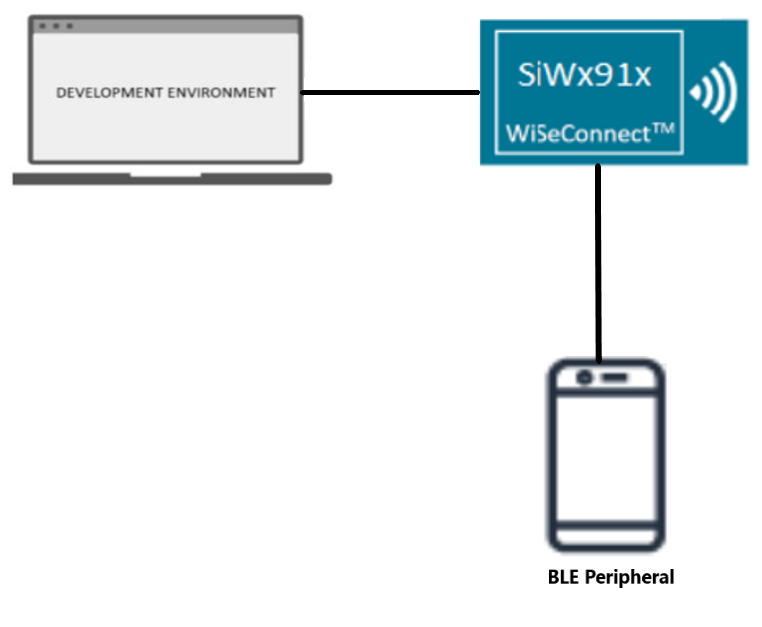

## Steps to Run Demo

### Getting Started

Refer to the instructions [here](https://docs.silabs.com/wiseconnect/latest/wiseconnect-getting-started/) to:

- [Install Simplicity Studio](https://docs.silabs.com/wiseconnect/latest/wiseconnect-developers-guide-developing-for-silabs-hosts/#install-simplicity-studio)
- [Install WiSeConnect extension](https://docs.silabs.com/wiseconnect/latest/wiseconnect-developers-guide-developing-for-silabs-hosts/#install-the-wi-se-connect-extension)
- [Connect your device to the computer](https://docs.silabs.com/wiseconnect/latest/wiseconnect-developers-guide-developing-for-silabs-hosts/#connect-si-wx91x-to-computer)
- [Upgrade your connectivity firmware ](https://docs.silabs.com/wiseconnect/latest/wiseconnect-developers-guide-developing-for-silabs-hosts/#update-si-wx91x-connectivity-firmware)
- [Create a Studio project ](https://docs.silabs.com/wiseconnect/latest/wiseconnect-developers-guide-developing-for-silabs-hosts/#create-a-project)

For details on the project folder structure, see the [WiSeConnect Examples](https://docs.silabs.com/wiseconnect/latest/wiseconnect-examples/#example-folder-structure) page.

### Configuration and setup

The application can be configured to suit your requirements and development environment. Read through the following sections and make any changes needed.

- Open `app.c` file and update/modify the following parameters

   - `RSI_BLE_DEVICE_NAME` refers the name of the Silicon Labs device to appear during scanning by remote devices.

      ```c
      #define RSI_BLE_DEVICE_NAME                              "SIMPLE_PRIVACY"
      ```

   - `RSI_DEVICE_ROLE` refers the role of the Silicon Labs device. Possible values are PERIPHERAL_ROLE and CENTRAL_ROLE

      ```c
      #define RSI_DEVICE_ROLE                                  PERIPHERAL_ROLE 
      ```

   - `RSI_BLE_DEV_ADDR_TYPE` refers the address type of the remote device.

      ```c
      #define RSI_BLE_REMOTE_ADDR_TYPE                         LE_PUBLIC_ADDRESS
      ```

   - `RSI_BLE_REMOTE_ADDR` refers remote device address which has to connect.

      ```c
      #define RSI_BLE_REMOTE_ADDR                              "00:23:A7:56:77:77"
      ```

   - `RSI_REMOTE_DEVICE_NAME` refers the name of the Remote device to which Silicon Labs device initiate connection.

      ```c
      #define RSI_REMOTE_DEVICE_NAME                           "BLE_SIMPLE_PRIVACY"
      ```
  
   - `RSI_BLE_SMP_IO_CAPABILITY` refers the IO capability of Silicon Labs device for SMP, `RSI_BLE_SMP_PASSKEY` is smp passkey key from Silicon Labs device.

      ```c
      #define RSI_BLE_SMP_IO_CAPABILITY                        0x00
      #define RSI_BLE_SMP_PASSKEY                              0
      ```

- The desired parameters are provided in following steps. User can also modify the parameters as per their needs and requirements.

   - Following are the **non-configurable** macros in the application.

   - Following are the event numbers for connection, disconnection, and enhanced connection events.

      ```c
      #define RSI_APP_EVENT_ADV_REPORT                         0x00
      #define  RSI_BLE_CONN_EVENT                              0x01
      #define  RSI_BLE_DISCONN_EVENT                           0x02
      #define  RSI_BLE_SMP_REQ_EVENT                           0x03
      #define  RSI_BLE_SMP_RESP_EVENT                          0x04
      #define  RSI_BLE_SMP_PASSKEY_EVENT                       0x05
      #define  RSI_BLE_SMP_FAILED_EVENT                        0x06
      #define  RSI_BLE_ENCRYPT_STARTED_EVENT                   0x07
      #define  RSI_BLE_SMP_PASSKEY_DISPLAY_EVENT               0x08
      #define  RSI_BLE_SC_PASSKEY_EVENT                        0x09
      #define  RSI_BLE_LTK_REQ_EVENT                           0x0A
      #define  RSI_BLE_SECURITY_KEYS_EVENT                     0x0B
      #define  RSI_BLE_ENHANCE_CONNECTED_EVENT                 0x0C
      ```

   - `RSI_BLE_SET_RESOLVABLE_PRIV_ADDR_TOUT` refers resolution timeout , that is the length of time the controller uses a Resolvable Private Address before a new resolvable private address is generated and starts being used.

      ```c
      #define RSI_BLE_SET_RESOLVABLE_PRIV_ADDR_TOUT           120
      ```

   - Process type refers the operation to be performed on the resolving list. Valid configurations for the process type are:

      ```c
      #define RSI_BLE_ADD_TO_RESOLVE_LIST                      1
      #define RSI_BLE_REMOVE_FROM_RESOLVE_LIST                 2
      #define RSI_BLE_CLEAR_RESOLVE_LIST                       3
      ```

   - `RSI_BLE_PRIVACY_MODE` refers the privacy mode of local device

      ```c
      #define RSI_BLE_PRIVACY_MODE                             RSI_BLE_DEVICE_PRIVACY_MODE
      ```

   - `RSI_BLE_RESOLVING_LIST_SIZE` refers the resolving list size of Silicon Labs device.

      ```c
      #define RSI_BLE_RESOLVING_LIST_SIZE                      5
      ```

- Open `ble_config.h` file and update/modify following macros,

   - `RSI_BLE_DEV_ADDR_RESOLUTION_ENABLE` refers address resolution is enable or not. It should be 1 to enable privacy feature.

      ```c
      #define RSI_BLE_DEV_ADDR_RESOLUTION_ENABLE               1
      ```

   - `RSI_BLE_ADV_DIR_ADDR_TYPE` refers the address type of remote device which use while advertising.

      ```c
      #define RSI_BLE_ADV_DIR_ADDR_TYPE                        LE_PUBLIC_ADDRESS
      ```

   - `RSI_BLE_ADV_DIR_ADDR` refers to which device the local device will advertise with private address, it should be one of the device in resolve list.

      ```c
      #define RSI_BLE_ADV_DIR_ADDR                             "00:15:83:6A:64:17"
      #define RSI_BLE_PWR_INX                                  30
      #define RSI_BLE_PWR_SAVE_OPTIONS                         BLE_DISABLE_DUTY_CYCLING
      ```

      > **Note:** `ble_config.h` files are already set with desired configuration in respective example folders user need not change for each example.

> **Note**: For recommended settings, please refer the [recommendations guide](https://docs.silabs.com/wiseconnect/latest/wiseconnect-developers-guide-prog-recommended-settings/).

### Steps for execution

Refer to the instructions [here](https://docs.silabs.com/wiseconnect/latest/wiseconnect-getting-started/) to:

- Build the application in Studio.
- Flash, run and debug the application

Follow the below steps for the successful execution of the application:

### Verify BLE Privacy application as a **PERIPHERAL_ROLE**

1. If Silicon Labs device is configured as "PERIPHERAL_ROLE " specified in the macro RSI_DEVICE_ROLE, Silicon Labs device will be in the Advertising state.

2. Connect any serial console for prints.

3. Open an LE App in the Smartphone and do the scan.

4. In the App, Silicon Labs device will appear with the name configured in the macro `RSI_BLE_DEVICE_NAME`.

   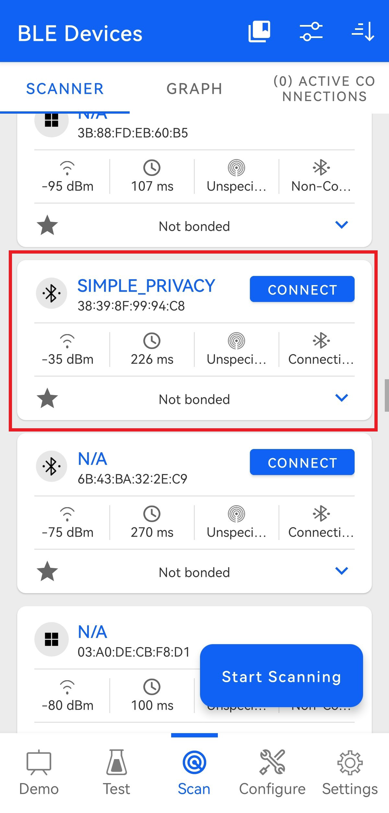

5. Initiate a connection from the App by clicks on the **Connect** button

6. After a successful connection, the remote device sends the **SMP** request, and the Silicon Labs device will respond with the **SMP** response.  

   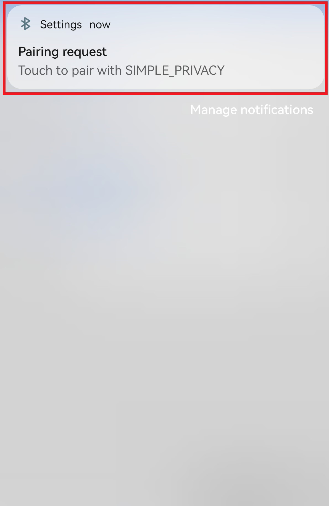     
   
   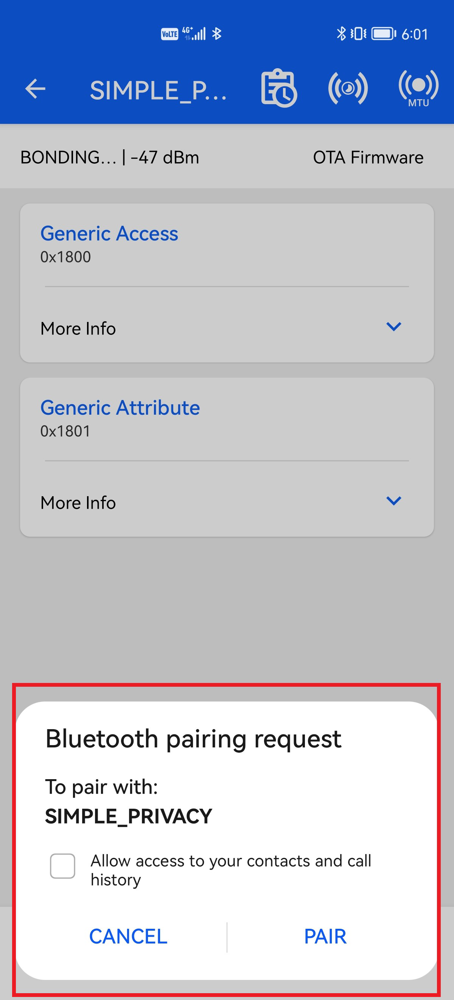  

7. The remote device receives the **pair** pop-up window, Once the user clicks on the **pair** button the Silicon Labs device receives the passkey.

8. Again the remote device receives the **pair** pop-up window, and click on the **pair**  button. Enter the received passkey as shown below.

        
   
        

9. After successful SMP connection security keys will exchange  between the Remote device and Silicon Labs device.

   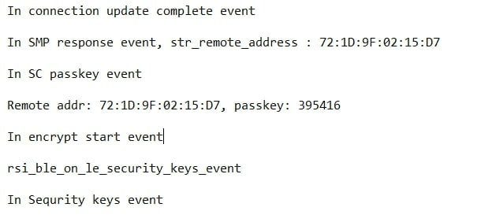

   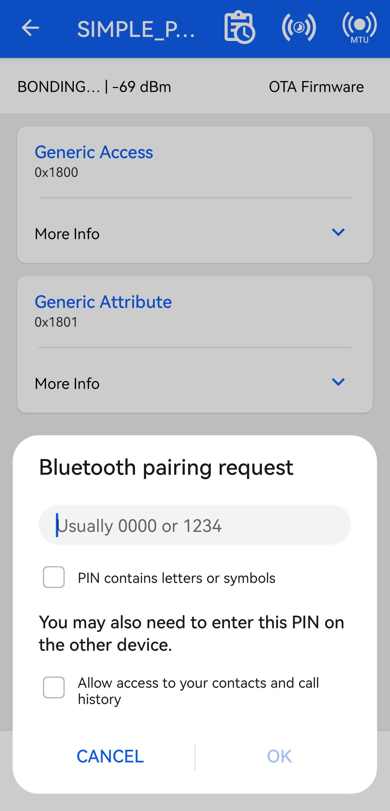

10. Silicon Labs device will add the remote device's IRK's and local IRK's in to resolve list and enable resolution

11. Give disconnect from remote device and the Silicon labs device starts advertising.

12. Refer the below images for console prints

      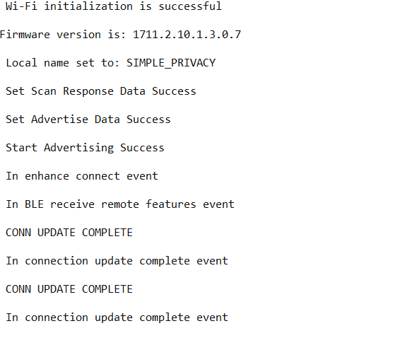

      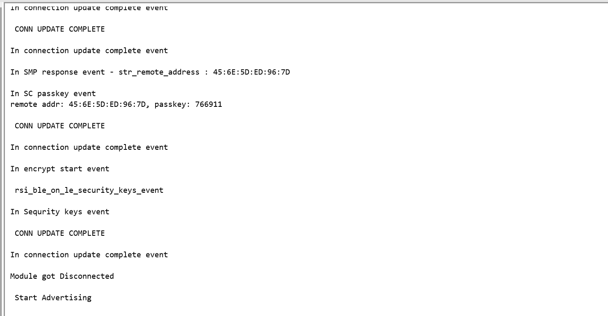

### Verify BLE Privacy application as a **CENTRAL_ROLE**

1. If Silicon Labs device is configured as **CENTRAL_ROLE** specified in the macro **RSI_DEVICE_ROLE**, Silicon Labs device will be in Scanning state.

2. Connect any serial console for prints.

3. Advertise the remote device.

   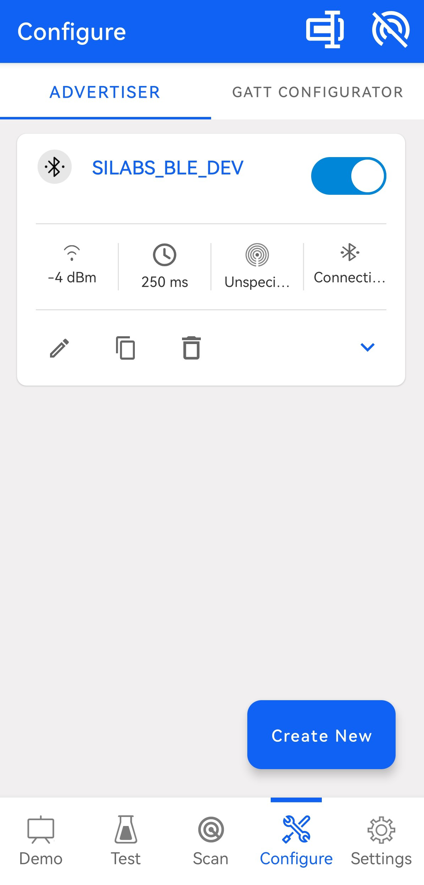   

   > **Note:** Refer the [Creating New Advertisement Sets](https://docs.silabs.com/bluetooth/5.0/miscellaneous/mobile/efr-connect-mobile-app) for configuring the Simplicity Connect mobile App(formerly EFR Connect App) as advertiser.
4. If Silicon Labs device gets a device with name configured `RSI_REMOTE_DEVICE_NAME` or bd address with address configured in RSI_BLE_REMOTE_ADDR in results ,local device will try to connect with remote device.

5. After connection Silicon Labs device which is in central mode will initiate an SMP request.  

   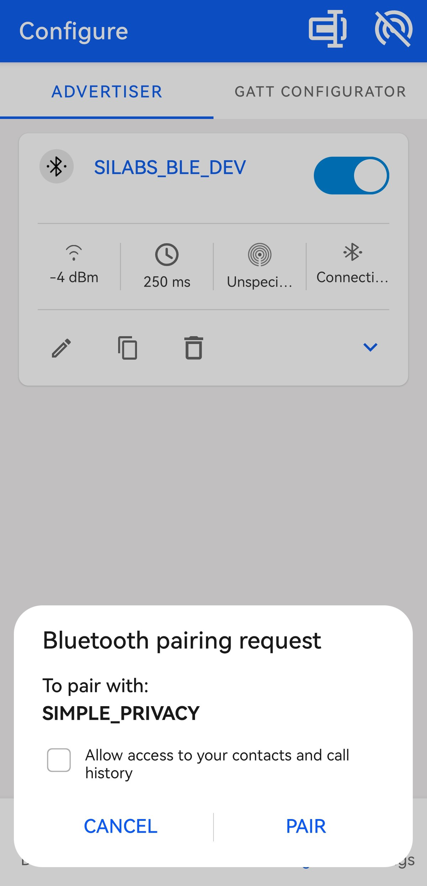  
6. Give a response from remote device and passkey

   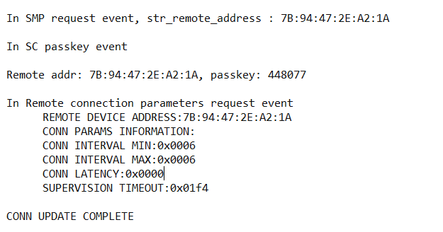

   

7. After a successful SMP connection security keys will exchanged between Remote device and Silicon Labs device and the Silicon Labs device will add remote device's IRK's and local IRK's in to resolve list and enable resolution.

      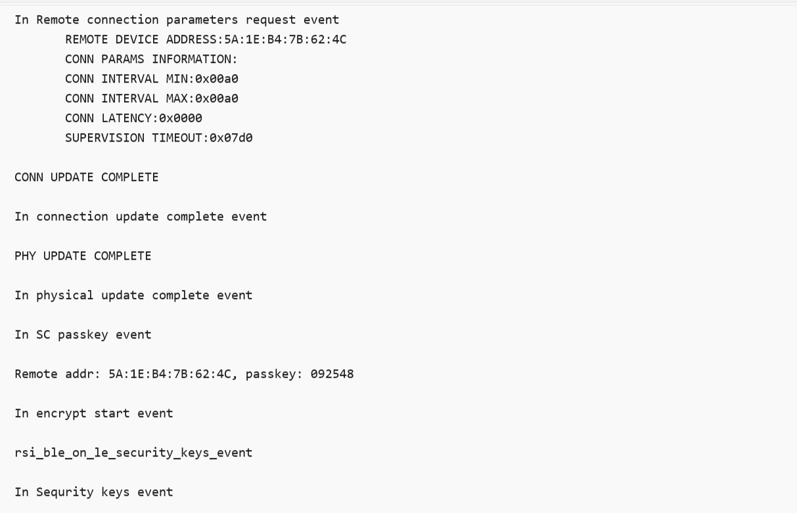

8. Give disconnect from remote device and keep in advertise mode.

9. Now Silicon Labs device will scan and resolves the remote device address.

10. Refer the below images for console prints

      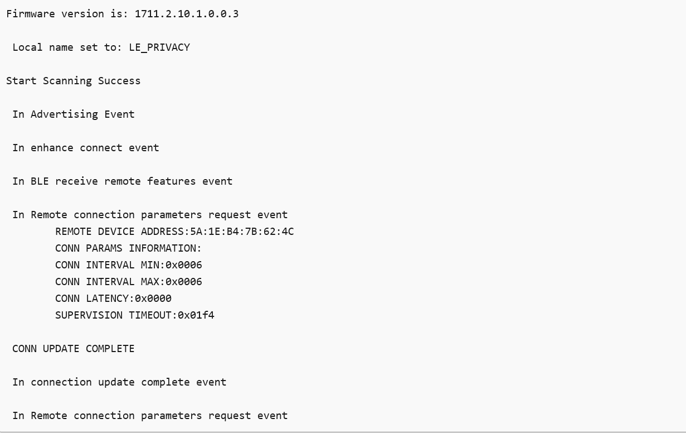

      

## Troubleshooting

| Symptom | Things to check |
|--------|------------------|
| No connection / scan issues | Confirm the peer address type and `RSI_BLE_DEV_ADDR` / `RSI_REMOTE_DEVICE_NAME` match the peripheral; phones often use random addresses. |
| Privacy / address resolution not demonstrable | This example relies on the **resolving list** and **Resolvable Private Addresses (RPAs)**. **Verify the peer uses an RPA** (typical after successful bonding when the peer has privacy enabled)—IRK exchange during SMP is required. A peer that stays on a **public** or **static random** address only does not exercise the same **RPA rotation and resolution** path; align `RSI_BLE_REMOTE_ADDR_TYPE` / directed-adv settings in `app.c` and `ble_config.h` with the peer. |
| Extended advertising not seen | Use a central that supports extended scanning; verify PHY and advertising set configuration in `app.c` / `ble_config.h`. |
| NCP: no boot or no HCI traffic | Update SiWx917 connectivity firmware; verify SPI/UART wiring per [NCP getting started](https://docs.silabs.com/wiseconnect/latest/wiseconnect-getting-started/getting-started-with-ncp-mode). Flash the correct `*_ncp.slcp` (or `*_uart_ncp.slcp`) on the **EFR32** host. |
| Power save anomalies on NCP expansion board | See the power-save note under **Configuration and setup** and the *Getting started with SiWx91x NCP* guide. |
| Build or flash errors | Open the `.slcp` that matches your kit (SoC vs PSRAM vs NCP) and matching SDK / WiSeConnect versions. |


## Resources

1. [WiSeConnect getting started](https://docs.silabs.com/wiseconnect/latest/wiseconnect-getting-started/)
2. [WiSeConnect developers guide — developing for Silicon Labs hosts](https://docs.silabs.com/wiseconnect/latest/wiseconnect-developers-guide-developing-for-silabs-hosts/)
3. [Programming recommended settings](https://docs.silabs.com/wiseconnect/latest/wiseconnect-developers-guide-prog-recommended-settings/)


## Report Bugs and Get Support

Report issues and get help from the Silicon Labs community:

- [Silicon Labs Community](https://www.silabs.com/community)
