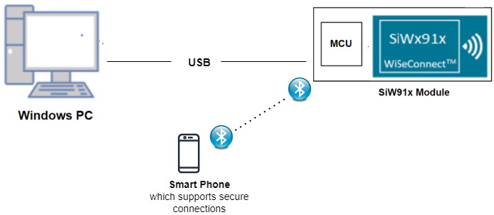
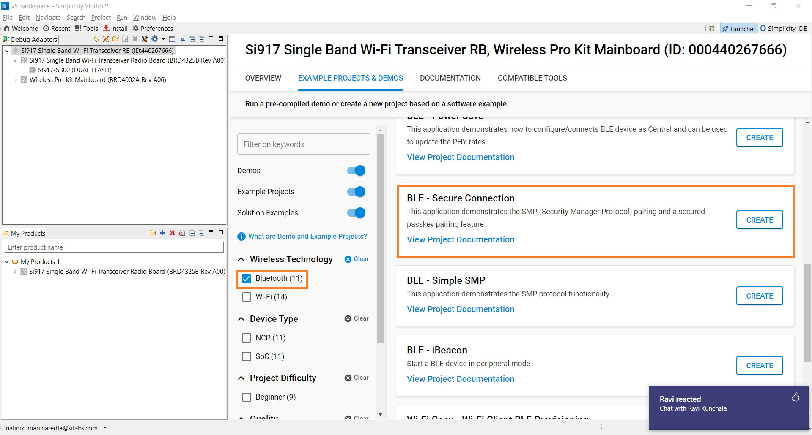
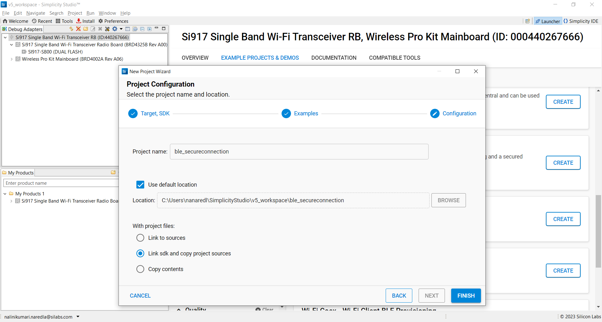
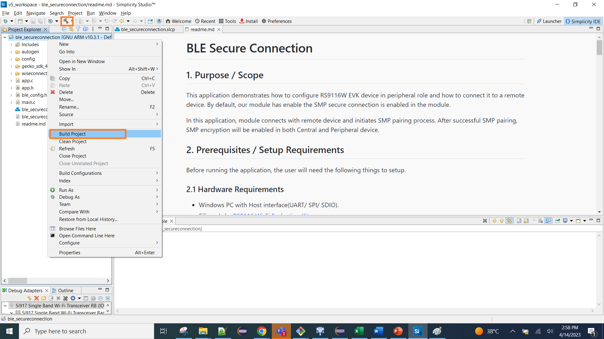
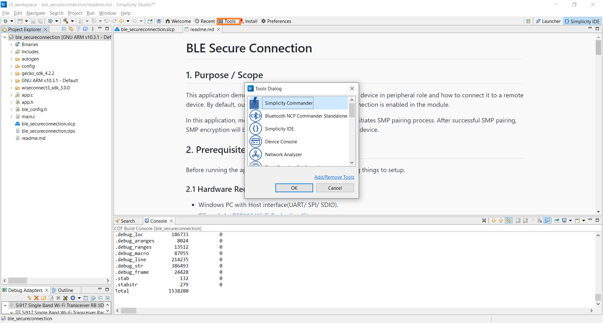
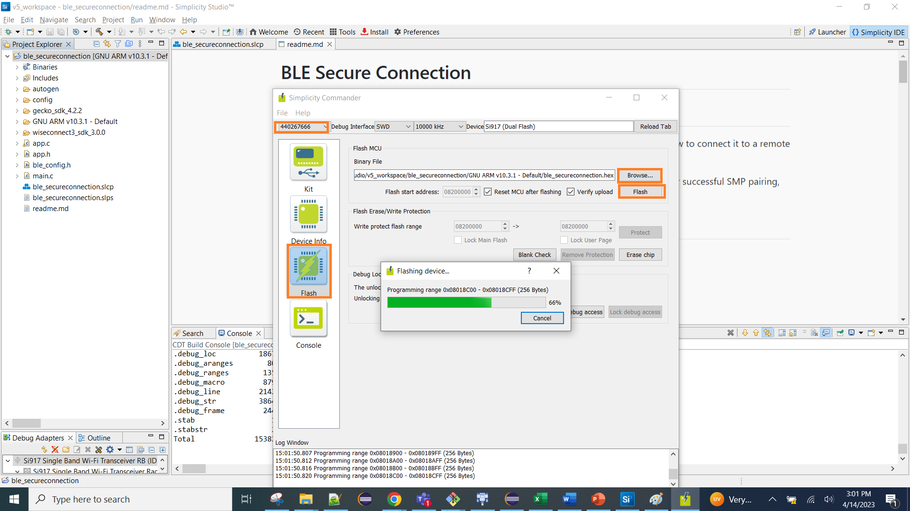
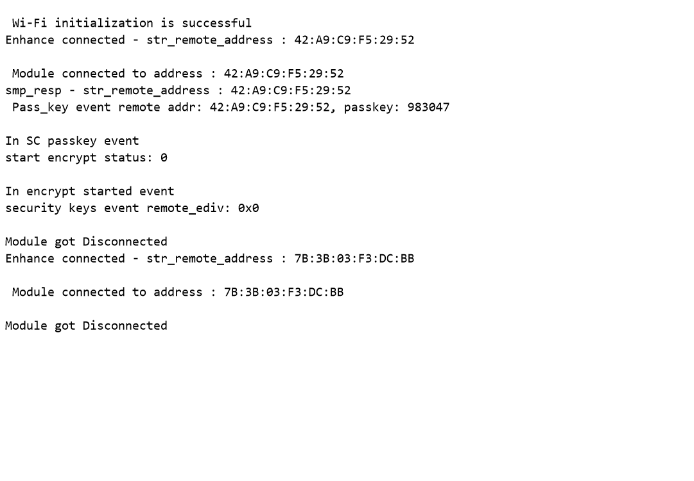

# BLE Secure Connection

## 1. Purpose / Scope

This application demonstrates how to configure SiWx91x device in peripheral role and how to connect it to a remote device. By default, our module has enable the SMP secure connection is enabled in the module.

In this application, module connects with remote device and initiates SMP pairing process.  After successful SMP pairing, SMP encryption will be enabled in both Central and Peripheral device.

## 2. Prerequisites / Setup Requirements

Before running the application, the user will need the following things to setup.

### 2.1 Hardware Requirements

- Windows PC with Host interface(UART/ SPI/ SDIO).
  - SiWx91x Wi-Fi Evaluation Kit. The SiWx91x supports multiple operating modes. See [Operating Modes]() for details.
  - **SoC Mode**:
    - Silicon Labs [BRD4325A, BRD4325B, BRD4325C, BRD4325G, BRD4338A](https://www.silabs.com/)
  - **NCP Mode**:
    - Silicon Labs [BRD4180B](https://www.silabs.com/);
    - Host MCU Eval Kit. This example has been tested with:
      - Silicon Labs [WSTK + EFR32MG21](https://www.silabs.com/development-tools/wireless/efr32xg21-bluetooth-starter-kit)

- BLE peripheral device which supports privacy feature(Generally phones with the BLE Connect application)
- BLE peripheral device which supports SMP pairing(This Application uses TI sensor tag for a remote device)

### 2.2 Software Requirements

- Embedded Development Environment
  - For Silicon Labs EFx32, use the latest version of [Simplicity Studio](https://www.silabs.com/developers/simplicity-studio)

- Download and install the Silicon Labs [EFR Connect App](https://www.silabs.com/developers/efr-connect-mobile-app) in the android smart phones for testing BLE applications. Users can also use their choice of BLE apps available in Android/iOS smart phones.

### 2.3 Setup Diagram

**SoC Mode :**

  
**NCP Mode :**

Follow the [Getting Started with Wiseconnect3 SDK](https://docs.silabs.com/wiseconnect/latest/wiseconnect-getting-started/) guide to set up the hardware connections and Simplicity Studio IDE.

## 3 Project Environment

- Ensure the SiWx91x loaded with the latest firmware following the [Upgrade Si91x firmware](https://docs.silabs.com/wiseconnect/latest/wiseconnect-getting-started/getting-started-with-soc-mode#upgrade-si-wx91x-connectivity-firmware)

- Ensure the latest Gecko SDK along with the extension WiSeConnect3 is added to Simplicity Studio.

### 3.1 Creating the project

#### 3.1.1 SoC mode

- Ensure the SiWx91x set up is connected to your PC.

- In the Simplicity Studio IDE, the SiWx91x SoC board will be detected under **Debug Adapters** pane as shown below.

  ****

#### 3.1.2 NCP mode

- Ensure the EFx32 and SiWx91x set up is connected to your PC.

- In the Simplicity Studio IDE, the EFR32 board will be detected under **Debug Adapters** pane as shown below.

  ****

### 3.2 Importing the project

- Studio should detect your board. Your board will be shown here. Click on the board detected and go to **EXAMPLE PROJECTS & DEMOS** section 

#### SOC Mode

- Select **BLE - Secure Connection** test application

  ****

- Click 'Create'. The "New Project Wizard" window appears. Click 'Finish'

  ****

### 3.3 Set up for application prints

#### 3.3.1 Teraterm set up - for BRD4325A, BRD4325B, BRD4325C, BRD4325G

You can use either of the below USB to UART converters for application prints.

1. Set up using USB to UART converter board.

   - Connect Tx (Pin-6) to P27 on WSTK
   - Connect GND (Pin 8 or 10) to GND on WSTK

   ****

2. Set up using USB to UART converter cable.

   - Connect RX (Pin 5) of TTL convertor to P27 on WSTK
   - Connect GND (Pin1) of TTL convertor to GND on WSTK

   ****

3. Open the Teraterm tool.

   - For SoC mode, choose the serial port to which USB to UART converter is connected and click on **OK**.

     ****

**Note:** For Other 917 SoC boards please refer section #3.3.2

#### 3.3.2 **Teraterm set up - for NCP and SoC modes**

1. Open the Teraterm tool.

- choose the J-Link port and click on **OK**.
    
    ****

2. Navigate to the Setup → Serial port and update the baud rate to **115200** and click on **OK**.

    ****

    ****

## 4 Application Build Environment

The application can be configured to suit your requirements and development environment. Read through the following sections and make any changes needed.

### 4.1 Configure the Application

**4.1** Open `ble_sc.c` file

**4.1.1** User must update the below parameters

`RSI_BLE_DEVICE_NAME` refers the name of the WiSeConnect device to appear during scanning by remote devices.

  #define RSI_BLE_DEVICE_NAME                              "BLE_SMP_SC"

`RSI_BLE_SMP_IO_CAPABILITY` refers IO capability.

  #define RSI_BLE_SMP_IO_CAPABILITY                        0x00

`RSI_BLE_SMP_PASSKEY` refers SMP Passkey

  #define RSI_BLE_SMP_PASSKEY                              0

Following are the non-configurable macros in the application.

  #define RSI_BLE_CONN_EVENT                               0x01
  #define RSI_BLE_DISCONN_EVENT                            0x02
  #define RSI_BLE_SMP_REQ_EVENT                            0x03
  #define RSI_BLE_SMP_RESP_EVENT                           0x04
  #define RSI_BLE_SMP_PASSKEY_EVENT                        0x05
  #define RSI_BLE_SMP_FAILED_EVENT                         0x06
  #define RSI_BLE_ENCRYPT_STARTED_EVENT                    0x07
  #define RSI_BLE_SMP_PASSKEY_DISPLAY_EVENT                0x08
  #define RSI_BLE_SC_PASSKEY_EVENT                         0X09
  #define RSI_BLE_LTK_REQ_EVENT                            0x0A

**Power save configuration**

   By default, The Application is configured without power save.

  #define ENABLE_POWER_SAVE 0

If user wants to run the application in power save, modify the below configuration.

  #define ENABLE_POWER_SAVE 1

## 5. Build and Test the Application

- Follow the below steps for the successful execution of the application.

### 5.1 Build the Application

- Follow the below steps for the successful execution of the application.

#### SoC Mode

- Once the project is created, click on the build icon (hammer) to build the project (or) right click on project and click on Build Project.

   

- Successful build output will show as below.

#### NCP Mode

   

- Successful build output will show as below.

### 5.2 Loading the Application Image

1. Click on Tools and Simplicity Commander as shown below.

   

2. Load the firmware image

- Select the board.
- Browse the application image (.hex) and click on Flash button.

   

### 5.3 Running the SiWx91x Application

1. After the program gets executed, Silicon Labs device will be in advertising state.

2. Connect any serial console for prints.

3. Open a EFR Connect mobile App in the Smartphone and do the scan.Ensure that the device is not bonded prior . Open the bonded tab and if the application name appears then click on the three dots beside the name and select delete bond information.

4. In the App, Silicon Labs  will appear with the name configured in the macro "BLE_SMP_SC" or sometimes observed as Silicon Labs device as internal name "SimpleBLEPeripheral".

5. Initiate connection from the App.

6. Observe that the connection is established between the desired device and Silicon Labs device.When application sends a smp request accept it on remote side by clicking ok(pair) and after smp passkey display event .

7. Enter the passkey displayed on the console (host logs) on the remote mobile side  

8. After successful connection, application will initiate SMP paring and wait for SMP response event and SMP passkey request event. After receiving SMP response and SMP SC passkey events, application sends SMP response and stores passkey in numeric value and sets SMP Sc Passkey responses event.

9. If SMP is successful, Device sends SMP encrypt started event to host. If not success, Device sends SMP failure event to host.

## 5.4 Observing the output prints on serial terminal  

