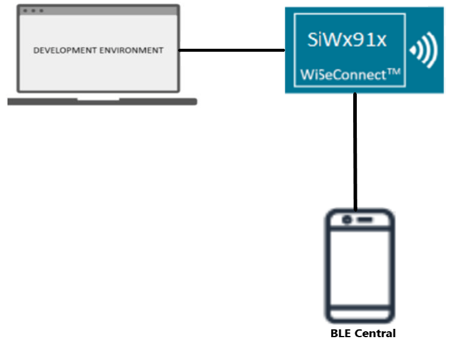
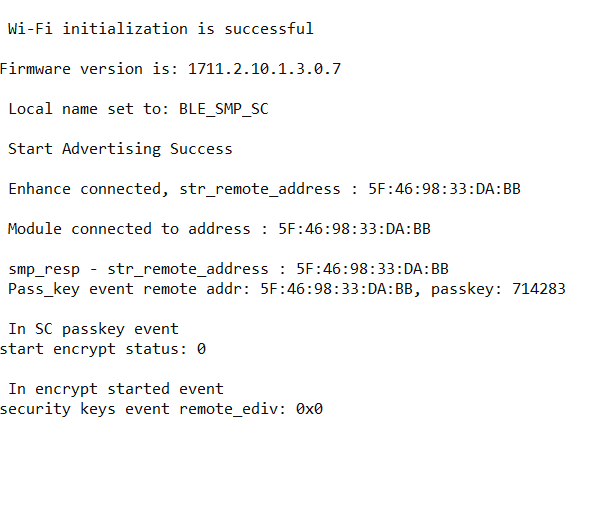

# BLE - Secure Connection

## Table of Contents

- [Purpose/Scope](#purposescope)
- [Prerequisites/Setup Requirements](#prerequisitessetup-requirements)
  - [Hardware Requirements](#hardware-requirements)
  - [Software Requirements](#software-requirements)
  - [Setup Diagram](#setup-diagram)
- [Getting Started](#getting-started)
- [Application Build Environment](#application-build-environment)
- [Test the Application](#test-the-application)

## Purpose/Scope

This application demonstrates how to configure SiWx91x device in peripheral role and how to connect it to a remote device. By default, our module has enable the SMP secure connection is enabled in the module.

In this application, module connects with remote device and initiates SMP pairing process.  After successful SMP pairing, SMP encryption will be enabled in both Central and Peripheral device.

## Prerequisites/Setup Requirements

### Hardware Requirements

- Windows PC with Host interface(UART/ SPI/ SDIO).
  - SiWx91x Wi-Fi Evaluation Kit.
  - SoC Mode:
    - Silicon Labs [BRD4325A, BRD4325B, BRD4325C, BRD4325G, BRD4338A, BRD4339B, BRD4343A](https://www.silabs.com/)
    - Kits
      - SiWx917 AC1 Module Explorer Kit (BRD2708A)
  - PSRAM Mode:  
    - Silicon Labs [BRD4340A, BRD4342A, BRD4325G](https://www.silabs.com/)
  - NCP Mode:
    - Silicon Labs [BRD4180B](https://www.silabs.com/);
    - Host MCU Eval Kit. This example has been tested with:
      - Silicon Labs [WSTK + EFR32MG21](https://www.silabs.com/development-tools/wireless/efr32xg21-bluetooth-starter-kit)
      - NCP Expansion Kit with NCP Radio boards
        - (BRD4346A + BRD8045A) [SiWx917-EB4346A]
        - (BRD4357A + BRD8045A) [SiWx917-EB4357A]
  - Interface and Host MCU Supported
    - SPI - EFR32 
- BLE peripheral device with privacy and SMP pairing support.

### Software Requirements

- Embedded Development Environment
- Download and install the Silicon Labs [Simplicity Connect App(formerly EFR Connect App) or other BLE Central/Peripheral app.](https://www.silabs.com/developers/simplicity-connect-mobile-app ) in the android smart phones for testing BLE applications. Users can also use their choice of BLE apps available in Android/iOS smart phones.

> **Note:** The provided mobile screenshots are from the 2.8.1 version of the Simplicity Connect App(formerly EFR Connect App), it is recommended to use the latest version.

### Setup Diagram

 
  
## Getting Started

Refer to the instructions [here](https://docs.silabs.com/wiseconnect/latest/wiseconnect-getting-started/) to:

- [Install Simplicity Studio](https://docs.silabs.com/wiseconnect/latest/wiseconnect-developers-guide-developing-for-silabs-hosts/#install-simplicity-studio)
- [Install WiSeConnect 3 extension](https://docs.silabs.com/wiseconnect/latest/wiseconnect-developers-guide-developing-for-silabs-hosts/#install-the-wi-se-connect-3-extension)
- [Connect your device to the computer](https://docs.silabs.com/wiseconnect/latest/wiseconnect-developers-guide-developing-for-silabs-hosts/#connect-si-wx91x-to-computer)
- [Upgrade your connectivity firmware ](https://docs.silabs.com/wiseconnect/latest/wiseconnect-developers-guide-developing-for-silabs-hosts/#update-si-wx91x-connectivity-firmware)
- [Create a Studio project ](https://docs.silabs.com/wiseconnect/latest/wiseconnect-developers-guide-developing-for-silabs-hosts/#create-a-project)

For details on the project folder structure, see the [WiSeConnect Examples](https://docs.silabs.com/wiseconnect/latest/wiseconnect-examples/#example-folder-structure) page.

## Application Build Environment

The application can be configured to suit your requirements and development environment. Read through the following sections and make any changes needed.

- Open `ble_sc.c` file and update/modify the following parameters:

  - `RSI_BLE_DEVICE_NAME` refers the name of the WiSeConnect device to appear during scanning by remote devices.

      ```c
      #define RSI_BLE_DEVICE_NAME                              "BLE_SMP_SC"
      ```

  - `RSI_BLE_SMP_IO_CAPABILITY` refers IO capability.

      ```c
      #define RSI_BLE_SMP_IO_CAPABILITY                        0x00
      ```

  - `RSI_BLE_SMP_PASSKEY` refers SMP Passkey

      ```c
      #define RSI_BLE_SMP_PASSKEY                              0
      ```

  - Following are the non-configurable macros in the application.

      ```c
      #define RSI_BLE_CONN_EVENT                               0x01
      #define RSI_BLE_DISCONN_EVENT                            0x02
      #define RSI_BLE_SMP_REQ_EVENT                            0x03
      #define RSI_BLE_SMP_RESP_EVENT                           0x04
      #define RSI_BLE_SMP_PASSKEY_EVENT                        0x05
      #define RSI_BLE_SMP_FAILED_EVENT                         0x06
      #define RSI_BLE_ENCRYPT_STARTED_EVENT                    0x07
      #define RSI_BLE_SMP_PASSKEY_DISPLAY_EVENT                0x08
      #define RSI_BLE_SC_PASSKEY_EVENT                         0X09
      #define RSI_BLE_LTK_REQ_EVENT                            0x0A
      ```
  - Power save configuration

    By default, the application is configured without power save.

      ```c
      #define ENABLE_POWER_SAVE 0
      ```

  - If user wants to run the application in power save, modify the following configuration.

      ```c
      #define ENABLE_POWER_SAVE 1
      ```
> **Note:** 
> User can configure default region specific regulatory information using `sl_wifi_region_db_config.h`

## Test the Application

Refer to the instructions [here](https://docs.silabs.com/wiseconnect/latest/wiseconnect-getting-started/) to:

- Build the application in Studio.
- Flash, run and debug the application.

Follow the steps for successful execution of the program:

1. After the program gets executed, Silicon Labs device will be in advertising state.

2. Connect any serial console for prints.

3. Open a Simplicity Connect App(formerly EFR Connect App) in the Smartphone and do the scan.Ensure that the device is not bonded prior . Open the bonded tab and if the application name appears then click on the three dots beside the name and select delete bond information.

4. In the App, Silicon Labs  will appear with the name configured in the macro "BLE_SMP_SC" or sometimes observed as Silicon Labs device as internal name "SimpleBLEPeripheral".

 

5. Initiate connection from the App.

 

6. Observe that the connection is established between the desired device and Silicon Labs device.When application sends a smp request accept it on remote side by clicking ok(pair) and after smp passkey display event .

 

 

7. Enter the passkey displayed on the console (host logs) on the remote mobile side.

 

 

8. SiWx91x will initiate SMP Procedure by giving a security request . The remote device will give a SMP Pair request and SiWx91x responds with a SMP pair response . SMP Passkey event , encryption event and security keys exchange event follow after it .

 
 
9. If SMP is successful, device sends SMP encrypt started event to host. If not success, device sends SMP failure event to host.

10. Refer the following images for console prints:
 
    
