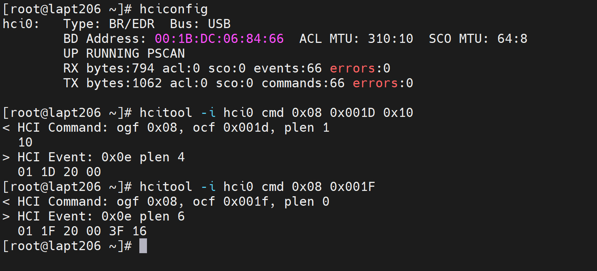
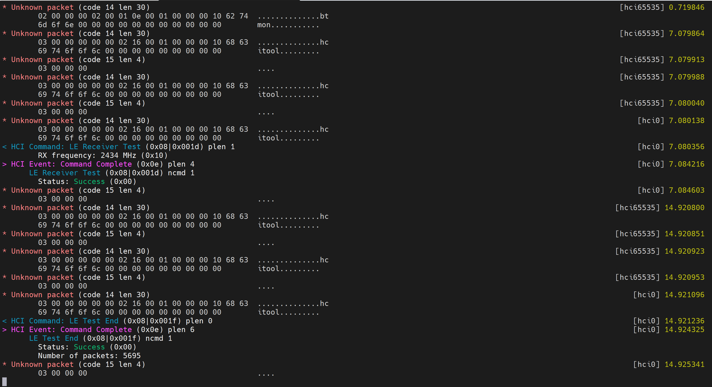
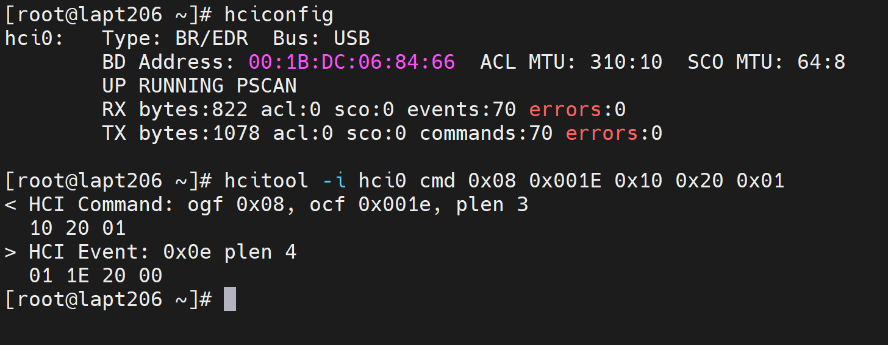
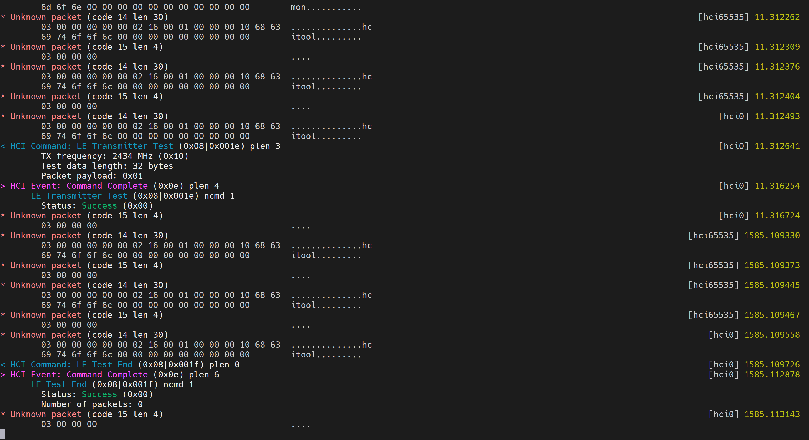
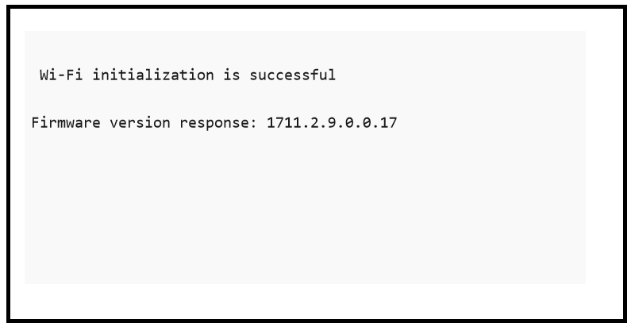

# BLE - Testmodes

## High-Level Overview

This application demonstrates how to test the BLE GAP peripheral role.

## Table of Contents

- [High-Level Overview](#high-level-overview)
- [Table of Contents](#table-of-contents)
- [Purpose/Scope](#purposescope)
- [Prerequisites/Setup Requirements](#prerequisitessetup-requirements)
  - [Hardware Requirements](#hardware-requirements)
  - [Software Requirements](#software-requirements)
  - [NCP mode: host application and project files](#ncp-mode-host-application-and-project-files)
  - [Setup Diagram](#setup-diagram)
- [Steps to Run Demo](#steps-to-run-demo)
  - [Getting Started](#getting-started)
  - [Configuration and setup](#configuration-and-setup)
  - [Steps for execution](#steps-for-execution)
    - [TX Testmodes Execution](#tx-testmodes-execution)
    - [Configuring the Application for Rx](#configuring-the-application-for-rx)
- [Troubleshooting](#troubleshooting)
- [Resources](#resources)
- [Report Bugs and Get Support](#report-bugs-and-get-support)

## Purpose/Scope

This application demonstrates how to test the BLE GAP peripheral role.

## Prerequisites/Setup Requirements

### Hardware Requirements

- Windows PC
- SoC Mode:
  - Silicon Labs [BRD4325A, BRD4325B, BRD4325C, BRD4325G, BRD4338A, BRD4339B, BRD4343A](https://www.silabs.com/)
  - Kits
    - SiWx917 AC1 Module Explorer Kit (BRD2708A)
- NCP Mode:
  - Silicon Labs [BRD4180B](https://www.silabs.com/) **AND**
  - Host MCU Eval Kit. This example has been tested with:
    - Silicon Labs [WSTK + EFR32MG21](https://www.silabs.com/development-tools/wireless/efr32xg21-bluetooth-starter-kit)
    - NCP Expansion Kit with NCP Radio boards
      - (BRD4346A + BRD8045A) [SiWx917-EB4346A]
      - (BRD4357A + BRD8045A) [SiWx917-EB4357A]

- A Linux PC

- Third party Bluetooth dongle

### Software Requirements

- Simplicity Studio
- SoC
  - Silicon Labs SiWx917 PK6030A SoC Kit which includes
    - BRD4001A/BRD4002A Wireless Starter Kit Mainboard
    - BRD4325A Radio Board
  - USB TO UART converter / TTL cable
- PSRAM Mode:  
  - Silicon Labs [BRD4340A, BRD4342A, BRD4325G](https://www.silabs.com/)
- NCP
  - Silicon Labs BRD8036A Si917 QMS SB Expansion Board
  - [Silicon Labs SLWSTK6006A EFR32xG21 Wireless Starter Kit](https://www.silabs.com/development-tools/wireless/efr32xg21-wireless-starter-kit) which includes
    - BRD4001A/BRD4002A Wireless Starter Kit Mainboard
    - BRD4180A/BRD4180B Radio Board
  - Interface and Host MCU Supported
    - SPI - EFR32

### NCP mode: host application and project files

| Mode | Host / target | Project file (this example folder) |
|------|----------------|-------------------------------------|
| SoC | Application runs on SiWx91x. | `ble_testmodes_soc.slcp` |
| PSRAM | Application runs on SiWx91x with PSRAM-capable radio board. | `ble_testmodes_psram.slcp` |
| NCP (SPI) | Application runs on **EFR32** host; SiWx917 is the network co-processor over **SPI**. | `ble_testmodes_ncp.slcp` |

Open the `.slcp` for your kit from **`examples/snippets/ble/ble_testmodes/`** in Simplicity Studio. For NCP, follow [Getting started with NCP mode](https://docs.silabs.com/wiseconnect/latest/wiseconnect-getting-started/getting-started-with-ncp-mode).

### Setup Diagram


## Steps to Run Demo

### Getting Started

Refer to the instructions [here](https://docs.silabs.com/wiseconnect/latest/wiseconnect-getting-started/) to:

- [Install Simplicity Studio](https://docs.silabs.com/wiseconnect/latest/wiseconnect-developers-guide-developing-for-silabs-hosts/#install-simplicity-studio)
- [Install WiSeConnect extension](https://docs.silabs.com/wiseconnect/latest/wiseconnect-developers-guide-developing-for-silabs-hosts/#install-the-wi-se-connect-extension)
- [Connect your device to the computer](https://docs.silabs.com/wiseconnect/latest/wiseconnect-developers-guide-developing-for-silabs-hosts/#connect-si-wx91x-to-computer)
- [Upgrade your connectivity firmware ](https://docs.silabs.com/wiseconnect/latest/wiseconnect-developers-guide-developing-for-silabs-hosts/#update-si-wx91x-connectivity-firmware)
- [Create a Studio project ](https://docs.silabs.com/wiseconnect/latest/wiseconnect-developers-guide-developing-for-silabs-hosts/#create-a-project)

For details on the project folder structure, see the [WiSeConnect Examples](https://docs.silabs.com/wiseconnect/latest/wiseconnect-examples/#example-folder-structure) page.

### Configuration and setup

The application can be configured to suit user requirements and development environment. Read through the following sections and make any changes if needed.

- In the Project Explorer pane of the IDE, expand the **ble_testmodes** folder and open the **app.c** file. 

   - **TX Testmodes configurations:** 

      - `RSI_CONFIG_TEST_MODE` refers the Transmit Mode of the Silicon Labs module to be selected.
        ```c
        #define RSI_CONFIG_TEST_MODE                          RSI_BLE_TESTMODE_TRANSMIT
        ```
      - `RSI_BLE_TX_PAYLOAD_LEN` refers the transmit packet length.
        ```c
        #define RSI_BLE_TX_PAYLOAD_LEN                        0x20
        ```

      - `RSI_BLE_TX_PAYLOAD_TYPE` refers the transmit packet payload type
        ```c
        #define RSI_BLE_TX_PAYLOAD_TYPE                       PRBS9_SEQ
        ```

      - `RSI_SEL_ANTENNA` refers the antenna which is to be used by Silicon Labs module, Valid configurations are RSI_SEL_INTERNAL_ANTENNA and RSI_SEL_EXTERNAL_ANTENNA
        ```c
        #define RSI_SEL_ANTENNA                               RSI_SEL_INTERNAL_ANTENNA
        ```

   - **RX Testmodes configurations:** 

      - `RSI_CONFIG_TEST_MODE` refers the Receive Mode of the Silicon Labs module to be selected.
        ```c
        #define RSI_CONFIG_TEST_MODE                          RSI_BLE_TESTMODE_RECEIVE
        ```
  
> **Note**: For recommended settings, please refer the [recommendations guide](https://docs.silabs.com/wiseconnect/latest/wiseconnect-developers-guide-prog-recommended-settings/).

### Steps for execution

Refer to the instructions [here](https://docs.silabs.com/wiseconnect/latest/wiseconnect-getting-started/) to:

- Build the application in Studio depending on your mode (SoC / NCP).
- Flash, run and debug the application.

Follow the steps for the successful execution of the application:

Application has the feasibility to configure the TX Testmodes (or) RX Testmodes.

### TX Testmodes Execution

1. Once the program is executed, the Silicon Labs module will begin transmitting packets with the desired length.
2. Attach the dongle to a Linux machine and execute the hcitool command.
3. Use the following command with the third-party dongle to verify whether the Silicon Labs module's packets are being transmitted:

   - `hcitool -i hcix cmd 0x08 0x001D 0x10` 

    Replace hcix with the interface of the third-party dongle, 

    **opcode:**

     - 0x08 refers to OGF for LE controller commands,
     - 0x001D refers to OCF for LE Receiver Test command,

    **parameter:**
    
     - 0x10 with received channel which refers to parameters passed for Receiver command
     
  >  **Note:**
  >  - For HCI command format refer to section 5.4.1 | Vol 4, Part E in Core Specification 5.4
  >  - For LE receiver test command format refer to section 7.8.28 | Vol 4, Part E in Core Specification 5.4
  
4. The received channel of the third-party dongle should match the transmit channel of the Silicon Labs module.
5. To cease receiving, execute the following command using the third-party dongle.
 hcitool -i hcix cmd 0x08 0x001F
(Replace hcix with the interface of the third-party dongle.)
6. Verify the status parameters whether the packets are received or not after receiving stop command.
7. For reference, consult the provided images displaying prints from the third-party dongle.
8. Refer the following images for third party dongle prints:

   - commands log

   

   - bt mon log
      
   

### Configuring the Application for Rx

1. Once the program is executed, the Silicon Labs module will be ready to receive packets.
2. Utilize the following command with the third-party dongle to transmit packets to the Silicon Labs module.
3. Execute the following command using the third-party dongle to send packets to the Silicon Labs module:

   - `hcitool -i hcix cmd 0x08 0x001E 0x10 0x20 0x01` 
    
   Replace hcix with the interface of the third-party dongle, 
   
   **opcode:**
    - 0x08 refers to OGF for LE controller commands,
    - 0x001E refers to OCF for LE Receiver Test command,
   
   **parameter:**
    - 0x10 transmitted channel which refers to parameter passed for transmitter command
    - 0x20 payload length
    - 0x01 payload type

  > **Note:**
  > - For LE transmitter test command format refer to section 7.8.29 | Vol 4, Part E in Core Specification 5.4

4. Received channel of Silicon Labs module should be same as transmit channel of third party dongle.

5. Refer the following images for third party dongle prints.

- Command log:

   

- btmon log:

   

6. Refer the following images for console prints:

   

## Troubleshooting

| Symptom | Things to check |
|--------|------------------|
| No connection / scan issues | Confirm the peer address type and `RSI_BLE_DEV_ADDR` / `RSI_REMOTE_DEVICE_NAME` match the peripheral; phones often use random addresses. |
| Extended advertising not seen | Use a central that supports extended scanning; verify PHY and advertising set configuration in `app.c` / `ble_config.h`. |
| NCP: no boot or no HCI traffic | Update SiWx917 connectivity firmware; verify SPI/UART wiring per [NCP getting started](https://docs.silabs.com/wiseconnect/latest/wiseconnect-getting-started/getting-started-with-ncp-mode). Flash the correct `*_ncp.slcp` (or `*_uart_ncp.slcp`) on the **EFR32** host. |
| Power save anomalies on NCP expansion board | See the power-save note under **Configuration and setup** and the *Getting started with SiWx91x NCP* guide. |
| Build or flash errors | Open the `.slcp` that matches your kit (SoC vs PSRAM vs NCP) and matching SDK / WiSeConnect versions. |


## Resources

1. [WiSeConnect getting started](https://docs.silabs.com/wiseconnect/latest/wiseconnect-getting-started/)
2. [WiSeConnect developers guide — developing for Silicon Labs hosts](https://docs.silabs.com/wiseconnect/latest/wiseconnect-developers-guide-developing-for-silabs-hosts/)
3. [Programming recommended settings](https://docs.silabs.com/wiseconnect/latest/wiseconnect-developers-guide-prog-recommended-settings/)


## Report Bugs and Get Support

Report issues and get help from the Silicon Labs community:

- [Silicon Labs Community](https://www.silabs.com/community)
