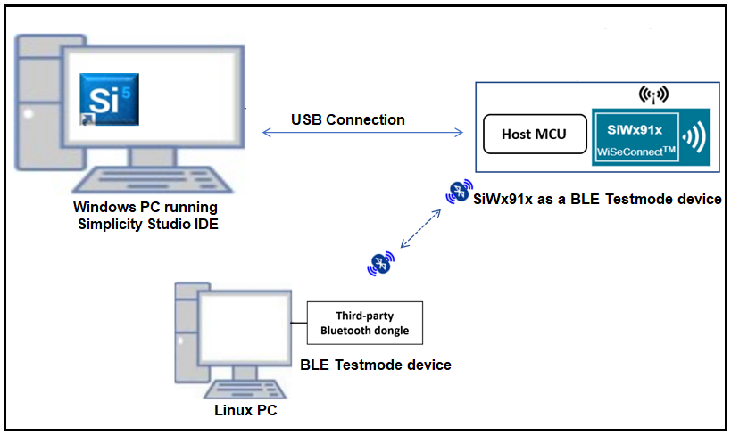
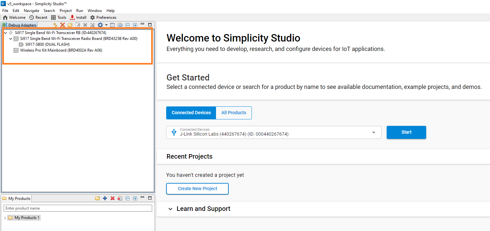

# BLE Test Modes

## 1. Purpose / Scope

This application demonstrates how to test the BLE GAP peripheral role.

## 2. Prerequisites / Setup Requirements

Before running the application, the user will need to set up the following things

## 2.1 Hardware Requirements

- Windows PC
- **SoC Mode**:
  - Silicon Labs [BRD4325A, BRD4325B, BRD4325C, BRD4325G, BRD4338A](https://www.silabs.com/)
- **NCP Mode**:
  - Silicon Labs [BRD4180B](https://www.silabs.com/) **AND**
  - Host MCU Eval Kit. This example has been tested with:
    - Silicon Labs [WSTK + EFR32MG21](https://www.silabs.com/development-tools/wireless/efr32xg21-bluetooth-starter-kit)

- A Linux PC

- Third party Bluetooth dongle

### 2.2 Software Requirements

- Embedded Development Environment

  - For Silicon Labs EFx32, use the latest version of [Simplicity Studio](https://www.silabs.com/developers/simplicity-studio)

#### **2.2.1 SoC** 

   - Silicon Labs SiWx917 PK6030A SoC Kit which includes
      - BRD4001A/BRD4002A Wireless Starter Kit Mainboard
      - BRD4325A Radio Board
   - USB TO UART converter / TTL cable
   
#### **2.2.2 NCP**

   - Silicon Labs BRD8036A Si917 QMS SB Expansion Board
   - [Silicon Labs SLWSTK6006A EFR32xG21 Wireless Starter Kit](https://www.silabs.com/development-tools/wireless/efr32xg21-wireless-starter-kit) which includes
      - BRD4001A/BRD4002A Wireless Starter Kit Mainboard
      - BRD4180A/BRD4180B Radio Board

### 2.3 Setup Diagram

#### SoC Mode

 
  
#### NCP Mode  



Follow the [Getting Started with Wiseconnect3 SDK](https://docs.silabs.com/wiseconnect/latest/wiseconnect-getting-started/) guide to set up the hardware connections and Simplicity Studio IDE.

## 3 Project Environment

- Ensure the SiWx91x loaded with the latest firmware following the [Upgrade Si91x firmware](https://docs.silabs.com/wiseconnect/latest/wiseconnect-getting-started/getting-started-with-soc-mode#upgrade-si-wx91x-connectivity-firmware)
- Ensure the latest Gecko SDK along with the extension WiSeConnect3 is added to Simplicity Studio.

### 3.1 Creating the Project

#### 3.1.1 SoC Mode

- Ensure the SiWx91x set up is connected to your PC.

- In the Simplicity Studio IDE, the SiWx91x SoC board will be detected under **Debug Adapters** pane as shown below.

   
#### 3.1.2 NCP Mode
- Ensure the EFx32 and SiWx91x set up is connected to your PC.

- In the Simplicity Studio IDE, the EFR32 board will be detected under **Debug Adapters** pane as shown below.

   
### 3.2 Importing the project
- Studio should detect your board. Your board will be shown here. Click on the board detected and go to EXAMPLE PROJECTS & DEMOS section
#### SOC Mode
- Select **BLE-Testmodes(SOC)** test application
   
- Click 'Create'. The "New Project Wizard" window appears. Click 'Finish'
   
#### NCP Mode
- Select **BLE-Testmodes(NCP)** test application
   
- Click 'Create'. The "New Project Wizard" window appears. Click 'Finish'
   
### 3.3 Setup for Application Prints
#### 3.3.1 Teraterm set up - for BRD4325A, BRD4325B, BRD4325C, BRD4325G
You can use either of the below USB to UART converters for application prints.
   1. Set up using USB to UART converter board.
      - Connect Tx (Pin-6) to P27 on WSTK
      - Connect GND (Pin 8 or 10) to GND on WSTK
      ****
   2. Setup using USB to UART converter cable.
      - Connect RX (Pin 5) of TTL convertor to P27 on WSTK
      - Connect GND (Pin1) of TTL convertor to GND on WSTK
      ****
   3. Open the Tera Term tool.
      - For SoC mode, choose the serial port to which USB to UART converter is connected and click on OK.
      ****
Note: For Other 917 SoC boards please refer section #3.3.2
#### 3.3.2 Teraterm set up - for NCP and SoC modes
1. Open the Tera Term tool.
- choose the J-Link port and click on **OK.**

   ****
2. Navigate to the Setup → Serial port and update the baud rate to **115200** and click on **OK.**
   ****
   ****

## 4. Application Configuration Parameters
The application can be configured to suit user requirements and development environment. Read through the following sections and make any changes if needed. 

1. In the Project explorer pane of the IDE, expand the **ble\_testmodes** folder and open the **app.c** file. 


   - **TX Testmodes configurations:** 
   ```c
   //RSI_CONFIG_TEST_MODE refers the Transmit Mode of the Silicon Labs module to be selected.
   #define RSI_CONFIG_TEST_MODE                          RSI_BLE_TESTMODE_TRANSMIT

   //RSI_BLE_TX_PAYLOAD_LEN refers the Transmit packet length.
   #define RSI_BLE_TX_PAYLOAD_LEN                        0x20

   //RSI_BLE_TX_PAYLOAD_TYPE refers the Transmit packet payload type
   #define RSI_BLE_TX_PAYLOAD_TYPE                       PRBS9_SEQ

   //RSI_SEL_ANTENNA refers the antenna which is to be used by Silicon Labs module, Valid configurations are RSI_SEL_INTERNAL_ANTENNA and RSI_SEL_EXTERNAL_ANTENNA
   #define RSI_SEL_ANTENNA                               RSI_SEL_INTERNAL_ANTENNA
   ```

   - **RX Testmodes configurations:** 
   ```c
   //RSI_CONFIG_TEST_MODE refers the Receive Mode of the Silicon Labs module to be selected.
   #define RSI_CONFIG_TEST_MODE                          RSI_BLE_TESTMODE_RECEIVE

   //RSI_SEL_ANTENNA refers the antenna which is to be used by Silicon Labs module, Valid configurations are RSI_SEL_INTERNAL_ANTENNA and RSI_SEL_EXTERNAL_ANTENNA
   #define RSI_SEL_ANTENNA                               RSI_SEL_INTERNAL_ANTENNA
   ```

## 5. Build and Test the Application

- Follow the below steps for the successful execution of the application.

### 5.1 Build the Application

- Follow the below steps for the successful execution of the application.

#### SoC Mode

- Once the project is created, click on the build icon (hammer) to build the project (or) right click on project and click on Build Project.

   

- Successful build output will show as below.

#### NCP Mode
   

- Successful build output will show as below.

### 5.2 Loading the Application Image

1. Click on Tools and Simplicity Commander as shown below.

   

2. Load the firmware image

- Select the board.
- Browse the application image (.hex) and click on Flash button.

   

### 6 Application Execution Flow
Application has the feasibility to configure the TX Testmodes (or) RX Testmodes.
### 6.1 TX Testmodes Execution

1. Once the program is executed, the Silicon Labs module will begin transmitting packets with the desired length.
2. Attach the dongle to a Linux machine and execute the hcitool command.
3. Use the following command with the third-party dongle to verify whether the Silicon Labs module's packets are being transmitted:
	hcitool -i hcix cmd 0x08 0x001D 0x10
(Replace hcix with the interface of the third-party dongle, and 0x10 with the received channel.)
4. The received channel of the third-party dongle should match the transmit channel of the Silicon Labs module.
5. To cease receiving, execute the following command using the third-party dongle.
	hcitool -i hcix cmd 0x08 0x001F
(Replace hcix with the interface of the third-party dongle.)
6. Verify the status parameters whether the packets are received or not after receiving stop command.
7. For reference, consult the provided images displaying prints from the third-party dongle.
8. Refer the below images for Third party dongle prints
   - commands log
   
   - bt mon log
   
### 6.2 Configuring the Application for Rx:
1. Once the program is executed, the Silicon Labs module will be ready to receive packets.
2. Utilize the following command with the third-party dongle to transmit packets to the Silicon Labs module.
3. Execute the command below using the third-party dongle to send packets to the Silicon Labs module:
	hcitool -i hcix cmd 0x08 0x001E 0x10 0x20 0x01
(Replace hcix with the interface of the third-party dongle, 0x10 with the received channel, 0x20 with the payload length, and 0x01 with the payload type.)
4. Received channel of Silicon Labs module should be same as transmit channel of Third party dongle.
5. Refer the below images for Third party dongle prints
   - Command log:
   
   - btmon log:
   

#### 7 Application Output
- SoC mode & NCP mode:

   ****

### Note

For NCP mode, following defines have to enabled manually in preprocessor setting of example project

- For 917A0 expansion board, enable CHIP_917 = 1
- For 917B0 1.2 expansion board, enable CHIP_917 = 1, CHIP_917B0 = 1
- For 917B0 2.0 expansion board, enable CHIP_917 = 1, CHIP_917B0 = 1, SI917_RADIO_BOARD_V2 = 1 (This is enabled by default for all examples)