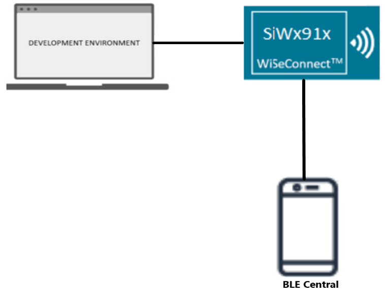
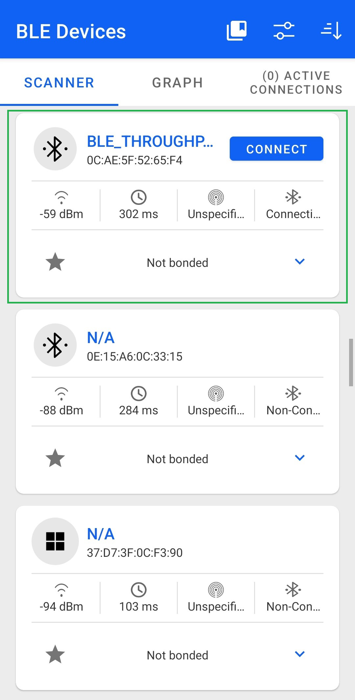
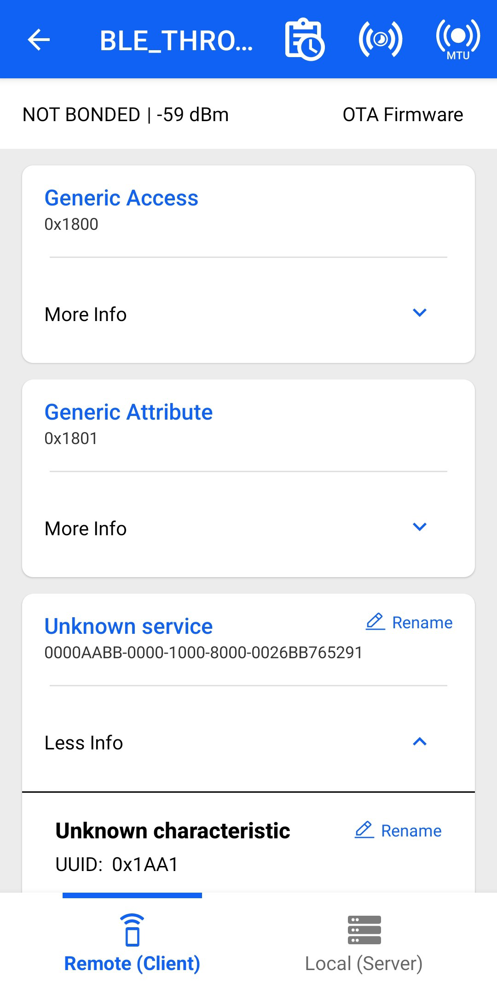
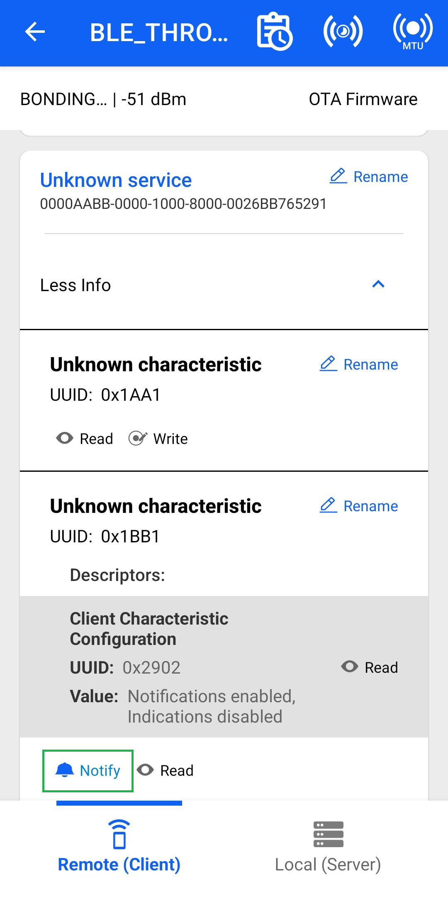
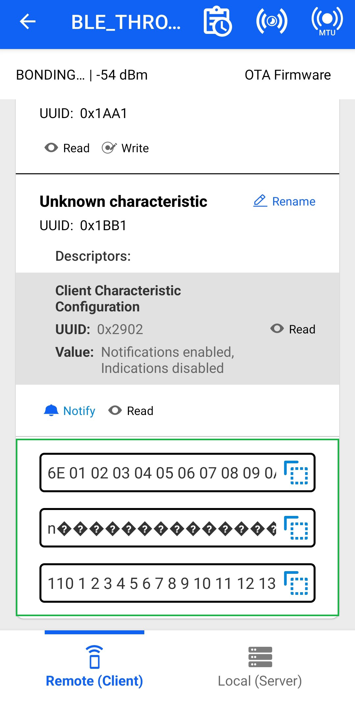
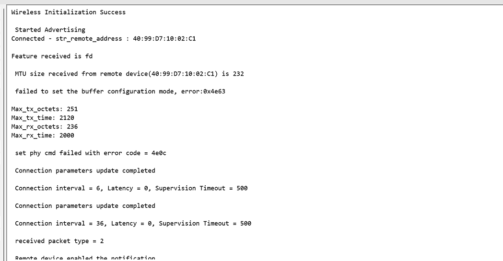
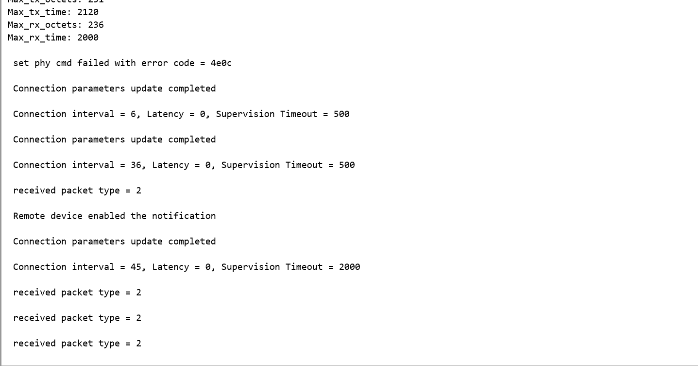
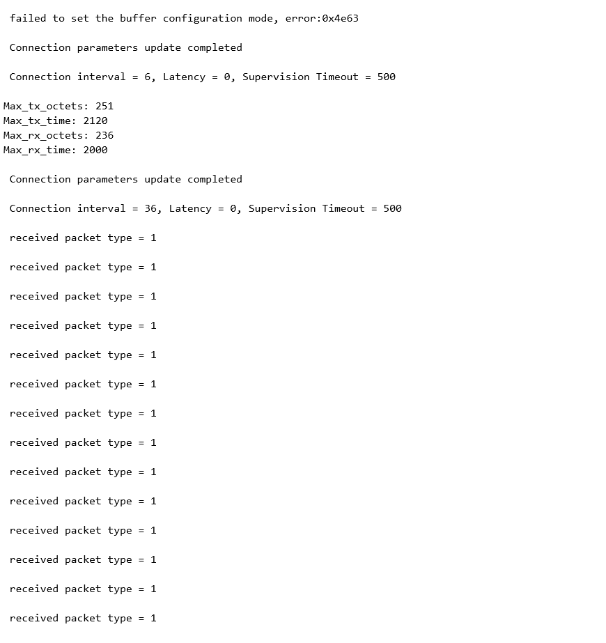
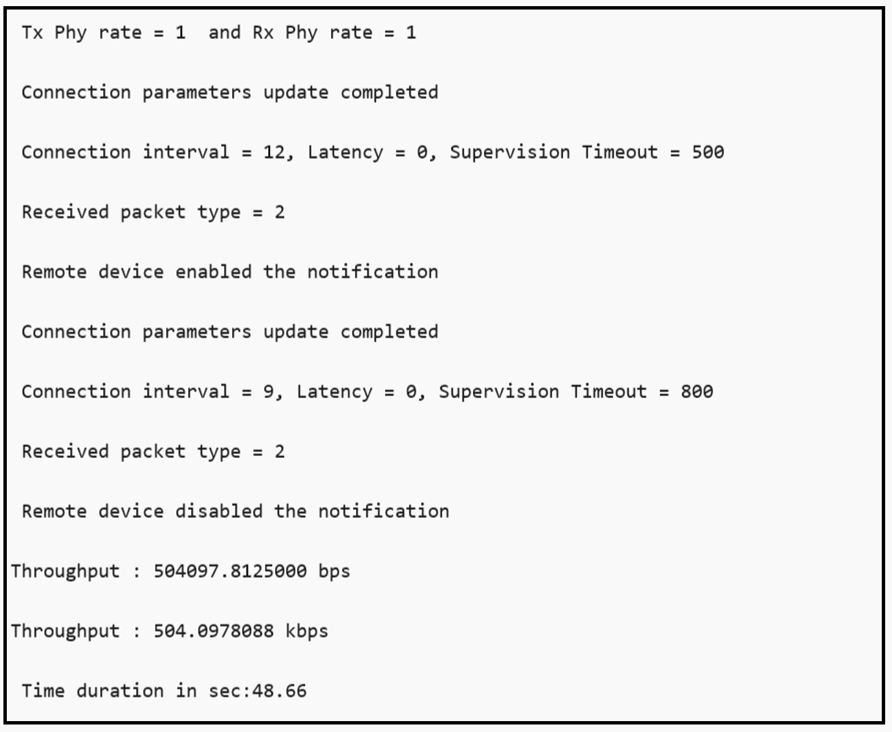

# BLE - Throughput

## Table of Contents

- [BLE - Throughput](#ble---throughput)
  - [Table of Contents](#table-of-contents)
  - [Purpose/Scope](#purposescope)
  - [Prerequisites/Setup Requirements](#prerequisitessetup-requirements)
    - [Hardware Requirements](#hardware-requirements)
    - [Software Requirements](#software-requirements)
    - [Setup Diagram](#setup-diagram)
  - [Getting Started](#getting-started)
    - [Instructions for Simplicity Studio IDE and Silicon Labs devices (SoC and NCP Modes)](#instructions-for-simplicity-studio-ide-and-silicon-labs-devices-soc-and-ncp-modes)
    - [Instructions for Keil IDE and STM32F411RE MCU (NCP Mode)](#instructions-for-keil-ide-and-stm32f411re-mcu-ncp-mode)
  - [Application Build Environment](#application-build-environment)
  - [Test the Application](#test-the-application)
    - [Instructions for Simplicity Studio IDE and Silicon Labs devices (SoC and NCP Modes)](#instructions-for-simplicity-studio-ide-and-silicon-labs-devices-soc-and-ncp-modes-1)
    - [Instructions for Keil IDE and STM32F411RE MCU](#instructions-for-keil-ide-and-stm32f411re-mcu)

## Purpose/Scope

This application demonstrates how to exchange continuous data to the remote device to measure the On-Air Throughput using a BLE Sniffer.

- In this Application, the GATT server configures with Custom service with write, read, and notification characteristic UUIDs.
- When connected remote device enables the notification on UUID, Silicon Labs device sends the continuous notifications to the connected device.
- This is data can be captured with Sniffer to measure the throughput.

**Sequence of Events**

This application explains to the user how to:

- Create a Simple chat service
- Make the device advertise / scannable
- Connect from remote BLE device/ Connect to remote BLE device
- Initiate the Security
- Excite the Data length and Phy rate features
- Sends the notification messages to the connected peer/Smartphone when the notification is enabled

## Prerequisites/Setup Requirements

### Hardware Requirements

- Windows PC with Host interface(UART/ SPI/ SDIO).
- SiWx91x Wi-Fi Evaluation Kit. The SiWx91x supports multiple operating modes. See [Operating Modes]() for details.
- **SoC Mode**:
  - Standalone
    - BRD4002A Wireless pro kit mainboard [SI-MB4002A]
    - Radio Boards 
  	  - BRD4338A [SiWx917-RB4338A]
      - BRD4339B [SiWx917-RB4339B]
  	  - BRD4340A [SiWx917-RB4340A]
      - BRD4343A [SiWx917-RB4343A]
  - Kits
  	- SiWx917 Pro Kit [Si917-PK6031A](https://www.silabs.com/development-tools/wireless/wi-fi/siwx917-pro-kit?tab=overview)
  	- SiWx917 Pro Kit [Si917-PK6032A]
    - SiWx917 AC1 Module Explorer Kit (BRD2708A)
  	
- **NCP Mode**:
  - Standalone
    - BRD4002A Wireless pro kit mainboard [SI-MB4002A]
    - EFR32xG24 Wireless 2.4 GHz +10 dBm Radio Board [xG24-RB4186C](https://www.silabs.com/development-tools/wireless/xg24-rb4186c-efr32xg24-wireless-gecko-radio-board?tab=overview)
    - NCP Expansion Kit with NCP Radio boards
      - (BRD4346A + BRD8045A) [SiWx917-EB4346A]
      - (BRD4357A + BRD8045A) [SiWx917-EB4357A]
  - Kits
  	- EFR32xG24 Pro Kit +10 dBm [xG24-PK6009A](https://www.silabs.com/development-tools/wireless/efr32xg24-pro-kit-10-dbm?tab=overview)
  - STM32F411RE MCU
     - [STM32F411RE](https://www.st.com/en/microcontrollers-microprocessors/stm32f411re.html) MCU
     - NCP Radio Board (BRD4346A + BRD8045C)
  - Interface and Host MCU Supported
    - SPI - EFR32 
    - UART - EFR32
    
- **PSRAM Mode**:
    - Silicon Labs [BRD4340A](https://www.silabs.com/)
- BLE peripheral device in case of Silicon Labs module as client.
- BLE central device in case of Silicon Labs module as server.

### Software Requirements

- Embedded Development Environment
- Simplicity Studio IDE (to be used with Silicon Labs MCU)
- Keil IDE (to be used with STM32F411RE MCU)
- Serial Terminal - [Docklight](https://docklight.de/)/[Tera Term](https://ttssh2.osdn.jp/index.html.en) (to be used with Keil IDE)
- Download and install the Silicon Labs [Simplicity Connect App(formerly EFR Connect App) or other BLE Central/Peripheral app.](https://www.silabs.com/developers/simplicity-connect-mobile-app ) in the android smart phones for testing BLE applications. Users can also use their choice of BLE apps available in Android/iOS smart phones.

> **Note:** The provided mobile screenshots are from the 2.5.2 version of the Simplicity Connect App(formerly EFR Connect App), it is recommended to use the latest version.

### Setup Diagram



## Getting Started

### Instructions for Simplicity Studio IDE and Silicon Labs devices (SoC and NCP Modes)

Refer to the instructions [here](https://docs.silabs.com/wiseconnect/latest/wiseconnect-getting-started/) to:

- [Install Simplicity Studio](https://docs.silabs.com/wiseconnect/latest/wiseconnect-developers-guide-developing-for-silabs-hosts/#install-simplicity-studio)
- [Install WiSeConnect extension](https://docs.silabs.com/wiseconnect/latest/wiseconnect-developers-guide-developing-for-silabs-hosts/#install-the-wi-se-connect-extension)
- [Connect your device to the computer](https://docs.silabs.com/wiseconnect/latest/wiseconnect-developers-guide-developing-for-silabs-hosts/#connect-si-wx91x-to-computer)
- [Upgrade your connectivity firmware ](https://docs.silabs.com/wiseconnect/latest/wiseconnect-developers-guide-developing-for-silabs-hosts/#update-si-wx91x-connectivity-firmware)
- [Create a Studio project ](https://docs.silabs.com/wiseconnect/latest/wiseconnect-developers-guide-developing-for-silabs-hosts/#create-a-project)

For details on the project folder structure, see the [WiSeConnect Examples](https://docs.silabs.com/wiseconnect/latest/wiseconnect-examples/#example-folder-structure) page.

### Instructions for Keil IDE and STM32F411RE MCU (NCP Mode)

  - Install the [Keil IDE](https://www.keil.com/).
  - Download [WiSeConnect SDK](https://github.com/SiliconLabs/wiseconnect)
  - Update the device's connectivity firmware as mentioned [here](https://docs.silabs.com/wiseconnect/latest/wiseconnect-getting-started/getting-started-with-ncp-mode).
  - Connect the SiWx91x NCP to STM32F411RE Nucleo Board following the below steps:
  - Connect the male Arduino compatible header on carrier board to female Arduino compatible header on STM32F411RE Nucleo board.
  - Mount the NCP Radio board (BRD4346A) onto the radio board socket available on the base board (BRD8045C).
  - After connecting all the boards, the setup should look like the image shown below:
    
  - Connect the setup to the computer.
  - Open the BLE PER µVision project - **ble_throughput_app.uvprojx** by navigating to **WiSeConnect SDK → examples → snippets → ble → ble_throughput_app → keil_project**.

## Application Build Environment

The application can be configured to suit your requirements and development environment. Read through the following sections and make any changes needed.

- Open `app.c` file and update/modify the following parameters:
	
   - `RSI_BLE_DEVICE_NAME` refers the name of the Silicon Labs device to appear during scanning by remote devices.
   
      ```c    
      #define RSI_BLE_DEVICE_NAME                                  "BLE_THROUGHPUT"
      ```
- Open `rsi_ble_common_config.h` file and update the below parameters.    

   - `RSI_BLE_NEW_SERVICE_UUID` refers to the 16-bit of 128-bit attribute value of the newly created service. 
      ```c
      //128-bit UUID service: 0000AABB-0000-1000-8000-0026BB765291
      #define RSI_BLE_NEW_SERVICE_UUID                                0xAABB
      ```

   - `RSI_BLE_ATTRIBUTE_1_UUID` refers to the attribute type of the first attribute under this service (RSI_BLE_NEW_SERVICE_UUID).
      ```c
      #define RSI_BLE_ATTRIBUTE_1_UUID                                0x1AA1
      ```
   - `RSI_BLE_ATTRIBUTE_2_UUID` refers to the attribute type of the second attribute under this service (RSI_BLE_NEW_SERVICE_UUID).
      ```c
      #define RSI_BLE_ATTRIBUTE_2_UUID                                0x1BB1
      ```
   
  - Following are the **Non-configurable** macros in the application.

    - `RSI_BLE_CHAR_SERV_UUID` refers to the attribute type of the characteristics to be added in a service.

      ```c
      #define RSI_BLE_CHAR_SERV_UUID                            0x2803
      ```

    - `RSI_BLE_CLIENT_CHAR_UUID` refers to the attribute type of the client characteristics descriptor to be added in a service.

      ```c
      #define RSI_BLE_CLIENT_CHAR_UUID                          0x2902
      ```  

    - Following are the properties:

    - `RSI_BLE_ATT_PROPERTY_READ` is used to set the READ property to an attribute value.

      ```c
      #define RSI_BLE_ATT_PROPERTY_READ                         0x02
      ```

    - `RSI_BLE_ATT_PROPERTY_WRITE` is used to set the WRITE property to an attribute value.

      ```c
      #define RSI_BLE_ATT_PROPERTY_WRITE                        0x08
      ```

    - `RSI_BLE_ATT_PROPERTY_NOTIFY` is used to set the NOTIFY property to an attribute value.

      ```c
      #define RSI_BLE_ATT_PROPERTY_NOTIFY                       0x10
      ```

      ```c
      #define RSI_BLE_PWR_INX                                   30
      #define RSI_BLE_PWR_SAVE_OPTIONS                          0
      
      #define RSI_BLE_REMOTE_DEV_ADDR                           "00:12:45:AB:1D:32"
      #define RSI_REMOTE_DEVICE_NAME                            "Note10"
      
      #define CONN_BY_ADDR                                      1
      #define CONN_BY_NAME                                      2

      #define CONNECT_OPTION                                    CONN_BY_NAME
      
      #define CENTERAL_ROLE                                     1
      #define PERIPHERAL_ROLE                                   2
      #define CONNECTION_ROLE                                   PERIPHERAL_ROLE
      
      #define CONN_INTERVAL_MIN                                 45
      #define CONN_INTERVAL_MAX                                 45
      #define CONN_LATENCY                                      0
      #define SUPERVISION_TIMEOUT                               800
      
      #define SMP_ENABLE                                        1
      
      #define TX_LEN                                            0xFB
      #define TX_TIME                                           0x0148
      
      #define TX_PHY_RATE                                       0x02
      #define RX_PHY_RATE                                       0x02
      #define CODDED_PHY_RATE                                   0x00

      #define NOTIFY_DISABLE                                    0x00
      #define NOTIFY_ENABLE                                     0x01
      
      #define DLE_ON                                            1
      
      #define DLE_BUFFER_MODE                                   1
      #define DLE_BUFFER_COUNT                                  25
      #define RSI_BLE_MAX_DATA_LEN                              232
      ```

      > **Note:** `ble_config.h` file is already set with the desired configuration in respective example folders user need not change for each example.

> **Note**: For recommended settings, please refer the [recommendations guide](https://docs.silabs.com/wiseconnect/latest/wiseconnect-developers-guide-prog-recommended-settings/).

## Test the Application

### Instructions for Simplicity Studio IDE and Silicon Labs devices (SoC and NCP Modes)

Refer to the instructions [here](https://docs.silabs.com/wiseconnect/latest/wiseconnect-getting-started/) to:

- Build the application in Studio.
- Flash, run and debug the application.

### Instructions for Keil IDE and STM32F411RE MCU

- Build the application.
- Set the Docklight up by connecting STM32's Serial COM port. This enables you to view the application prints.
- Flash, run and debug the application.

Follow the steps for successful execution of the program:

1. After the program gets executed, the Silicon Labs module will be in an Advertising state by default.

2. Connect any serial console for prints.

3. Open a nRF Connect App on the Smartphone and do the scan.

4. In the App, the Silicon Labs module device will appear with the name configured in the macro **RSI_BLE_DEVICE_NAME (Ex: "BLE_THROUGHPUT")**

    

5. Initiate a connection from the App.

6. After successful connection, Simplicity Connect App(formerly EFR Connect App) displays the supported services of Silicon Labs module.

    

7. Select the attribute service which is added **RSI_BLE_NEW_SERVICE_UUID**
   **(Ex: 0xAABB)**
   
8. Enable notifications for the read attribute **RSI_BLE_ATTRIBUTE_2_UUID**
   **i.e 0x1BB1, it will start the data transfer for given attribute.**

   

9. Please refer to the given following images for continuous notification received on the mobile.

    

10. Refer the below image for console prints.

    **Console prints for 2Mbps:**

    

    

    **Console prints for 1Mbps:**

    

    
