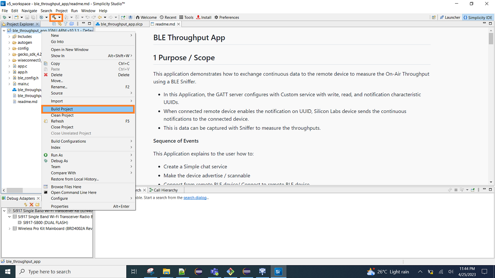
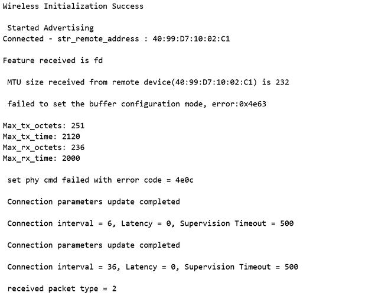

# BLE Throughput App

## 1 Purpose / Scope

This application demonstrates how to exchange continuous data to the remote device to measure the On-Air Throughput using a BLE Sniffer.

- In this Application, the GATT server configures with Custom service with write, read, and notification characteristic UUIDs.
- When connected remote device enables the notification on UUID, Silicon Labs device sends the continuous notifications to the connected device.
- This is data can be captured with Sniffer to measure the throughput.

**Sequence of Events**

This Application explains to the user how to:

- Create a Simple chat service
- Make the device advertise / scannable
- Connect from remote BLE device/ Connect to remote BLE device
- Initiate the Security
- Excite the Data length and Phy rate features
- Sends the notification messages to the connected peer/Smartphone when the notification is enabled

## 2 Prerequisites / Setup Requirements

### 2.1 Hardware Requirements

- Windows PC with Host interface(UART/ SPI/ SDIO).
- SiWx91x Wi-Fi Evaluation Kit. The SiWx91x supports multiple operating modes. See [Operating Modes]() for details.
- **SoC Mode**:
  - Silicon Labs [BRD4325A, BRD4325B, BRD4325C, BRD4325G, BRD4338A, BRD4340A](https://www.silabs.com/)
- **NCP Mode**:
  - Silicon Labs [BRD4180B](https://www.silabs.com/); **AND**
  - Host MCU Eval Kit. This example has been tested with:
  - Silicon Labs [WSTK + EFR32MG21](https://www.silabs.com/development-tools/wireless/efr32xg21-bluetooth-starter-kit)
- BLE peripheral device in case of Silicon Labs module as master.
- BLE central device in case of Silicon Labs module as slave.

### 2.2 Software Requirements

- Embedded Development Environment
- Simplicity Studio IDE
  - Download the [Simplicity Studio IDE](https://www.silabs.com/developers/simplicity-studio).
  - Follow the [Simplicity Studio user guide](https://docs.silabs.com/simplicity-studio-5-users-guide/1.1.0/ss-5-users-guide-getting-started/install-ss-5-and-software#install-ssv5) to install Simplicity Studio IDE.
- Download and install the Silicon Labs [EFR Connect App](https://www.silabs.com/developers/efr-connect-mobile-app) in the android smart phones for testing BLE applications. Users can also use their choice of BLE apps available in Android/iOS smart phones.

### 2.3 Setup Diagram

- **SoC Mode :**

   

- **NCP Mode :**

   

Follow the [Getting Started with Wiseconnect3 SDK](https://docs.silabs.com/wiseconnect/latest/wiseconnect-getting-started/) guide to set up the hardware connections and Simplicity Studio IDE.

## 3 Project Environment

- Ensure the SiWx91x loaded with the latest firmware following the [Upgrade Si91x firmware](https://docs.silabs.com/wiseconnect/latest/wiseconnect-getting-started/getting-started-with-soc-mode#upgrade-si-wx91x-connectivity-firmware)

- Ensure the latest Gecko SDK along with the extension WiSeConnect3 is added to Simplicity Studio.

### 3.1 Creating the project

#### 3.1.1 SoC mode

- Ensure the SiWx91x set up is connected to your PC.

- In the Simplicity Studio IDE, the SiWx91x SoC board will be detected under **Debug Adapters** pane as shown below.

  ****

#### 3.1.2 NCP mode

- Ensure the EFx32 and SiWx91x set up is connected to your PC.

- In the Simplicity Studio IDE, the EFR32 board will be detected under **Debug Adapters** pane as shown below.

  ****

### 3.2 Importing the project

- Studio should detect your board. Your board will be shown here. Click on the board detected and go to **EXAMPLE PROJECTS & DEMOS** section 

#### SOC Mode

- Select **BLE - Throughput** test application

  ****

- Click 'Create'. The "New Project Wizard" window appears. Click 'Finish'

  ****

### 3.3 Set up for application prints

#### 3.3.1 Teraterm set up - for BRD4325A, BRD4325B, BRD4325C, BRD4325G, BRD4340A

You can use either of the below USB to UART converters for application prints.

1. Set up using USB to UART converter board.

   - Connect Tx (Pin-6) to P27 on WSTK
   - Connect GND (Pin 8 or 10) to GND on WSTK

   ****

2. Set up using USB to UART converter cable.

   - Connect RX (Pin 5) of TTL convertor to P27 on WSTK
   - Connect GND (Pin1) of TTL convertor to GND on WSTK

   ****

3. Open the Teraterm tool.

   - For SoC mode, choose the serial port to which USB to UART converter is connected and click on **OK**.

     ****

**Note:** For Other 917 SoC boards please refer section #3.3.2

#### 3.3.2 **Teraterm set up - for NCP and SoC modes**

1. Open the Teraterm tool.

- choose the J-Link port and click on **OK**.
    
    ****

2. Navigate to the Setup → Serial port and update the baud rate to **115200** and click on **OK**.

    ****

    ****

## 4 Application Build Environment

### 4.1 Configure the Application

The application can be configured to suit your requirements and development environment. Read through the following sections and make any changes needed.

**4.1.1** In the Project explorer pane of the IDE, expand the **ble_throughput_app** folder and open the **app.c** file. 
	****
	
   - **BLE_THROUGHPUT** refers the name of the Silicon Labs device to appear during scanning by remote devices.
   
      ```c    
      #define RSI_BLE_DEVICE_NAME                                  "BLE_THROUGHPUT"
      ```
**4.1.2** Open `rsi_ble_common_config.h` file and update the below parameters.    


   - **BLE characteristic service and attribute uuid**
   ```c
   //RSI_BLE_NEW_SERVICE_UUID refers to the 16-bit of 128-bit attribute value of the newly created service. 
   //128-bit UUID service: 0000AABB-0000-1000-8000-0026BB765291
   #define RSI_BLE_NEW_SERVICE_UUID                                0xAABB

   //RSI_BLE_ATTRIBUTE_1_UUID refers to the attribute type of the first attribute under this service (RSI_BLE_NEW_SERVICE_UUID).
   #define RSI_BLE_ATTRIBUTE_1_UUID                                0x1AA1

   //RSI_BLE_ATTRIBUTE_2_UUID refers to the attribute type of the second attribute under this service (RSI_BLE_NEW_SERVICE_UUID).
   #define RSI_BLE_ATTRIBUTE_2_UUID                                0x1BB1
   ```
   
   - **Note:**   Following are the **Non-configurable** macros in the application.
   
   ```c
   //RSI_BLE_CHAR_SERV_UUID refers to the attribute type of the characteristics to be added in a service.
   #define RSI_BLE_CHAR_SERV_UUID                                    0x2803

   //RSI_BLE_CLIENT_CHAR_UUID refers to the attribute type of the client characteristics descriptor to be added in a service.
   #define RSI_BLE_CLIENT_CHAR_UUID                                  0x2902
   ```
   
   - **Note:**  Following are the properties:
   
   ```c
   //RSI_BLE_ATT_PROPERTY_READ is used to set the READ property to an attribute value.
   #define RSI_BLE_ATT_PROPERTY_READ                                 0x02

   //RSI_BLE_ATT_PROPERTY_WRITE is used to set the WRITE property to an attribute value.

   #define RSI_BLE_ATT_PROPERTY_WRITE                                0x08
   
   //RSI_BLE_ATT_PROPERTY_NOTIFY is used to set the NOTIFY property to an attribute value.
   #define RSI_BLE_ATT_PROPERTY_NOTIFY                               0x10
   ```
   
**4.1.3** Open ``ble_config.h`` and `app.c` files and configure the Opermode command parameters.   


   - **BLE Throughput Configurations**
   
   ```c 
   #define RSI_BLE_PWR_INX                                             30
   #define RSI_BLE_PWR_SAVE_OPTIONS                                    0
   
   #define RSI_BLE_REMOTE_DEV_ADDR                                     "00:12:45:AB:1D:32"
   #define RSI_REMOTE_DEVICE_NAME                                      "Note10"
   
   #define CONN_BY_ADDR                                                1
   #define CONN_BY_NAME                                                2
   
   #define CONNECT_OPTION                                              CONN_BY_NAME
   
   #define CENTERAL_ROLE                                               1
   #define PERIPHERAL_ROLE                                             2
   #define CONNECTION_ROLE                                             PERIPHERAL_ROLE
   
   #define CONN_INTERVAL_MIN                                           45
   #define CONN_INTERVAL_MAX                                           45
   #define CONN_LATENCY                                                0
   #define SUPERVISION_TIMEOUT                                         800
   
   #define SMP_ENABLE                                                  1
   
   #define TX_LEN                                                      0xFB
   #define TX_TIME                                                     0x0148
   
   #define TX_PHY_RATE                                                 0x02
   #define RX_PHY_RATE                                                 0x02
   #define CODDED_PHY_RATE                                             0x00
   
   #define NOTIFY_DISABLE                                              0x00
   #define NOTIFY_ENABLE                                               0x01
   
   #define DLE_ON                                                      1
   
   #define DLE_BUFFER_MODE                                             1
   #define DLE_BUFFER_COUNT                                            25
   #define RSI_BLE_MAX_DATA_LEN                                        232
   ```

   - **Opermode command parameters**
     This configuration can be found in app.c as `config`	
   
   **Note:** `ble_config.h` and `app.c` files are already set with desired configuration in respective example folders you need not change for each example.	      
      
### 4.2 Build the Application

- Follow the below steps for the successful execution of the application.

#### SoC Mode

- Once the project is created, click on the build icon (hammer) to build the project (or) right click on project and click on Build Project.

   
   
- Successful build output will show as below.
   
#### NCP Mode :

   
   
- Successful build output will show as below.

### 4.3 Loading the Application Image

1. Click on Tools and Simplicity Commander as shown below.

   
   
2. Load the firmware image
 - Select the board. 
 - Browse the application image (.hex) and click on Flash button.

   
   
### 4.4 Run the SiWx91x Application
   
1. After the program gets executed, the Silicon Labs module will be in an Advertising state by default.

2. Connect any serial console for prints.

3. Open a ERF Connect App on the Smartphone and do the scan.

4. In the App, the Silicon Labs module device will appear with the name configured in the macro **RSI_BLE_DEVICE_NAME (Ex: "BLE_THROUGHPUT")**


5. Initiate a connection from the App.

6. After successful connection, EFR connect APP displays the supported services of Silicon Labs module


7. Select the attribute service which is added **RSI_BLE_NEW_SERVICE_UUID**
   **(Ex: 0xAABB)**
   
8. After Enable notifications for the read attribute **RSI_BLE_ATTRIBUTE_2_UUID**
   **(Example: 0x1BB1) So that the GATT server notifies when value updated in that particular attribute.**
   

9. Please refer to the given below images for continuous notification received on the mobile.


### 4.5 Application Output




