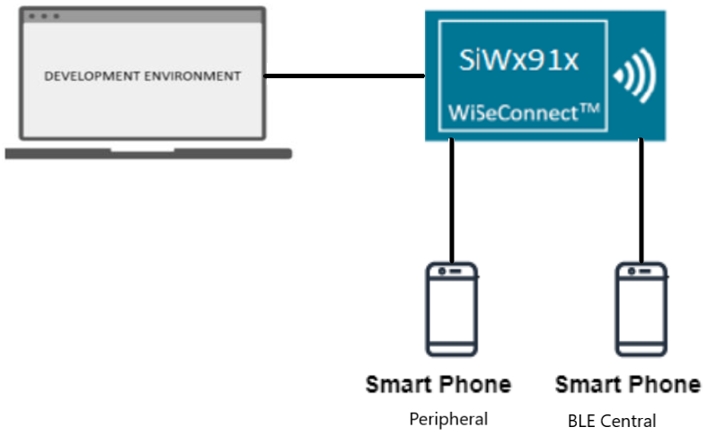
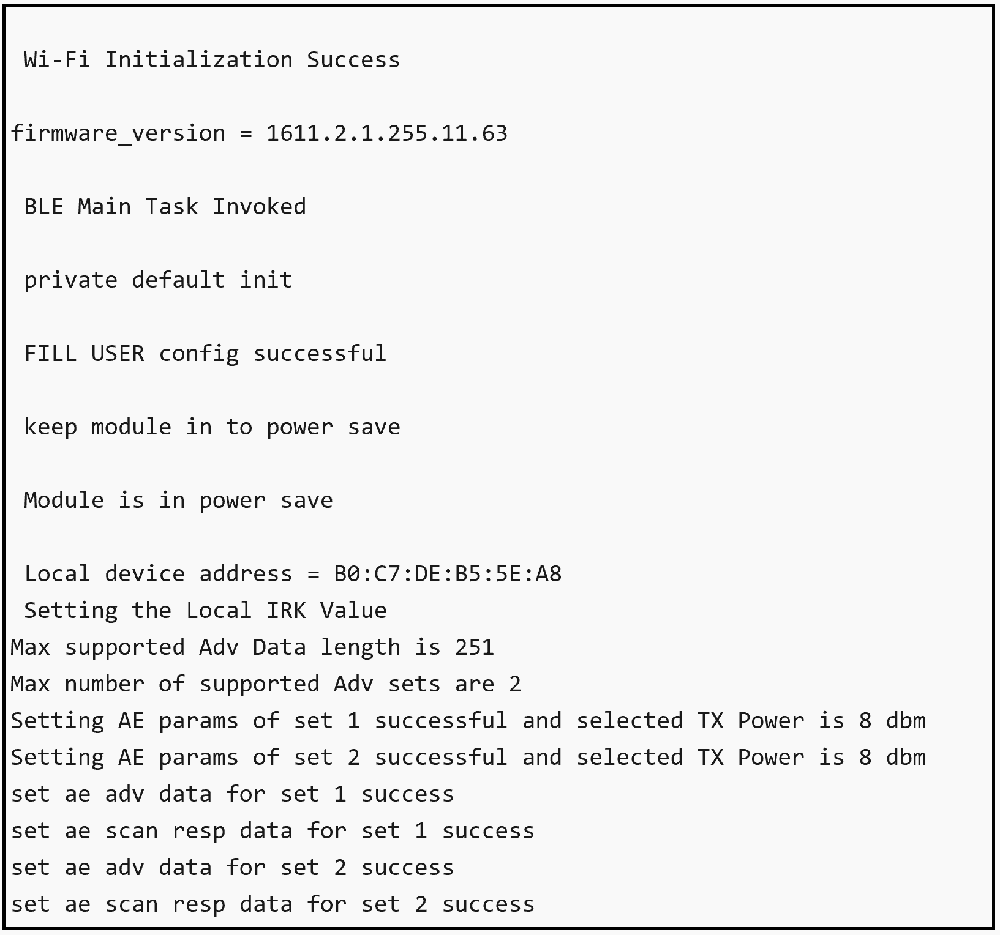
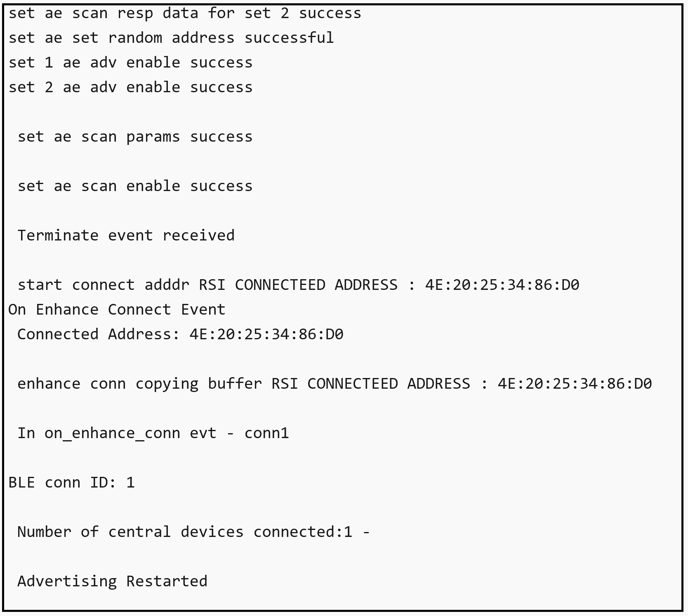
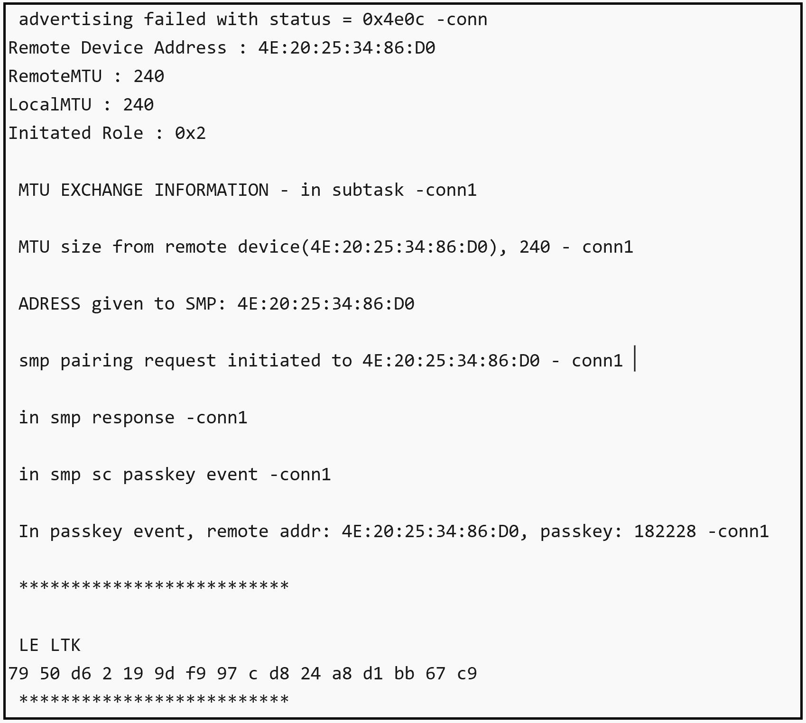
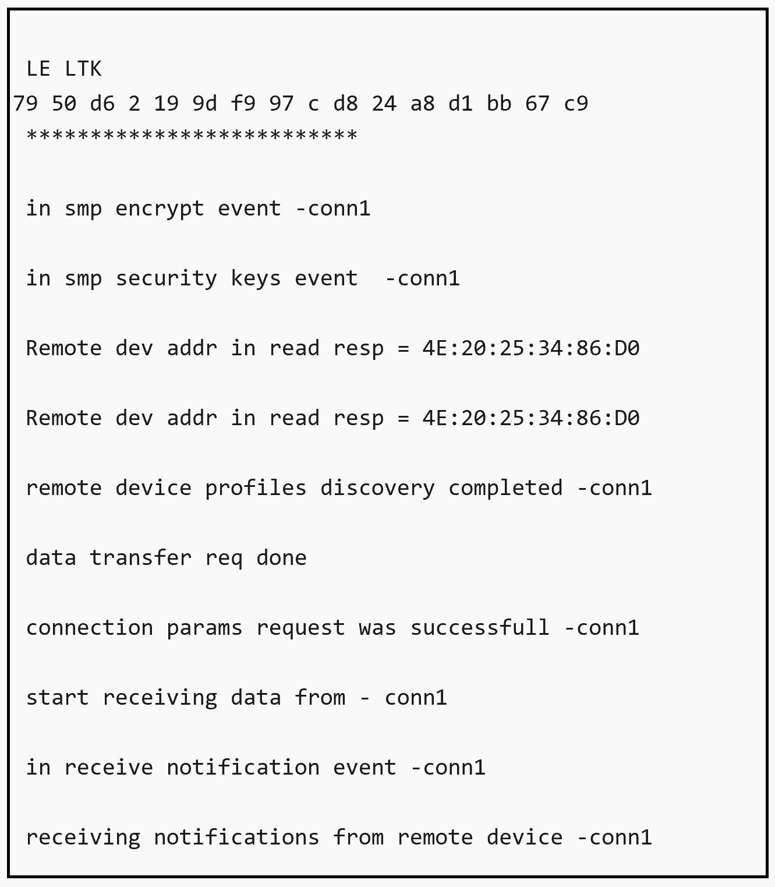

# BLE - Unified AE Coex App

## Table of Contents

- [Purpose/Scope](#purposescope) 
- [Prerequisites/Setup Requirements](#prerequisitessetup-requirements)
  - [Hardware Requirements](#hardware-requirements)
  - [Software Requirements](#software-requirements)
  - [Setup Diagram](#setup-diagram)
- [Getting Started](#getting-started)
- [Application Build Environment](#application-build-environment)
- [Test the Application](#test-the-application)

## Purpose/Scope

This application demonstrates how to configure SiWx91x in Extended Advertising mode (Central/Peripheral).

## Prerequisites/Setup Requirements

### Hardware Requirements

- Windows PC
- SoC Mode:
  - Silicon Labs [BRD4325A, BRD4325B, BRD4325C, BRD4325G, BRD4338A, BRD4339B, BRD4343A](https://www.silabs.com/)
  - Kits
    - SiWx917 AC1 Module Explorer Kit (BRD2708A)
- PSRAM Mode:  
  - Silicon Labs [BRD4340A, BRD4342A, BRD4325G](https://www.silabs.com/)
- NCP Mode:
  - Silicon Labs [BRD4180B](https://www.silabs.com/);
  - Host MCU Eval Kit. This example has been tested with:
    - Silicon Labs [WSTK + EFR32MG21](https://www.silabs.com/development-tools/wireless/efr32xg21-bluetooth-starter-kit)
    - NCP Expansion Kit with NCP Radio boards
      - (BRD4346A + BRD8045A) [SiWx917-EB4346A]
      - (BRD4357A + BRD8045A) [SiWx917-EB4357A]
  - Interface and Host MCU Supported 
    - SPI - EFR32 
- Smartphone configured as BLE peripheral

### Software Requirements

- Simplicity Studio IDE

- Download and install the Silicon Labs [Simplicity Connect App(formerly EFR Connect App) or other BLE Central/Peripheral app.](https://www.silabs.com/developers/simplicity-connect-mobile-app ) in the android smart phones for testing BLE applications. Users can also use their choice of BLE apps available in Android/iOS smart phones.

### Setup Diagram

  	
   		
## Getting Started

Refer to the instructions [here](https://docs.silabs.com/wiseconnect/latest/wiseconnect-getting-started/) to:

- [Install Simplicity Studio](https://docs.silabs.com/wiseconnect/latest/wiseconnect-developers-guide-developing-for-silabs-hosts/#install-simplicity-studio)
- [Install WiSeConnect 3 extension](https://docs.silabs.com/wiseconnect/latest/wiseconnect-developers-guide-developing-for-silabs-hosts/#install-the-wi-se-connect-3-extension)
- [Connect your device to the computer](https://docs.silabs.com/wiseconnect/latest/wiseconnect-developers-guide-developing-for-silabs-hosts/#connect-si-wx91x-to-computer)
- [Upgrade your connectivity firmware ](https://docs.silabs.com/wiseconnect/latest/wiseconnect-developers-guide-developing-for-silabs-hosts/#update-si-wx91x-connectivity-firmware)
- [Create a Studio project ](https://docs.silabs.com/wiseconnect/latest/wiseconnect-developers-guide-developing-for-silabs-hosts/#create-a-project)

For details on the project folder structure, see the [WiSeConnect Examples](https://docs.silabs.com/wiseconnect/latest/wiseconnect-examples/#example-folder-structure) page.

## Application Build Environment

The application can be configured to suit your requirements and development environment. Read through the following sections and make any changes needed.

- Open `ble_config.h` file and update/modify following macros:

  - Configure the following macros to enable extended advertsing and scanning by default respectively
       ```c
       #define ADV_ENABLED_DEFAULT    1
       #define SCAN_ENABLED_DEFAULT   1
       ```
  - Set the following macro to enable second advertising set
       ```c
       #define ADV_SET2    1
       ```
  - Configure the following macros to set the number of peripheral and central connections that can be made
       ```c
       #define RSI_BLE_MAX_NBR_SLAVES    1
       #define RSI_BLE_MAX_NBR_MASTERS   1
       ```
  - Fill the name of the peripheral to be connected to in the following macro
       ```c
       #define RSI_REMOTE_DEVICE_NAME1   AEdevice1
       ```
  - Configure following macro to enable secure connection for central and peripheral respectively :
       ```c
       #define SMP_ENABLE_M1    1
       #define SMP_ENABLE_S1    1
       ```
  - Set following macro to receive 'gatt notifications' from remote device
       ```c
       #define RX_NOTIFICATIONS_FROM_M1    1
       #define RX_NOTIFICATIONS_FROM_S1    1
       ```
    > **Note**: Max limit for number of peripheral connections is 1 and central connections is 1

  - Power save configuration:

    - By default, The application is configured without power save.
       ```c
       #define ENABLE_POWER_SAVE 0
       ```

    - If user wants to run the application in power save, modify the following configuration.
       ```c
       #define ENABLE_POWER_SAVE 1
       ```

  - The desired parameters are provided following. User can also modify the parameters as per their needs and requirements.

    - The length of the advertising data needs to be filled in the following macro
       ```c
       #define BLE_AE_ADV_DATA_LEN    0x19
       ```
    - Follow mentioned macro needs to be populated with data
       ```c
       #define BLE_AE_ADV_DATA    "AE_PERIPHERAL_DATA_1"
       ```
  - The Extended advertising handle for set 1 and 2 can be set with the following macros respectively
       ```c
       #define BLE_AE_ADV_HNDL_SET_1          0x00
       #define BLE_AE_ADV_HNDL_SET_2          0x01
       ```
  - The minimum advertising interval for set 1 and 2 can be set with the following macros respectively
       ```c
       #define BLE_AE_ADV_INT_MIN_SET_1       0x20
       #define BLE_AE_ADV_INT_MIN_SET_2       0x30
       ```
  - The maximum advertising interval for set 1 and 2 can be set with the following macros respectively
       ```c
       #define BLE_AE_ADV_INT_MAX_SET_1       0x20
       #define BLE_AE_ADV_INT_MAX_SET_2       0x30
       ```
  - The Extended advertising channel map for set 1 and 2 can be set with the following macros respectively
       ```c
       #define BLE_AE_ADV_CHANNEL_MAP_SET_1   0x07
       #define BLE_AE_ADV_CHANNEL_MAP_SET_2   0x07
       ```
  - The Extended advertising filter policy for set 1 and 2 can be set with the following macros respectively
       ```c
       #define BLE_AE_ADV_FILTER_POLICY_SET_1 0x00
       #define BLE_AE_ADV_FILTER_POLICY_SET_2 0x00
       ```
  - The Extended advertising TX Power for set 1 and 2 can be set with the following macros respectively
       ```c
       #define BLE_AE_ADV_TX_PWR_SET_1        0x7f
       #define BLE_AE_ADV_TX_PWR_SET_2        0x7f
       ```
  - The primary advertising phy for set 1 and 2 can be set with the following macros respectively
       ```c
       #define BLE_AE_PRIMARY_ADV_PHY_SET_1   0x01
       #define BLE_AE_PRIMARY_ADV_PHY_SET_2   0x01
       ```
  - The Extended advertising max skip for set 1 and 2 can be set with the following macros respectively
       ```c
       #define BLE_AE_SEC_ADV_MAX_SKIP_SET_1  0x00
       #define BLE_AE_SEC_ADV_MAX_SKIP_SET_2  0x00
       ```
  - The secondary advertising phy for set 1 and 2 can be set with the following macros respectively
       ```c
       #define BLE_AE_SECONDARY_ADV_PHY_SET_1 0x01
       #define BLE_AE_SECONDARY_ADV_PHY_SET_2 0x01
       ```
  - The Extended advertising SID for set 1 and 2 can be set with the following macros respectively
       ```c
       #define BLE_AE_ADV_SID_SET_1           0x00
       #define BLE_AE_ADV_SID_SET_2           0x01
       ```
  - The Extended advertising scan request notification enable for set 1 and 2 can be set with the following macros respectively
       ```c
       #define BLE_AE_SCAN_REQ_NOTIF_EN_SET_1 0x01
       #define BLE_AE_SCAN_REQ_NOTIF_EN_SET_2 0x01
       ```
  - The Extended advertising event properties for set 1 and 2 can be set with the following macros respectively
       ```c
       #define BLE_AE_ADV_EVNT_PROP_SET_1     (BLE_CONNECTABLE_ADV)
       #define BLE_AE_ADV_EVNT_PROP_SET_2     0x00
       ```
  - The Extended advertising duration for set 1 and 2 can be set with the following macros respectively
       ```c
       #define BLE_AE_ADV_DUR_SET_1           0x00
       #define BLE_AE_ADV_DUR_SET_2           0x00
       ```
  - The maximum extended advertising events for set 1 and 2 can be set with the following macros respectively
       ```c
       #define BLE_AE_ADV_MAX_AE_EVENTS_SET_1 0x00
       #define BLE_AE_ADV_MAX_AE_EVENTS_SET_2 0x00
       ```
  - Extended scanning filter type can be set with the following macro
       ```c
       #define BLE_AE_SCAN_FILTER_TYPE       SCAN_FILTER_TYPE_ALL
       ```
  - The scan type for primary phy can be set using following macro
       ```c
       #define PRI_PHY_BLE_AE_SCAN_TYPE      SCAN_TYPE_ACTIVE
       ```
  - The scan type for secondary phy can be set using following macro
       ```c
       #define SEC_PHY_BLE_AE_SCAN_TYPE      SCAN_TYPE_ACTIVE
       ```
  - The primary phy extended scan interval can be set using following macro
       ```c
       #define PRI_PHY_LE_AE_SCAN_INTERVAL   0x100
       ```
  - The primary phy extended scan window can be set using following macro
       ```c
       #define PRI_PHY_LE_AE_SCAN_WINDOW     0x50
       ```
  - The secondary phy extended scan interval can be set using following macro
       ```c
       #define SEC_PHY_LE_AE_SCAN_INTERVAL   0x100
       ```
  - The secondary phy extended scan window can be set using following macro
       ```c
       #define SEC_PHY_LE_AE_SCAN_WINDOW     0x50
       ```
  - Extended scanning filter duplicates can be set using following macro
       ```c
       #define BLE_AE_SCAN_ENABLE_FILTER_DUP 0x00
       ```
  - Extended scan duration can be set using following macro
       ```c
       #define BLE_AE_SCAN_DUR               0x00
       ```
  - Extended scan period can be set using following macro
       ```c
       #define BLE_AE_SCAN_PERIOD            0x00
       ```
  - Following are the non-configurable macros in the application.

  - The event properties bits:
       ```c
       #define BLE_CONNECTABLE_ADV        (1 << 0)
       #define BLE_SCANNABLE_ADV          (1 << 1)
       #define BLE_LOW_DUTY_DIR_CONN_ADV  (1 << 2)
       #define BLE_HIGH_DUTY_DIR_CONN_ADV (1 << 3)
       #define BLE_LEGACY_ADV             (1 << 4)
       #define BLE_ANONYMOUS_ADV          (1 << 5)
       #define BLE_TX_WR_ADV              (1 << 6)
       ```
  - Global buffer length: 
       ```c
       #define BT_GLOBAL_BUFF_LEN 15000
       ```

  - Phy rate bits:
       ```c
       #define PHY_1M       BIT(0)
       #define PHY_2M       BIT(1)
       #define PHY_LE_CODED BIT(2)
       #define RSI_BLE_PWR_INX          30
       #define RSI_BLE_PWR_SAVE_OPTIONS 0    
       #define BLE_DISABLE_DUTY_CYCLING 0
       #define BLE_DUTY_CYCLING         1
       #define BLR_DUTY_CYCLING         2
       #define BLE_4X_PWR_SAVE_MODE     4
       ```
  - Opermode command parameters
       ```c
       #define RSI_FEATURE_BIT_MAP                            FEAT_SECURITY_OPEN
       #define RSI_TCP_IP_BYPASS                              RSI_DISABLE
       #define RSI_TCP_IP_FEATURE_BIT_MAP                     TCP_IP_FEAT_DHCPV4_CLIENT
       #define RSI_CUSTOM_FEATURE_BIT_MAP                     FEAT_CUSTOM_FEAT_EXTENTION_VALID
       #define RSI_EXT_CUSTOM_FEATURE_BIT_MAP                 0
       ```

 >**Note:** `ble_config.h` files are already set with desired configuration in respective example folders user need not change for each example.

> **Note:** 
> User can configure default region specific regulatory information using `sl_wifi_region_db_config.h` 
   

## Test the Application

Refer to the instructions [here](https://docs.silabs.com/wiseconnect/latest/wiseconnect-getting-started/) to:

- Build the application.
- Flash, run and debug the application.

Follow the steps as mentioned for the successful execution of the application:

1. Set the desired name Silicon Labs device needs to advertise in `RSI_BLE_LOCAL_NAME` and its random address in `RSI_BLE_SET_RAND_ADDR`. User needs to populate `RSI_BLE_ADV_INT_MIN` and `RSI_BLE_ADV_INT_MAX` with desired values for minimum advertsing interval and maximum advertsing interval.

2. After the program gets executed, from remote device scan for Silicon Labs device which advertsises with the remote device specified in `RSI_BLE_LOCAL_NAME` macro.

3. Observe that the connection is established between the desired device and SiWx91x. 

   > **Note:** Examples for BLE peripherals: Bluetooth Dongle, mobile application, TA sensor tag.
   
4. After successful program execution the prints looks as shown following.   
     
     
      
     
     