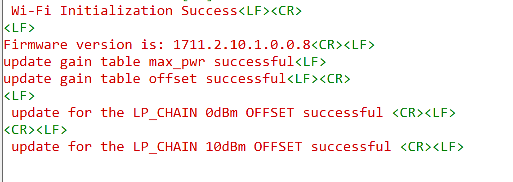

# BLE - Update Gain Table 

## Table of Contents

- [BLE - Update Gain Table](#ble---update-gain-table)
  - [Table of Contents](#table-of-contents)
  - [Purpose/Scope](#purposescope)
  - [Prerequisites/Setup Requirements](#prerequisitessetup-requirements)
    - [Hardware Requirements](#hardware-requirements)
    - [Software Requirements](#software-requirements)
  - [Getting Started](#getting-started)
  - [Application Build Environment](#application-build-environment)
  - [Test the Application](#test-the-application)

## Purpose/Scope

This application demonstrates how to modify gain table offset/max power details. The app can be used to overwrite the default region based gain table with a user-defined region-based gain table.

There are two types of gain tables for BLE protocol
  - Gain table holding maximum transmit power values
  - Gain table with maximum power vs. offset values

Both gain tables must be configured in the correct order to successfully apply changes in the firmware.

## Prerequisites/Setup Requirements

### Hardware Requirements

- Windows PC
- SoC Mode:
  - Silicon Labs [BRD4325A, BRD4325B, BRD4325C, BRD4325G, BRD4338A, BRD4339B, BRD4343A](https://www.silabs.com/)
  - Kits
    - SiWx917 AC1 Module Explorer Kit (BRD2708A)
- PSRAM Mode:  
  - Silicon Labs [BRD4340A, BRD4342A, BRD4325G](https://www.silabs.com/)
- NCP Mode:
  - Silicon Labs [BRD4180B](https://www.silabs.com/);
  - Host MCU Eval Kit. This example has been tested with:
    - Silicon Labs [WSTK + EFR32MG21](https://www.silabs.com/development-tools/wireless/efr32xg21-bluetooth-starter-kit)
    - NCP Expansion Kit with NCP Radio boards
      - (BRD4346A + BRD8045A) [SiWx917-EB4346A]
      - (BRD4357A + BRD8045A) [SiWx917-EB4357A]
- Smartphone 

### Software Requirements

- Simplicity Studio IDE

- Download and install the Silicon Labs [Simplicity Connect App(formerly EFR Connect App) or other BLE Central/Peripheral app.](https://www.silabs.com/developers/simplicity-connect-mobile-app ) in the android smart phones for testing BLE applications. Users can also use their choice of BLE apps available in Android/iOS smart phones.
  
## Getting Started

Refer to the instructions [here](https://docs.silabs.com/wiseconnect/latest/wiseconnect-getting-started/) to:

- [Install Simplicity Studio](https://docs.silabs.com/wiseconnect/latest/wiseconnect-developers-guide-developing-for-silabs-hosts/#install-simplicity-studio)
- [Install WiSeConnect extension](https://docs.silabs.com/wiseconnect/latest/wiseconnect-developers-guide-developing-for-silabs-hosts/#install-the-wi-se-connect-extension)
- [Connect your device to the computer](https://docs.silabs.com/wiseconnect/latest/wiseconnect-developers-guide-developing-for-silabs-hosts/#connect-si-wx91x-to-computer)
- [Upgrade your connectivity firmware ](https://docs.silabs.com/wiseconnect/latest/wiseconnect-developers-guide-developing-for-silabs-hosts/#update-si-wx91x-connectivity-firmware)
- [Create a Studio project ](https://docs.silabs.com/wiseconnect/latest/wiseconnect-developers-guide-developing-for-silabs-hosts/#create-a-project)

For details on the project folder structure, see the [WiSeConnect Examples](https://docs.silabs.com/wiseconnect/latest/wiseconnect-examples/#example-folder-structure) page.

## Application Build Environment

The application can be configured to suit your requirements and development environment. Read through the following sections and make any changes needed.


   The API used to update the gain table is:
```c
int32_t rsi_bt_cmd_update_gain_table_offset_or_max_pwr(uint8_t node_id,
                                                       uint8_t payload_len,
                                                       uint8_t *payload,
                                                       uint8_t req_type)
```
---
**Note!**
* This command must be used immediately after opermode request
* Internally, the firmware maintains two tables
    * Gain table holding Max Tx power values for all regions
    * Gain table with Max power vs offset values for each channel of all regions
* There are 5 regions supported and are FCC, ETSI, TELEC, KCC, WORLDWIDE. These FCC/ETSI/TELEC/KCC gain table max power level and offset values should be loaded in end-to-end mode via BLE User Gain table. This has to be called upon every boot-up since this information is not saved inside flash. SoC uses these tables in FCC/ETSI/TELEC/KCC to limit power and not to violate allowed limits.
* For Worldwide region firmware uses Worldwide values for Tx. For other regions(FCC/ETSI/TELEC/KCC), Firmware uses min value out of Worldwide & Region based values for Tx.  Also there will be part to part variation across chips and offsets are estimated during manufacturing flow which will be applied as correction factor during normal mode of operation.
* This frame has to be used by customers who has done FCC/ETSI/TELEC/KCC certification with their own antenna. All other customers should not use this. Inappropriate use of this frame may result in violation of FCC/ETSI/TELEC/KCC or any certifications and Silicon labs is not liable for that.

---

* BLE power offset like <CHANNEL_NUM>, <1M_OFFSET>, <2M_OFFSET>, <500kbps_oFFSET>, <125kbps_oFFSET>

---

> **Note**: For recommended settings, please refer the [recommendations guide](https://docs.silabs.com/wiseconnect/latest/wiseconnect-developers-guide-prog-recommended-settings/).

Set below macro to update Max TX power and offset
```c
#define GAIN_TABLE_AND_MAX_POWER_UPDATE_ENABLE 1 //! To update gain table and max tx power and offsets
```

**req_type** can be set to one of the following macros :
```c
#define UPDATE_GAIN_TABLE_MAX_POWER 0  // For updating Gain table Max power
#define UPDATE_GAIN_TABLE_OFFSET    1  // For updating Gain table offset
#define BLE_GAIN_TABLE_LP_CHAIN_0DBM_OFFSET_UPDATE  2
#define BLE_GAIN_TABLE_LP_CHAIN_10DBM_OFFSET_UPDATE 3
```
**node_id** refers to BLE Node id :
```c
#define BLE_NODE 0  // For selecting BLE node
```

The following arrays will be used to update_gain_table based on `node_id` and `req_type`.

| `node_id`  | `req_type`                    | Payload Array                                    |
| ---------- | ----------------------------- | ------------------------------------------------ |
| `BLE_NODE` | `UPDATE_GAIN_TABLE_MAX_POWER` | `Si917_BLE_REGION_BASED_MAXPOWER_XX`           |
| `BLE_NODE` | `UPDATE_GAIN_TABLE_OFFSET`    | `Si917_BLE_REGION_BASED_MAXPOWER_VS_OFFSET_XX` |
| `BLE_NODE` | `BLE_GAIN_TABLE_LP_CHAIN_0DBM_OFFSET_UPDATE` | `Si917_BLE_REGION_BASED_LP_CHAIN_0DBM_OFFSET_XX`           |
| `BLE_NODE` | `BLE_GAIN_TABLE_LP_CHAIN_10DBM_OFFSET_UPDATE`    | `Si917_BLE_REGION_BASED_LP_CHAIN_10DBM_OFFSET_XX` |

**Gain Table Max Power Array Format**

```c
uint8_t _Si917_BLE_REGION_BASED_MAXPOWER_XX[] = {}; //! Fill the user gain table max power values in the below mentioned way.

<TABLE NAME>[] = { 
                   <REGION NAME 1>, <MAX POWER>, 
                   <REGION NAME 1>, <MAX POWER>,
                    .
                    .
                   <REGION NAME N>, <MAX POWER> 
                 };
```

**Gain Table Offset Array Format**
```c
uint8_t _Si917_BLE_REGION_BASED_MAXPOWER_VS_OFFSET[] = {};  // Fill the user gain table offset values as shown.

<TABLE NAME>[] = {
                  <Number Of Regions - 'r'>,
                    <REGION NAME 1>, <Number of Channels - 'm'>,
                      <CHANNEL NUMBER 1>, <OFFSET>, <OFFSET>, <OFFSET>, <OFFSET>
                      <CHANNEL NUMBER 2>, <OFFSET>, <OFFSET>, <OFFSET>, <OFFSET>
                      .
                      .
                      <CHANNEL NUMBER m>, <OFFSET>,
                    <REGION NAME 2>, <Number of Channels - 'n'>,
                      <CHANNEL NUMBER 1>, <OFFSET>, <OFFSET>, <OFFSET>, <OFFSET>
                      <CHANNEL NUMBER 2>, <OFFSET>, <OFFSET>, <OFFSET>, <OFFSET>
                      .
                      .
                      <CHANNEL NUMBER n>, <OFFSET>, <OFFSET>, <OFFSET>, <OFFSET>
                     .
                     .
                     <REGION NAME r>, <Number of Channels - 'n'>,
                       <CHANNEL NUMBER 1>, <OFFSET>, <OFFSET>, <OFFSET>, <OFFSET>
                       <CHANNEL NUMBER 2>, <OFFSET>, <OFFSET>, <OFFSET>, <OFFSET>
                       .
                       .
                       <CHANNEL NUMBER n>, <OFFSET>, <OFFSET>, <OFFSET>, <OFFSET>
                   };

uint8_t Si917_BLE_REGION_BASED_LP_CHAIN_0DBM_OFFSET_XX[] = {};  // Fill the user gain table offset values as shown.

<TABLE NAME>[] = {
                  <Number Of Regions - 'r'>,
                    <REGION NAME 1>, <Number of Channels - 'm'>,
                      <CHANNEL NUMBER 1>, <OFFSET>, <OFFSET>, <OFFSET>, <OFFSET>
                      <CHANNEL NUMBER 2>, <OFFSET>, <OFFSET>, <OFFSET>, <OFFSET>
                      .
                      .
                      <CHANNEL NUMBER m>, <OFFSET>,
                    <REGION NAME 2>, <Number of Channels - 'n'>,
                      <CHANNEL NUMBER 1>, <OFFSET>, <OFFSET>, <OFFSET>, <OFFSET>
                      <CHANNEL NUMBER 2>, <OFFSET>, <OFFSET>, <OFFSET>, <OFFSET>
                      .
                      .
                      <CHANNEL NUMBER n>, <OFFSET>, <OFFSET>, <OFFSET>, <OFFSET>
                     .
                     .
                     <REGION NAME r>, <Number of Channels - 'n'>,
                       <CHANNEL NUMBER 1>, <OFFSET>, <OFFSET>, <OFFSET>, <OFFSET>
                       <CHANNEL NUMBER 2>, <OFFSET>, <OFFSET>, <OFFSET>, <OFFSET>
                       .
                       .
                       <CHANNEL NUMBER n>, <OFFSET>, <OFFSET>, <OFFSET>, <OFFSET>
                   };

uint8_t Si917_BLE_REGION_BASED_LP_CHAIN_10DBM_OFFSET_XX[] = {};  // Fill the user gain table offset values as shown.

<TABLE NAME>[] = {
                  <Number Of Regions - 'r'>,
                    <REGION NAME 1>, <Number of Channels - 'm'>,
                      <CHANNEL NUMBER 1>, <OFFSET>, <OFFSET>, <OFFSET>, <OFFSET>
                      <CHANNEL NUMBER 2>, <OFFSET>, <OFFSET>, <OFFSET>, <OFFSET>
                      .
                      .
                      <CHANNEL NUMBER m>, <OFFSET>,
                    <REGION NAME 2>, <Number of Channels - 'n'>,
                      <CHANNEL NUMBER 1>, <OFFSET>, <OFFSET>, <OFFSET>, <OFFSET>
                      <CHANNEL NUMBER 2>, <OFFSET>, <OFFSET>, <OFFSET>, <OFFSET>
                      .
                      .
                      <CHANNEL NUMBER n>, <OFFSET>, <OFFSET>, <OFFSET>, <OFFSET>
                     .
                     .
                     <REGION NAME r>, <Number of Channels - 'n'>,
                       <CHANNEL NUMBER 1>, <OFFSET>, <OFFSET>, <OFFSET>, <OFFSET>
                       <CHANNEL NUMBER 2>, <OFFSET>, <OFFSET>, <OFFSET>, <OFFSET>
                       .
                       .
                       <CHANNEL NUMBER n>, <OFFSET>, <OFFSET>, <OFFSET>, <OFFSET>
                   };

```
**Region Name and Values**

|  Region Name | Value   | 
|--------------|---------|
| `FCC`          | `0`       |
| `ETSI`         | `1`       | 
| `TELEC`        | `2`       |
| `WORLDWIDE`    | `3`       |
| `KCC`          | `4`       |

## Test the Application

Refer to the instructions [here](https://docs.silabs.com/wiseconnect/latest/wiseconnect-getting-started/) to:

- Build the application in Studio.
- Flash, run and debug the application

Follow the steps as mentioned for the successful execution of the application:

1. As soon as the debug process is completed, the application control branches to the main().

2. Go to the J-link Silicon Labs console pane to observe the debug prints in the Serial 1 tab.

3. Click on the **Resume** icon in the Simplicity Studio IDE toolbar to run the application.

4. Review gain table updates on the serial terminal. Refer the following image for console prints:


