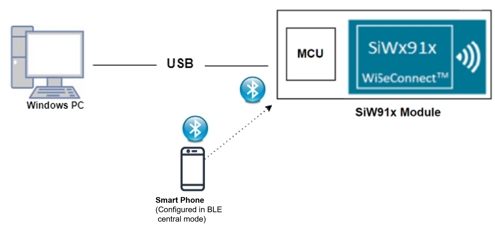
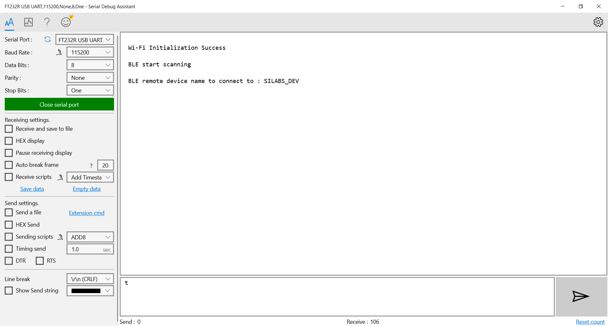

# BLE Whitelist

## 1. Purpose / Scope

This application is used to add a particular BD-Address to the White List. The device to connect is saved on the white list located in the LL block of the controller.

This enumerates the remote devices that are allowed to communicate with the local device. The White List can restrict which device are allowed to connect to other device.

If it is not, it wont connect. Once the address was saved, the connection with that device is going to be an auto connection establishment procedure. 

This means that the Controller autonomously establishes a connection with the device address that matches the address stored in the While List.

## 2. Prerequisites / Setup Requirements

Before running the application, the user will need the following things to setup.

### 2.1 Hardware Requirements

- Windows PC with Host interface(UART/ SPI/ SDIO).
  - SiWx91x Wi-Fi Evaluation Kit. The SiWx91x supports multiple operating modes. See [Operating Modes]() for details.
  - **SoC Mode**: 
    - Silicon Labs [BRD4325A, BRD4325B, BRD4325G](https://www.silabs.com/)
  - **NCP Mode**:
    - Silicon Labs [(BRD4180A, BRD4280B)](https://www.silabs.com/);
    - Host MCU Eval Kit. This example has been tested with:
      - Silicon Labs [WSTK + EFR32MG21](https://www.silabs.com/development-tools/wireless/efr32xg21-bluetooth-starter-kit)
- BLE peripheral device

### 2.2 Software Requirements
    
- Embedded Development Environment

  - For Silicon Labs EFx32, use the latest version of [Simplicity Studio](https://www.silabs.com/developers/simplicity-studio)- Download and install the Silicon Labs [EFR Connect App](https://www.silabs.com/developers/efr-connect-mobile-app) in the android smart phones for testing BLE applications. Users can also use their choice of BLE apps available in Android/iOS smart phones.

### 2.3 Setup Diagram
   
**SoC Mode :** 

  
**NCP Mode :**   


## 3. Project Environment

Ensure the SiWx91x loaded with the latest firmware following the [Getting started with a PC](https://docs.silabs.com/rs9116/latest/wiseconnect-getting-started)

### 3.1 Create the Project

#### 3.1.1 SoC Mode

1. Ensure the SiWx91x setup is connected to your PC.

- In the Simplicity Studio IDE, the SiWx91x SoC board will be detected under **Debug Adapters** pane as shown below.

   
   
- Studio should detect your board. Your board will be shown here. Click on the board detected and go to **EXAMPLE PROJECTS & DEMOS** section.  

- Filter for Bluetooth examples from the Gecko SDK added. For this, check the *Bluetooth* checkbox under **Wireless Technology** and select *BLE - Whitelist* application.

   

- Click 'Create'. The "New Project Wizard" window appears. Click 'Finish'

  

#### 3.1.2 NCP Mode

1. Ensure the EFx32 and SiWx91x setup is connected to your PC.

- In the Simplicity Studio IDE, the EFR32 board will be detected under **Debug Adapters** pane as shown below.
   
   

- Ensure the latest Gecko SDK along with the WiSeConnect 3 extension is added to Simplicity Studio.

- Go to the 'EXAMPLE PROJECT & DEMOS' tab and select *BLE - Whitelist* application.

- Click 'Create'. The "New Project Wizard" window appears. Click 'Finish'.

  

### 3.2 Setup for Application Prints

#### 3.2.1 SoC Mode

  You can use either of the below USB to UART converters for application prints.

1. Setup using USB to UART converter board.

   - Connect Tx (Pin-6) to P27 on WSTK
   - Connect GND (Pin 8 or 10) to GND on WSTK

****

2. Setup using USB to UART converter cable

   - Connect RX (Pin 5) of TTL convertor to P27 on WSTK
   - Connect GND (Pin1) of TTL convertor to GND on WSTK

****

**Tera Term setup - for NCP and SoC modes**

1. Open the Tera Term tool.

 - For SoC mode, choose the serial port to which USB to UART converter is connected and click on **OK**. 

   ****

 - For NCP mode, choose the J-Link port and click on **OK**.
    
   ****

2. Navigate to the Setup → Serial port and update the baud rate to **115200** and click on **OK**.

  ****
 
  ****

## 4 Application Build Environment

### 4.1 Application Configuration

The application can be configured to suit your requirements and development environment. Read through the following sections and make any changes needed.

**4.1.1** Open `app.c` file,

User must update the below parameters 

- `RSI_BLE_DEV_ADDR_TYPE` refers address type of the remote device to connect.  

```
  #define RSI_BLE_DEV_ADDR_TYPE                          LE_PUBLIC_ADDRESS 
```

- Based on the address of the advertising device, Valid configurations are

  - LE_RANDOM_ADDRESS
  - LE_PUBLIC_ADDRESS
   
   Note:
     Depends on the remote device, address type will be changed.

- `RSI_BLE_DEV_ADDR` refers address of the remote device to connect.

  #define RSI_BLE_DEV_ADDR                      "00:1A:7D:DA:71:48"

   `RSI_BLE_WHITELIST_DEV_ADDR1_TYPE`, `RSI_BLE_WHITELIST_DEV_ADDR1_TYPE` refers address of the remote devices to be whitelisted
   
  #define RSI_BLE_WHITELIST_DEV_ADDR1_TYPE              LE_PUBLIC_ADDRESS
  #define RSI_BLE_WHITELIST_DEV_ADDR2_TYPE              LE_PUBLIC_ADDRESS 
  
`RSI_REMOTE_DEVICE_NAME` refers the name of remote device to which Silicon Labs device has to connect.

  #define RSI_REMOTE_DEVICE_NAME                         "SILABS_DEV" 

**Note:** user can configure either RSI_BLE_DEV_ADDR or RSI_REMOTE_DEVICE_NAME of the remote device.

**Power save configuration**

   By default, The Application is configured without power save.
  
  #define ENABLE_POWER_SAVE 0

   If user wants to run the application in power save, modify the below configuration. 
  
  #define ENABLE_POWER_SAVE 1 

The desired parameters are provided below. User can also modify the parameters as per their needs and requirements.

Following are the event numbers for advertising, connection and Disconnection events,

  #define RSI_APP_EVENT_ADV_REPORT                       0
  #define RSI_APP_EVENT_CONNECTED                        1
  #define RSI_APP_EVENT_DISCONNECTED                     2

**4.1.2** Open `ble_config.h` file and update/modify following macros,

  #define RSI_BLE_PWR_INX                                30
  #define RSI_BLE_PWR_SAVE_OPTIONS                       0
  #define RSI_BLE_SCAN_FILTER_TYPE                       SCAN_FILTER_TYPE_ONLY_WHITE_LIST

   **Opermode command parameters*

  #define RSI_FEATURE_BIT_MAP                            FEAT_SECURITY_OPEN
  #define RSI_TCP_IP_BYPASS                              RSI_DISABLE
  #define RSI_TCP_IP_FEATURE_BIT_MAP                     TCP_IP_FEAT_DHCPV4_CLIENT
  #define RSI_CUSTOM_FEATURE_BIT_MAP                     FEAT_CUSTOM_FEAT_EXTENTION_VALID
  #define RSI_EXT_CUSTOM_FEATURE_BIT_MAP                 EXT_FEAT_384K_MODE
   
   **Note:**
   ble_config.h files are already set with desired configuration in respective example folders user need not change for each example. 
   
### 4.2 Build the Application

- Follow the below steps for the successful execution of the application.

#### Build Project - SoC Mode

- Once the project is created, click on the build icon (hammer) to build the project (or) right click on project and click on Build Project.

   
   
- Successful build output will show as below.
   
#### Build Project - NCP Mode

   
   
- Successful build output will show as below.
   
## 5. Test the Application

- Follow the below steps for the successful execution of the application.

### 5.1 Load the SiWx91x Firmware

Refer [Getting started with PC](https://docs.silabs.com/rs9116/latest/wiseconnect-getting-started) to load the firmware into SiWx91x EVK. The firmware binary is located in `<SDK>/firmware/`

### 5.2 Load the Application Image

1. Click on Tools and Simplicity Commander as shown below.

   
   
2. Load the application image
 - Select the board. 
 - Browse the application image (.hex) and click on Flash button.

   

### 5.3 Run the Application

1. Configure the remote ble device in peripheral mode and put it in advertising mode.

   **Note:** Refer the [Creating New Advertisement Sets](https://docs.silabs.com/bluetooth/5.0/miscellaneous/mobile/efr-connect-mobile-app) for configuring the EFR connect mobile APP as advertiser.

2. After the program gets executed, it adds the configured remote device addresses to the whitelist, and Silicon Labs device tries to connect only with the whitelisted remote device specified in **RSI_BLE_DEV_ADDR or RSI_REMOTE_DEVICE_NAME** macro and ble_whitelist_addr1 array.

3. Observe that the connection is established between the desired device and Silicon Labs device.

4. Refer the below images for console prints


