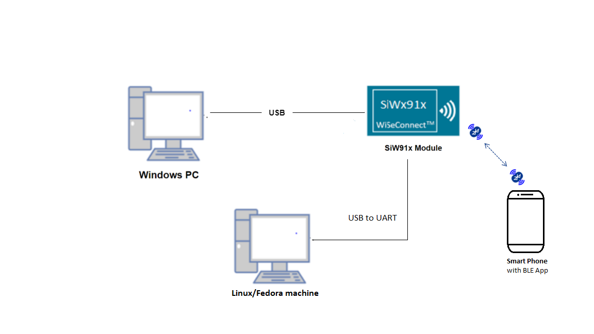
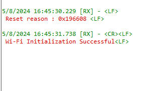

# Ble - BT_STACK_BYPASS

## Table of Contents

- [Purpose/Scope](#purposescope)
- [Prerequisites/Setup Requirements](#prerequisitessetup-requirements)
  - [Hardware Requirements](#hardware-requirements)
  - [Software Requirements](#software-requirements)
  - [Setup Diagram](#Setup-Diagram)
- [Getting Started](#Getting-Started)
- [Application Build Environment](#application-build-environment)
- [Test the Application](#test-the-application)
-[Pin configurations for UART cable](#Pin-configurations-for-UART-cable)
## Purpose / Scope

This application demonstrates how to configure the Raw HCI commands through uart.

## Prerequisites / Setup Requirements

Before running the application, the user will need the following things to setup.

### Hardware Requirements

- Windows PC with Host interface(UART/ SPI/ SDIO).
  - SiWx91x Wi-Fi Evaluation Kit. The SiWx91x supports multiple operating modes. See [Operating Modes]() for details.
  - **SoC Mode**:
	  - Standalone
	  - BRD4002A Wireless pro kit mainboard [SI-MB4002A]
	  - Radio Boards 
		- BRD4338A [SiWx917-RB4338A]
		- BRD4339B [SiWx917-RB4339B]
		- BRD4340A [SiWx917-RB4340A] 
		- BRD4343A [SiWx917-RB4343A]
- Kits
  	- SiWx917 Pro Kit [Si917-PK6031A](https://www.silabs.com/development-tools/wireless/wi-fi/siwx917-pro-kit?tab=overview)
  	- SiWx917 Pro Kit [Si917-PK6032A]
    - SiWx917 AC1 Module Explorer Kit (BRD2708A)
  - Smart phone with Simplicity Connect App(formerly EFR Connect App) mobile app  			
### Software Requirements

- [WiSeConnect SDK](https://github.com/SiliconLabs/wiseconnect-wifi-bt-sdk/)
    
- Embedded Development Environment

   - For STM32, use licensed [Keil IDE](https://www.keil.com/demo/eval/arm.htm)

   - For Silicon Labs EFx32, use the latest version of [Simplicity Studio](https://www.silabs.com/developers/simplicity-studio)
   
- Download and install the Silicon Labs [Simplicity Connect App(formerly EFR Connect App)](https://www.silabs.com/developers/simplicity-connect-mobile-app ) in the android smart phones for testing BLE applications. Users can also use their choice of BLE apps available in Android/iOS smart phones.

#### Setup Diagram 



## Getting Started

- Refer to the instructions [here](https://docs.silabs.com/wiseconnect/latest/wiseconnect-getting-started/) to:

   - Install Studio and WiSeConnect 3 extension
   - Connect your device to the computer
   - Upgrade your connectivity firmware
   - Create a Studio project

- For details on the project folder structure, see the [WiSeConnect Examples](https://docs.silabs.com/wiseconnect/latest/wiseconnect-examples/#example-folder-structure) page.

## Application Build Environment
 
- The application can be configured to suit your requirements and development environment. Read through the following sections and make any changes needed.

  - Open `USART.c` file which can be found in this path: components/device/silabs/si91x/mcu/drivers/cmsis_driver/USART.c

  - User must enable the below parameters if they are not enabled

  ```c
   #define RTE_USART0_CHNL_UDMA_TX_EN         1
  ```
  ```c
   #define RTE_USART0_CHNL_UDMA_RX_EN         1
  ```

## Test the Application

Refer to the instructions [here](https://docs.silabs.com/wiseconnect/latest/wiseconnect-getting-started/) to:

- Build the application in Studio.
- Flash, run and debug the application.
 
Follow the steps for successful execution of the program:

1. After the program gets executed, Silicon Labs module will be in uart receive state.
	
	- Observe the prints in the Docklight
	
	

2. Add the hciattach file from below path examples\snippets\ble\bt_stack_bypass\binaries in Fedora in any Folder.

3. Change the permissions for the hciattach file added in Fedora by giving below command.
    ```c
	    chmod 777 hciattach
    ```
	
4. Send the below command to make `Silicon labs module Up`.
    ```c
	    ./hciattach -s 115200  /dev/ttyUSBX  any , X - device interface
    ```

5. Send the below command to verify the device interface with `BD_ADDR` is up or not.
    ```c
	    hciconfig
    ```
	
6. If the interface is `DOWN`. send below command to make interface `UP`. where  `X` indicates device interface.
    ```c
	    hciconfig -a hciX up 
    ```

7. Send the below commands to verify the basic functionality.
    - For Advertising, where  `X` indicates device interface.

    ```c
	    hciconfig -a hciX leadv
    ```
    - For Scanning, where  `X` indicates device interface.

    ```c
    	hcitool -i hciX lescan (for scanning), X - device interface
    ```
8. After sending the above commands verify functionlaity in Remote Mobile App

   - Open NRF connect app in remote Mobile device and scan for Silicon Labs Module with BD_ADDR seen in step no.5
	
9. Send the below command to remove the device.
    ```c
	    pkill hciattach
    ```
10. If you want to re-run the application press reset on the EFR and follow the same steps.	
	
## Pin configurations for UART cable

- Connect USB to UART cable to Fedora/Linux machine(https://www.amazon.in/Serial-Converter-Cable-Terminated-Header/dp/B06ZYPLFNB). 
- Follow the below pin configurations to connect USB to UART cable with WSTK Board.

| Pin description | Pin number on the WSTK board|
|-----------------|------------|
|UART Tx |P35|
|UART Rx |P33|