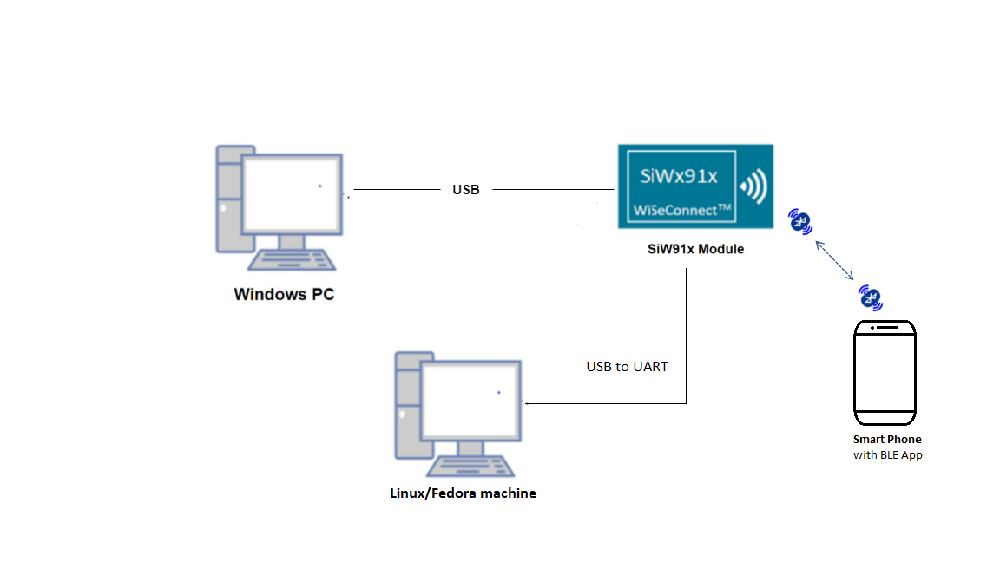
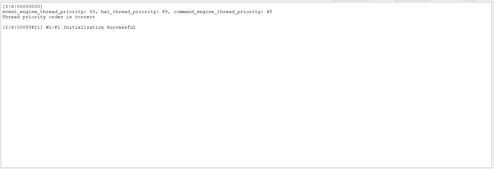
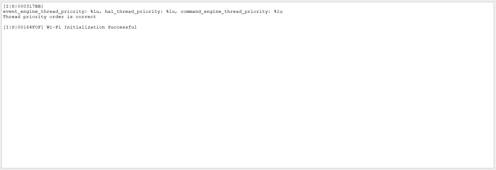
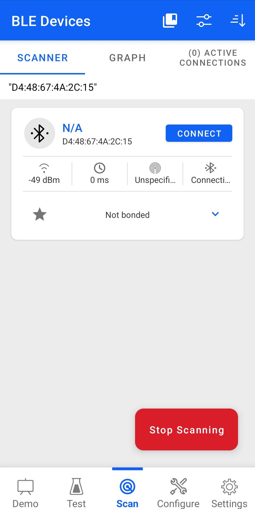
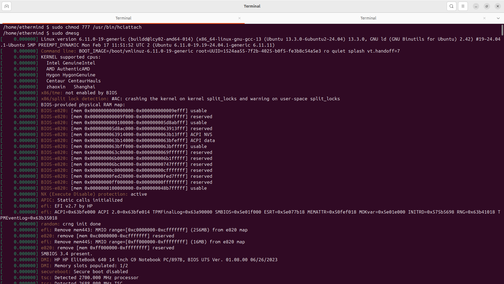
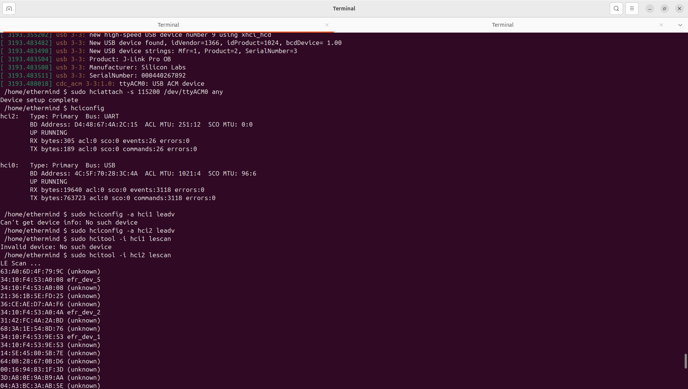
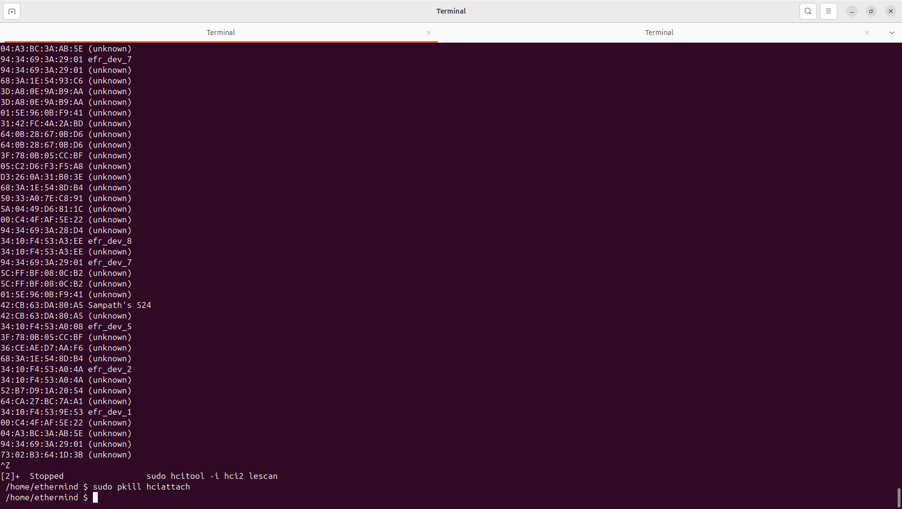
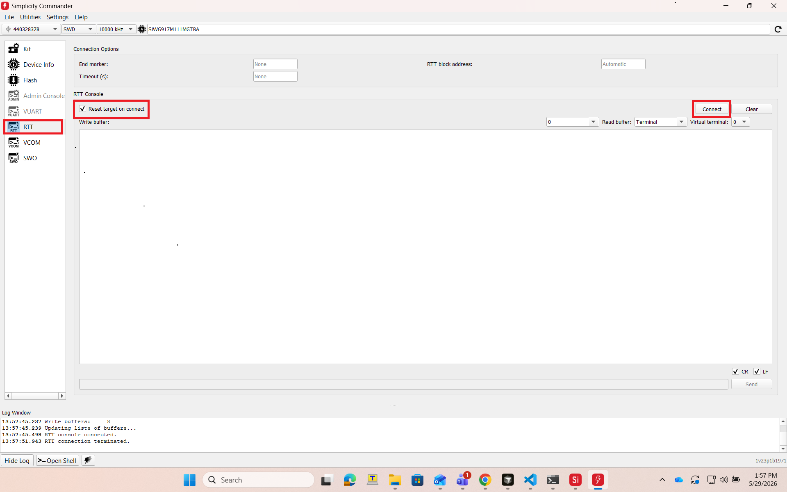

# Ble - BT_STACK_BYPASS

## High-Level Overview

This application demonstrates how to send raw HCI commands to the SiWx91x module from a Linux host over UART.

## Table of Contents

- [Ble - BT\_STACK\_BYPASS](#ble---bt_stack_bypass)
  - [High-Level Overview](#high-level-overview)
  - [Table of Contents](#table-of-contents)
  - [Purpose / Scope](#purpose--scope)
  - [Prerequisites / Setup Requirements](#prerequisites--setup-requirements)
    - [Hardware Requirements](#hardware-requirements)
    - [Software Requirements](#software-requirements)
    - [Project Files](#project-files)
    - [Setup Diagram](#setup-diagram)
  - [Steps to Run Demo](#steps-to-run-demo)
    - [Getting Started](#getting-started)
    - [Configuration and Setup](#configuration-and-setup)
      - [NCP mode (EFR32 + Si91x NCP module)](#ncp-mode-efr32--si91x-ncp-module)
      - [HCI VCOM and Debug Logging](#hci-vcom-and-debug-logging)
      - [General Configuration](#general-configuration)
    - [Steps for Execution](#steps-for-execution)
      - [Steps to view Logs](#steps-to-view-logs)
      - [Attach HCI UART on the Linux host (Raspberry Pi / modern Linux)](#attach-hci-uart-on-the-linux-host-raspberry-pi--modern-linux)
      - [Legacy Fedora (hciattach)](#legacy-fedora-hciattach)
    - [Pin configurations for UART cable (SoC mode)](#pin-configurations-for-uart-cable-soc-mode)
  - [Troubleshooting](#troubleshooting)
  - [Resources](#resources)
  - [Report Bugs and Get Support](#report-bugs-and-get-support)

## Purpose / Scope

This application demonstrates how to configure the Raw HCI commands through UART.

This application can be used for controller-level BT-Sig validation.

## Prerequisites / Setup Requirements

Before running the application, ensure that you have the following.

### Hardware Requirements

- A Windows PC (for build, flash, and—on **NCP**—USB connection to the EFR32 host board).
- A Linux PC (for BT stack; to send HCI commands to the SiWx91x module over UART).
- SiWx91x Wi-Fi Evaluation Kit. The SiWx91x supports multiple operating modes. See [Operating Modes](https://docs.silabs.com/wiseconnect/latest/wiseconnect-developers-guide-overview/#operating-modes) for details.

- **SoC Mode**:
  - Standalone
    - [BRD4002A](https://www.silabs.com/development-tools/wireless/wireless-pro-kit-mainboard?tab=overview) Wireless Pro Kit Mainboard [SI-MB4002A](https://www.silabs.com/development-tools/wireless/wireless-pro-kit-mainboard?tab=overview)
    - Radio Boards
      - [BRD4338A](https://www.silabs.com/development-tools/wireless/wi-fi/siwx917-rb4338a-wifi-6-bluetooth-le-soc-radio-board?tab=overview) [SiWx917-RB4338A]
      - [BRD4343A](https://www.silabs.com/development-tools/wireless/wi-fi/siw917y-rb4343a-wi-fi-6-bluetooth-le-8mb-flash-radio-board-for-module?tab=overview) [SiWx917-RB4343A]
      - [BRD4343C](https://www.silabs.com/development-tools/wireless/wi-fi/siw917y-rb4343c-wi-fi-6-bluetooth-le-8mb-flash-radio-board-for-module?tab=overview) [SiWx917-RB4343C]
  - Kits
    - SiWx917 Pro Kit [Si917-PK6031A](https://www.silabs.com/development-tools/wireless/wi-fi/siwx917-pro-kit?tab=overview)
    - SiWx917 Pro Kit [Si917-PK6032A]
    - SiWx917 AC1 Module Explorer Kit [BRD2708A](https://www.silabs.com/development-tools/wireless/wi-fi/siw917y-ek2708a-explorer-kit)

- **NCP Mode**:
  - Standalone
    - [BRD4002A](https://www.silabs.com/development-tools/wireless/wireless-pro-kit-mainboard?tab=overview) Wireless Pro Kit Mainboard [SI-MB4002A](https://www.silabs.com/development-tools/wireless/wireless-pro-kit-mainboard?tab=overview)
    - EFR32xG24 Wireless 2.4 GHz +10 dBm Radio Board [xG24-RB4186C](https://www.silabs.com/development-tools/wireless/xg24-rb4186c-efr32xg24-wireless-gecko-radio-board?tab=overview)
    - NCP Expansion Kit with NCP Radio Boards
      - [[BRD8045A](https://www.silabs.com/development-tools/wireless/wi-fi/expansion-adapter-board-for-co-processor-radio-boards?tab=overview) + [BRD4346A](https://www.silabs.com/development-tools/wireless/wi-fi/siwx917-rb4346a-wifi-6-bluetooth-le-soc-4mb-flash-radio-board?tab=overview) / [BRD4357A](https://www.silabs.com/development-tools/wireless/wi-fi/siw917y-rb4357a-wi-fi-6-bluetooth-le-4mb-flash-radio-board-for-rcp-and-ncp-modules?tab=overview) / [BRD4357C](https://www.silabs.com/development-tools/wireless/wi-fi/siw917y-rb4357c-wi-fi-6-bluetooth-le-4mb-flash-radio-board-for-rcp-and-ncp-modules?tab=overview)]
  - Kits
    - EFR32xG24 Pro Kit +10 dBm [xG24-PK6009A](https://www.silabs.com/development-tools/wireless/efr32xg24-pro-kit-10-dbm?tab=overview)
  - Interface and Host MCU Supported
    - SPI - EFR32 

- Smartphone with [Simplicity Connect App](https://www.silabs.com/developers/simplicity-connect-mobile-app) (formerly EFR Connect App) for BLE testing (or other BLE apps on Android/iOS).

### Software Requirements

- [WiSeConnect SDK](https://github.com/SiliconLabs/wiseconnect)

- Embedded Development Environment

  - For Silicon Labs EFR32, use the latest version of [Simplicity Studio](https://www.silabs.com/developers/simplicity-studio)

- **RTT** (bundled with Simplicity Studio / J-Link support on EFR32) for **debug logging**: use the **RTT** view in the debugger or **J-Link RTT Viewer** to capture firmware prints. 
  - **RTT Channel 0**: Both host and TA (firmware) logs for SoC and NCP modes
  - See [HCI VCOM and debug logging](#hci-vcom-and-debug-logging) for details.

- Download and install the Silicon Labs [Simplicity Connect App](https://www.silabs.com/developers/simplicity-connect-mobile-app) (formerly EFR Connect App) on Android smartphones for testing BLE applications. Users can also use their choice of BLE apps available on Android/iOS.

### Project Files


| Mode | Host / target                                                                         | Project file (this example folder) |
| ---- | ------------------------------------------------------------------------------------- | ---------------------------------- |
| SoC  | Application runs on SiWx91x.                                                          | `bt_stack_bypass.slcp`             |
| NCP  | Application runs on **EFR32** host; SiWx917 is the network co-processor over **SPI**. | `bt_stack_bypass_spi_ncp.slcp`     |

> **Note:** The BT Stack Bypass example is provided only in **SoC** and **NCP** mode. PSRAM variants are not shipped for this example.

To create a project, select the appropriate example (`bt_stack_bypass` for SoC or `bt_stack_bypass_spi_ncp` for NCP) from the **Examples and Demos** section in Simplicity Studio. For NCP mode setup, refer to [Getting started with NCP mode](https://docs.silabs.com/wiseconnect/latest/wiseconnect-getting-started/getting-started-with-ncp-mode-with-efr32).

### Setup Diagram



## Steps to Run Demo

### Getting Started

- Refer to the instructions [here](https://docs.silabs.com/wiseconnect/latest/wiseconnect-getting-started/) to:

  - [Install Simplicity Studio](https://docs.silabs.com/wiseconnect/latest/wiseconnect-developers-guide-developing-for-silabs-hosts/using-the-simplicity-studio-ide#install-simplicity-studio).
  - [Install WiSeConnect extension](https://docs.silabs.com/wiseconnect/latest/wiseconnect-developers-guide-developing-for-silabs-hosts/using-the-simplicity-studio-ide#install-the-wiseconnect-extension).
  - [Connect your device to the computer](https://docs.silabs.com/wiseconnect/latest/wiseconnect-developers-guide-developing-for-silabs-hosts/using-the-simplicity-studio-ide#connect-siwx91x-to-computer).
  - [Upgrade your connectivity firmware](https://docs.silabs.com/wiseconnect/latest/wiseconnect-developers-guide-developing-for-silabs-hosts/using-the-simplicity-studio-ide#update-siwx91x-connectivity-firmware).
    > **Note:** Ensure the SiWx91x module is loaded with the latest connectivity firmware as described in [SiWx91x Firmware Update].
  - [Create a Studio project](https://docs.silabs.com/wiseconnect/latest/wiseconnect-developers-guide-developing-for-silabs-hosts/using-the-simplicity-studio-ide#create-a-project). Choose **BLE - BT_STACK_BYPASS** or **BLE - BT_STACK_BYPASS (NCP)** as appropriate for your board.
- For details on the project folder structure, see the [WiSeConnect Examples](https://docs.silabs.com/wiseconnect/latest/wiseconnect-examples/#example-folder-structure) page.

### Configuration and Setup

#### NCP mode (EFR32 + Si91x NCP module)

Use **NCP host** mode when the application runs on an **EFR32 host MCU** connected to a Si91x NCP module over the **SPI Bus** (same arrangement as `wireless_test_ncp`).

1. In Simplicity Studio, create and generate a project using the example **`bt_stack_bypass_spi_ncp`** with your target EFR32 board. This configuration aligns with the **`wireless_test_ncp`** component set for the SPI interface and excludes the console CLI source files.
2. Do not define `SLI_SI91X_MCU_INTERFACE` for the NCP host build. In this configuration (`app.c`), HCI communication uses the `sl_iostream` interface. Configure the stdio retarget to use the EUSART VCOM interface, similar to the `wireless_test_ncp` example project.
3. HCI reset handling on NCP calls **`sl_wifi_deinit()`** and **`NVIC_SystemReset()`** instead of the SoC **`sl_si91x_soc_nvic_reset()`**.
4. **`ble_config.h`** already selects NCP-appropriate BLE limits.
5. For **NCP mode**, connect the EFR32 host board directly to the Linux PC using a USB cable. The HCI communication happens over the board's USB/VCOM interface. This application follows your board's USB connection and the project's **stdio / iostream** setup.

> **Note:** Ensure that you do not use the SoC UART pin wiring below for the NCP mode.

#### HCI VCOM and Debug Logging

- The UART/VCOM interface used for HCI communication with the host PC must transmit only HCI packet data. Do not use `printf()` on the same interface, as debug text and ASCII characters can corrupt the HCI data stream and cause invalid packet type errors on the host side.

- To avoid interference with HCI traffic, **host and TA (firmware) logs** are redirected to **RTT Channel 0**. This provides non-intrusive debug logging over the J-Link debugger connection without affecting HCI communication on VCOM.

Alternatively, use Simplicity Studio's RTT Console view while debugging.

#### General Configuration

- The application can be configured to suit your requirements and development environment. Read through the following sections and make any changes needed.
  - Open `USART.c` file which can be found in this path: components/device/silabs/si91x/mcu/drivers/cmsis_driver/USART.c

  - User must enable the below parameters if they are not enabled

  ```c
   #define RTE_USART0_CHNL_UDMA_TX_EN         1
  ```
  ```c
   #define RTE_USART0_CHNL_UDMA_RX_EN         1
  ```

- **Do not define `SL_SI91X_PRINT_DBG_LOG`** in NCP builds, as it would route logs to VCOM/HCI and break the HCI stream.

- **Note for SoC mode**: If logging is enabled in the SoC application, the M4 will not go to powersave mode since RTT is being used as the logging backend. Both host and TA (firmware) logs will be available on RTT Channel 0.

> **Note**: For recommended settings, please refer the [recommendations guide](https://docs.silabs.com/wiseconnect/latest/wiseconnect-developers-guide-prog-recommended-settings/).

### Steps for Execution

Refer to the instructions [here](https://docs.silabs.com/wiseconnect/latest/wiseconnect-getting-started/) to:

- Build the application in Studio.
- Flash, run and debug the application.

> **Note:** 
> - **For SoC mode**: Connect an external USB-to-UART cable from the WSTK board to the Linux PC (see [Pin configurations for UART cable (SoC mode)](#pin-configurations-for-uart-cable-soc-mode))
> - **For NCP mode**: After successfully flashing the application binary file, disconnect the EFR32 host board USB power cable from the Windows PC and connect it to the Linux host (no external UART cable needed).

Follow the steps for successful execution of the program:

1. After the program gets executed, Silicon Labs module will be in uart receive state.

2. Wait until **Wi-Fi initialization completes** on the module before attaching HCI on the host (required for BLE HCI to respond).

    - Refer below image for SOC console logs
      

    - Refer below image for NCP console logs
      

3. Attach the UART HCI interface on the Linux host — see [Attach HCI UART on the Linux host](#attach-hci-uart-on-the-linux-host-raspberry-pi--modern-linux) (Raspberry Pi / modern Linux) or [Legacy Fedora (hciattach)](#legacy-fedora-hciattach).

4. Send the below command to verify the device interface with `BD_ADDR` is up or not.

    ```sh
    hciconfig
    ```

5. If the interface is `DOWN`, send below command to make interface `UP`, where `X` indicates device interface.

    ```sh
    hciconfig -a hciX up
    ```

6. Send the below commands to verify the basic functionality.
    - For Advertising, where `X` indicates device interface.

      ```sh
      hciconfig -a hciX leadv
      ```
    - For Scanning, where `X` indicates device interface.

      ```sh
      hcitool -i hciX lescan
      ```

7. After sending the above commands verify functionality in Remote Mobile App

   - Open SiConnect app in remote Mobile device and scan for Silicon Labs Module with BD_ADDR seen in step no.4
  

8. To detach the HCI UART interface, stop `btattach` (modern Linux) or `hciattach` (legacy):

    ```sh
    pkill -f 'btattach.*ttyUSBX'
    ```
    or
    ```sh
    pkill hciattach
    ```

9. If you want to re-run the application press reset on the board and follow the same steps.

Refer to the following Linux logs for the command which will be same for both `SOC` and `NCP` modes.






#### Steps to view Logs

1. Open Simplicity Commander.

2. Switch to the RTT tab.

3. Enable **Reset target on connect**, and click **Connect**


#### Attach HCI UART on the Linux host (Raspberry Pi / modern Linux)

Use this flow on **Raspberry Pi OS**, **Debian Bookworm**, and other hosts with **kernel 5.10+** and **BlueZ 5.x**. The bundled script uses `btattach` (H4 protocol) instead of the deprecated `hciattach` tool.

1. Install BlueZ user tools if `btattach` is not present:

    ```sh
    sudo apt install bluez
    ```

2. Copy `examples/snippets/ble/bt_stack_bypass/binaries/hci_uart_attach.sh` to the Pi and make it executable:

    ```sh
    chmod +x hci_uart_attach.sh
    ```

3. Send the below command to check the connected SiWx917 device USB port.
    ```sh
    dmesg
    ```

3. Attach the SiWx91x HCI UART (use `-d` for background mode — recommended on Pi so SSH disconnect does not remove `hciX`):

    ```sh
    sudo ./hci_uart_attach.sh -d /dev/ttyUSBX 115200
    ```

4. Bring the interface up:

    ```sh
    sudo hciconfig hciX up
    ```

The script stops **ModemManager** and the host **bluetooth** service (which can grab the serial port or conflict with the onboard controller), configures the UART line, and runs `btattach -P h4 -N`. **`btattach` must stay running** while `hci0` is in use.

#### Legacy Fedora (hciattach)

On older Fedora hosts that ship the bundled `hciattach` binary in `examples/snippets/ble/bt_stack_bypass/binaries/`:

1. Copy the `hciattach` binary to a folder on the host.

2. Change permissions:

    ```sh
    chmod 777 hciattach
    ```

3. Send the below command to check the connected SiWx917 device USB port.
    ```sh
    dmesg
    ```

4. Attach:

    ```sh
    ./hciattach -s 115200 /dev/ttyX any
    ```

	
### Pin Configurations for UART Cable (SoC mode)

The table below applies only to SoC mode, when you connect an external USB-to-UART cable from a Linux host (e.g., Fedora) to the WSTK for raw HCI on UART.

- Connect USB to UART cable to a Linux host (e.g. Raspberry Pi or Fedora) ([example cable](https://www.amazon.in/Serial-Converter-Cable-Terminated-Header/dp/B06ZYPLFNB)).
- Follow the pin configuration below to connect the USB-to-UART cable to the WSTK board (**SoC** testing only).


| Pin description | Pin number on the WSTK board |
| --------------- | ---------------------------- |
| UART Tx         | P35                          |
| UART Rx         | P33                          |


## Troubleshooting

If you encounter issues while running the BT Stack Bypass example, check the following:

- Ensure USART0 DMA channels (`RTE_USART0_CHNL_UDMA_TX_EN`, `RTE_USART0_CHNL_UDMA_RX_EN`) are enabled in `USART.c`.
- Verify the USB-to-UART cable wiring matches the pin configuration (Tx on P35, Rx on P33).
- On **Raspberry Pi / modern Linux**, use `hci_uart_attach.sh` with `btattach` — not legacy `hciattach` (see [Attach HCI UART on the Linux host](#attach-hci-uart-on-the-linux-host-raspberry-pi--modern-linux)).
- Wait for **Wi-Fi initialization** on the module before running `hciconfig hciX up`.
- If the serial port is busy, ensure **ModemManager** and the host **bluetooth** service are stopped (the script does this automatically).
- On Pi, run `hci_uart_attach.sh -d` so `btattach` survives SSH session disconnect.
- If `hciconfig` shows the interface as DOWN, bring it up with `hciconfig -a hciX up`.
- Verify the serial baud rate (115200) and correct `/dev/ttyUSBX` device path.
- On legacy Fedora, confirm the `hciattach` binary has execute permissions (`chmod 777 hciattach`).

## Resources

- [WiSeConnect Getting Started Guide](https://docs.silabs.com/wiseconnect/latest/wiseconnect-getting-started/)
- [WiSeConnect API Reference Guide](https://docs.silabs.com/wiseconnect/latest/wiseconnect-api-reference-guide-si91x-driver/)
- [Simplicity Connect Mobile App](https://www.silabs.com/developers/simplicity-connect-mobile-app)

## Report Bugs and Get Support

Report issues and get help from the Silicon Labs community:

- [Silicon Labs Community](https://www.silabs.com/community)

