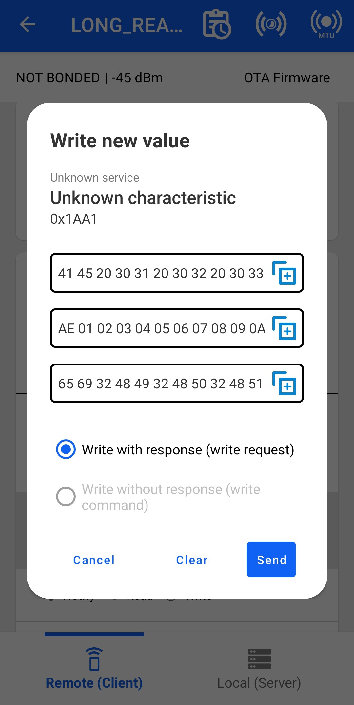
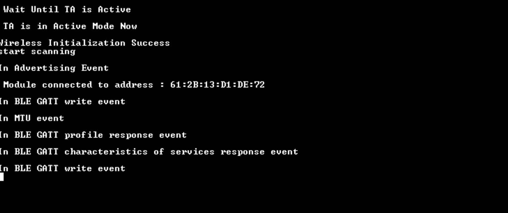

# BLE - Gatt Long Read

## Table of Contents

- [BLE - Gatt Long Read](#ble---gatt-long-read)
  - [Table of Contents](#table-of-contents)
  - [Purpose/Scope](#purposescope)
  - [Prerequisites](#prerequisites)
    - [Hardware Requirements](#hardware-requirements)
    - [Software Requirements](#software-requirements)
    - [Setup Diagram](#setup-diagram)
  - [Getting Started](#getting-started)
  - [Application Build Environment](#application-build-environment)
  - [Test the Application](#test-the-application)
    - [BLE GATT\_long\_read Application as a Server](#ble-gatt_long_read-application-as-a-server)
    - [BLE GATT\_long\_read Application as a Client](#ble-gatt_long_read-application-as-a-client)

## Purpose/Scope

This application demonstrates how a GATT client device accesses a GATT server device for long read, means when user wants to read more than MTU(minimum of local and remote devices MTU's) size of data.

- Silicon Labs module acts as a GATT client/server(based on user configuration) and explains reads/writes.
- Client role is initialized with Battery Service. 
- Server role is initialized with a custom service.

**Sequence of Events**

This Application explains to the user how to:

- Advertising in PERIPHERAL role
- Connects with remote device in CENTRAL role.
- Loop back the data came from the remote device
- Read request to the remote device

## Prerequisites

### Hardware Requirements

- A Windows PC
  - SiWx91x Wi-Fi Evaluation Kit. The SiWx91x supports multiple operating modes. See [Operating Modes]() for details.
- SoC Mode:
   - Silicon Labs [BRD4325A, BRD4325B, BRD4325C, BRD4325G, BRD4338A, BRD4339B, BRD4343A](https://www.silabs.com/)
   - Kits
     - SiWx917 AC1 Module Explorer Kit (BRD2708A)
- PSRAM Mode:  
   - Silicon Labs [BRD4340A, BRD4342A, BRD4325G](https://www.silabs.com/)
- NCP Mode:
   - Silicon Labs [BRD4180B](https://www.silabs.com/);
   - Host MCU Eval Kit. This example has been tested with:
     - Silicon Labs [WSTK + EFR32MG21](https://www.silabs.com/development-tools/wireless/efr32xg21-bluetooth-starter-kit)
     - NCP Expansion Kit with NCP Radio boards
       - (BRD4346A + BRD8045A) [SiWx917-EB4346A]
       - (BRD4357A + BRD8045A) [SiWx917-EB4357A]
   - Interface and Host MCU Supported
     - SPI - EFR32 
- BLE supported Smart phone with GATT client in case of our module as GATT server
- BLE supported Smart phone with GATT server  in case of our module as GATT client (Bluetooth version 4.0 and above version).

### Software Requirements

- Simplicity Studio IDE

### Setup Diagram

  

## Getting Started

Refer to the instructions [here](https://docs.silabs.com/wiseconnect/latest/wiseconnect-getting-started/) to:

- [Install Simplicity Studio](https://docs.silabs.com/wiseconnect/latest/wiseconnect-developers-guide-developing-for-silabs-hosts/#install-simplicity-studio)
- [Install WiSeConnect extension](https://docs.silabs.com/wiseconnect/latest/wiseconnect-developers-guide-developing-for-silabs-hosts/#install-the-wi-se-connect-extension)
- [Connect your device to the computer](https://docs.silabs.com/wiseconnect/latest/wiseconnect-developers-guide-developing-for-silabs-hosts/#connect-si-wx91x-to-computer)
- [Upgrade your connectivity firmware ](https://docs.silabs.com/wiseconnect/latest/wiseconnect-developers-guide-developing-for-silabs-hosts/#update-si-wx91x-connectivity-firmware)
- [Create a Studio project ](https://docs.silabs.com/wiseconnect/latest/wiseconnect-developers-guide-developing-for-silabs-hosts/#create-a-project)

For details on the project folder structure, see the [WiSeConnect Examples](https://docs.silabs.com/wiseconnect/latest/wiseconnect-examples/#example-folder-structure) page.

## Application Build Environment

The application can be configured to suit user requirements and development environment. Read through the following sections and make any changes if needed.

- Open **app.c** file.


   - `GATT_ROLE` refers the GATT role of the Silicon Labs device, 

      ```c
      #define SERVER                                        0
      #define CLIENT                                        1
      #define GATT_ROLE                                     SERVER
      ``` 

   - BLE GATT_long_read application as a **CLIENT**

      - `RSI_BLE_DEV_ADDR_TYPE` refers address type of the remote device to connect.
         ```c
         #define RSI_BLE_DEV_ADDR_TYPE                   RANDOM_ADDRESS
         ```

      - `RSI_BLE_DEV_ADDR` refers address of the remote device to connect. Replace this with valid BD address.
         ```c
         #define RSI_BLE_DEV_ADDR                        "F5:64:91:A2:F6:6F"
         ```
      - `RSI_REMOTE_DEVICE_NAME` refers the name of remote device to which Silicon Labs device has to connect
         ```c
         #define RSI_REMOTE_DEVICE_NAME                        "SILABS_DEV"
         ```

         > **Note:** User can configure either RSI_BLE_DEV_ADDR or RSI_REMOTE_DEVICE_NAME of the remote device.

   - BLE GATT_long_read application as a **SERVER** 

      - `BLE GATT LONG READ` Service and corresponding characteristic Services
    
         - `RSI_BLE_CHAR_SERV_UUID` refers standard attribute type of characteristic service
            ```c 
            #define RSI_BLE_CHAR_SERV_UUID                       0x2803
            ```

         - `RSI_BLE_CLIENT_CHAR_UUID`  refers standard attribute type of client characteristic configuration descriptor.
             ```c
            #define RSI_BLE_CLIENT_CHAR_UUID                     0x2902
            ```

         - `RSI_BLE_NEW_SERVICE_UUID` refers service uuid when module acts as server
            ```c
            #define RSI_BLE_NEW_SERVICE_UUID                      0xAABB
            ```


         - `RSI_BLE_ATTRIBUTE_1_UUID` refers characteristic uuid when module acts as server
            ```c
            #define RSI_BLE_ATTRIBUTE_1_UUID                      0x1AA1
            ```

         - `RSI_BLE_NEW_CLIENT_SERVICE_UUID` refers service present in GATT server LE device.
            ```c
            #define RSI_BLE_NEW_CLIENT_SERVICE_UUID               0x180F
            ```


         - `RSI_BLE_CLIENT_ATTRIBUTE_1_UUID` refers characteristic present under above service in GATT server LE device.
            ```c
            #define RSI_BLE_CLIENT_ATTRIBUTE_1_UUID               0x2A19
            ```

         - `RSI_BLE_MAX_DATA_LEN` refers the maximum attribute value length.
            ```c
            #define RSI_BLE_MAX_DATA_LEN                          20
            ```

   - BLE ATTRIBUTE PROPERTIES

         ```c
         #define RSI_BLE_ATT_PROP_RD                              0x02
         #define RSI_BLE_ATT_PROP_WR                              0x08
         #define RSI_BLE_ATT_PROP_NOTIFY                          0x10
         ```

- Open `ble_config.h` file and update the below parameters.

   - Opermode command parameters

         ```c
         #define RSI_FEATURE_BIT_MAP     (FEAT_ULP_GPIO_BASED_HANDSHAKE | FEAT_DEV_TO_HOST_ULP_GPIO_1) 

         #define RSI_TCP_IP_BYPASS         RSI_DISABLE       

         #define RSI_TCP_IP_FEATURE_BIT_MAP     (TCP_IP_FEAT_DHCPV4_CLIENT) 

         #define RSI_EXT_TCPIP_FEATURE_BITMAP 0

         #define RSI_CUSTOM_FEATURE_BIT_MAP    FEAT_CUSTOM_FEAT_EXTENTION_VALID  

         #define RSI_EXT_CUSTOM_FEATURE_BIT_MAP (EXT_FEAT_LOW_POWER_MODE | EXT_FEAT_XTAL_CLK_ENABLE | EXT_FEAT_512K_M4SS_192K)

         #define RSI_BT_FEATURE_BITMAP (BT_RF_TYPE | ENABLE_BLE_PROTOCOL)
         ```

         > **Note:** `ble_config.h` files are already set with desired configuration in respective example folders you need not change for each example. 

> **Note**: For recommended settings, please refer the [recommendations guide](https://docs.silabs.com/wiseconnect/latest/wiseconnect-developers-guide-prog-recommended-settings/).

## Test the Application

Refer to the instructions [here](https://docs.silabs.com/wiseconnect/latest/wiseconnect-getting-started/) to:

- Build the application in Studio.
- Flash, run and debug the application.

Follow the steps below for successful execution of the application:

> **Note:** The provided mobile screenshots are from the 2.5.2 version of the Simplicity Connect App(formerly EFR Connect App), it is recommended to use the latest version.

### BLE GATT_long_read Application as a Server

1. After the program gets executed, If Silicon Labs device is configured as `SERVER` specified in the macro `GATT_ROLE`, Silicon Labs will be in Advertising state.
2. Connect any serial console for prints.
3. Open the Simplicity Connect App(formerly EFR Connect App) in the Smartphone and do the scan.
4. In the App, Silicon Labs module device will appear with the name configured in the macro `RSI_BLE_APP_GATT_TEST (Ex: "LONG_READ_TEST")` or sometimes observed as Silicon Labs device as internal name "**SimpleBLEPeripheral**".

      

5. Initiate connection from the App.
6. After successful connection, Simplicity Connect App(formerly EFR Connect App) displays the supported services of Silicon Labs module.

      

7. After connecting, mtu size will be updated. As per mtu size, write will be happen from Silicon Labs device.
8. If mtu size is of 100 bytes, module can read upto 98 bytes, write upto 97 bytes.
9. For the data more than 20 bytes, application has to store value and send using gatt_read_response function whenever remote device reads some handle's data.

      

> **Note:** For read request event to be raised auth_read flag in rsi_ble_add_char_val_att function need to be set.
>- Based on GATT_ROLE configurable macro, this application will be act as a GATT server or GATT client device.   

 Prints can see as below in any Console terminal:

- **SOC**


- **NCP**


### BLE GATT_long_read Application as a Client

1. After the program gets executed, If Silicon Labs device is configured as `CLIENT` specified in the macro `GATT_ROLE`, Silicon Labs will be in Advertising state.
2. Connect any serial console for prints.
3. Open the Simplicity Connect App(formerly EFR Connect App) and Create the **Battery service** to configure the Remote device as a GATT server.
   - Name: Battery service
   - UUID: 0x180F
   > **Note:** Refer the [Adding Services](https://docs.silabs.com/bluetooth/5.0/miscellaneous/mobile/efr-connect-mobile-app) for creating the GATT server the Simplicity Connect mobile App(formerly EFR Connect App) as advertiser.
4. Add the characteristic services and their coresponding properties as shown below:
   - Name: Battey level
   - UUID: 0x2A19
   - Property: Read & Write  
   **Note:** Refer the [Adding Characteristics and Descriptors](https://docs.silabs.com/bluetooth/5.0/miscellaneous/mobile/efr-connect-mobile-app) for creating the GATT server in the Simplicity Connect mobile App(formerly EFR Connect App).

   

5. Configure the advertiser.
   > **Note:** Refer the [Creating New Advertisement Sets](https://docs.silabs.com/bluetooth/5.0/miscellaneous/mobile/efr-connect-mobile-app) for configuring the Simplicity Connect mobile App(formerly EFR Connect App) as advertiser. 

   

6. In Client mode, the Silicon Labs module will trying to connect with remote device as specified by `RSI_BLE_DEV_ADDR` or `RSI_REMOTE_DEVICE_NAME`.
7. Get all GATT profiles of remote device and Search for profile specified in the macro `RSI_BLE_NEW_CLIENT_SERVICE_UUID`. And get all characteristics of the battery service.
8. After connecting, mtu size will be updated. As per mtu(maximum transmit unit) size, read requests will be happen from Silicon Labs device.

      

9.Prints can be seen as below in any Console terminal:

- **SOC** 

  

- **NCP** 

  
