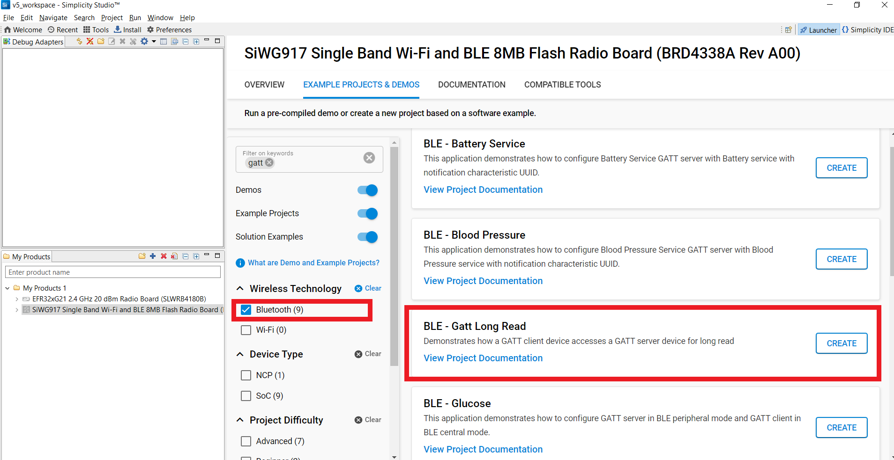
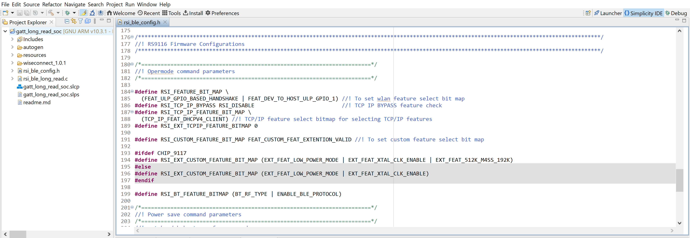

# GATT Long Read

## 1. Purpose / Scope

This application demonstrates how a GATT client device accesses a GATT server device for long read, means when user wants to read more than MTU(minimum of local and remote devices MTU's) size of data.

- Silicon Labs module acts as a GATT client/server(based on user configuration) and explains reads/writes.
- Client role is initialized with Battery Service. 
- Server role is initialized with a custom service.

**Sequence of Events**

This Application explains to the user how to:

- Advertising in PERIPHERAL role
- Connects with remote device in CENTRAL role.
- Loop back the data came from the remote device
- Read request to the remote device

## **2 Prerequisites**

For the application, you will need the following:

### **2.1 Hardware Requirements**

- A Windows PC
- **SoC Mode**: 
  - Silicon Labs [BRD4325A, BRD4325B, BRD4325G](https://www.silabs.com/)
- **NCP Mode**:
  - Silicon Labs [(BRD4180A, BRD4280B)](https://www.silabs.com/) 
- BLE supported Smart phone with GATT client in case of our module as GATT server
- BLE supported Smart phone with GATT server  in case of our module as GATT client (Bluetooth version 4.0 and above version).
- USB TO UART converter / TTL cable.

### **2.2 Software Requirements**

- Simplicity Studio IDE
  - To download and install the Simplicity Studio IDE, refer to the "Simplicity Studio IDE Set up" section in ***Getting started with SiWx91x*** guides.

- SiWx917_WiSeConnect_SDK.X.X
  
- [EFR connect Mobile APP](https://www.silabs.com/developers/efr-connect-mobile-app)

- Tera Term software or any other serial terminal software - for viewing application prints

### 2.3 Setup Diagram
- **SoC Mode :**

   

- **NCP Mode :**

   

Follow the [Getting Started with Wiseconnect3 SDK](https://docs.silabs.com/wiseconnect/latest/wiseconnect-getting-started/) guide to set up the hardware connections and Simplicity Studio IDE.

## 3 Project Environment

- Ensure the SiWx91x loaded with the latest firmware following the [Upgrade Si91x firmware](https://docs.silabs.com/wiseconnect/latest/wiseconnect-getting-started/getting-started-with-soc-mode#upgrade-si-wx91x-connectivity-firmware)

- Ensure the latest Gecko SDK along with the extension WiSeConnect3 is added to Simplicity Studio.

### 3.1 Creating the project

#### 3.1.1 SoC mode

- Ensure the SiWx91x set up is connected to your PC.

- In the Simplicity Studio IDE, the SiWx91x SoC board will be detected under **Debug Adapters** pane as shown below.

  ****

#### 3.1.2 NCP mode

- Ensure the EFx32 and SiWx91x set up is connected to your PC.

- In the Simplicity Studio IDE, the EFR32 board will be detected under **Debug Adapters** pane as shown below.

  ****

### 3.2 Importing the project

- Studio should detect your board. Your board will be shown here. Click on the board detected and go to **EXAMPLE PROJECTS & DEMOS** section 

#### SOC Mode

- Select **BLE - GATT Long Read** test application

  ****

- Click 'Create'. The "New Project Wizard" window appears. Click 'Finish'

  ****

### 3.3 Set up for application prints

#### 3.3.1 Teraterm set up - for BRD4325A, BRD4325B, BRD4325C, BRD4325G

You can use either of the below USB to UART converters for application prints.

1. Set up using USB to UART converter board.

   - Connect Tx (Pin-6) to P27 on WSTK
   - Connect GND (Pin 8 or 10) to GND on WSTK

   ****

2. Set up using USB to UART converter cable.

   - Connect RX (Pin 5) of TTL convertor to P27 on WSTK
   - Connect GND (Pin1) of TTL convertor to GND on WSTK

   ****

3. Open the Teraterm tool.

   - For SoC mode, choose the serial port to which USB to UART converter is connected and click on **OK**.

     ****

**Note:** For Other 917 SoC boards please refer section #3.3.2

#### 3.3.2 **Teraterm set up - for NCP and SoC modes**

1. Open the Teraterm tool.

- choose the J-Link port and click on **OK**.
    
    ****

2. Navigate to the Setup → Serial port and update the baud rate to **115200** and click on **OK**.

    ****

    ****

## 4 Application Build Environment

### 4.1 Configure the Application

The application can be configured to suit user requirements and development environment. Read through the following sections and make any changes if needed. 

1. In the Project explorer pane of the IDE, 
Open **app.c** file. 


   - **GATT_ROLE** refers the GATT role of the Silicon Labs device, 

   ```c
   #define SERVER                                        0
   #define CLIENT                                        1
   #define GATT_ROLE                                     SERVER
   ```
   
### **4.2 BLE GATT_long_read application as a CLIENT**

   ```c
   //RSI_BLE_DEV_ADDR_TYPE refers address type of the remote device to connect.
   #define RSI_BLE_DEV_ADDR_TYPE                   RANDOM_ADDRESS

   //RSI_BLE_DEV_ADDR refers address of the remote device to connect. Replace this with valid BD address.
   #define RSI_BLE_DEV_ADDR                        "F5:64:91:A2:F6:6F"

   //RSI_REMOTE_DEVICE_NAME refers the name of remote device to which Silicon Labs device has to connect
   #define RSI_REMOTE_DEVICE_NAME                        "SILABS_DEV"
   ```

   **Note:** User can configure either RSI_BLE_DEV_ADDR or RSI_REMOTE_DEVICE_NAME of the remote device.

### **4.3 BLE GATT_long_read application as a SERVER** 

- **BLE GATT LONG READ Service and corresponding Characteristic Services**

      ```c     
         // RSI_BLE_CHAR_SERV_UUID refers standard attribute type of characteristic service

         #define RSI_BLE_CHAR_SERV_UUID                       0x2803


         // RSI_BLE_CLIENT_CHAR_UUID  refers standard attribute type of client characteristic configuration descriptor.

         #define RSI_BLE_CLIENT_CHAR_UUID                     0x2902

         // RSI_BLE_NEW_SERVICE_UUID refers service uuid when module acts as server

         #define RSI_BLE_NEW_SERVICE_UUID                      0xAABB


         // RSI_BLE_ATTRIBUTE_1_UUID refers characteristic uuid when module acts as server
         
         #define RSI_BLE_ATTRIBUTE_1_UUID                      0x1AA1

         // RSI_BLE_NEW_CLIENT_SERVICE_UUID refers service present in GATT server LE device.

         #define RSI_BLE_NEW_CLIENT_SERVICE_UUID               0x180F


         // RSI_BLE_CLIENT_ATTRIBUTE_1_UUID refers characteristic present under above service in GATT server LE device.

         #define RSI_BLE_CLIENT_ATTRIBUTE_1_UUID               0x2A19

         // RSI_BLE_MAX_DATA_LEN refers the maximum attribute value length.
      
         #define RSI_BLE_MAX_DATA_LEN                          20
      ```

- **BLE ATTRIBUTE PROPERTIES**

      ```c
      #define RSI_BLE_ATT_PROP_RD                              0x02
      #define RSI_BLE_ATT_PROP_WR                              0x08
      #define RSI_BLE_ATT_PROP_NOTIFY                          0x10
      ```

2. Open `ble_config.h` file and update the below parameters.    


- **Opermode command parameters**

      ```c
      #define RSI_FEATURE_BIT_MAP     (FEAT_ULP_GPIO_BASED_HANDSHAKE | FEAT_DEV_TO_HOST_ULP_GPIO_1) 

      #define RSI_TCP_IP_BYPASS         RSI_DISABLE       

      #define RSI_TCP_IP_FEATURE_BIT_MAP     (TCP_IP_FEAT_DHCPV4_CLIENT) 

      #define RSI_EXT_TCPIP_FEATURE_BITMAP 0

      #define RSI_CUSTOM_FEATURE_BIT_MAP    FEAT_CUSTOM_FEAT_EXTENTION_VALID  

      #define RSI_EXT_CUSTOM_FEATURE_BIT_MAP (EXT_FEAT_LOW_POWER_MODE | EXT_FEAT_XTAL_CLK_ENABLE | EXT_FEAT_512K_M4SS_192K)

      #define RSI_BT_FEATURE_BITMAP (BT_RF_TYPE | ENABLE_BLE_PROTOCOL)
      ```

   **Note:** `ble_config.h` files are already set with desired configuration in respective example folders you need not change for each example. 

## 5. Building and Testing the Application

User has to follow the below steps for the successful execution of the application.

### 5.1 Building the Application

- Once the project is created, click on the build icon (hammer) to build the project (or) right click on project and click on Build Project.

   

### 5.2 Load the Applicatin Image

1. Click on Tools and Simplicity Commander as shown below.

   
   
2. Load the firmware image

- Select the board. 
- Browse the application image (.hex) and click on Flash button.

   
      
## **6 Application Execution Flow**   

Application has the feasibility to configure the GATT server (or) GATT client.     
**Note:**      

- The provided mobile screenshots are from the 2.5.2 version of the EFR Connect app, it is recommended to use the latest version.

### **6.1  BLE GATT_long_read application as a SERVER**

1. After the program gets executed, If Silicon Labs device is configured as **SERVER** specified in the macro **GATT_ROLE**, Silicon Labs will be in Advertising state.
2. Connect any serial console for prints.
3. Open the EFR Connect App in the Smartphone and do the scan.
4. In the App, Silicon Labs module device will appear with the name configured in the macro `RSI_BLE_APP_GATT_TEST (Ex: "LONG_READ_TEST")` or sometimes observed as Silicon Labs device as internal name "**SimpleBLEPeripheral**".    

5. Initiate connection from the App.
6. After successful connection, EFR Connect APP displays the supported services of Silicon Labs module.     

7. After connecting, mtu size will be updated. As per mtu size, write will be happen from Silicon Labs device
8. If mtu size is of 100 bytes, module can read upto 98 bytes, write upto 97 bytes
9. For the data more than 20 bytes, application has to store value and send using gatt_read_response function whenever remote device reads some handle's data.    
     
**Note:** 
   - For read request event to be raised auth_read flag in rsi_ble_add_char_val_att function need to be set.

- Based on GATT_ROLE configurable macro, this application will be act as a GATT server or GATT client device.   

 Prints can see as below in any Console terminal s

- **SOC** 

- **NCP** 


### **6.2  BLE GATT_long_read application as a CLIENT** 

1. After the program gets executed, If Silicon Labs device is configured as **CLIENT** specified in the macro **GATT_ROLE**, Silicon Labs will be in Advertising state.
2. Connect any serial console for prints.
3. Open the EFR Connect APP and Create the **Battery service** to configure the Remote device as a GATT server.
   - Name: Battery service
   - UUID: 0x180F
   **Note:** Refer the [Adding Services](https://docs.silabs.com/bluetooth/5.0/miscellaneous/mobile/efr-connect-mobile-app) for creating the GATT server the EFR connect mobile APP as advertiser.
4. Add the characteristic services and their coresponding properties as shown below
   - Name: Battey level
   - UUID: 0x2A19
   - Property: Read & Write  
   **Note:** Refer the [Adding Characteristics and Descriptors](https://docs.silabs.com/bluetooth/5.0/miscellaneous/mobile/efr-connect-mobile-app) for creating the GATT server in the EFR connect mobile APP.    
   
5. Configure the advertiser.
   **Note:** Refer the [Creating New Advertisement Sets](https://docs.silabs.com/bluetooth/5.0/miscellaneous/mobile/efr-connect-mobile-app) for configuring the EFR connect mobile APP as advertiser.    
   
6. In Client mode, the Silicon Labs module will trying to connect with remote device as specified by `RSI_BLE_DEV_ADDR` or `RSI_REMOTE_DEVICE_NAME`.
7. Get all GATT profiles of remote device and Search for profile specified in the macro `RSI_BLE_NEW_CLIENT_SERVICE_UUID`. And get all characteristics of the battery service.
8. After connecting, mtu size will be updated. As per mtu(maximum transmit unit) size, read requests will be happen from Silicon Labs device.    
    
9.Prints can see as below in any Console terminal 

- **SOC** 

- **NCP** 

