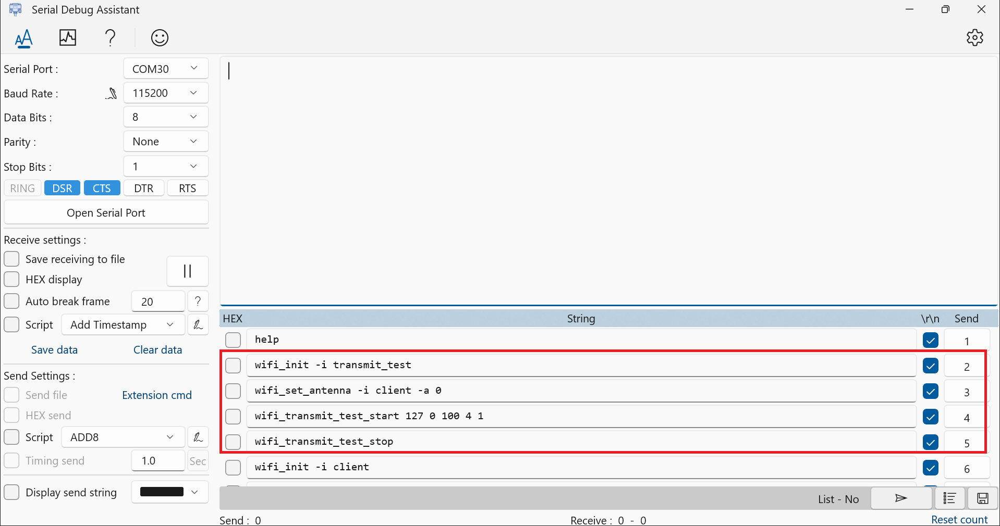
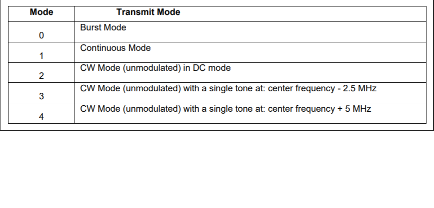
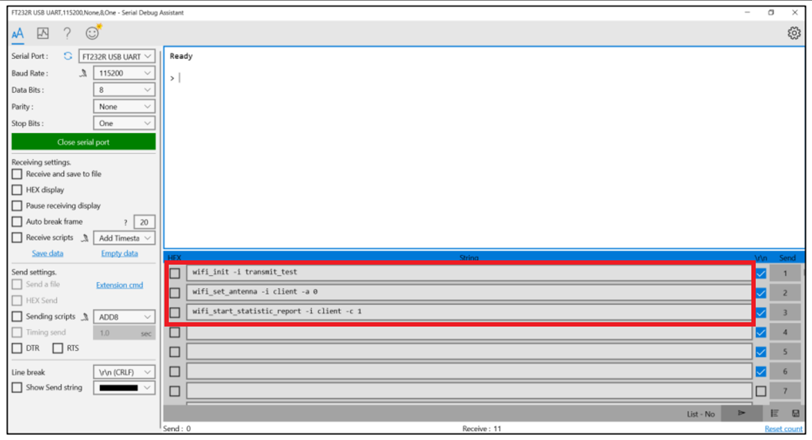
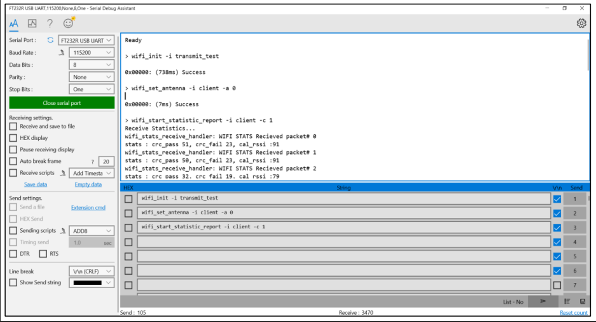

# Cli Demo

## Table of Contents

- [Purpose/Scope](#purposescope) 
- [Prerequisites/Setup Requirements](#prerequisitessetup-requirements)
  - [Hardware Requirements](#hardware-requirements)
  - [Software Requirements](#software-requirements)
  - [Setup Diagram](#setup-diagram)
- [Getting Started](#getting-started)
- [Application Build Environment](#application-build-environment)
- [Test the Application](#test-the-application)

## Purpose/Scope

The CLI Demo application is a command-line interface (CLI) application designed to showcase various functionalities and capabilities of SiWx91x in different scenarios and configuration modes. It serves as a quick reference guide and a hands-on demonstration of SiWx91x core features for developers and users.

## Prerequisites/Setup Requirements

### Hardware Requirements

- A Windows PC.
- Spectrum Analyzer for WLAN RF measurement (PER_Tx). 
- Signal Generator for WLAN RF measurement (PER_Rx).
- 802.11 ax/b/g/n Access point.
- A Micro-coaxial connector plug to SMA-female cable (RF connector) for connecting the U.Fl port of the Si917 radio board to the Spectrum Analyzer or Signal Generator.
- **SoC Mode**:
  - Standalone
    - BRD4002A Wireless pro kit mainboard [SI-MB4002A]
    - Radio Boards 
  	  - BRD4338A [SiWx917-RB4338A]
      - BRD4339B [SiWx917-RB4339B]
  	  - BRD4340A [SiWx917-RB4340A]
  - Kits
  	- SiWx917 Pro Kit [Si917-PK6031A](https://www.silabs.com/development-tools/wireless/wi-fi/siwx917-pro-kit?tab=overview)
  	- SiWx917 Pro Kit [Si917-PK6032A]
  	
- **NCP Mode**:
  - Standalone
    - BRD4002A Wireless pro kit mainboard [SI-MB4002A]
    - EFR32xG24 Wireless 2.4 GHz +10 dBm Radio Board [xG24-RB4186C](https://www.silabs.com/development-tools/wireless/xg24-rb4186c-efr32xg24-wireless-gecko-radio-board?tab=overview)
    - NCP EFR Expansion Kit with NCP Radio board (BRD4346A + BRD8045A) [SiWx917-EB4346A]
  - Kits
  	- EFR32xG24 Pro Kit +10 dBm [xG24-PK6009A](https://www.silabs.com/development-tools/wireless/efr32xg24-pro-kit-10-dbm?tab=overview)  

### Software Requirements

- Simplicity Studio
- A Serial terminal software such as [Serial Debug Assistant](https://apps.microsoft.com/detail/9NBLGGH43HDM?rtc=1&hl=en-in&gl=in)

Note : The user can use the Simplicity studio’s console window for sending and receiving the CLI command.
### Setup Diagram

- The figure below shows the setup and the connections for the WLAN RF testing.

- The figure below shows the setup and the connections for SiWG917 in Station mode.

## Getting Started

Refer to the instructions [here](https://docs.silabs.com/wiseconnect/latest/wiseconnect-getting-started/) to:

- Install Studio and WiSeConnect 3 extension
- Connect your device to the computer
- Upgrade your connectivity firmware
- Create a Studio project

For details on the project folder structure, see the [WiSeConnect Examples](https://docs.silabs.com/wiseconnect/latest/wiseconnect-examples/#example-folder-structure) page.

## Application Build Environment

The application can be configured to suit your requirements and development environment.

- The application uses the default configurations as provided in the **wifi_commands.c** and user can choose to configure these parameters as needed.
  
  User can enable or disable powersave related optimizations by setting the ENABLE_POWERSAVE_CLI macro in the **wifi_commands.c** file to 1 or 0 respectively

## Test the application

Refer to the instructions [here](https://docs.silabs.com/wiseconnect/latest/wiseconnect-getting-started/) to:

- Build the application in Studio.
>
> Note: 
> - The default SSID is "MY_AP_SSID" and passphrase is "MY_AP_PASSPHRASE". You may either use these or modify them as described in the [Application Build Environment](#application-build-environment) section.
- Flash, run and debug the application

   

Follow the steps below for successful execution of the application:

- The terminal screen displays lot of commands which can be added manually in Extension command in Serial debug assistant.

 **Here are List of those commands:**

1. HELP
2. wifi_init
3. wifi_init -i client
4. wifi_init -i ap
5. wifi_init -i apsta
6. wifi_scan
7. wifi_scan -s **ssid** -i client_5g
8. wifi_scan -s **ssid** -i ap
9. wifi_scan -s **ssid** -i client
10. wifi_scan -s **ssid** -i ap_5g
11. wifi_connect  **ssid** -p **password** -s **security mode**
12. wifi_deinit
13. wifi_disconnect -i client
14. wifi_get_client_info
15. wifi_get_fw_version
16. wifi_get_mac_address -i 1
17. wifi_set_performance_profile high_performance
18. wifi_set_performance_profile power_save
19. wifi_set_performance_profile power_save_low_latency
20. wifi_set_performance_profile ultra_power_save
21. wifi_get_statistics
22. wifi_get_performance_profile
23. sl_net_host_get_by_name **url** -t **time_in_milliseconds** -i **ipv4/ipv6**
24. wifi_iot_socket_create -i 1 -j 2 -k 2
25. wifi_iot_socket_connect -i 0 -j **server_ip** -k 4 -l **server_port**
26. wifi_iot_socket_bind -i 0 -j **local_ip** -k 4 -l **local_port**
27. wifi_iot_socket_receive_from -i 0
28. wifi_iot_socket_create -i 1 -j -k 1
29. wifi_iot_socket_listen -i 0 -j 1
30. wifi_iot_socket_accept -i 0
31. wifi_iot_socket_send -i 0 -d **data_to be sent**
32. start_dhcp

And so on...

### Below are the examples of the commands on how to enter those in the Serial Debug Assistant

- **HELP COMMAND:-** 
  
  ****

- After issuing the **help** command in serial Debug assistant it will display all the commands of the CLI demo on the Serial Debug screen as shown in the below image.

  ****

  ****

- Clean the Serial Debug Assistant console using **Empty Data**

  ****

### **Below are the Commands to run the RF test example.**

- **Transmit Test Commands for Wi-Fi**

  

1. wifi_init -i **mode** for initializing the WiFi interface and for selecting the mode.

    e.g., wifi_init -i transmit_test

2. wifi_set_antenna -i client -a **antenna type** is used for selecting the antenna.

    e.g., wifi_set_antenna -i client -a 0
By default antenna type should be set to 0.

3. wifi_transmit_test_start **power** **data rate** **length** **mode** **channel**

    e.g., wifi_transmit_test_start 127 0 100 1 1.

- For Wi-Fi 6 or 802.11ax mode RF test, issue the below command.

4. wifi_ax_transmit_test_start **power** **data rate** **length** **mode** **channel** **enable_11ax** **coding_type** **nominal_pe** **ul_dl** **he_ppdu_type** **beam_change** **bw** **stbc** **tx_bf** **gi_ltf** **dcm** **nsts_midamble** **spatial_reuse** **bss_color** **he_siga2_reserved** **ru_allocation** **n_heltf_tot** **sigb_dcm** **sigb_mcs** **user_sta_id** **user_idx** **sigb_compression_field**
    e.g., wifi_ax_transmit_test_start 127 0 100 1 1 1 0 1 1 0 0 0 0 0 0 0 1 0 0 0 1 1 1 1 1 1 1
  **power**: Set transmit power in dbm. Valid values are from 2dBm to 18dBm.

**Note**: To configure the maximum power level for a particular frequency band, 
Set **power** = 127

**data rate**: Set transmit data rate

**length**: Configure length of the transmit packet. Valid values are in the range:

[24 ... 1500] bytes in burst mode

[24 ... 260] bytes in continuous mode

**mode**: Transmit mode
****

**Note**:

**Burst Mode**
DUT transmits a burst of packets with the given power, rate, length in the channel configured. The burst size will be 
determined by the **length** parameter, if it the **length** parameter is zero, then DUT keeps transmitting till 
stop API is called.

**Continuous Mode**:
The DUT transmits an unmodulated waveform continuously. 

**Continuous Wave Mode (Non-Modulation) in DC Mode**:
The DUT transmits a spectrum only at the center frequency of the channel. A basic signal with no modulation is that of a sine 
wave and is usually referred to as a continuous wave (CW) signal. A basic signal source produces sine waves. Ideally, the 
sine wave is perfect. In the frequency domain, it is viewed as a single line at some specified frequency.

**Continuous Wave Mode (Non-Modulation) in Single Tone Mode (Center frequency -2.5 MHz)**:
The DUT transmits a spectrum that is generated at -2.5 MHz from the center frequency of the channel selected. Some amount 
of carrier leakage will be seen at Center Frequency.
For example, for 2412 MHz the output will be seen at 2409.5 MHz.

**Continuous Wave Mode (Non-Modulation) in Single Tone Mode (Center frequency +5 MHz)**:
The DUT transmits a spectrum that is generated at 5MHz from the center frequency of the channel selected. Some amount of 
carrier leakage will be seen at Center Frequency.
For example, for 2412 MHz the output will be seen at 2417 MHz. 

>**Note**
>
>1. Before starting CW mode, it is required to start Continuous mode with >power and channel values which is intended to be used 
>in CW mode as follows:
>
>    a. Start Continuous mode with intended power value and channel value; >pass any valid values for rate and length.
>
>    b. Stop Continuous mode.
>
>    c. Start CW mode.
>
>2. To switch CW mode, stop PER mode and then give CW mode.
>
>3. Generally, it is recommended to measure the TX power with “Burst mode” >or “Continuous mode” only. "Continuous wave 
>mode" for TX power measurement is not recommended. "Continuous wave mode" >can be used for certification purposes and 
>to measure the frequency error. 
>
>    **channel**: Set the Channel number.
- The wifi 6 parameter descriptions are mentioned in the sl_si91x_protocol_types.h file of the SDK.
>
>5. **wifi_transmit_test_stop** is used for stopping the Transmit test.

- Configure below parameter in **wifi_commands.c** to enable AGGREGATION support
  .feature_bit_map = SL_SI91X_FEAT_AGGREGATION

**Additional sample commands for Wi-Fi 6 RF Test**

  |  **Test case**                   | **PPDU**  | **LTF Size**| **GI** | **DCM/nDCM** | **RU Tone** | **RU Number** | **User Index** | **Rate** | **Pkt Len** | **Command** |
  |--------------------------------- |-----------|-------------|--------|--------------|-------------|---------------|----------------|----------|-------------|----------------------------------------------------------------------------|
  | SU PPDU 4x HE-LTF + 3.2us nDCM   | SU PPDU   |   4x        |  3.2us |  nDCM        | 242Tone     |   RU1         |     0          | MCS0     |  1500   | wifi_ax_transmit_test_start 10 256 1500 0 1 1 0 2 1 0 0 0 0 0 3 0 0 0 0 0 192 1 0 0 0 0 0
  | SU PPDU 1x HE-LTF + 0.8us DCM    | SU PPDU   |   1x        |  0.8us |   DCM        | 242Tone     |   RU1         |     0          | MCS1     |  1500   | wifi_ax_transmit_test_start 10 257 1500 0 1 1 0 2 1 0 0 0 0 0 0 1 0 0 0 0 192 1 0 0 0 0 0
  | ERSU PPDU 4x HE-LTF + 3.2us nDCM | ERSU PPDU |   4x        |  3.2us |  nDCM        | 242Tone     |   RU1         |     0          | MCS0     |  1500   | wifi_ax_transmit_test_start 10 256 1500 0 1 1 0 2 1 1 0 0 0 0 3 0 0 0 0 0 192 1 0 0 0 0 0
  | ERSU PPDU 4x HE-LTF + 0.8us nDCM | ERSU PPDU |   4x        |  0.8us |  nDCM        | 242Tone     |   RU1         |     0          | MCS2     |  1500   | wifi_ax_transmit_test_start 10 258 1500 0 1 1 0 2 1 1 0 0 1 0 1 1 0 0 0 0 192 1 0 0 0 0 0
  | TB PPDU 4x HE-LTF + 3.2us nDCM   | TB PPDUDU |   4x        |  3.2us |  nDCM        | 106Tone     |   RU1         |     0          | MCS7     |  1500   | wifi_ax_transmit_test_start 10 263 1500 0 1 1 0 2 1 2 0 0 0 0 2 0 0 0 0 0 53 1 0 0 0 0 0
  | TB PPDU 2x HE-LTF + 1.6us nDCM   | TB PPDUDU |   2x        |  1.6us |  nDCM        | 26Tone      |   RU8         |     7          | MCS6     |  1500   | wifi_ax_transmit_test_start 10 262 1500 0 1 1 0 2 1 2 0 0 0 0 1 0 0 0 0 0 7 1 0 0 0 7 0
  | TB PPDU 2x HE-LTF + 1.6us nDCM   | TB PPDUDU |   2x        |  1.6us |  nDCM        | 26Tone      |   RU9         |     8          | MCS6     |  1500   | wifi_ax_transmit_test_start 10 262 1500 0 1 1 0 2 1 2 0 0 0 0 1 0 0 0 0 0 8 1 0 0 0 8 0

**Receive test Commands**

**NOTE**:
    Receive stats testing should be done in a controlled environment (RF shield box or chamber).

****
****

**Receive Test Commands for the CLI**:

1. wifi_init -i **mode** for initializing the WiFi interface and for selecting the mode.

    e.g., wifi_init -i transmit_test

2. wifi_set_antenna -i client -a **antenna type** is used for selecting the antenna.

    e.g., wifi_set_antenna -i client -a 0
By default antenna type should be set to 0.

3. wifi_start_statistic_report -i client -c **channel** -n **stats_count** is used to receive the packet statistics once per second in that selected channel.

    e.g., wifi_start_statistic_report -i client -c 1 -n 30
  
  To observe the receive stats for 'n' iterations (e.g. 20), the command can be given as follows:   
     e.g., wifi_start_statistic_report -i client -c 1 -n 20

**WIFI INIT COMMAND:-**

- Click on the extension cmd and click on the Entered **wifi_init** command from the command console

  ****

- After issuing the **wifi_init** command from the command console, This is how the response is displayed on the screen.

  ****

**WIFI SCAN COMMAND:-**

- After issuing the **wifi_scan** command in the command console, This is how the response is displayed on the screen.

  ****

**WIFI CONNECT COMMAND:-**

- After issuing the **wifi_connect** command in the command console, This is how the response is displayed on the screen. 

  ****

- To connect to open mode networks, following command can be issued: wifi_connect <SSID> -s open

**WIFI DEINIT COMMAND:-**

- After issuing the **wifi_deinit** command in command console, This is how the response is displayed on the screen.  

  ****

## Steps to add new commands for cli_demo application

1. First add the ‘key-value’ pair in the *console_command_database* structure in **console_commands/src/console_command_database.c** file as shown below:

   - The ‘key’ is the name of new command to be created, and the value is the structure variable for the command.

      ****
	
Here the new command is: *cli_demo_new_cmd*
The structure variable for the newly created command is *_cli_demo_new_cmd_command*.

2. The *_cli_demo_new_cmd_command* structure variable should be declared in the **console_commands/src/console_command_database.c** file with the following fields

    ****

**The description of the new command:-**

- The description of the new command is a string which explains briefly about the command.

**The command handler for the new command:-**

- In the above figure, *cli_demo_new_cmd_command_handler* is the command handler which needs to be defined.
- For any new command, we have to declare a function in **console_commands/src/console_command_database.c** file with a specific proptotype as shown below.
*extern sl_status_t cli_demo_new_cmd_command_handler( console_args_t* arguments );*

- The function name can be anything, but the return type and argument must be as shown above.

**The string array for argument description of the command  handler:-**

- In the above figure, *_cli_demo_new_cmd_arg_help* is the string array which needs to be defined.
- We need to define a string array in **console_commands/src/console_command_database.c** file which briefly explains about the arguments in the command handler. The declaration is as shown below.

  ****

We have given the description for all three strings as 0.

**The list of data types of arguments of command handler:-**

- Refering to the *_cli_demo_new_cmd_command* structure variable image, { CONSOLE_OPTIONAL_ARG('s', CONSOLE_ARG_STRING ), CONSOLE_ARG_UINT, CONSOLE_ARG_INT, CONSOLE_ARG_END } }  are the list of datatypes corresponding to the list of arguments.
- The data types CONSOLE_ARG_UINT corresponds to ‘uint’ , CONSOLE_ARG_INT corresponds to ‘int’ and CONSOLE_ARG_STRING corresponds to ‘string’. The list of arguments must end with CONSOLE_ARG_END.
- The arguments can be mandatory or optional. The mandatory arguments are given directly, but optional arguments are given using an expression, CONSOLE_OPTIONAL_ARG(‘character’, datatype) The ‘character’ is an alphabet which is user choice which can be used to give an optional argument in a cli command. The datatype can be anything mentioned above.
- In addition to standard data type arguments like uint, int, string, there can be enums which can also be passed as arguments to a command. The arguments we need to pass in a command depends on what APIs we call in a command handler. 
- For some of the wifi APIs we call inside a command handler, we may need to use the argument values as specified in the *console_argument_values* variable defined in **console_commands/src/console_argument_types.c** file. For passing those values in a cli command, we need to look for the corresponding argument types defined in the same file.
For example:
We may want to pass a data rate as *SL_WIFI_RATE_11B_1* enum value in a cli command, the corresponding uint32 array is mapped to *[CONSOLE_TYPE(data_rate)]*. We need to search for *data_rate_type* string array in the same file as shown below
The sring corresponding to *SL_WIFI_RATE_11B_1* is "1Mbps". So *1Mbps* should be passed as an argument in the cli command.
In the command handler, the arguments passed in the cli command are internally mapped to corresponding enum values and hence can be accessed directly using GET_COMMAND_ARG() or GET_OPTIONAL_COMMAND_ARG().
****
****
****

- So, the overall changes we need to make in  **console_commands/src/console_command_database.c** file is as shown below:
****
- So, the cli command that can be used with the above changes is *cli_demo_new_cmd -s Optional_String 1 2*

3. The command handler should be defined in a relevant file as shown below. The arguments can be accessed directly or by using GET_COMMAND_ARG() or GET_OPTIONAL_COMMAND_ARG() as shown below. 
****
