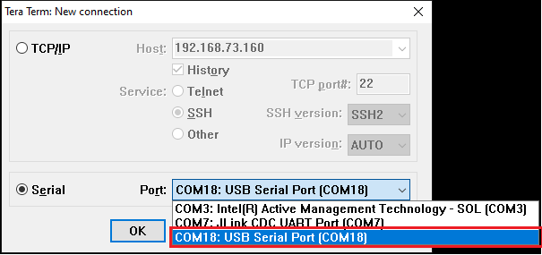

# Cli Demo

## 1 Purpose/Scope

The CLI Demo application is a command-line interface (CLI) application designed to showcase various functionalities and capabilities of SiWx91x in different scenarios and configuration modes. It serves as a quick reference guide and a hands-on demonstration of SiWx91x core features for developers and users.
Note: Currently only Wi-Fi connection, powersave and RF test commands are supported.

## 2 Prerequisites/Setup Requirements

### 2.1 Hardware Requirements

- A Windows PC.
- **SoC Mode**:
  - Silicon Labs [BRD4325A, BRD4325B, BRD4325C, BRD4325G, BRD4338A](https://www.silabs.com/)

### 2.2 Software Requirements

- Simplicity Studio IDE

  - Download the latest [Simplicity Studio IDE](https://www.silabs.com/developers/simplicity-studio)
  - Follow the [Simplicity Studio user guide](https://docs.silabs.com/simplicity-studio-5-users-guide/1.1.0/ss-5-users-guide-getting-started/install-ss-5-and-software#install-ssv5) to install Simplicity Studio IDE

### 2.3 Setup Diagram

#### SoC Mode  

Follow the [Getting Started with Wiseconnect SDK](https://docs.silabs.com/wiseconnect/latest/wiseconnect-getting-started/) guide to set up the hardware connections and Simplicity Studio IDE.

#### Setup for the RF test in SoC Mode

## 3 Project Environment

- Ensure the SiWx91x loaded with the latest firmware following the [Upgrade Si91x firmware](https://docs.silabs.com/wiseconnect/latest/wiseconnect-getting-started/getting-started-with-soc-mode#upgrade-si-wx91x-connectivity-firmware)

- Ensure the latest Gecko SDK along with the extension WiSeConnect3 is added to Simplicity Studio.

### 3.1 Creating the project

#### 3.1.1 SoC mode

- Ensure the SiWx91x set up is connected to your PC.

- In the Simplicity Studio IDE, the SiWx91x SoC board will be detected under **Debug Adapters** pane as shown below.

  ****

### 3.2 Importing the project

- Studio should detect your board. Your board will be shown here. Click on the board detected and go to **EXAMPLE PROJECTS & DEMOS** section 

#### SOC Mode

- Select **Cli Demo** test application

  ****

- Click 'Create'. The "New Project Wizard" window appears. Click 'Finish'

  ****

### 3.3 Set up for application prints

#### 3.3.1 Teraterm set up - for BRD4325A, BRD4325B, BRD4325C, BRD4325G

You can use either of the below USB to UART converters for application prints.

1. Set up using USB to UART converter board.

   - Connect Tx (Pin-6) to P27 on WSTK
   - Connect GND (Pin 8 or 10) to GND on WSTK

   ****

2. Set up using USB to UART converter cable.

   - Connect RX (Pin 5) of TTL convertor to P27 on WSTK
   - Connect GND (Pin1) of TTL convertor to GND on WSTK

   ****

3. Open the Teraterm tool.

   - For SoC mode, choose the serial port to which USB to UART converter is connected and click on **OK**.

     ****

**Note:** For Other 917 SoC boards please refer section #3.3.2

#### 3.3.2 **Serial Debug Assistant set up - for SoC mode**

1. Open the [Serial Debug Assistant](https://apps.microsoft.com/store/detail/serial-debug-assistant/9NBLGGH43HDM?hl=en-in&gl=in&rtc=1) tool. (The user can download it from the Microsoft store for transmitting and receiving commands)

   - For SoC mode, choose the serial port to which USB to UART converter is connected (For E.g.: FT232R USB UART or COM Port can be detected) and update the baud rate to **115200** and click on  **Open Serial Port**.

      ****

2. Click on **Extension cmd** under Send settings window to enter the CLI commands.

 ****

## 4 Application Build Environment

The application can be configured to suit your requirements and development environment.

### 4.1 Configure the application

- The application uses the default configurations as provided in the **wifi_commands.c** and user can choose to configure these parameters as needed.

### 4.2 Build the application

- SoC mode: Build as cli_demo Example

  ****

### 4.3 Run and Test the application

- Once the build was successful, right click on project and click on Debug As->Silicon Labs ARM Program as shown in below image.

  - SoC

    ****

### 4.4 Application Output

- After the application gets executed successfully, **Ready** is displayed on the Serial Debug Assistant screen.

  ****

- In terminal screen We have so many commands by manually we can add those commands in Extension command in Serial debug assistant.we can add those commands to it.

 **Here are List of those commands:**

1. HELP
2. wifi_init
3. wifi_init -i client
4. wifi_init -i ap
5. wifi_init -i apsta
6. wifi_scan
7. wifi_scan -s **ssid** -i client_5g
8. wifi_scan -s **ssid** -i ap
9. wifi_scan -s **ssid** -i client
10. wifi_scan -s **ssid** -i ap_5g
11. wifi_connect  **ssid** **password**
12. wifi_deinit
13. wifi_disconnect -i client
14. wifi_get_client_info
15. wifi_get_fw_version
16. wifi_get_mac_address -i 1
17. wifi_set_performance_profile high_performance
18. wifi_set_performance_profile power_save
19. wifi_set_performance_profile power_save_low_latency
20. wifi_set_performance_profile ultra_power_save
21. wifi_get_statistics
22. wifi_get_performance_profile
23. sl_dns_host_get_by_name **url** -t **time_in_milliseconds** -i **ipv4/ipv6**
24. wifi_iot_socket_create -i 1 -j 2 -k 2
25. wifi_iot_socket_connect -i 0 -j **server_ip** -k 4 -l **server_port**
26. wifi_iot_socket_bind -i 0 -j **local_ip** -k 4 -l **local_port**
27. wifi_iot_socket_receive_from -i 0
28. wifi_iot_socket_create -i 1 -j -k 1
29. wifi_iot_socket_listen -i 0 -j 1
30. wifi_iot_socket_accept -i 0
31. wifi_iot_socket_send -i 0 -d **data_to be sent**
32. start_dhcp

And so on...

### Below are the examples of the commands on how to enter those in the Serial Debug Assistant

- **HELP COMMAND:-** 
  
  ****

- After issuing the **help** command in serial Debug assistant it will display all the commands of the CLI demo on the Serial Debug screen as shown in the below image.

  ****

  ****

- Clean the Serial Debug Assistant console using **Empty Data**

  ****

### **Below are the Commands to run the RF test example.**

- **Transmit Test Commands**

  

1. wifi_init -i **mode** for initializing the WiFi interface and for selecting the mode.

e.g., wifi_init -i transmit_test

2. wifi_set_antenna -i client -a **antenna type** is used for selecting the antenna.

e.g., wifi_set_antenna -i client -a 0
By default antenna type should be set to 0.

3. wifi_transmit_test_start **power** **data rate** **length** **mode** **channel**

e.g., wifi_transmit_test_start 127 0 100 1 1.

**power**: Set transmit power in dbm. Valid values are from 2dBm to 18dBm.

**Note**: To configure the maximum power level for a particular frequency band, 
Set **power** = 127

**data rate**: Set transmit data rate

**length**: Configure length of the transmit packet. Valid values are in the range:

[24 ... 1500] bytes in burst mode

[24 ... 260] bytes in continuous mode

**mode**: Transmit mode
****

**Note**:

**Burst Mode**
DUT transmits a burst of packets with the given power, rate, length in the channel configured. The burst size will be 
determined by the **length** parameter, if it the **length** parameter is zero, then DUT keeps transmitting till 
stop API is called.

**Continuous Mode**:
The DUT transmits an unmodulated waveform continuously. 

**Continuous Wave Mode (Non-Modulation) in DC Mode**:
The DUT transmits a spectrum only at the center frequency of the channel. A basic signal with no modulation is that of a sine 
wave and is usually referred to as a continuous wave (CW) signal. A basic signal source produces sine waves. Ideally, the 
sine wave is perfect. In the frequency domain, it is viewed as a single line at some specified frequency.

**Continuous Wave Mode (Non-Modulation) in Single Tone Mode (Center frequency -2.5 MHz)**:
The DUT transmits a spectrum that is generated at -2.5 MHz from the center frequency of the channel selected. Some amount 
of carrier leakage will be seen at Center Frequency.
For example, for 2412 MHz the output will be seen at 2409.5 MHz.

**Continuous Wave Mode (Non-Modulation) in Single Tone Mode (Center frequency +5 MHz)**:
The DUT transmits a spectrum that is generated at 5MHz from the center frequency of the channel selected. Some amount of 
carrier leakage will be seen at Center Frequency.
For example, for 2412 MHz the output will be seen at 2417 MHz. 

**Note**

1. Before starting CW mode, it is required to start Continuous mode with power and channel values which is intended to be used 
in CW mode as follows:

a. Start Continuous mode with intended power value and channel value; pass any valid values for rate and length.

b. Stop Continuous mode.

c. Start CW mode.

2. To switch CW mode, stop PER mode and then give CW mode.

3. Generally, it is recommended to measure the TX power with “Burst mode” or “Continuous mode” only. "Continuous wave 
mode" for TX power measurement is not recommended. "Continuous wave mode" can be used for certification purposes and 
to measure the frequency error. 

**channel**: Set the Channel number.

5. **wifi_transmit_test_stop** is used for stopping the Transmit test.

**Receive test Commands**

****
****

**Receive Test Commands for the CLI**:

1. wifi_init -i **mode** for initializing the WiFi interface and for selecting the mode. 

e.g., wifi_init -i transmit_test

2. wifi_set_antenna -i client -a **antenna type** is used for selecting the antenna.

e.g., wifi_set_antenna -i client -a 0
By default antenna type should be set to 0. 

3. wifi_start_statistic_report -i client -c **channel** is used receive the packet statistics once per second in that selected 
channel. 

e.g., wifi_start_statistic_report -i client -c 1

**WIFI INIT COMMAND:-**

- Click on the extension cmd and click on the Entered **wifi_init** command from the command console

****

- After issuing the **wifi_init** command from the command console, This is how the response is displayed on the screen.

****

**WIFI SCAN COMMAND:-**

- After issuing the **wifi_scan** command in the command console, This is how the response is displayed on the screen.

****

**WIFI CONNECT COMMAND:-**

- After issuing the **wifi_connect** command in the command console, This is how the response is displayed on the screen. 

****
****

**WIFI DEINIT COMMAND:-**

- After issuing the **wifi_deinit** command in command console, This is how the response is displayed on the screen.  

****

## 5 Steps to add new commands for cli_demo application

1. First add the ‘key-value’ pair in the *console_command_database* structure in **console_commands/src/console_command_database.c** file as shown below:

   - The ‘key’ is the name of new command to be created, and the value is the structure variable for the command.

****
	
Here the new command is: *cli_demo_new_cmd*
The structure variable for the newly created command is *_cli_demo_new_cmd_command*.

2. The *_cli_demo_new_cmd_command* structure variable should be declared in the **console_commands/src/console_command_database.c** file with the following fields

****

**2.1 The description of the new command:-**

- The description of the new command is a string which explains briefly about the command.

**2.2 The command handler for the new command:-**

- In the above figure, *cli_demo_new_cmd_command_handler* is the command handler which needs to be defined.
- For any new command, we have to declare a function in **console_commands/src/console_command_database.c** file with a specific proptotype as shown below.
*extern sl_status_t cli_demo_new_cmd_command_handler( console_args_t* arguments );*

- The function name can be anything, but the return type and argument must be as shown above.

**2.3 The string array for argument description of the command  handler:-**

- In the above figure, *_cli_demo_new_cmd_arg_help* is the string array which needs to be defined.
- We need to define a string array in **console_commands/src/console_command_database.c** file which briefly explains about the arguments in the command handler. The declaration is as shown below.
****
We have given the description for all three strings as 0.

**2.4 The list of data types of arguments of command handler:-**

- Refering to the *_cli_demo_new_cmd_command* structure variable image, { CONSOLE_OPTIONAL_ARG('s', CONSOLE_ARG_STRING ), CONSOLE_ARG_UINT, CONSOLE_ARG_INT, CONSOLE_ARG_END } }  are the list of datatypes corresponding to the list of arguments.
- The data types CONSOLE_ARG_UINT corresponds to ‘uint’ , CONSOLE_ARG_INT corresponds to ‘int’ and CONSOLE_ARG_STRING corresponds to ‘string’. The list of arguments must end with CONSOLE_ARG_END.
- The arguments can be mandatory or optional. The mandatory arguments are given directly, but optional arguments are given using an expression, CONSOLE_OPTIONAL_ARG(‘character’, datatype) The ‘character’ is an alphabet which is user choice which can be used to give an optional argument in a cli command. The datatype can be anything mentioned above.
- In addition to standard data type arguments like uint, int, string, there can be enums which can also be passed as arguments to a command. The arguments we need to pass in a command depends on what APIs we call in a command handler. 
- For some of the wifi APIs we call inside a command handler, we may need to use the argument values as specified in the *console_argument_values* variable defined in **console_commands/src/console_argument_types.c** file. For passing those values in a cli command, we need to look for the corresponding argument types defined in the same file.
For example:
We may want to pass a data rate as *SL_WIFI_RATE_11B_1* enum value in a cli command, the corresponding uint32 array is mapped to *[CONSOLE_TYPE(data_rate)]*. We need to search for *data_rate_type* string array in the same file as shown below
The sring corresponding to *SL_WIFI_RATE_11B_1* is "1Mbps". So *1Mbps* should be passed as an argument in the cli command.
In the command handler, the arguments passed in the cli command are internally mapped to corresponding enum values and hence can be accessed directly using GET_COMMAND_ARG() or GET_OPTIONAL_COMMAND_ARG().
****
****
****

- So, the overall changes we need to make in  **console_commands/src/console_command_database.c** file is as shown below:
****
- So, the cli command that can be used with the above changes is *cli_demo_new_cmd -s Optional_String 1 2*

3. The command handler should be defined in a relevant file as shown below. The arguments can be accessed directly or by using GET_COMMAND_ARG() or GET_OPTIONAL_COMMAND_ARG() as shown below. 
****