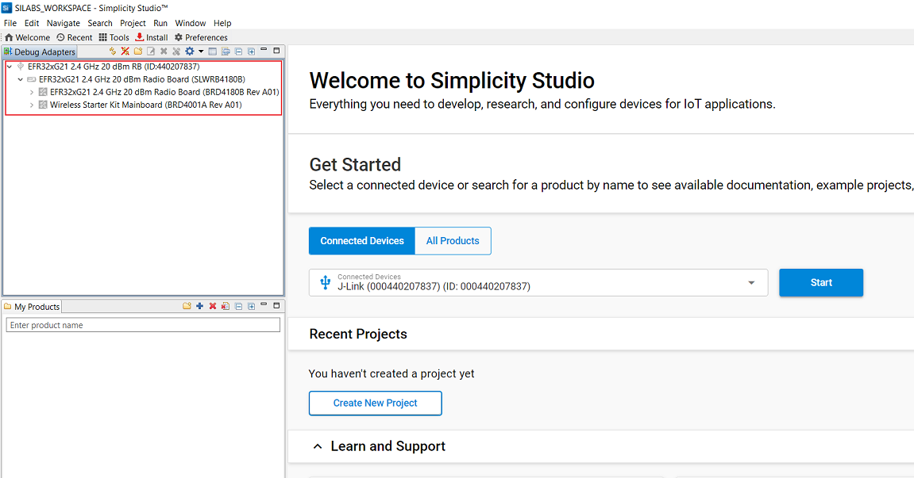

# Cli Demo

## 1 Purpose/Scope

The CLI Demo application is a command-line interface (CLI) application designed to showcase various functionalities and capabilities of SiWx91x in different scenarios and configuration modes. It serves as a quick reference guide and a hands-on demonstration of SiWx91x core features for developers and users.

## 2 Prerequisites/Setup Requirements

### 2.1 Hardware Requirements

- A Windows PC.
- **SoC Mode**: 
  - Silicon Labs [BRD4325A,BRD4325B, BRD4325G](https://www.silabs.com/)
- **NCP Mode**:
  - Silicon Labs [(BRD4180A, BRD4280B)](https://www.silabs.com/) **AND**
  - Host MCU Eval Kit. This example has been tested with:
    - Silicon Labs [WSTK + EFR32MG21](https://www.silabs.com/development-tools/wireless/efr32xg21-bluetooth-starter-kit)

### 2.2 Software Requirements

- Simplicity Studio IDE 

  - Download the latest [Simplicity Studio IDE](https://www.silabs.com/developers/simplicity-studio)
  - Follow the [Simplicity Studio user guide](https://docs.silabs.com/simplicity-studio-5-users-guide/1.1.0/ss-5-users-guide-getting-started/install-ss-5-and-software#install-ssv5) to install Simplicity Studio IDE

### 2.3 Setup Diagram

#### SoC Mode  

Follow the [Getting Started with SiWx91x SoC](https://docs.silabs.com/) guide to set up the hardware connections and Simplicity Studio IDE.

#### NCP Mode  

Follow the [Getting Started with EFx32](https://docs.silabs.com/rs9116-wiseconnect/latest/wifibt-wc-getting-started-with-efx32/) guide to setup the hardware connections and Simplicity Studio IDE.

**NOTE**: 

- The Host MCU platform (EFR32MG21) and the SiWx91x interact with each other through the SPI interface. 

## 3 Project Environment

- Ensure the SiWx91x loaded with the latest firmware following the [Getting started with a PC](https://docs.silabs.com/rs9116/latest/wiseconnect-getting-started)

### 3.1 Creating the project

#### 3.1.1 SoC mode

- In the Simplicity Studio IDE, the SiWx91x SoC board will be detected under **Debug Adapters** pane as shown below.

    ****

- Ensure the latest Gecko SDK along with the  WiSeConnect3 extension is added to Simplicity Studio.

- Studio should detect your board. Your board will be shown here. Click on the board detected and go to **EXAMPLE PROJECTS & DEMOS** section.

- We can see the Example  cli_demo in Simplicity Studio and select those Example.

    ****

- Click 'Create'. The "New Project Wizard" window appears. Click 'Finish'

    ****

#### 3.1.2 NCP mode

- In the Simplicity Studio IDE, the EFR32 board will be detected under **Debug Adapters** pane as shown below.

  ****

- Ensure the latest Gecko SDK along with the  WiSeConnect3 extension is added to  Simplicity Studio.

- Go to the 'EXAMPLE PROJECT & DEMOS' tab and select **Cli Demo** example.

  ****

- Click 'Create'. The "New Project Wizard" window appears. Click 'Finish'

   ****

### 3.2 Set up for application prints

#### 3.2.1 SoC mode

  You can use either of the below USB to UART converters for application prints.

1. Set up using USB to UART converter board.

   - Connect TX (Pin 4) of TTL convertor to P14 on WSTK
   - Connect RX (Pin 5) of TTL convertor to P27 on WSTK
   
    ****

2. Set up using USB to UART converter cable.

   - Connect TX (Pin 4) of TTL convertor to P14 on WSTK
   - Connect RX (Pin 5) of TTL convertor to P27 on WSTK
   
    ****

**Tera Term set up - for NCP and SoC modes**

1. Open the Tera Term tool.

   - For SoC mode, choose the serial port to which USB to UART converter is connected and click on **OK**. 

      ****

   - For NCP mode, choose the J-Link port and click on **OK**.
    
      ****

2. Navigate to the Setup → Serial port and update the baud rate to **115200** and click on **OK**.

 ****

 ****

## 4 Application Build Environment

The application can be configured to suit your requirements and development environment. 

### 4.1 Configure the application

- The application uses the default configurations as provided in the **default_wifi_ap_profile** in **sl_net_default_valus.h** and user can choose to configure these parameters as needed.

### 4.2 Build the application

- SoC mode: Build as cli_demo Example

  ****

- NCP mode: 

### 4.3 Run and Test the application

- Once the build was successful, right click on project and click on Debug As->Silicon Labs ARM Program as shown in below image.

  - SoC
    
    ****

  - NCP

    ****

### 4.4 Application Output

- After the application gets execueted successfully, we get output like this

  ****

- In terminal screen We have so many commands by manually we can add those commands in Extension command in Serial debug assistant.we can add those commands to it.

 **Here are List of those commands:**

1. HELP
2. wifi-init
3. wifi_init -i client
4. wifi_init -i ap
5. wifi_init -i apsta
6. wifi_scan
7. wifi_scan -s <ssid> -i 2.4g
8. wifi_scan -s <ssid> -i ap
9. wifi_scan -s <ssid> -i client
10. wifi_scan -s <ssid> -i 5g
11. wifi_ap_up
12. wifi_connect  <ssid> <password>
13. wifi_deinit
14. wifi_disconnect -i 0
15. wifi_get_client_info
16. wifi_init -i client/ap
17. wifi_get_fw_version
18. wifi_get_mac_address -i 0
19. wifi_set_performance_profile high_performance
20. wifi_set_performance_profile power_saver
21. wifi_set_performance_profile power_saver_low_latency
22. wifi_set_performance_profile ultra_power_saver
23. wifi_get_signal_strength
24. wifi_get_statistics
25. wifi_get_performance_profile
26. wifi_ip_address
27. wifi_get_ip_address
28. sl_dns_host_get_by_name <url> -t <time_in_milliseconds> -i <ipv4/ipv6>
29. wifi_iot_socket_create -i 1 -j 2 -k 2
30. wifi_iot_socket_connect -i 0 -j <server_ip> -k 4 -l <server_port>
31. wifi_iot_socket_bind -i 0 -j <local_ip> -k 4 -l <local_port>
32. wifi_iot_socket_receive_from -i 0
33. wifi_iot_socket_create -i 1 -j -k 1
34. wifi_iot_socket_listen -i 0 -j 1
35. wifi_iot_socket_accept -i 0
36. wifi_iot_socket_send -i 0 -d <data_to be sent>
37. start_dhcp

And so on...

- Here I am given some commands how we can enter and use those commands in terminal screen..

**HELP COMMAND:-**

****

- After clicking Help command in serial Debug assistant you will see so many scenario's in debug assistant like this

****
****

- clean the TTL console using Empty Data

****

**WIFI INIT COMMAND:-**

- Again click extension cmd and click WiFi Init command in TTL console

****

- After clicking WiFi init command in TTL console and click send command we get this prints 

****

**WIFI SCAN COMMAND:-**

- After clicking WiFi Scan command in TTL console and click send command we get this prints 

****

**WIFI CONNECT COMMAND:-**

- After clicking WiFi Connect command in TTL console and click send command we get this prints 

****
****

**WIFI DEINIT COMMAND:-**

- After clicking WiFi deinit command in TTL console and click send command we get this prints

****