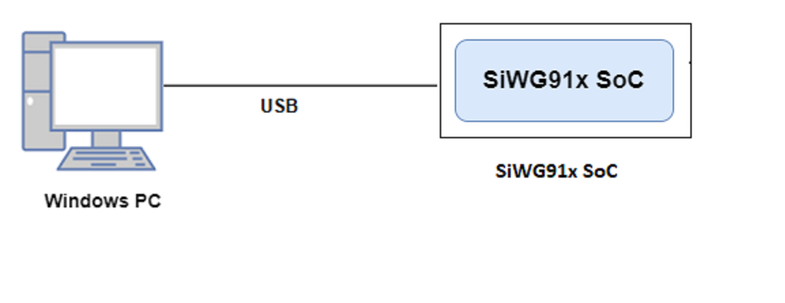

# Crypto - AES

## Table of Contents

- [Crypto - AES](#crypto---aes)
  - [Table of Contents](#table-of-contents)
  - [Purpose/Scope](#purposescope)
  - [Prerequisites/Setup Requirements](#prerequisitessetup-requirements)
    - [Hardware Requirements](#hardware-requirements)
    - [Software Requirements](#software-requirements)
    - [Setup Diagram](#setup-diagram)
      - [SoC Mode](#soc-mode)
  - [Getting Started](#getting-started)
  - [Application Build Environment](#application-build-environment)
  - [Test the Application](#test-the-application)
  - [Note](#note)
  - [Note](#note-1)
  - [Application Output](#application-output)

## Purpose/Scope

This application demonstrates how to encrypt and decrypt the data using AES APIs.

## Prerequisites/Setup Requirements

### Hardware Requirements

- Windows PC
- SoC Mode:
  - Silicon Labs [BRD4338A](https://www.silabs.com/)
- For the Wrap Key feature of this application to work, the keys should be programmed and secure boot (ta_secure_boot) should be enabled in the device

### Software Requirements

- Simplicity Studio IDE

### Setup Diagram

#### SoC Mode 



## Getting Started

Refer the instructions [here](https://docs.silabs.com/wiseconnect/latest/wiseconnect-getting-started/) to:

- Install Studio and WiSeConnect extension
- Connect your device to the computer
- Upgrade your connectivity firmware
- Create a Studio project

For details on the project folder structure, see the [WiSeConnect Examples](https://docs.silabs.com/wiseconnect/latest/wiseconnect-examples/#example-folder-structure) page.

## Application Build Environment

The application can be configured to suit your requirements and development environment. Read through the following sections and make any changes needed.

Open `app.c` file and configure the following parameters accordingly:

- The length of the input message/plain text can be configured by using the below macro

  ```c
  #define BUFFER_SIZE 16
  ```

- *msg* refers to plain data which is passed to AES engine.
- *key* is used for encryption/decryption of the 'msg' in AES engine.
- *iv* refers to Initialization Vector used in SL_SI91X_AES_CBC and SL_SI91X_AES_CTR modes.

- Based on the below macro, the given key can be wrapped by passing valid **sl_si91x_wrap_config_t** configuration to `sl_si91x_wrap()` and outputs the *wrapped_key*.

  ```c
  #define USE_WRAPPED_KEYS 0
  ```

- According to NIST, the AES algorithm is capable of using cryptographic keys of 128, 192, and 256 bits to encrypt and decrypt data in block sizes of 128 bits (16 bytes). This means that each block of data processed by the AES algorithm should be aligned to 16-byte boundaries. 

- The input message can be aligned to 16 bytes by enabling below macro.

  ```c
  #define PKCS_7_PADDING 1
  ```

- After filling the appropriate **sl_si91x_aes_config_t** configuration, `sl_si91x_aes()` stores the output in the provided encrypted_buffer/decrypted_buffer. 

- To enable AES multipart support, set the macro USE_MULTIPART to 1.

  ```c
  #define USE_MULTIPART    1
  ```

- This AES multipart demonstrates how to split the encryption and decryption process into multiple chunks and handle each chunk separately. 

- The function `sl_si91x_aes_multipart()` is used to perform AES encryption or decryption on large messages by splitting them into smaller chunks. The function allows you to define the size of each chunk by chunk_len bytes.

  - chunk_len: Specifies the number of bytes per chunk.
  - aes_flags: The flags (BIT(0), BIT(1), BIT(2)) indicate whether the chunk is the first, middle, or last chunk in the sequence respectively.

- In AES multipart operation, data must be transmitted in 16-byte aligned chunks. Padding should not be applied to the first and middle chunks to preserve the original message. If the final chunk is not 16 bytes aligned, padding should only be added to the final chunk.

- In Multipart API, while sending less than or equal to 1408 bytes of data to the NWP in a single transmission, the user should include both the first and last chunks in the AES flags.

- Multipart support will not be available in the event of power loss. Operations will need to restart from the beginning.

- When the user sends data by setting the first chunk, NWP treats it as the start of the data.

> **Note**: For recommended settings, please refer the [recommendations guide](https://docs.silabs.com/wiseconnect/latest/wiseconnect-developers-guide-prog-recommended-settings/).

## Test the Application

Refer to the instructions [here](https://docs.silabs.com/wiseconnect/latest/wiseconnect-getting-started/) to:

- Build the application.
- Flash, run and debug the application.
- Based on the input data, key size and mode of encryption/decryption, the output from AES engine can be observed in the provided output buffer.

## Note

- The SDK is limited to handling RX packet lengths up to 1616 bytes, as the rx_buffer is capped at this size. Receiving messages larger than this limit may result in data corruption. To mitigate this, the AES application restricts the input message length to 1408 bytes.
- In the Multipart API, ensure that the chunk length does not exceed 1408 bytes. If the chunk length surpasses this limit, the API will return an error.

## Note

- When using wrapped keys, always ensure that the `wrap_iv_mode` field in the `sl_si91x_key_config_b0_t` struct (`config.key_config.b0.wrap_iv_mode`) is set to the same mode for both encryption and decryption operations.

## Application Output


Multipart AES:


