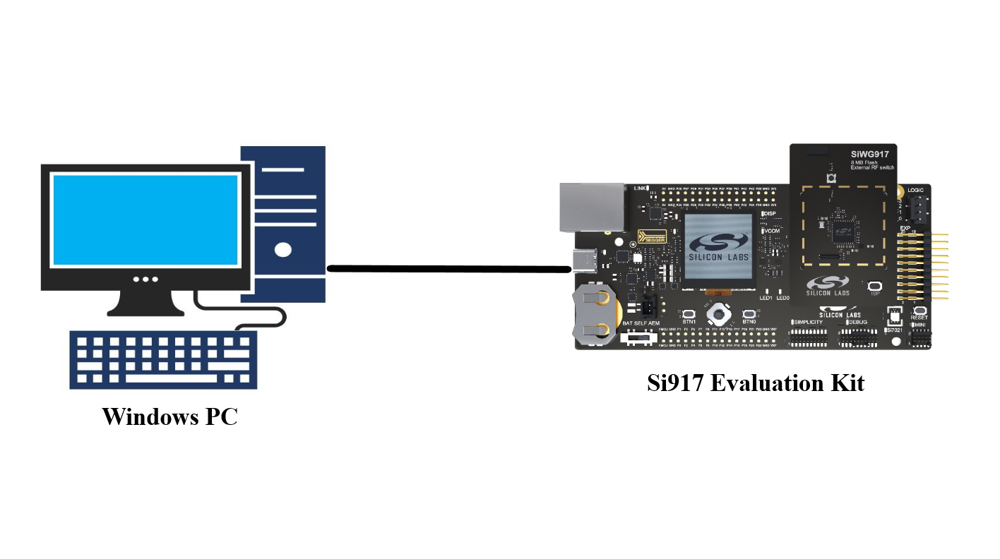
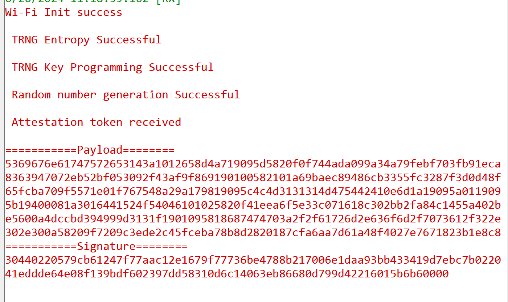

# Crypto - Attestation

## Table of Contents

- [Crypto - Attestation](#crypto---attestation)
  - [Table of Contents](#table-of-contents)
  - [Purpose/Scope](#purposescope)
  - [Prerequisites/Setup Requirements](#prerequisitessetup-requirements)
    - [Hardware Requirements](#hardware-requirements)
    - [Software Requirements](#software-requirements)
    - [Setup Diagram](#setup-diagram)
      - [SoC Mode](#soc-mode)
  - [Getting Started](#getting-started)
  - [Application Build Environment](#application-build-environment)
  - [Test the Application](#test-the-application)
  - [Application Output](#application-output)

## Purpose/Scope

- Demonstrates how to send a token request to NWP and receive the response token.
- Enables users to verify device authenticity.
- Sends a 32-byte nonce generated using TRNG.
- Receives a token signed with the Attestation private key.
- Decodes the token using t_cose and QCBOR libraries.

## Prerequisites/Setup Requirements

- This application works only when secure boot is enabled for NWP.

### Hardware Requirements

- Windows PC
- Silicon Labs Si917 Evaluation Kit [WPK(BRD4002) + BRD4338A / BRD4342A / BRD4343A ]
- SiWx917 AC1 Module Explorer Kit (BRD2708A)
 
### Software Requirements

- Simplicity Studio

### Setup Diagram

#### SoC Mode

  

## Getting Started

Refer the instructions [here](https://docs.silabs.com/wiseconnect/latest/wiseconnect-getting-started/) to:

- Install Studio and WiSeConnect extension
- Connect your device to the computer
- Upgrade your connectivity firmware
- Create a Studio project

For details on the project folder structure, see the [WiSeConnect Examples](https://docs.silabs.com/wiseconnect/latest/wiseconnect-examples/#example-folder-structure) page.

## Application Build Environment

- Configure the following parameters in rsi_attestation_app.h file and update/modify following macros if required

   ```c
   #define LENGTH_OF_RANDOM_DATA        // Length of nonce to be sent along with the attestation request
   #define LENGTH_OF_TOKEN              // Length of token to be received
   ```

> **Note**: For recommended settings, please refer the [recommendations guide](https://docs.silabs.com/wiseconnect/latest/wiseconnect-developers-guide-prog-recommended-settings/).

## Test the Application

Refer to the instructions [here](https://docs.silabs.com/wiseconnect/latest/wiseconnect-getting-started/) to:

- Build the application.
- Make sure to enable secure boot for NWP using Commander.

## Application Output

- Sample output


Follow the steps as mentioned for the successful execution of the application:

1. Enable the NWP secure boot (Mandatory).
2. When the application runs,It sends a token request along with 32 byte nonce and receives the token. 
3. User will get the token along with the nonce that was sent in verify_data buffer present in t_cose_verify.c file and same data get printed with payload and signature data on the UART console
4. Payload data and signature data should be copied in two separate files using .hex editor. Before copying, remove the trailing 0's from the signature and run the below command for signature verification.

      a. openssl dgst -sha256 -verify <Attestation_pubkey.pem> -signature <signature_file> <payload_file>

5. If out put is "Vefified OK", program is working fine. If  verification is failed, could be payload and Signature is copied wrongly.
