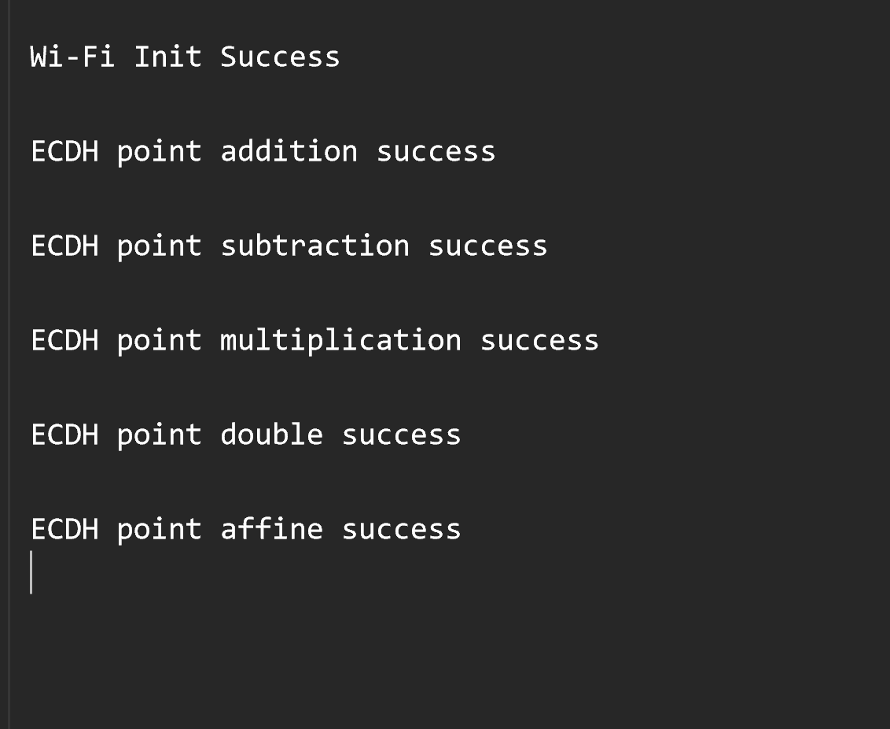

# Crypto - ECDH

## Table of Contents

- [Crypto - ECDH](#crypto---ecdh)
  - [Table of Contents](#table-of-contents)
  - [Purpose/Scope](#purposescope)
  - [Prerequisites/Setup Requirements](#prerequisitessetup-requirements)
    - [Hardware Requirements](#hardware-requirements)
    - [Software Requirements](#software-requirements)
    - [Setup Diagram](#setup-diagram)
      - [SoC Mode](#soc-mode)
  - [Getting Started](#getting-started)
  - [Application Build Environment](#application-build-environment)
  - [Test the Application](#test-the-application)
  - [Application Output](#application-output)

## Purpose/Scope

This application explains how to configure and use the ECDH crypto APIs.

## Prerequisites/Setup Requirements

### Hardware Requirements

- Windows PC
- SoC Mode:
  - Silicon Labs [BRD4338A](https://www.silabs.com/)

### Software Requirements

- Simplicity Studio IDE

### Setup Diagram

#### SoC Mode 

  

## Getting Started

Refer the instructions [here](https://docs.silabs.com/wiseconnect/latest/wiseconnect-getting-started/) to:

- Install Studio and WiSeConnect extension
- Connect your device to the computer
- Upgrade your connectivity firmware
- Create a Studio project

For details on the project folder structure, see the [WiSeConnect Examples](https://docs.silabs.com/wiseconnect/latest/wiseconnect-examples/#example-folder-structure) page.

## Application Build Environment

The application can be configured to suit your requirements and development environment. Read through the following sections and make any changes needed.

Open `app.c` and configure the following parameters accordingly

- The length of the input message can be configured by using the below macro

```c
#define BUFFER_SIZE      32
```

- The length of the input parameters for `sl_si91x_ecdh_point_affine` is configured using the below macro

```c
#define AFFINIFY_SIZE    24
```

- Based on the requirement, the input parameters to the following APIs can be modified and output is observed in the respective output buffers.
  - `sl_si91x_ecdh_point_addition`
  - `sl_si91x_ecdh_point_subtraction`
  - `sl_si91x_ecdh_point_multiplication`
  - `sl_si91x_ecdh_point_double`
  - `sl_si91x_ecdh_point_affine`

> **Note**: For recommended settings, please refer the [recommendations guide](https://docs.silabs.com/wiseconnect/latest/wiseconnect-developers-guide-prog-recommended-settings/).

## Test the Application

Refer to the instructions [here](https://docs.silabs.com/wiseconnect/latest/wiseconnect-getting-started/) to:

- Build the application.
- Flash, run and debug the application.

## Application Output

  
