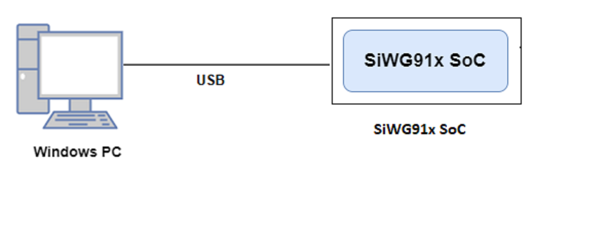
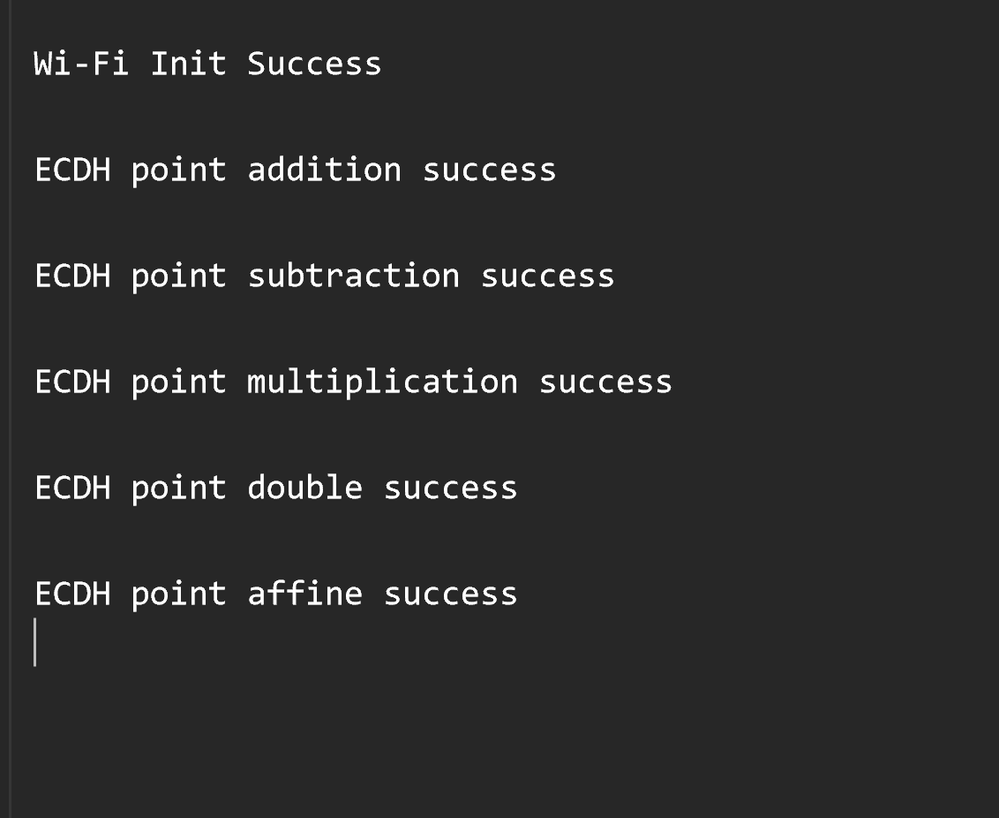

# SiWx91x Platform Crypto ECDH

## Table of Contents

- [SiWx91x Platform Crypto ECDH](#platform-siwx91x-crypto-ecdh)
  - [Table of Contents](#table-of-contents)
  - [Purpose/Scope](#purposescope)
  - [Prerequisites/Setup Requirements](#prerequisitessetup-requirements)
    - [Hardware Requirements](#hardware-requirements)
    - [Software Requirements](#software-requirements)
    - [Setup Diagram](#setup-diagram)
      - [SoC Mode](#soc-mode)
  - [Getting Started](#getting-started)
  - [Application Build Environment](#application-build-environment)
  - [Test the Application](#test-the-application)
  - [Application Output](#application-output)
  - [Troubleshooting](#troubleshooting)
  - [Resources](#resources)
  - [Report Bugs/Support](#report-bugssupport)

## Purpose/Scope

This application explains how to configure and use the ECDH crypto APIs.

## Prerequisites/Setup Requirements

### Hardware Requirements

- Windows PC
- Silicon Labs SiWx91x Evaluation Kit [[BRD4002](https://www.silabs.com/development-tools/wireless/wireless-pro-kit-mainboard?tab=overview) + [BRD4338A](https://www.silabs.com/development-tools/wireless/wi-fi/siwx917-rb4338a-wifi-6-bluetooth-le-soc-radio-board?tab=overview) / [BRD4342A](https://www.silabs.com/development-tools/wireless/wi-fi/siwx91x-rb4342a-wifi-6-bluetooth-le-soc-radio-board?tab=overview) / [BRD4343A](https://www.silabs.com/development-tools/wireless/wi-fi/siw917y-rb4343a-wi-fi-6-bluetooth-le-8mb-flash-radio-board-for-module?tab=overview) / [BRD4343C](https://www.silabs.com/development-tools/wireless/wi-fi/siw917y-rb4343c-wi-fi-6-bluetooth-le-8mb-flash-radio-board-for-module?tab=overview)]

### Software Requirements

- Simplicity Studio IDE

### Setup Diagram

#### SoC Mode 

  

## Getting Started

Refer the instructions [here](https://docs.silabs.com/wiseconnect/latest/wiseconnect-getting-started/) to:

- Install Studio and WiSeConnect extension
- Connect your device to the computer
- Upgrade your connectivity firmware
- Create a Studio project

For details on the project folder structure, see the [WiSeConnect Examples](https://docs.silabs.com/wiseconnect/latest/wiseconnect-examples/#example-folder-structure) page.

## Application Build Environment

The application can be configured to suit your requirements and development environment. Read through the following sections and make any changes needed.

Open `app.c` and configure the following parameters accordingly

- The length of the input message can be configured by using the below macro

```c
#define BUFFER_SIZE      32
```

- The length of the input parameters for `sl_si91x_ecdh_point_affine` is configured using the below macro

```c
#define AFFINIFY_SIZE    24
```

- Based on the requirement, the input parameters to the following APIs can be modified and output is observed in the respective output buffers.
  - `sl_si91x_ecdh_point_addition`
  - `sl_si91x_ecdh_point_subtraction`
  - `sl_si91x_ecdh_point_multiplication`
  - `sl_si91x_ecdh_point_double`
  - `sl_si91x_ecdh_point_affine`

> **Note**: For recommended settings, please refer the [recommendations guide](https://docs.silabs.com/wiseconnect/latest/wiseconnect-developers-guide-prog-recommended-settings/).

> **Note**: For recommended settings, please refer the [recommendations guide](https://docs.silabs.com/wiseconnect/latest/wiseconnect-developers-guide-prog-recommended-settings/).

> **Note**: To enable **sideband crypto**, Use **one** of the following methods, depending on your workflow:
>
> **Option 1 — Edit the example's `.slcp` file (the `.slcp` inside the example folder, not the project `.slcp`):**
>
> Add the `define` entry at example scope:
>
> ```yaml
> define:
>   - name: SL_SI91X_SIDE_BAND_CRYPTO
> ```
>
> **Option 2 — Add the macro using Configurators 2.0:**
>
> 1. Create the desired PSA example project and open it in any compatible IDE.
> 2. In the project explorer, right-click the project and select **Open Configurators 2.0**.
>
>    
>
> 3. In the configurator view, switch to the **Build Configurator** tab.
>
>    
>
> 4. Under **Compiler Flags → C**, add `-DSL_SI91X_SIDE_BAND_CRYPTO` to the options list and save the configuration.
>
>    
>
> 5. **Clean** the project and then **rebuild** it for the change to take effect.

> [!NOTE]
> Sideband is supported only with PSA APIs.

## Test the Application

Refer to the instructions [here](https://docs.silabs.com/wiseconnect/latest/wiseconnect-getting-started/) to:

- Build the application.
- Flash, run and debug the application.

## Application Output

  

## Troubleshooting

For troubleshooting information, see [WiSeConnect Troubleshooting](https://docs.silabs.com/wiseconnect/latest/wiseconnect-developers-guide-troubleshooting/).

## Resources

- [WiSeConnect Documentation](https://docs.silabs.com/wiseconnect/latest/)
- [WiSeConnect Examples](https://docs.silabs.com/wiseconnect/latest/wiseconnect-examples/)

## Report Bugs/Support

To report bugs or get support, visit [Silicon Labs Community](https://community.silabs.com/).
