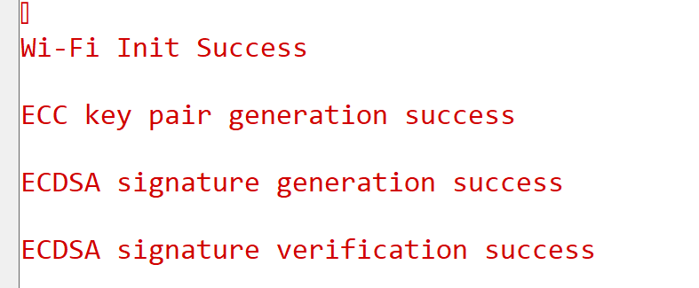

# SiWx91x Platform Crypto ECDSA

## Table of Contents

- [SiWx91x Platform Crypto ECDSA](#platform-siwx91x-crypto-ecdsa)
  - [Table of Contents](#table-of-contents)
  - [Purpose/Scope](#purposescope)
  - [Prerequisites/Setup Requirements](#prerequisitessetup-requirements)
    - [Hardware Requirements](#hardware-requirements)
    - [Software Requirements](#software-requirements)
    - [Setup Diagram](#setup-diagram)
      - [SoC Mode](#soc-mode)
  - [Getting Started](#getting-started)
  - [Application Build Environment](#application-build-environment)
  - [Test the Application](#test-the-application)
  - [Note](#note)
  - [Application Output](#application-output)
  - [Troubleshooting](#troubleshooting)
  - [Resources](#resources)
  - [Report Bugs/Support](#report-bugssupport)

## Purpose/Scope

This application explains how to configure and use the ECDSA crypto APIs.

## Prerequisites/Setup Requirements

### Hardware Requirements

- Windows PC
- Silicon Labs SiWx91x Evaluation Kit [[BRD4002](https://www.silabs.com/development-tools/wireless/wireless-pro-kit-mainboard?tab=overview) + [BRD4338A](https://www.silabs.com/development-tools/wireless/wi-fi/siwx917-rb4338a-wifi-6-bluetooth-le-soc-radio-board?tab=overview) / [BRD4342A](https://www.silabs.com/development-tools/wireless/wi-fi/siwx91x-rb4342a-wifi-6-bluetooth-le-soc-radio-board?tab=overview) / [BRD4343A](https://www.silabs.com/development-tools/wireless/wi-fi/siw917y-rb4343a-wi-fi-6-bluetooth-le-8mb-flash-radio-board-for-module?tab=overview) / [BRD4343C](https://www.silabs.com/development-tools/wireless/wi-fi/siw917y-rb4343c-wi-fi-6-bluetooth-le-8mb-flash-radio-board-for-module?tab=overview)]
- For the Wrap Key feature of this application to work, the keys should be programmed and secure boot (ta_secure_boot) should be enabled in the device

### Software Requirements

- Simplicity Studio IDE

### Setup Diagram

#### SoC Mode 

  

## Getting Started

Refer the instructions [here](https://docs.silabs.com/wiseconnect/latest/wiseconnect-getting-started/) to:

- Install Studio and WiSeConnect extension
- Connect your device to the computer
- Upgrade your connectivity firmware
- Create a Studio project

For details on the project folder structure, see the [WiSeConnect Examples](https://docs.silabs.com/wiseconnect/latest/wiseconnect-examples/#example-folder-structure) page.

## Application Build Environment

The application can be configured to suit your requirements and development environment. Read through the following sections and make any changes needed.

Open `app.c` and configure the following parameters accordingly

- The length of the input message can be configured by using the macro INPUT_MSG_SIZE

- The input parameters for `sl_si91x_ecdsa` are configured using these macros

curve_id
  SL_SI91X_ECC_SECP224R1
  SL_SI91X_ECC_SECP256R1

sha_mode
  SL_SI91X_SHA_256
  SL_SI91X_SHA_384
  SL_SI91X_SHA_512

| curve ID | SHA mode |
|--------------- | ------------------|
| SL_SI91X_ECC_SECP224R1 | SL_SI91X_SHA_256 |
| SL_SI91X_ECC_SECP256R1 | SL_SI91X_SHA_384 |
| Note: All the mentioned curves are compatible with all mentioned SHA modes | SL_SI91X_SHA_512 |


- The private key length and public key length can be changed using these macros SL_SI91X_PRIVATE_KEY_SIZE,  SL_SI91X_PUBLIC_KEY_SIZE and the values corresponding to the following curves are

| Macro | Size |
|---------------| ------------------|
| SL_SI91X_PRIVATE_KEY_SIZE | 28 |
| SL_SI91X_PUBLIC_KEY_SIZE | 57 |

  | Macro | Size |
|---------------| ------------------|
| SL_SI91X_PRIVATE_KEY_SIZE | 32 |
| SL_SI91X_PUBLIC_KEY_SIZE | 65 |

- To use wrapped private key in ECDSA operation, enable wrap mode by setting the macro USE_WRAPPED_KEYS to 1

> **Note**: For recommended settings, please refer the [recommendations guide](https://docs.silabs.com/wiseconnect/latest/wiseconnect-developers-guide-prog-recommended-settings/).

> **Note**: For recommended settings, please refer the [recommendations guide](https://docs.silabs.com/wiseconnect/latest/wiseconnect-developers-guide-prog-recommended-settings/).

> **Note**: To enable **sideband crypto**, Use **one** of the following methods, depending on your workflow:
>
> **Option 1 — Edit the example's `.slcp` file (the `.slcp` inside the example folder, not the project `.slcp`):**
>
> Add the `define` entry at example scope:
>
> ```yaml
> define:
>   - name: SL_SI91X_SIDE_BAND_CRYPTO
> ```
>
> **Option 2 — Add the macro using Configurators 2.0:**
>
> 1. Create the desired PSA example project and open it in any compatible IDE.
> 2. In the project explorer, right-click the project and select **Open Configurators 2.0**.
>
>    
>
> 3. In the configurator view, switch to the **Build Configurator** tab.
>
>    
>
> 4. Under **Compiler Flags → C**, add `-DSL_SI91X_SIDE_BAND_CRYPTO` to the options list and save the configuration.
>
>    
>
> 5. **Clean** the project and then **rebuild** it for the change to take effect.

## Test the Application

Refer to the instructions [here](https://docs.silabs.com/wiseconnect/latest/wiseconnect-getting-started/) to:

- Build the application.
- Flash, run and debug the application.

## Note

- The SDK does not properly handle rx packet lengths over 1616 bytes due to the rx_buffer being capped at 1616 bytes, which may cause data corruption if the input message size exceeds the expected length. Therefore, the ECDSA application limits the input message length to 1000 bytes.
- If the user provides an input message longer than 1000 bytes, the firmware will return "SL_STATUS_SI91X_CRYPTO_INPUT_MSG_LENGTH_EXCEEDED".

## Application Output

  

## Troubleshooting

For troubleshooting information, see [WiSeConnect Troubleshooting](https://docs.silabs.com/wiseconnect/latest/wiseconnect-developers-guide-troubleshooting/).

## Resources

- [WiSeConnect Documentation](https://docs.silabs.com/wiseconnect/latest/)
- [WiSeConnect Examples](https://docs.silabs.com/wiseconnect/latest/wiseconnect-examples/)

## Report Bugs/Support

To report bugs or get support, visit [Silicon Labs Community](https://community.silabs.com/).
