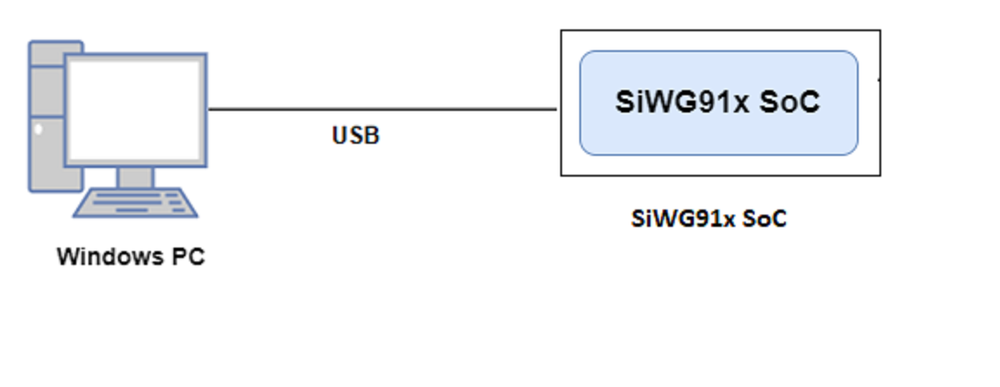
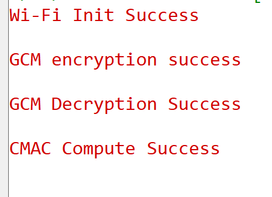

# Crypto - GCM_CMAC

## Table of Contents

- [Crypto - GCM\_CMAC](#crypto---gcm_cmac)
  - [Table of Contents](#table-of-contents)
  - [Purpose/Scope](#purposescope)
  - [Prerequisites/Setup Requirements](#prerequisitessetup-requirements)
    - [Hardware Requirements](#hardware-requirements)
    - [Software Requirements](#software-requirements)
    - [Setup Diagram](#setup-diagram)
      - [SoC Mode](#soc-mode)
  - [Getting Started](#getting-started)
  - [Application Build Environment](#application-build-environment)
  - [Test the Application](#test-the-application)
  - [Note](#note)
  - [Application Output](#application-output)

## Purpose/Scope

This application demonstrates the following:
 - How to encrypt and decrypt the data using GCM APIs.
 - How to generate the MAC using the CMAC API.

## Prerequisites/Setup Requirements

### Hardware Requirements

- Windows PC
- SoC Mode:
  - Silicon Labs [BRD4338A](https://www.silabs.com/)
- For the Wrap Key feature of this application to work, the keys should be programmed and secure boot (ta_secure_boot) should be enabled in the device

### Software Requirements

- Simplicity Studio IDE

### Setup Diagram

#### SoC Mode 



## Getting Started

Refer the instructions [here](https://docs.silabs.com/wiseconnect/latest/wiseconnect-getting-started/) to:

- Install Studio and WiSeConnectxtension
- Connect your device to the computer
- Upgrade your connectivity firmware
- Create a Studio project

For details on the project folder structure, see the [WiSeConnect Examples](https://docs.silabs.com/wiseconnect/latest/wiseconnect-examples/#example-folder-structure) page.

## Application Build Environment

The application can be configured to suit your requirements and development environment. Read through the following sections and make any changes needed.

Open `app.c` file and configure the following parameters accordingly

- The length of the input message/plain text can be configured by using the below macro

```c
#define BUFFER_SIZE 16
```

- *gcm_msg* refers to plain data which is passed to GCM engine.
- *key* is used for encryption/decryption of the 'msg' in AES engine.
- *nonce* refers to Initialization Vector used.
- *ad* refers to the additional data which is passed to the GCM engine.

- Based on the below macro, the given key can be wrapped by passing valid **sl_si91x_wrap_config_t** configuration to `sl_si91x_wrap()` and outputs the *wrapped_key*.

```c
#define USE_WRAPPED_KEYS 0
```

- After filling the appropriate **sl_si91x_gcm_config_t** configuration, `sl_si91x_gcm()` stores the output in the provided encrypted_buffer/decrypted_buffer in case of GCM Mode or stores the output in the provided mac buffer in case of CMAC Mode.

> **Note**: For recommended settings, please refer the [recommendations guide](https://docs.silabs.com/wiseconnect/latest/wiseconnect-developers-guide-prog-recommended-settings/).

## Test the Application

Refer to the instructions [here](https://docs.silabs.com/wiseconnect/latest/wiseconnect-getting-started/) to:

- Build the application.
- Flash, run and debug the application.
- Based on the input data, key size and mode of encryption/decryption, the output from GCM engine can be observed in the provided output buffer.
- In case of CMAC mode, the output from the CMAC engine can be observed in the provided mac output buffer.

## Note

- The SDK does not properly handle rx packet lengths over 1616 bytes due to the rx_buffer being capped at 1616 bytes, which may cause data corruption if the input message size exceeds the expected length. Therefore, the GCM_CMAC application limits the input message length to 1400 bytes.
- If the user provides an input message longer than 1400 bytes, the firmware will return "SL_STATUS_SI91X_CRYPTO_INPUT_MSG_LENGTH_EXCEEDED".
## Application Output

