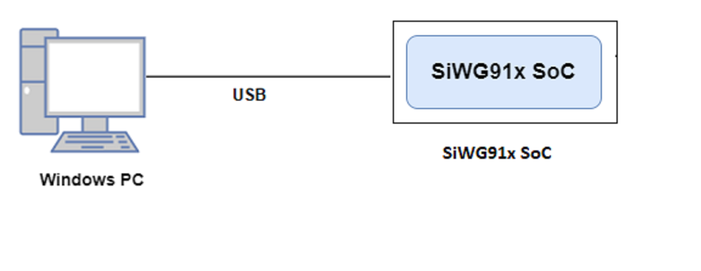
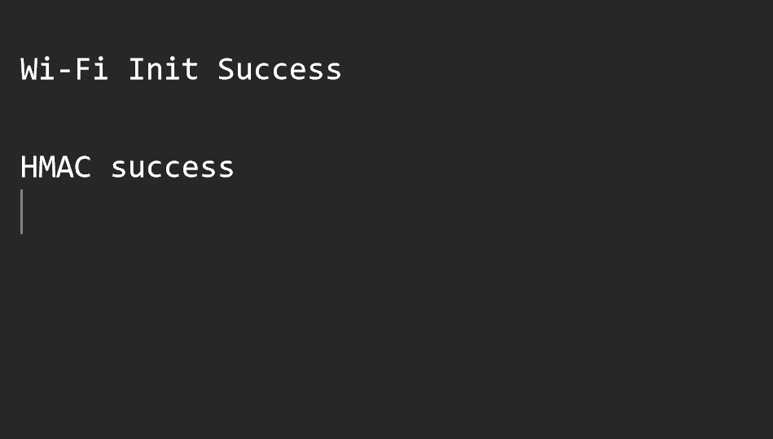

# Crypto - HMAC

## Table of Contents

- [Purpose/Scope](#purposescope) 
- [Prerequisites/Setup Requirements](#prerequisitessetup-requirements)
  - [Hardware Requirements](#hardware-requirements)
  - [Software Requirements](#software-requirements)
  - [Setup Diagram](#setup-diagram)
- [Getting Started](#getting-started)
- [Application Build Environment](#application-build-environment)
- [Test the Application](#test-the-application)

## Purpose/Scope

This application demonstrates how to configure and use the HMAC API and generates the digest for a given input.

## Prerequisites/Setup Requirements

### Hardware Requirements

- Windows PC
- SoC Mode:
  - Silicon Labs [BRD4338A](https://www.silabs.com/)

### Software Requirements

- Simplicity Studio IDE

### Setup Diagram

#### SoC Mode 

  

## Getting Started

Refer the instructions [here](https://docs.silabs.com/wiseconnect/latest/wiseconnect-getting-started/) to:

- Install Studio and WiSeConnect 3 extension
- Connect your device to the computer
- Upgrade your connectivity firmware
- Create a Studio project

For details on the project folder structure, see the [WiSeConnect Examples](https://docs.silabs.com/wiseconnect/latest/wiseconnect-examples/#example-folder-structure) page.

## Application Build Environment

The application can be configured to suit your requirements and development environment. Read through the following sections and make any changes needed.

Open `app.c` file and configure the following parameters accordingly

- "msg" refers to plain data which is given to HMAC engine for encryption with all sizes of key.
- "key" refers to key which is used to encrypt/decrypt the "msg" using  HMAC engine.
- "hmac_mode" can be configured to one of the following mode - "SL_SI91X_HMAC_SHA_1", "SL_SI91X_HMAC_SHA_256", "SL_SI91X_HMAC_SHA_384", "SL_SI91X_HMAC_SHA_512" 
- After filling the appropriate **sl_si91x_hmac_config_t** configuration, `sl_si91x_hmac()` stores the digest in the provided buffer. 
- "USE_WRAPPED_KEYS" is defined by default which will enable key wrapping functionality.
- `sl_si91x_wrap()` pads and wraps the key based on the "padding" and "hmac_mode" configurations and stores it in the provided buffer.

## Test the Application

Refer to the instructions [here](https://docs.silabs.com/wiseconnect/latest/wiseconnect-getting-started/) to:

- Build the application.
- Flash, run and debug the application.
- Based on the input data and key, the digest from HMAC engine can be observed in the provided buffer.

## Application Output

  
