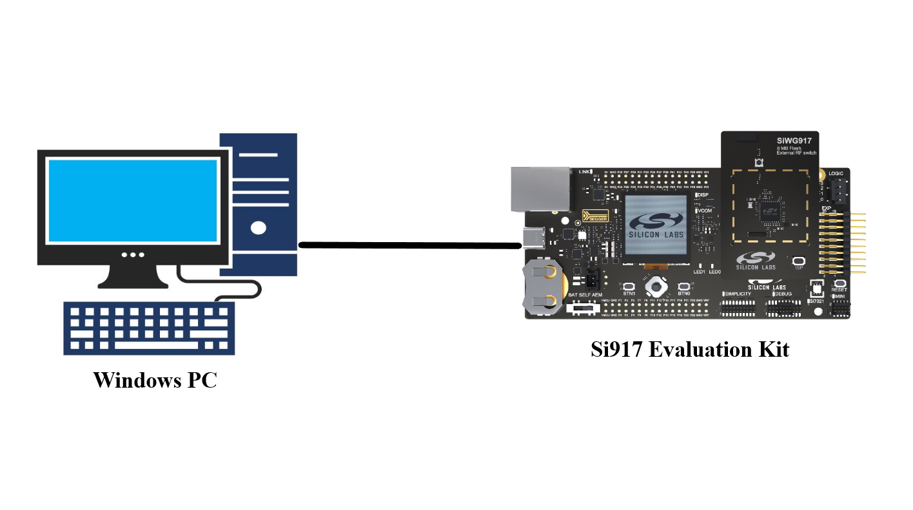
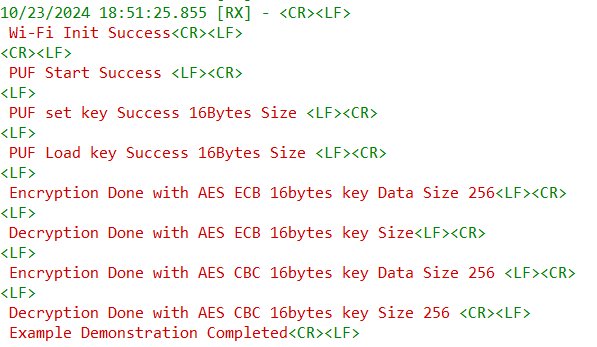

# Crypto - PUF

## Table of Contents

- [Purpose/Scope](#purposescope)
- [Prerequisites/Setup Requirements](#prerequisitessetup-requirements)
  - [Hardware Requirements](#hardware-requirements)
  - [Software Requirements](#software-requirements)
  - [Setup Diagram](#setup-diagram)
- [Getting Started](#getting-started)
- [Application Build Environment](#application-build-environment)
- [Test the Application](#test-the-application)
- [Application Output](#application-output)
- [Activation Code Generation and Flash](#activation-code-generation-and-flash)

## Purpose/Scope

This application demonstrates how to configure and use the Physical Unclonable Function (PUF) API for AES encryption and decryption. It illustrates how to leverage PUF for secure key management and cryptographic operations using AES in both ECB and CBC modes.

## Prerequisites/Setup Requirements

### Hardware Requirements

- Windows PC
- SoC Mode:
  - Silicon Labs [BRD4338A](https://www.silabs.com/)

  > **Note**:
  The board should contain a valid Activation Code (AC) in Flash. For more information on how to generate an activation code, please refer to the section [Activation Code Generation and Flash](#activation-code-generation-and-flash).

### Software Requirements

- Simplicity Studio IDE

### Setup Diagram

#### SoC Mode 

  

## Getting Started

Follow the instructions [here](https://docs.silabs.com/wiseconnect/latest/wiseconnect-getting-started/) to:

- Install Simplicity Studio and the WiSeConnect 3 extension.
- Connect your device to the computer.
- Upgrade your connectivity firmware.
- Create a Studio project.

For details on the project folder structure, see the [WiSeConnect Examples](https://docs.silabs.com/wiseconnect/latest/wiseconnect-examples/#example-folder-structure) page.

## Application Build Environment

The application can be configured to suit your requirements and development environment. 

Adjust the following parameters in the `app.c` file:

- **Boot Configuration**: For enabling PUF feature, user need to set BIT[31] of custom feature bitmap and 
    BIT[7] of ext_custom_feature_bit_map in boot config.

    ```sh
    static const sl_wifi_device_configuration_t client_configuration = {
      .boot_config = {
        .custom_feature_bit_map = SL_SI91X_CUSTOM_FEAT_EXTENTION_VALID,   // BIT[31] enabled
        .ext_custom_feature_bit_map = SL_SI91X_EXT_FEAT_PUF,              // BIT[7] enabled
      }
    }
    ```
- **AES_KEY**: User Key (UK) is used to generate Key Code (KC). Modify the `AES_KEY` constant if a different key is needed.
    Key size can be either 16 or 32 bytes. Modify the `key_size` parameter accordingly in all APIs.

- **AES_PLAIN_TXT**: Data to be encrypted/decrypted. Adjust the `AES_PLAIN_TXT` constant as required.
    > **Note**:
    - The SDK does not properly handle rx packet lengths over 1616 bytes due to the rx_buffer being capped at 1616 bytes, which may cause data corruption if the input message size exceeds the expected length. Therefore, the AES application limits the input message length to 1400 bytes.
    - If the user provides an input message longer than 1400 bytes, the firmware will return "SL_STATUS_SI91X_CRYPTO_INPUT_MSG_LENGTH_EXCEEDED".

- **IV (Initialization Vector)**: For AES CBC mode, adjust the `AES_CBC_IV` constant if a different IV is required.

- **AES_BUFFER_SIZE**: Buffer size to hold output data. Adjust the `AES_BUFFER_SIZE` macro based on the input message length.

  ```c
  #define AES_BUFFER_SIZE 256
  ```
  
  > **Example**: If the user wants to encrypt 512 bytes, increase the buffer size to 512.

- To retrieve the User Key (UK) using `sl_si91x_puf_get_key_req`, set the `key_index` in `sl_si91x_puf_set_key_req` to a non-zero value, i.e., between 1 and 15.

- To load the Key Code (KC) into the AES Engine for encryption and decryption using `sl_si91x_puf_load_key_req`, set the `key_index` in `sl_si91x_puf_set_key_req` to `0` (Master Key).

### Activation Code Requirement

Device should contain a valid activation code (AC) in Flash. If this code is not present, the user will get the error `SL_STATUS_SI91X_PUF_ACTIVATION_CODE_INVALID` for `sl_si91x_puf_start_req()`.

In this case, the user should follow the process [Activation Code Generation and Flash](#activation-code-generation-and-flash)


## Test the Application

To test the application:

1. Build the application.
2. Flash the firmware to the device.
3. Run and debug the application.
4. Observe the encryption and decryption results for AES ECB and AES CBC modes.

Refer to the instructions [here](https://docs.silabs.com/wiseconnect/latest/wiseconnect-getting-started/) for detailed steps.

## Application Output

  

The output will show the results of AES encryption and decryption operations using the PUF API. 

**Key Actions Performed by the Application:**

1. **Start PUF:** Initializes the PUF module for cryptographic operations.
2. **Set Key:** Configures the PUF with the specified AES key.
3. **Get Key:** Retrieves and validates the key from PUF.
4. **Encrypt:** Performs AES encryption in ECB and CBC modes.
5. **Decrypt:** Performs AES decryption and validates the results.

For a detailed view of the implementation, refer to the `app.c` file and make any necessary adjustments to suit your specific requirements.

## Activation Code Generation and Flash
To generate and flash the activation code using Simplicity Commander, follow these steps:

**Command**: 
```sh
commander manufacturing init --mbr <filename.bin|default>
```

**Example**: 
```sh
commander manufacturing init --mbr ta_mbr_SiWG917M111MGTBA.bin
```

> **Note**: The MBR files are present in the folder `...\Commander_win32_x64_1v15p3b1357\Simplicity Commander\resources\jlink\Si917`

#### Return Codes:

- **Success**: `0xa05a`
- **Failure**: Try again
