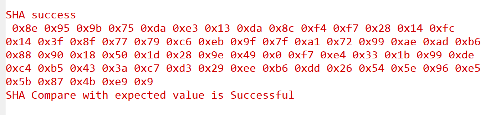

# Crypto - SHA

## Table of Contents

- [Purpose/Scope](#purposescope) 
- [Prerequisites/Setup Requirements](#prerequisitessetup-requirements)
  - [Hardware Requirements](#hardware-requirements)
  - [Software Requirements](#software-requirements)
  - [Setup Diagram](#setup-diagram)
- [Getting Started](#getting-started)
- [Application Build Environment](#application-build-environment)
- [Test the Application](#test-the-application)

## Purpose/Scope

In cryptography, SHA (Secure Hash Algorithm) is a cryptographic hash function designed by the United States National Security Agency and is a U.S. Federal Information Processing Standard published by the United States NIST.

SHA produces a message digest based on principles similar to those used by Ronald L. Rivest of MIT in the design of the MD4 and MD5 message digest algorithms, but has a more conservative design.

SHA forms part of several widely used security applications and protocols, including TLS and SSL, PGP, SSH, S/MIME, and IPsec. Those applications can also use MD5; both MD5 and SHA are descended from MD4.

- This application explains how to configure and use the SHA crypto engine using Silabs SDK.
- This Application demonstrates the various SHA operations like
  - SHA 1
  - SHA 256
  - SHA 384
  - SHA 512
- This application is used to compute digest using SHA crypto engine.
- This application is provided with single NIST test vector to verify funtionality.

## Prerequisites/Setup Requirements

### Hardware Requirements

  - Windows PC 
  - Silicon Labs [Si917 Evaluation Kit WSTK]

### Software Requirements

  - Embedded Development Environment
    - For Silicon Labs Si91x, use Simplicity Studio

### Setup Diagram

#### SoC Mode 

  

## Getting Started

Refer the instructions [here](https://docs.silabs.com/wiseconnect/latest/wiseconnect-getting-started/) to:

- Install Studio and WiSeConnect 3 extension
- Connect your device to the computer
- Upgrade your connectivity firmware
- Create a Studio project

For details on the project folder structure, see the [WiSeConnect Examples](https://docs.silabs.com/wiseconnect/latest/wiseconnect-examples/#example-folder-structure) page.

## Application Build Environment

- Configure the following parameters in app.c file and update/modify following macros if required
- In calling function sl_si91x_sha, change SL_SI91X_SHA_512 to required sha mode
- From given configuration,
“SHA” refers to data which is given as input to SHA for computing digest.

## Test the Application

Refer to the instructions [here](https://docs.silabs.com/wiseconnect/latest/wiseconnect-getting-started/) to:

- Build the application.
- Flash, run and debug the application.

1. Depending on SHA mode digest of respective size is computed for the given input data.

## Expected Results

 - User will get the digest value.

