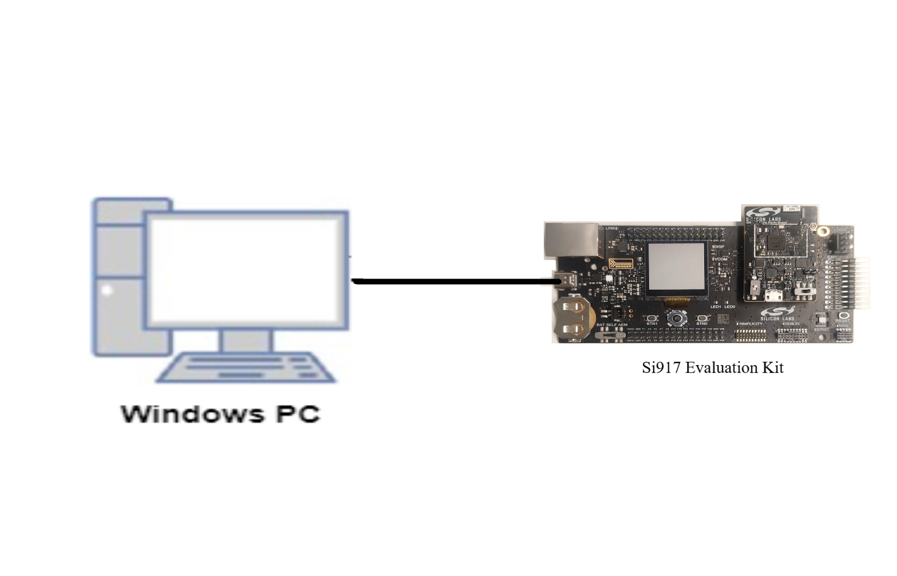
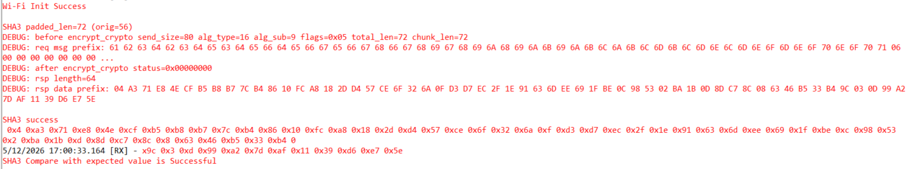

# Crypto - SHA3

## Table of Contents

- [Crypto - SHA3](#crypto---sha3)
  - [Table of Contents](#table-of-contents)
  - [Purpose/Scope](#purposescope)
  - [Prerequisites/Setup Requirements](#prerequisitessetup-requirements)
    - [Hardware Requirements](#hardware-requirements)
    - [Software Requirements](#software-requirements)
    - [Setup Diagram](#setup-diagram)
      - [SoC Mode](#soc-mode)
  - [Getting Started](#getting-started)
  - [Application Build Environment](#application-build-environment)
  - [Test the Application](#test-the-application)
  - [Expected Results](#expected-results)

## Purpose/Scope

SHA3 (Secure Hash Algorithm 3) is the latest member of the Secure Hash Algorithm family of standards, released by NIST on August 5, 2015. SHA3 is based on the Keccak cryptographic primitive and uses the sponge construction, making it structurally different from SHA-1 and SHA-2.

SHA3 is intended as a drop-in replacement and additional option for SHA-2 in the wide variety of applications that use cryptographic hash functions, including digital signatures, message authentication, key derivation, and integrity verification in protocols such as TLS, IPsec, and SSH.

- This application explains how to configure and use the SHA3 crypto engine using the Silabs SDK.
- This application demonstrates the various SHA3 operations:
  - SHA3-224
  - SHA3-256
  - SHA3-384
  - SHA3-512
- This application is used to compute the digest using the SHA3 crypto engine.
- This application is provided with a single NIST test vector to verify functionality.
- This application does not support multi-part hash operations.

## Prerequisites/Setup Requirements

### Hardware Requirements

- Windows PC 
- Silicon Labs [Si917 Evaluation Kit [[BRD4002](https://www.silabs.com/development-tools/wireless/wireless-pro-kit-mainboard?tab=overview) + [BRD4338A](https://www.silabs.com/development-tools/wireless/wi-fi/siwx917-rb4338a-wifi-6-bluetooth-le-soc-radio-board?tab=overview) / [BRD4342A](https://www.silabs.com/development-tools/wireless/wi-fi/siwx91x-rb4342a-wifi-6-bluetooth-le-soc-radio-board?tab=overview) / [BRD4343A](https://www.silabs.com/development-tools/wireless/wi-fi/siw917y-rb4343a-wi-fi-6-bluetooth-le-8mb-flash-radio-board-for-module?tab=overview) / [BRD4343C](https://www.silabs.com/development-tools/wireless/wi-fi/siw917y-rb4343c-wi-fi-6-bluetooth-le-8mb-flash-radio-board-for-module?tab=overview)]]

### Software Requirements

- Embedded Development Environment
  - For Silicon Labs Si91x, use Simplicity Studio

### Setup Diagram

#### SoC Mode 

  

## Getting Started

Refer the instructions [here](https://docs.silabs.com/wiseconnect/latest/wiseconnect-getting-started/) to:

- Install Studio and WiSeConnect extension
- Connect your device to the computer
- Upgrade your connectivity firmware
- Create a Studio project

For details on the project folder structure, see the [WiSeConnect Examples](https://docs.silabs.com/wiseconnect/latest/wiseconnect-examples/#example-folder-structure) page.

## Application Build Environment

- Configure the following parameters in the `app.c` file and update/modify the following macros if required.
- In the calling function `sl_si91x_sha`, change `SL_SI91X_SHA3_512` to the required SHA3 mode (`SL_SI91X_SHA3_224`, `SL_SI91X_SHA3_256`, `SL_SI91X_SHA3_384`, or `SL_SI91X_SHA3_512`).
- When changing the SHA3 mode, you must also:
  - Update the rate passed to `sha3_pad()` to match the selected mode (`SHA3_224_RATE` / `SHA3_256_RATE` / `SHA3_384_RATE` / `SHA3_512_RATE`).
  - Update `digest_out[]` with the corresponding NIST test vector and adjust the digest length used in the `memcmp` and the print loop accordingly.
- **SHA3 message padding**: The si91x firmware does NOT apply SHA3 `pad10*1` padding internally. The application must pre-pad the message using the SHA3 domain separator `0x06` before passing it to `sl_si91x_sha()`. The helper `sha3_pad()` in `app.c` performs this padding. Skipping this step will cause the resulting digest to differ from the standard NIST SHA3 vectors.
- From the given configuration,
"SHA3" refers to the data which is given as input to SHA3 for computing the digest.

> **Note**: For recommended settings, please refer to the [recommendations guide](https://docs.silabs.com/wiseconnect/latest/wiseconnect-developers-guide-prog-recommended-settings/).

> **Note**: For recommended settings, please refer the [recommendations guide](https://docs.silabs.com/wiseconnect/latest/wiseconnect-developers-guide-prog-recommended-settings/).

> **Note**: To enable **sideband crypto**, Use **one** of the following methods, depending on your workflow:
>
> **Option 1 — Edit the example's `.slcp` file (the `.slcp` inside the example folder, not the project `.slcp`):**
>
> Add the `define` entry at example scope:
>
> ```yaml
> define:
>   - name: SL_SI91X_SIDE_BAND_CRYPTO
> ```
>
> **Option 2 — Add the macro using Configurators 2.0:**
>
> 1. Create the desired PSA example project and open it in any compatible IDE.
> 2. In the project explorer, right-click the project and select **Open Configurators 2.0**.
>
>    
>
> 3. In the configurator view, switch to the **Build Configurator** tab.
>
>    
>
> 4. Under **Compiler Flags → C**, add `-DSL_SI91X_SIDE_BAND_CRYPTO` to the options list and save the configuration.
>
>    
>
> 5. **Clean** the project and then **rebuild** it for the change to take effect.

## Test the Application

Refer to the instructions [here](https://docs.silabs.com/wiseconnect/latest/wiseconnect-getting-started/) to:

- Build the application.
- Flash, run and debug the application.

1. Depending on the SHA3 mode, the digest of the respective size is computed for the given input data.

## Expected Results

- User will get the digest value.


