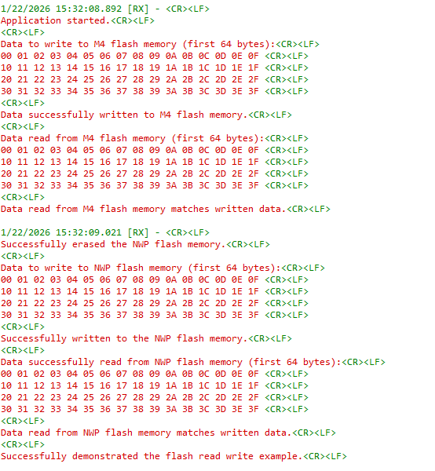

# Wi-Fi - Flash Read Write

## Table of Contents

- [Wi-Fi - Flash Read Write](#wi-fi---flash-read-write)
  - [Table of Contents](#table-of-contents)
  - [Purpose/Scope](#purposescope)
  - [Prerequisites/Setup Requirements](#prerequisitessetup-requirements)
    - [Hardware Requirements](#hardware-requirements)
    - [Software Requirements](#software-requirements)
    - [Setup Diagram](#setup-diagram)
  - [Getting Started](#getting-started)
  - [Application Build Environment](#application-build-environment)
  - [Configuration Parameters](#configuration-parameters)
  - [Test the Application](#test-the-application)
  
## Purpose/Scope

This application demonstrates the process of writing to and reading from SiWx91x flash.

## Prerequisites/Setup Requirements

### Hardware Requirements

- A Windows PC.
- **SoC Mode**:
  - Standalone
    - BRD4002A Wireless pro kit mainboard [SI-MB4002A]
    - Radio Boards 
  	  - BRD4338A [SiWx917-RB4338A]
      - BRD4339B [SiWx917-RB4339B]
  	  - BRD4340A [SiWx917-RB4340A]
  	  - BRD4343A [SiWx917-RB4343A]
  - Kits
  	- SiWx917 Pro Kit [Si917-PK6031A](https://www.silabs.com/development-tools/wireless/wi-fi/siwx917-pro-kit?tab=overview)
  	- SiWx917 Pro Kit [Si917-PK6032A]
    - SiWx917 AC1 Module Explorer Kit (BRD2708A)

### Software Requirements

- Simplicity Studio

### Setup Diagram

  

## Getting Started

Refer to the instructions [here](https://docs.silabs.com/wiseconnect/latest/wiseconnect-getting-started/) to:

- [Install Simplicity Studio](https://docs.silabs.com/wiseconnect/latest/wiseconnect-developers-guide-developing-for-silabs-hosts/#install-simplicity-studio)
- [Install WiSeConnect 3 extension](https://docs.silabs.com/wiseconnect/latest/wiseconnect-developers-guide-developing-for-silabs-hosts/#install-the-wi-se-connect-3-extension)
- [Connect your device to the computer](https://docs.silabs.com/wiseconnect/latest/wiseconnect-developers-guide-developing-for-silabs-hosts/#connect-si-wx91x-to-computer)
- [Upgrade your connectivity firmware ](https://docs.silabs.com/wiseconnect/latest/wiseconnect-developers-guide-developing-for-silabs-hosts/#update-si-wx91x-connectivity-firmware)
- [Create a Studio project ](https://docs.silabs.com/wiseconnect/latest/wiseconnect-developers-guide-developing-for-silabs-hosts/#create-a-project)

For details on the project folder structure, see the [WiSeConnect Examples](https://docs.silabs.com/wiseconnect/latest/wiseconnect-examples/#example-folder-structure) page.

## Application Build Environment

The application can be configured to suit your requirements and development environment.

The application uses the default configurations as provided in the **default_wifi_client_profile** in ``sl_net_default_values.h``. You can configure these parameters as needed.

## Configuration Parameters

In the application (`app.c`), you can configure the following parameters:

- **M4_FLASH_ADDRESS**: 
  - Represents the starting address in the common flash memory where the M4 region begins.
  - For the M4 region, the write address should start from 0x8000000.
  - It is used as the base address for writing data from the M4 core to the common flash memory.
- **NWP_FLASH_ADDRESS**:
  - Represents the starting address in the common flash memory where the NWP region begins.
  - For the NWP region, the write address should range from 0 to (20K-1).
  - It is used as the base address for writing data from the Network Processor (NWP) to the common flash memory.
- **LENGTH_OF_BUFFER**: Specifies the length of the buffer in bytes.
- **FLASH_SECTOR_ERASE_ENABLE**:
  - A flag used to enable or disable sector erase when writing data to flash.
  - When set to 1, it enables sector erase, allowing erasure of multiples of 4 KB of data.
  - When set to 0, it disables sector erase, allowing normal write operations onto flash without erasing sectors.

  >**Note**: Before performing a write operation, ensure that the flash memory is erased by setting `FLASH_SECTOR_ERASE_ENABLE` to `1`.

Modify these values in the `app.c` file as per the application requirements.

> **Note**: For recommended settings, see the [recommendations guide](https://docs.silabs.com/wiseconnect/latest/wiseconnect-developers-guide-prog-recommended-settings/).

## Test the Application

Refer to the instructions [here](https://docs.silabs.com/wiseconnect/latest/wiseconnect-getting-started/) to:

- Build the application.
- Flash, run, and debug the application.
- After successful execution of the application, the following output is displayed on the console.

  
