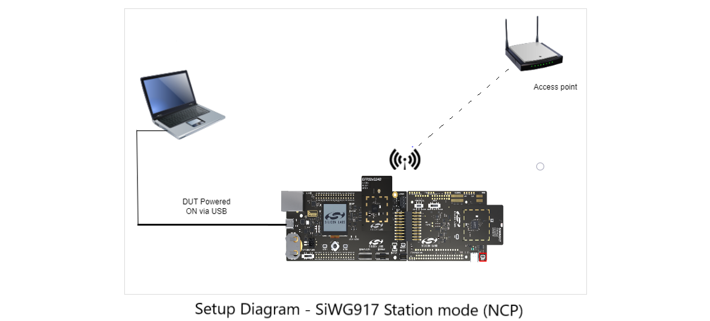

# Wireless Test

## Table of Contents

- [Purpose/Scope](#purposescope) 
- [Prerequisites/Setup Requirements](#prerequisitessetup-requirements)
  - [Hardware Requirements](#hardware-requirements)
  - [Software Requirements](#software-requirements)
  - [Setup Diagram](#setup-diagram)
- [Getting Started](#getting-started)
- [Application Build Environment](#application-build-environment)
- [Test the Application](#test-the-application)

## Purpose/Scope

The Wireless Test application is a Command-Line Interface (CLI) application designed to showcase various functionalities and capabilities of SiWx91x in different scenarios and configuration modes. It serves as a quick reference guide and a hands-on demonstration of SiWx91x core features for developers and users.

## Prerequisites/Setup Requirements

### Hardware Requirements

- A Windows PC.
- 802.11 ax/b/g/n access point - For Signaling mode or End-to-End mode testing.
- Spectrum Analyzer for TX RF measurement (PER-TX) - For Non -signaling mode testing. 
- Signal Generator for RX RF measurement (PER_RX) - For Non-signaling mode testing. 
- A Micro-coaxial connector plug to SMA-female cable (RF connector) for connecting the U.Fl port of the Si917 radio board to the Spectrum Analyzer or Signal Generator.
- **SoC Mode**:
  - Standalone
    - BRD4002A Wireless Pro Kit Mainboard [SI-MB4002A](https://www.silabs.com/development-tools/wireless/wireless-pro-kit-mainboard?tab=overview)
    - Radio Boards 
  	  - BRD4338A [SiWx917-RB4338A](https://www.silabs.com/development-tools/wireless/wi-fi/siwx917-rb4338a-wifi-6-bluetooth-le-soc-radio-board?tab=overview)
      - BRD4339B [SiWx917-RB4339B]
  	  - BRD4340A [SiWx917-RB4340A]
  	  - BRD4343A [SiWx917-RB4343A]
  - Kits
  	- SiWx917 Pro Kit [Si917-PK6031A](https://www.silabs.com/development-tools/wireless/wi-fi/siwx917-pro-kit?tab=overview)
  	
- **NCP Mode**:
  - Standalone
    - BRD4002A Wireless Pro Kit Mainboard [SI-MB4002A](https://www.silabs.com/development-tools/wireless/wireless-pro-kit-mainboard?tab=overview)
    - EFR32xG24 Wireless 2.4 GHz +10 dBm Radio Board [xG24-RB4186C](https://www.silabs.com/development-tools/wireless/xg24-rb4186c-efr32xg24-wireless-gecko-radio-board?tab=overview)
    - NCP Expansion Kit with NCP Radio Boards
      - [BRD4346A](https://www.silabs.com/development-tools/wireless/wi-fi/siwx917-rb4346a-wifi-6-bluetooth-le-soc-4mb-flash-radio-board?tab=overview) + [BRD8045C](https://www.silabs.com/development-tools/wireless/wi-fi/shield-adapter-board-for-co-processor-radio-boards?tab=overview)
      - [BRD4357A](https://www.silabs.com/development-tools/wireless/wi-fi/siw917y-rb4357a-wi-fi-6-bluetooth-le-4mb-flash-radio-board-for-rcp-and-ncp-modules?tab=overview) + [BRD8045C](https://www.silabs.com/development-tools/wireless/wi-fi/shield-adapter-board-for-co-processor-radio-boards?tab=overview)
  - Kits
  	- EFR32xG24 Pro Kit +10 dBm [xG24-PK6009A](https://www.silabs.com/development-tools/wireless/efr32xg24-pro-kit-10-dbm?tab=overview)  
  - Interface and Host MCU Supported
    - SPI - EFR32 
    - UART - EFR32

### Software Requirements

- Simplicity Studio IDE - [Simplicity Studio IDE](https://www.silabs.com/developer-tools/simplicity-studio)
- A Serial terminal software such as [Serial Debug Assistant](https://apps.microsoft.com/detail/9NBLGGH43HDM?rtc=1&hl=en-in&gl=in)

Note : The user can also use the Simplicity studio’s console window for sending and receiving the CLI command but it is recommended to use Serial Debug Assistant for ease of the command usage.


### Setup Diagram

#### SoC

- The following figure shows the setup and the connections for the WLAN RF testing.

  

- The following figure shows the setup and the connections for SiWG917 in Station mode.

  

- The following figure shows the setup and the connections for SiWG917 in BLE Advertising mode.

  

#### NCP

- The following figure shows the setup and the connections for the WLAN RF testing.

  

- The following figure shows the setup and the connections for SiWG917 (NCP) in Station mode.

  

- The following figure shows the setup and the connections for SiWG917 (NCP) in BLE Advertising mode.

  

## Getting Started

Refer to the instructions [here](https://docs.silabs.com/wiseconnect/latest/wiseconnect-getting-started/) to:

- [Install Simplicity Studio](https://docs.silabs.com/wiseconnect/latest/wiseconnect-developers-guide-developing-for-silabs-hosts/#install-simplicity-studio)
- [Install WiSeConnect 3 extension](https://docs.silabs.com/wiseconnect/latest/wiseconnect-developers-guide-developing-for-silabs-hosts/#install-the-wi-se-connect-3-extension)
- [Connect your device to the computer](https://docs.silabs.com/wiseconnect/latest/wiseconnect-developers-guide-developing-for-silabs-hosts/#connect-si-wx91x-to-computer)
- [Upgrade your connectivity firmware ](https://docs.silabs.com/wiseconnect/latest/wiseconnect-developers-guide-developing-for-silabs-hosts/#update-si-wx91x-connectivity-firmware)
- [Create a Studio project ](https://docs.silabs.com/wiseconnect/latest/wiseconnect-developers-guide-developing-for-silabs-hosts/#create-a-project)

For project folder structure details, see the [WiSeConnect Examples](https://docs.silabs.com/wiseconnect/latest/wiseconnect-examples/#example-folder-structure) page.


## Application Build Environment

The application can be configured to suit your requirements and development environment.

- The application uses the default configurations as provided in the **wifi_commands.c** and you can choose to configure these parameters as needed.
 
> **Note** :

> - The default SSID is `MY_AP_SSID` and passphrase is `MY_AP_PASSPHRASE` in **wifi_commands.c** file. You may either use these or modify them.

```c
    #define SOFT_AP_SSID         "MY_AP_SSID"
    #define SOFT_AP_PSK          "MY_AP_PASSPHRASE"   
```

> - The included cloud connectivity certificates are for reference only. If using default certificates in the release, the cloud connection will not work. You must replace the default certificates with valid certificates while connecting to the appropriate Cloud/OpenSSL Server.

## Test the Application

See the instructions [here](https://docs.silabs.com/wiseconnect/latest/wiseconnect-getting-started/) to:

- Build the application in Studio.
- Flash, run, and debug the application.


## **Common Commands**
1. set_region_configuration
2. wifi_radio_deinit
3. reset

## **set_region_configuration:**
Set a particular region.

**Syntax:**
```perl
set_region_configuration [-a operating_mode] <region>
```

|Parameter       |Description                                                                                |
|----------------|-------------------------------------------------------------------------------------------|
|*Operating_mode*        |Optional, (ap, apsta, ble_coex, client, client_ipv6, eap, transmit_test, ble) |
|*region*        |us → United states, eu → Europen Union, jp → Japan, world →  World wide domain, kr → Korean, sg → Singapore(not currently supported) |

### **wifi_radio_deinit:**
Deinitlize the Wi-Fi radio.

**Syntax:**
```perl
wifi_radio_deinit
```

### **reset:**
Reset the device.

**Syntax:**
```perl
reset
```

- Serial Debug Assistant has a provision of saving the commands  in the terminal which can be added via Extension cmd tab.


 **Here is a list of those commands:**

1. help
2. wifi_init
3. wifi_init -i client
4. wifi_init -i ap
5. wifi_init -i apsta
6. wifi_scan
7. wifi_scan -s **ssid** -i client_5g
8. wifi_scan -s **ssid** -i ap
9. wifi_scan -s **ssid** -i client
10. wifi_scan -s **ssid** -i ap_5g
11. wifi_connect  **ssid** -p **password** -s **security mode**
12. wifi_deinit
13. wifi_disconnect -i client
14. wifi_get_client_info
15. wifi_get_fw_version
16. wifi_get_mac_address -i 1
17. wifi_set_performance_profile high_performance
18. wifi_set_performance_profile power_save
19. wifi_set_performance_profile power_save_low_latency
20. wifi_set_performance_profile ultra_power_save
21. wifi_get_statistics
22. wifi_get_performance_profile
23. sl_net_dns_resolve_hostname **url** -t **time_in_milliseconds** -i **ipv4/ipv6**
24. wifi_iot_socket_create -i 1 -j 2 -k 2
25. wifi_iot_socket_connect -i 0 -j **server_ip** -k 4 -l **server_port**
26. wifi_iot_socket_bind -i 0 -j **local_ip** -k 4 -l **local_port**
27. wifi_iot_socket_receive_from -i 0
28. wifi_iot_socket_create -i 1 -j -k 1
29. wifi_iot_socket_listen -i 0 -j 1
30. wifi_iot_socket_accept -i 0
31. wifi_iot_socket_send -i 0 -d **data_to be sent**
32. start_dhcp
33. set_region_configuration -a **client** **jp**

    And so on...

### Below are examples of how to enter those commands in the Serial Debug Assistant.

- **help Command:** 
 
 
  ****

- After issuing the **help** command in the Serial Debug Assistant, the Assistang will display all the commands of the Wireless Test on the Serial Debug screen as shown in the image below.


  ****


## Wi-Fi CLI Examples:

1. [Transmit & Receive Test commands for Wi-Fi (WLAN RF test - Tx & Rx)](#below-are-the-commands-to-run-the-rf-test-example)
2. [Station mode and Power save mode example](#below-are-the-cli-commands-for-the-siwg917-for-station-mode-in-power-save)
3. [Access Point Mode](#below-are-the-cli-commands-for-the-siwg917-in-access-point-mode)
4. [Concurrent Mode - Access point+Station mode](#below-are-the-cli-commands-for-the-siwg917-in-concurrent-mode)
5. [Station ping](#below-are-the-cli-commands-for-connecting-to-the-access-point--router-and-pinging-the-gateway)
6. [Calibration - Gain offset correction](#steps--commands-to-run-the-gain-offset-correction)
7. [Calibration - Frequency offset correction](#commands-to-run-the-frequency-offset-correction)
8. [Gain Table Update](#gain-table-update)


### **Below are the commands to run the RF test example.**

- **Transmit Test Commands for Wi-Fi**


1. wifi_init -i **mode** for initializing the WiFi interface and for selecting the mode.

    e.g., wifi_init -i transmit_test

2. wifi_set_antenna -i client -a **antenna type** is used for selecting the antenna.

    e.g., wifi_set_antenna -i client -a 0
By default antenna type should be set to 0.

3. wifi_transmit_test_start **power** **data rate** **length** **mode** **channel**

    e.g., wifi_transmit_test_start 127 0 100 1 1.

- For Wi-Fi 6 or 802.11ax mode RF test, issue the following command. 
4. wifi_ax_transmit_test_start **power** **data rate** **length** **mode** **channel** **aggr.enable** **enable_11ax** **coding_type** **nominal_pe** **ul_dl** **he_ppdu_type** **beam_change** **bw** **stbc** **tx_bf** **gi_ltf** **dcm** **nsts_midamble** **spatial_reuse** **bss_color** **he_siga2_reserved** **ru_allocation** **n_heltf_tot** **sigb_dcm** **sigb_mcs** **user_sta_id** **user_idx** **sigb_compression_field**

    e.g., wifi_ax_transmit_test_start 127 263 1500 0 1 1 1 0 2 1 0 0 0 0 0 0 0 0 0 0 0 192 1 0 0 0 0 0

  **power**: Set transmit power in dbm. Valid values are from 2 dBm to 21 dBm.

  **data rate**: Set transmit data rate

The values for the data rates can be obtained from the **sl_wifi_constants.h** file available in the SDK. 

**length**: Configure length of the transmit packet. Valid values are in the range:

[24 ... 1500] bytes in burst mode

[24 ... 260] bytes in continuous mode

**mode**: Transmit mode

****

**Note**:

**Burst Mode**:
DUT transmits a burst of packets with the given power, rate, and length in the channel configured. The burst size will be 
determined by the **length** parameter. If the **length** parameter is zero, then DUT keeps transmitting till 
stop API is called.

**Continuous Mode**:
The DUT transmits an unmodulated waveform continuously. 

**Continuous Wave Mode (Non-Modulation) in DC Mode**:
The DUT transmits a spectrum only at the center frequency of the channel. A basic signal with no modulation is that of a sine 
wave and is usually referred to as a continuous wave (CW) signal. A basic signal source produces sine waves. Ideally, the 
sine wave is perfect. In the frequency domain, it is viewed as a single line at some specified frequency.

**Continuous Wave Mode (Non-Modulation) in Single Tone Mode (Center Frequency -2.5 MHz)**:
The DUT transmits a spectrum that is generated at -2.5 MHz from the center frequency of the channel selected. Some amount 
of carrier leakage will be seen at Center Frequency.
For example, for 2412 MHz, the output will be seen at 2409.5 MHz.

**Continuous Wave Mode (Non-Modulation) in Single Tone Mode (Center Frequency +5 MHz)**:
The DUT transmits a spectrum that is generated at 5 MHz from the center frequency of the channel selected. Some amount of 
carrier leakage will be seen at Center Frequency.
For example, for 2412 MHz, the output will be seen at 2417 MHz. 

>**Note**
>
>1. Before starting CW mode, it is required to start Continuous mode with power and channel values, which are intended to be used 
>in CW mode as follows:
>
>    a. Start Continuous mode with intended power value and channel value; pass any valid values for rate and length.
>
>    b. Stop Continuous mode.
>
>    c. Start CW mode.
>
>2. To switch CW mode, stop PER mode and then give CW mode.
>
>3. Generally, it is recommended to measure the TX power with “Burst mode” or “Continuous mode” only. "Continuous wave 
>mode" for TX power measurement is not recommended. "Continuous wave mode" can be used for certification purposes and 
>to measure the frequency error. 
>
>    **channel**: Set the Channel number.

- The Wi-Fi 6 parameter descriptions are mentioned in the [sl_si91x_protocol_types.h](https://docs.silabs.com/wiseconnect/latest/wiseconnect-api-reference-guide-si91x-driver/sl-si91x-request-tx-test-info-t) file of the SDK.
>
>5. **wifi_transmit_test_stop** is used for stopping the Transmit test.

**Note**: The current CLI supports input parameters up to 30 parameters. If you want to increase the input parameters, configure these in the settings of the CLI application --> Properties> GNU ARM C compiler -> preprocessor -->  SL_SI91X_CLI_CONSOLE_MAX_ARG_COUNT=30 as shown in the image below.

****

- Configure the following parameter in **wifi_commands.c** to enable AGGREGATION support: 

  .feature_bit_map = SL_SI91X_FEAT_AGGREGATION

**Additional sample commands for Wi-Fi 6 RF Test**

  |  **Test case**                   | **PPDU**  | **LTF Size**| **GI** | **DCM/nDCM** | **RU Tone** | **RU Number** | **User Index** | **Rate** | **Pkt Len** | **Command** |
  |--------------------------------- |-----------|-------------|--------|--------------|-------------|---------------|----------------|----------|-------------|----------------------------------------------------------------------------|
  | SU PPDU 4x HE-LTF + 3.2us nDCM   | SU PPDU   |   4x        |  3.2us |  nDCM        | 242Tone     |   RU1         |     0          | MCS0     |  1500   | wifi_ax_transmit_test_start 10 256 1500 0 1 1 0 2 1 0 0 0 0 0 3 0 0 0 0 0 192 1 0 0 0 0 0
  | SU PPDU 1x HE-LTF + 0.8us DCM    | SU PPDU   |   1x        |  0.8us |   DCM        | 242Tone     |   RU1         |     0          | MCS1     |  1500   | wifi_ax_transmit_test_start 10 257 1500 0 1 1 0 2 1 0 0 0 0 0 0 1 0 0 0 0 192 1 0 0 0 0 0
  | ERSU PPDU 4x HE-LTF + 3.2us nDCM | ERSU PPDU |   4x        |  3.2us |  nDCM        | 242Tone     |   RU1         |     0          | MCS0     |  1500   | wifi_ax_transmit_test_start 10 256 1500 0 1 1 0 2 1 1 0 0 0 0 3 0 0 0 0 0 192 1 0 0 0 0 0
  | ERSU PPDU 4x HE-LTF + 0.8us nDCM | ERSU PPDU |   4x        |  0.8us |  nDCM        | 242Tone     |   RU1         |     0          | MCS2     |  1500   | wifi_ax_transmit_test_start 10 258 1500 0 1 1 0 2 1 1 0 0 1 0 1 1 0 0 0 0 192 1 0 0 0 0 0
  | TB PPDU 4x HE-LTF + 3.2us nDCM   | TB PPDUDU |   4x        |  3.2us |  nDCM        | 106Tone     |   RU1         |     0          | MCS7     |  1500   | wifi_ax_transmit_test_start 10 263 1500 0 1 1 0 2 1 2 0 0 0 0 2 0 0 0 0 0 53 1 0 0 0 0 0
  | TB PPDU 2x HE-LTF + 1.6us nDCM   | TB PPDUDU |   2x        |  1.6us |  nDCM        | 26Tone      |   RU8         |     7          | MCS6     |  1500   | wifi_ax_transmit_test_start 10 262 1500 0 1 1 0 2 1 2 0 0 0 0 1 0 0 0 0 0 7 1 0 0 0 7 0
  | TB PPDU 2x HE-LTF + 1.6us nDCM   | TB PPDUDU |   2x        |  1.6us |  nDCM        | 26Tone      |   RU9         |     8          | MCS6     |  1500   | wifi_ax_transmit_test_start 10 262 1500 0 1 1 0 2 1 2 0 0 0 0 1 0 0 0 0 0 8 1 0 0 0 8 0

**Receive test commands**

**NOTE**:
    Run receive stats testing in a controlled environment (RF shield box or chamber).
****
****

**Receive Test Commands for the CLI**:

1. wifi_init -i **mode** for initializing the Wi-Fi interface and for selecting the mode.

    e.g., wifi_init -i transmit_test

2. wifi_set_antenna -i client -a **antenna type** is used for selecting the antenna.

    e.g., wifi_set_antenna -i client -a 0
By default antenna type should be set to 0.

3. wifi_start_statistic_report -i client -c **channel** -n **stats_count** is used to receive the packet statistics once per second in that selected channel.

    e.g., wifi_start_statistic_report -i client -c 1 -n 30
  
   To observe the receive stats for 'n' iterations (e.g. 20), the command can be given as follows:   
    e.g., wifi_start_statistic_report -i client -c 1 -n 20


### **Below are the CLI commands for the SiWG917 for station mode in Power save:**

- Below are the commands for station mode:
****

- Below are the commands for the SiWG917 in power save mode:
****
**Note:** In the CLI power save mode, only TA will be in power save mode. 

1. wifi_init -i **mode** for initializing the Wi-Fi interface and for selecting the mode.

   e.g., wifi_init -i client

2. wifi_scan -s **SSID** or wifi_scan for scanning an access point with the SSID mentioned in the command.
Or
scan all the access points available in the vicinity respectively.  

   e.g., wifi_scan -s **SILABS** or wifi_scan


   
3. wifi_connect **SSID** -p **PASSWORD** for connecting/joining to the configured access point.

   e.g., wifi_connect SILABS -p 12345678

4. start_dhcp [-i {ipv4|ipv6|ipv6_global|ipv6_link_local
|ipv6_site_local}] [-m  {dhcp|static}] for DHCP - getting the IP address of the SiWG917

   e.g., start_dhcp -i ipv4 -m dhcp

5. wifi_set_performance_profile { high_performance | power_save | power_save_low_latency| standby_power_save |standby_power_save_with_ram_retention }

   e.g., wifi_set_performance_profile power_save

**high_performance** - Power save is disabled, 
and throughput is maximum.

**power_save** - Power save mode when SiWG917 is associated 
with an access point. It is associated power save.

**standby_power_save** - The SiWG917 is not associated with an access point. RAM is not retained in this mode.

**standby_power_save_with_ram_retention** - The SiWG917 is not associated with an access point. RAM is retained in this mode.

**power_save_low_latency** - Power save mode when the SiWG917 is associated with an access point with higher 
throughput than ASSOCIATED_POWER_SAVE. This is not supported 
for BT/BLE.


### **Below are the CLI commands for the SiWG917 in Access Point mode:**

- Below are the commands for the SiWG917 in Access Point mode:
****

1. wifi_init -i **mode** for initializing the Wi-Fi interface and for selecting the mode.

   e.g., wifi_init -i ap

2. wifi_start_ap -a **SSID** -b **Security type** -c **encryption type** -d **channel number** -l **maximum clients** -n **beacon interval**
  
    e.g., wifi_start_ap -a SILABS_AP -b wpa2 -c ccmp -d 9 -l 4 -n 100

3. wifi_get_client_info for getting the Mac address and IP address of the clients that is connected to the access point (SiG917).
  
    e.g., wifi_get_client_info

**Note:- The password can be configured in the wifi_command.c file**

**"#define SOFT_AP_PSK          "123456789"**

**The wifi_start_ap command parameters are described in wifi_command.c file and console_command_database.c file.**


### **Below are the CLI commands for the SiWG917 in Concurrent mode:**

****


1. wifi_init -i **mode** for initializing the Wi-Fi interface and for selecting the mode.

   e.g., wifi_init -i apsta

2. wifi_start_ap -a **SSID** -b **Security type** -c **encryption type** -d **channel number** -l **maximum clients** -n **beacon interval**
  
    e.g., wifi_start_ap -a SILABS_AP -b wpa2 -c ccmp -d 9 -l 4 -n 100

3. wifi_scan -s **SSID** or wifi_scan for scanning an access point with the SSID mentioned in the command.
Or
scan all the access points available in the vicinity respectively.  

   e.g., wifi_scan -s **SILABS** or wifi_scan

4. wifi_connect **SSID** -p **PASSWORD** for connecting/joining to the configured access point.

   e.g., wifi_connect SILABS -p 12345678

5. start_dhcp [-i {ipv4|ipv6|ipv6_global|ipv6_link_local
|ipv6_site_local}] [-m  {dhcp|static}] for DHCP - getting the IP address of the SiWG917

   e.g., start_dhcp -i ipv4 -m dhcp  

**Note: Ensure that the channel number of the access point and the station mode are the same.** 


### **Below are the CLI commands for connecting to the access point / router and pinging the gateway.**

****

1. net_init client
2. wifi_scan
3. wifi_connect SILABS_AP -p 12345678  
4. start_dhcp
5. sl_net_ping 8.8.8.8 ipv4 64   or sl_net_ping 192.168.1.1 ipv4 64


### **Below are the CLI commands used to connect to an access point/router and configure a static IP address**

****

1. wifi_init -i client
2. wifi_scan
3. wifi_connect SILABS_AP -p 12345678  
4. start_dhcp -i ipv4 -m static -a 192.168.31.108 -g 192.168.31.1 -n 255.255.255.0 

## Steps to create a CLI command based on the application available in the release. 

**For example, if the user wants to create a CLI command for Station ping example:**

  Refer to the flow of the station ping example available in the release/SDK. 

  a. Initilization

  b. scan for the configured access point

  c. connect to the configured access point

  d. ping to the gateway address. 

### **Below are the CLI commands for calibration.**

**Calibration write**
 
 si91x_calibration_write **flags** **gain_offset_low** **gain_offset_mid** **gain_offset_high** -c **xo_ctune** -t **target**

### Steps/commands to run the Gain offset correction
1. Initialize --->  wifi_init -i transmit_test
2. Antenna command ---> wifi_set_antenna -i client -a 0
3. Transmit test command ---> wifi_transmit_test_start 18 0 100 0 1
4. Si91x_calibration_write command ---> si91x_calibration_write 16 10 0 0 -c 0 -t 1
5. Reset the board
6. Issue the initialization command again ---> wifi_init -i transmit_test
7. Antenna command ---> wifi_set_antenna -i client -a 0
8. Transmit test command ---> wifi_transmit_test_start 18 0 100 0 1


 ## **Frequency Offset**

### **Commands to run the Frequency offset correction**

 si91x_frequency_offset **frequency_offset_in_khz**


1. wifi_init -i transmit_test
2. wifi_set_antenna -i client -a 0
3. wifi_transmit_test_start 20 0 100 0 6
4. si91x_frequency_offset 70
5. si91x_calibration_write 2 0 0 0 -t 1

**Note**: -t parameter is the target for efuse or flash, 0 represents burn into efuse, and 1 represents burn into flash. 

 **Steps/commands to run the calibration example**

 1. Initialize
 2. Antenna command
 3. Transmit test command
 4. Si91x_calibration_write command
 5. Reset the board
 6. Issue the initialisation command again
 7. Antenna command
 8. Transmit test command 

The change in the Transmit power will be observed on the display of the spectrum analyzer. 

Refer to the [calibration application note](https://www.silabs.com/documents/public/application-notes/an1436-siwx917-qms-crystal-calibration-application-note.pdf) for more information.


**Here are the few examples for the si91x_calibration_write in channel 1, 6, and 11.** 

**For channel 1**

si91x_calibration_write 16 -4 0 0 -c 0 -t 1

The above command will increase the Transmit power to 2 dBm in channel 1. The second parameter (gain offset low) is configured to increase or decrease the Transmit power in the particular channel. The minus sign in the second parameter will increase the Transmit power configured in the command.

**For channel 6**

si91x_calibration_write 32 4 0 0 -c 0 -t 1

The above command will decrease the Transmit power to 2 dBm in channel 6.  

**For channel 11**

si91x_calibration_write 64 0 0 -2 -c 0 -t 1

The above command will increase the Transmit power to 1 dBm in channel 11.


## **Gain Table Update**
Update user gain table

**Syntax:**
```perl
wifi_update_gain_table <band> <bandwidth>
```

|Parameter       |Description                                                                                |
|----------------|-------------------------------------------------------------------------------------------|
|*band*          |Wi-Fi radio band (1 - 2.4 GHz)                                                             |
|*bandwidth*     |Channel bandwidth (0 - 20 MHz)                                                             |

**Example:**
```perl
wifi_update_gain_table 1 0
```

### **Steps to update user gain table**

1. Initialize --->  wifi_init -i transmit_test
2. Antenna command ---> wifi_set_antenna -i client -a 0
3. Update gain table command ---> wifi_update_gain_table 1 0
4. Transmit test command ---> wifi_transmit_test_start 18 0 100 0 1

**Note:** To update the gain table, configure the gain_table_payload[] of sl_wifi_update_gain_table_command_handler in wifi_command.c file.

**Note:** For changing the UART instance of the wireless_test example, see the VCOM section of the [Software Reference Manual](https://github.com/SiliconLabs/wiseconnect/blob/v3.3.1/docs/software-reference/manuals/siwx91x-software-reference-manual.md).
The changes needs to be configured in rsi_debug.c file and RTE_Device_917.h file. 


# **CLI Commands for BLE**
1. TEST Modes
2. USER Gain Table
3. Advertising Commands

# **TEST MODES:**
Used for the verification of BLE-RF performance.
1. ble_per_transmit
2. ble_per_receive
3. bt_per_stats
4. ble_tx_test_mode
5. ble_rx_test_mode
6. ble_end_test_mode


### **ble_per_transmit**
Enable/disable BLE PER (transmit test) mode transmission

**Syntax:**
```perl
ble_per_transmit <enable> <pkt_len> <phy_rate> <channel> <tx_power> <transmit_mode> [-a <ant_sel>] [-d <inter_pkt_gap>] [-c <rf_chain>] [-n <num_pkts>] [-p <payload_type>] [-s scrambler_seed]
```

|Parameter       |Description                                                                                |
|----------------|-------------------------------------------------------------------------------------------|
|*enable*        |Enable/disable BLE per TX, 1 → PER Transmit Enable, 0 → PER Transmit Disable.              |
|*pkt_len*       |Length of the packet to be transmitted.                                                    |
|*phy_rate*      |1 → 1Mbps, 2 → 2 Mbps, 4 → 125 Kbps Coded, 8 → 500 Kbps Coded.                             |
|*channel*       |BLE channel                                                                                |
|*tx_power*      |Power index                                                                                |
|*transmit_mode* |0 → Burst, 1 → Continuous stream, 2 → Continuous Wave (CW)                                 |
|*ant_sel*       |Optional, 2 → ONBOARD_ANT_SEL, 3 → EXT_ANT_SEL (Default)                                   |
|*inter_pkt_gap* |Optional. Number of 1250 us slots to be skipped between two packets (Default 0)            |                               |
|*rf_chain*      |Optional. RF Chain (HP/LP) to be used: 2 → BT_HP_CHAIN (Default), 3 → BT_LP_CHAIN.         |
|*num_pkts*      |Optional. Number of packets to be transmitted. Use 0 (Default) for continuous transmission |
|*scrambler_seed*|Optional. Initial seed to be used for whitening. Use 5 for the continuous mode|
|payload_type    | Optional. Type of payload data sequence. Refer to the "https://docs.silabs.com/wiseconnect/latest/wiseconnect-api-reference-guide-ble/rsi-ble-per-transmit-s#payload-type" |

**Example:**
>```perl
>ble_per_transmit 1 32 1 10 79 1
>```

### **ble_per_receive**

Enable/disable BLE  PER mode reception

**Syntax:**
```perl
ble_per_receive <enable> <phy_rate> <channel> [-a <ant_sel>] [-c <rf_chain>]
```

|Parameter       |Description                                                                                |
|----------------|-------------------------------------------------------------------------------------------|
|*enable*        |Enable/disable BLE per RX, 1 → PER Receive Enable, 0 → PER Receive Disable.              |
|*phy_rate*      |1 → 1 Mbps, 2 → 2 Mbps, 4 → 125 Kbps Coded, 8 → 500 Kbps Coded.                             |
|*channel*       |BLE channel                                                                                |
|*ant_sel*       |Optional, 2 → ONBOARD_ANT_SEL, 3 → EXT_ANT_SEL (Default)                                   |
|*rf_chain*      |Optional, RF Chain (HP/LP) to be used: 2 → BT_HP_CHAIN (Default), 3 → BT_LP_CHAIN.         |
>```perl
>ble_per_receive 1 1 10
>```

### **bt_per_stats**
Read BLE transmit & receive statistics

**Syntax:**
```perl
bt_per_stats [-t <time_duration>]
```
|Parameter       |Description                                                                                |
|----------------|-------------------------------------------------------------------------------------------|
|*time_duration*        |Time duration in seconds             |

**Response Structure:**
```perl
  // Packet count of CRC fails (Cyclic Redundancy Check (CRC)) 
  uint16_t crc_fail_cnt;

  // Packet count of CRC fails (Cyclic Redundancy Check (CRC)) 
  uint16_t crc_pass_cnt;

  // Packet count of aborted Tx 
  uint16_t tx_abort_cnt;

  // Packet count of dropped Rx
  uint16_t rx_drop_cnt;

  // Packet count of CCA Idle (Clear Channel Assessment (CCA))
  uint16_t rx_cca_idle_cnt;

  // Packet count of Rx start 
  uint16_t rx_start_idle_cnt;
  
  // Packet count of aborted Rx 
  uint16_t rx_abrt_cnt;
  
  // Packet count of successful transmissions 
  uint16_t tx_dones;
  
  // Received Signal Strength Indicator of the packet 
  int8_t rssi;
  
  // Packet count of ID packets received 
  uint16_t id_pkts_rcvd;
  
  // Dummy array of length 5
  uint16_t dummy[5];
```
**Note:** The "tx_dones" parameter will return 0 in continuous mode.

**Example:**
```perl
bt_per_stats
```

### **ble_tx_test_mode**

Start the TX test mode in controller

**Syntax:**
```perl
ble_tx_test_mode <TX_channel> <TX_PHY> [-a <payload_length>] [-b <payload_type>]
```

|Parameter       |Description                                                                                |
|----------------|-------------------------------------------------------------------------------------------|
|*TX_channel*        |BLE channel  |
|*TX_PHY*      |1 → 1Mbps, 2 → 2 Mbps, 4 → 125 Kbps Coded, 8 → 500 Kbps Coded                       |
|*payload_length*        |Length in bytes of payload data for each packet ( 1 - 251 bytes)  |
|*payload_type*      | Applicable payload types are specified below |

**Note:** Applicable payload types
- 0x00 →  PRBS9 sequence '11111111100000111101...' 
- 0x01 →  Repeated '11110000' 
- 0x02 →  Repeated '10101010' 
- 0x03 →  PRBS15 
- 0x04 →  Repeated '11111111' 
- 0x05 →  Repeated '00000000' 
- 0x06 →  Repeated '00001111' 
- 0x07 →  Repeated '01010101' 

**Example:**
>```perl
>ble_tx_test_mode 1 1 -p 100 -t 0
>```

### **ble_rx_test_mode**

Start the RX test mode in controller

**Syntax:**
```perl
ble_rx_test_mode <RX_channel> <RX_PHY> 
```

|Parameter       |Description                                                                                |
|----------------|-------------------------------------------------------------------------------------------|
|*RX_channel*        |BLE channel  |
|*RX_PHY*      |1 → 1Mbps, 2 → 2 Mbps, 4 → 125 Kbps Coded, 8 → 500 Kbps Coded                       |

**Example:**
>```perl
>ble_rx_test_mode 1 1
>```

### **ble_end_test_mode**

End the RX test mode in controller

**Syntax:**
```perl
ble_end_test_mode
```

**Example:**
>```perl
>ble_end_test_mode
>```

## **USER Gain Table:**
Used to configure the maxmium power with respect to region.
1. ble_user_gain_max_power
2. ble_user_gain_max_power_offset
3. ble_user_gain_lp_chain_0dBm_offset
4. ble_user_gain_table_lp_chain_8dBm_offset

### **ble_user_gain_max_power**

Set the Max power of the user gain table

**Syntax:**
```perl
ble_user_gain_max_power <certification_region> <max_power>
```

|Parameter       |Description                                                                                |
|----------------|-------------------------------------------------------------------------------------------|
|*certification_region*        |FCC → United states, ETSI → Europen Union, TELEC → Japan, WORLD_WIDE →  World wide domain, KCC → Korean|
|*max_power*      |Maximum  power configuration for the specified region                       |

**Example:**
>```perl
>ble_user_gain_max_power FCC 10 ETSI 5 TELEC 14 WORLD_WIDE 20 KCC 12
>```

### **ble_user_gain_max_power_offset**

Set the Max power offsets of the user gain table

**Syntax:**
```perl
ble_user_gain_max_power_offset
```
**Example:**
>```perl
>ble_user_gain_max_power_offset
>```


### **ble_user_gain_lp_chain_0dBm_offset**

Set the Max power offsets of the user gain table for 0 dBm in LP chain

**Syntax:**
```perl
ble_user_gain_lp_chain_0dBm_offset
```
**Example:**
>```perl
>ble_user_gain_lp_chain_0dBm_offset
>```

### **ble_user_gain_table_lp_chain_8dBm_offset**

Set the Max power offsets of the user gain table for 8 dBm in LP chain

**Syntax:**
```perl
ble_user_gain_table_lp_chain_8dBm_offset
```
**Example:**
>```perl
>ble_user_gain_table_lp_chain_8dBm_offset
>```


## **Commands**
Used to configure the SiWx917 device as a Peripheral device.
1. bt_set_local_name
2. bt_get_local_device_address
3. bt_get_local_name
4. ble_set_advertise_data
5. ble_start_advertising
6. ble_stop_advertising

### **bt_set_local_name**

Set local name "SL_CLI_DEMO" to the device

**Syntax:**
```perl
bt_set_local_name
```
**Example:**
>```perl
>bt_set_local_name
>```

### **bt_get_local_device_address**

Get the local device address

**Syntax:**
```perl
bt_get_local_device_address
```
**Example:**
>```perl
>bt_get_local_device_address
>```

### **bt_get_local_name**

Set the Advertise data

**Syntax:**
```perl
bt_get_local_name
```
**Example:**
>```perl
>bt_get_local_name
>```

### **ble_set_advertise_data**

Get the local device name

**Syntax:**
```perl
ble_set_advertise_data
```
**Example:**
>```perl
>ble_set_advertise_data
>```

### **ble_start_advertising**

Start the device advertising

**Syntax:**
```perl
ble_start_advertising
```
**Example:**
>```perl
>ble_start_advertising
>```

### **ble_stop_advertising**

Stop the device advertising

**Syntax:**
```perl
ble_stop_advertising
```
**Example:**
>```perl
>ble_stop_advertising
>```


# Examples

## BLE PER TX

1. Init BLE mode
>```perl
>wifi_init -i ble
>```

2. Set the region
>```perl
>set_region_configuration -a client world
>```

3. Enable PER mode continuous stream TX with 1 Mbps PHY at channel 10 and maximum power setting specified by the Gain Table:
>```perl
>ble_per_transmit 1 32 1 10 79 1
>```
>
****

## BLE PER RX

1. Init BLE mode
>```perl
>wifi_init -i ble
>```

2. Set the region
>```perl
>set_region_configuration -a client world
>```

3. Enable PER RX mode with 1 Mbps PHY at channel 10
>```perl
>ble_per_receive 1 1 10
>```

4. Read PER statistics
>```perl
>bt_per_stats
>```
****

## BLE User Gain Table

1. Init BLE mode
>```perl
>wifi_init -i ble
>```

2. Set the region
>```perl
>set_region_configuration -a client world
>```

3. Disable the Wi-Fi radio
>```perl
>wifi_radio_deinit
>```

4. Max power setting specified by the Gain Table
>```perl
>ble_user_gain_max_power FCC 9 ETSI 19 TELEC 19 WORLD_WIDE 13 KCC 9
>ble_user_gain_max_power_offset
>ble_user_gain_lp_chain_0dBm_offset
>ble_user_gain_table_lp_chain_8dBm_offset
>```

5. Enable PER mode continuous stream TX with 1 Mbps PHY at channel 10
>```perl
>ble_per_transmit 1 32 1 10 79 1
>```
****

## BLE DTM TX

1. Init BLE mode
>```perl
>wifi_init -i ble
>```

2. Set the region
>```perl
>set_region_configuration -a client world
>```

3. Enable the DTM TX
>```perl
>ble_tx_test_mode 1 1 -p 32 -t 1 
>```
****

## BLE DTM RX

1. Init BLE mode
>```perl
>wifi_init -i ble
>```

2. Set the region
>```perl
>set_region_configuration -a client world
>```

3. Enable the DTM RX
>```perl
>ble_rx_test_mode 1 1 
>```

4. End the DTM RX Test
>```perl
>ble_end_test_mode 
>```

****

## BLE device advertising
1. Init BLE mode
>```perl
>wifi_init -i ble
>```

2. Get device BD address
>```perl
>bt_get_local_device_address 
>```

3. Set the local name of the device
>```perl
>bt_set_local_name
>```

4. Get the local name of the device
>```perl
>bt_get_local_name
>```

5. Set the Advertise data
>```perl
>ble_set_advertise_data
>```

6. Start advertising
>```perl
>ble_start_advertising
>```
****


## Steps to add new commands for wireless_test application

1. First add the ‘key-value’ pair in the *console_command_database* structure in **console_commands/src/console_command_database.c** file as shown below:

   - The ‘key’ is the name of new command to be created, and the value is the structure variable for the command.
     ****
	
Here the new command is: *wireless_test_new_cmd*
The structure variable for the newly created command is *_wireless_test_new_cmd_command*.

2. The *_wireless_test_new_cmd_command* structure variable should be declared in the **console_commands/src/console_command_database.c** file with the following fields:

    ****

**The description of the new command:**

- The description of the new command is a string which explains briefly about the command.

**The command handler for the new command:**

- In the above figure, *wireless_test_new_cmd_command_handler* is the command handler which needs to be defined.
- For any new command, we have to declare a function in **console_commands/src/console_command_database.c** file with a specific proptotype as shown below.
*extern sl_status_t wireless_test_new_cmd_command_handler( console_args_t* arguments );*

- The function name can be anything, but the return type and argument must be as aforesaid mentioned.

**The string array for argument description of the command handler:**

- In the above figure, *_wireless_test_new_cmd_arg_help* is the string array which needs to be defined.
- We need to define a string array in **console_commands/src/console_command_database.c** file which briefly explains about the arguments in the command handler. Following is the declaration.

  ****

We have given the description for all three strings as 0.

**The list of data types of arguments of command handler:-**

- Referring to the *_wireless_test_new_cmd_command* structure variable image, { CONSOLE_OPTIONAL_ARG('s', CONSOLE_ARG_STRING ), CONSOLE_ARG_UINT, CONSOLE_ARG_INT, CONSOLE_ARG_END } }  are the list of datatypes corresponding to the list of arguments.
- The data types CONSOLE_ARG_UINT corresponds to ‘uint’ , CONSOLE_ARG_INT corresponds to ‘int’, and CONSOLE_ARG_STRING corresponds to ‘string’. The list of arguments must end with CONSOLE_ARG_END.
- The arguments can be mandatory or optional. The mandatory arguments are given directly, but optional arguments are given using an expression, CONSOLE_OPTIONAL_ARG (‘character’, datatype). The ‘character’ is an alphabet which is the user's choice and can be used to give an optional argument in a cli command. The datatype can be anything mentioned above.
- In addition to standard data type arguments like uint, int, and string, there can be enums which can also be passed as arguments to a command. The arguments we need to pass in a command depend on what APIs we call in a command handler.  
- For some of the Wi-Fi APIs, we call inside a command handler. We may need to use the argument values as specified in the *console_argument_values* variable defined in **console_commands/src/console_argument_types.c** file. For passing those values in a CLI command, we need to look for the corresponding argument types defined in the same file.
For example, we may want to pass a data rate as *SL_WIFI_RATE_11B_1* enum value in a CLI command. The corresponding uint32 array is mapped to *[CONSOLE_TYPE(data_rate)]*. We need to search for *data_rate_type* string array in the same file as shown below. 
The string corresponding to *SL_WIFI_RATE_11B_1* is "1Mbps". So *1Mbps* should be passed as an argument in the CLI command.
In the command handler, the arguments passed in the cli command are internally mapped to corresponding enum values and can be accessed directly using GET_COMMAND_ARG() or GET_OPTIONAL_COMMAND_ARG().


  ****


  ****


  ****


- Following are the overall changes we need to make in  **console_commands/src/console_command_database.c** file:


  ****
  
  
- So, the CLI command that can be used with the prescribed changes is *wireless_test_new_cmd -s Optional_String 1 2*.

3. The command handler should be defined in a relevant file as shown below. Following arguments can be accessed directly or by using GET_COMMAND_ARG() or GET_OPTIONAL_COMMAND_ARG(). 


****
