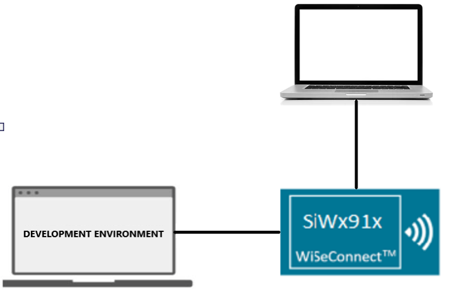

# Wi-Fi - Access Point

## Table of Contents

- [Wi-Fi - Access Point](#wi-fi---access-point)
  - [Table of Contents](#table-of-contents)
  - [Purpose/Scope](#purposescope)
  - [Prerequisites/Setup Requirements](#prerequisitessetup-requirements)
    - [Hardware Requirements](#hardware-requirements)
    - [Software Requirements](#software-requirements)
    - [Setup Diagram](#setup-diagram)
  - [Getting Started](#getting-started)
  - [Application Build Environment](#application-build-environment)
  - [Test the Application](#test-the-application)
  
## Purpose/Scope

This application demonstrates how to configure the SiWx91x as a soft access point and allow stations to connect to it.

## Prerequisites/Setup Requirements

### Hardware Requirements

- Windows PC

- **SoC Mode**:
  - Standalone
    - BRD4002A Wireless Pro Kit Mainboard [SI-MB4002A]
    - Radio Boards 
  	  - BRD4338A [SiWx917-RB4338A]
  	  - BRD4343A [SiWx917-RB4343A]
  - Kits
  	- SiWx917 Pro Kit [Si917-PK6031A](https://www.silabs.com/development-tools/wireless/wi-fi/siwx917-pro-kit?tab=overview)
  	- SiWx917 Pro Kit [Si917-PK6032A]
    - SiWx917 AC1 Module Explorer Kit (BRD2708A)
  	
- **NCP Mode**:
  - Standalone
    - BRD4002A Wireless Wireless Pro Kit Mainboard [SI-MB4002A]
    - EFR32xG24 Wireless 2.4 GHz +10 dBm Radio Board [xG24-RB4186C](https://www.silabs.com/development-tools/wireless/xg24-rb4186c-efr32xg24-wireless-gecko-radio-board?tab=overview)
 
  - Kits
  	- EFR32xG24 Pro Kit +10 dBm [xG24-PK6009A](https://www.silabs.com/development-tools/wireless/efr32xg24-pro-kit-10-dbm?tab=overview)
  - NCP Expansion Kit with NCP Radio Boards
      - (BRD4346A + BRD8045A) [SiWx917-EB4346A]
      - (BRD4357A + BRD8045A) [SiWx917-EB4357A] 

  - Interface and Host MCU Supported
    - SPI - EFR32 
    - UART - EFR32

### Software Requirements

- Simplicity Studio
-  Serial Terminal - [Docklight](https://docklight.de/)/[Tera Term](https://ttssh2.osdn.jp/index.html.en)

### Setup Diagram

  

## Getting Started

Refer to the instructions [here](https://docs.silabs.com/wiseconnect/latest/wiseconnect-getting-started/) to:

- [Install Simplicity Studio](https://docs.silabs.com/wiseconnect/latest/wiseconnect-developers-guide-developing-for-silabs-hosts/#install-simplicity-studio)
- [Install WiSeConnect 3 extension](https://docs.silabs.com/wiseconnect/latest/wiseconnect-developers-guide-developing-for-silabs-hosts/#install-the-wi-se-connect-3-extension)
- [Connect your device to the computer](https://docs.silabs.com/wiseconnect/latest/wiseconnect-developers-guide-developing-for-silabs-hosts/#connect-si-wx91x-to-computer)
- [Upgrade your connectivity firmware ](https://docs.silabs.com/wiseconnect/latest/wiseconnect-developers-guide-developing-for-silabs-hosts/#update-si-wx91x-connectivity-firmware)
- [Create a Studio project ](https://docs.silabs.com/wiseconnect/latest/wiseconnect-developers-guide-developing-for-silabs-hosts/#create-a-project)

For details on the project folder structure, see the [WiSeConnect Examples](https://docs.silabs.com/wiseconnect/latest/wiseconnect-examples/#example-folder-structure) page.

## Application Build Environment

- The application uses the default configurations as provided in the **default_wifi_ap_profile** in ``sl_net_default_values.h``. Users can choose to configure these parameters as needed.

- In the Project Explorer pane, expand the **config** folder and open the ``sl_net_default_values.h`` file. Configure the following parameters as you desire to enable the Silicon Labs Wi-Fi device as an access point.

- AP instance related parameters :

  - `DEFAULT_WIFI_AP_PROFILE_SSID` refers to the SSID of the WiSeConnect soft AP that will be created.
 
    ```c
    #define DEFAULT_WIFI_AP_PROFILE_SSID                   "MY_AP_SSID"     
    ```

  - `DEFAULT_WIFI_AP_CREDENTIAL` refers to the secret key of the WiSeConnect soft AP that will be created.

    ```c
    #define DEFAULT_WIFI_AP_CREDENTIAL                      "MY_AP_PASSPHRASE"
    ```

- Other AP instance configurations can be modified if required in `default_wifi_ap_profile` configuration structure.

> **Note**: For recommended settings, see the [recommendations guide](https://docs.silabs.com/wiseconnect/latest/wiseconnect-developers-guide-prog-recommended-settings/).

## Test the Application

Refer to the instructions [here](https://docs.silabs.com/wiseconnect/latest/wiseconnect-getting-started/) to:

- Build the application.
- Flash, run, and debug the application.
- After the application gets executed successfully, the MAC addresses of the remote clients that get connected or disconnected to the newly created access point are printed on the console.

  
