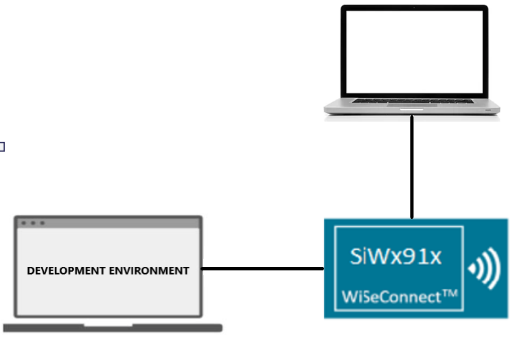

# Wi-Fi - Access Point

## High-Level Overview

SiWx91x soft access point example: Configure the device as a Wi-Fi AP with WPA2 security, allow stations to connect, and display client connect/disconnect events in the console in SoC and NCP modes.

## Table of Contents

- [Wi-Fi - Access Point](#wi-fi---access-point)
  - [High-Level Overview](#high-level-overview)
  - [Table of Contents](#table-of-contents)
  - [Purpose/Scope](#purposescope)
  - [Prerequisites/Setup Requirements](#prerequisitessetup-requirements)
    - [Hardware Requirements](#hardware-requirements)
    - [Software Requirements](#software-requirements)
    - [Setup Diagram](#setup-diagram)
  - [Getting Started](#getting-started)
  - [Application Build Environment](#application-build-environment)
  - [Test the Application](#test-the-application)
  - [Troubleshooting](#troubleshooting)
  - [Resources](#resources)
  - [Report Bugs and Get Support](#report-bugs-and-get-support)
  
## Purpose/Scope

This application demonstrates how to configure the SiWx91x as a soft access point and allow stations to connect to it.

## Prerequisites/Setup Requirements

### Hardware Requirements

- Windows PC

- **SoC Mode**:
  - Standalone
    - BRD4002A Wireless Pro Kit Mainboard [SI-MB4002A](https://www.silabs.com/development-tools/wireless/wireless-pro-kit-mainboard?tab=overview)
    - Radio Boards 
  	  - BRD4338A [SiWx917-RB4338A](https://www.silabs.com/development-tools/wireless/wi-fi/siwx917-rb4338a-wifi-6-bluetooth-le-soc-radio-board?tab=overview)
  	  - BRD4342A [SiWx917-RB4342A](https://www.silabs.com/development-tools/wireless/wi-fi/siwx91x-rb4342a-wifi-6-bluetooth-le-soc-radio-board?tab=overview)
  	  - BRD4339B [SiWx917-RB4339B](https://docs.silabs.com/wiseconnect/latest/wiseconnect-getting-started/getting-started-with-at)
  	  - BRD4340A [SiWx917-RB4340A](https://docs.silabs.com/wiseconnect/latest/wiseconnect-getting-started/getting-started-with-at)
  	  - BRD4343A [SiWx917-RB4343A](https://www.silabs.com/development-tools/wireless/wi-fi/siw917y-rb4343a-wi-fi-6-bluetooth-le-8mb-flash-radio-board-for-module?tab=overview)
  	  - BRD4343C [SiWx917-RB4343C](https://www.silabs.com/development-tools/wireless/wi-fi/siw917y-rb4343c-wi-fi-6-bluetooth-le-8mb-flash-radio-board-for-module?tab=overview)
  - Kits
  	- SiWG917 Dev Kit [BRD2605A](https://www.silabs.com/development-tools/wireless/wi-fi/siwx917-dk2605a-wifi-6-bluetooth-le-soc-dev-kit?tab=overview)
  	- SiWx917 Pro Kit [Si917-PK6031A](https://www.silabs.com/development-tools/wireless/wi-fi/siwx917-pro-kit?tab=overview)
  	- SiWx917 Pro Kit [Si917-PK6032A]
    - SiWx917 AC1 Module Explorer Kit [BRD2708A](https://www.silabs.com/development-tools/wireless/wi-fi/siw917y-ek2708a-explorer-kit?tab=overview)
  	
- **NCP Mode**:
  - Standalone
    - BRD4002A Wireless Pro Kit Mainboard [SI-MB4002A](https://www.silabs.com/development-tools/wireless/wireless-pro-kit-mainboard?tab=overview)
    - EFR32xG24 Wireless 2.4 GHz +10 dBm Radio Board [xG24-RB4186C](https://www.silabs.com/development-tools/wireless/xg24-rb4186c-efr32xg24-wireless-gecko-radio-board?tab=overview)
 
  - Kits
  	- EFR32xG24 Pro Kit +10 dBm [xG24-PK6009A](https://www.silabs.com/development-tools/wireless/efr32xg24-pro-kit-10-dbm?tab=overview)
  - NCP Expansion Kit with NCP Radio Boards
      - [BRD4346A](https://www.silabs.com/development-tools/wireless/wi-fi/siwx917-rb4346a-wifi-6-bluetooth-le-soc-4mb-flash-radio-board?tab=overview) + [BRD8045A](https://www.silabs.com/development-tools/wireless/wi-fi/expansion-adapter-board-for-co-processor-radio-boards?tab=overview)
      - [BRD4357A](https://www.silabs.com/development-tools/wireless/wi-fi/siw917y-rb4357a-wi-fi-6-bluetooth-le-4mb-flash-radio-board-for-rcp-and-ncp-modules?tab=overview) + [BRD8045A](https://www.silabs.com/development-tools/wireless/wi-fi/expansion-adapter-board-for-co-processor-radio-boards?tab=overview) 
      - [BRD4357C](https://www.silabs.com/development-tools/wireless/wi-fi/siw917y-rb4357c-wi-fi-6-bluetooth-le-4mb-flash-radio-board-for-rcp-and-ncp-modules?tab=overview) + [BRD8045A](https://www.silabs.com/development-tools/wireless/wi-fi/expansion-adapter-board-for-co-processor-radio-boards?tab=overview)

  - Interface and Host MCU Supported
    - SPI - EFR32 
    - UART - EFR32

### Software Requirements

- Simplicity Studio
-  Serial Terminal - [Docklight](https://docklight.de/)/[Tera Term](https://ttssh2.osdn.jp/index.html.en)

### Setup Diagram

  

## Getting Started

Refer to the instructions [here](https://docs.silabs.com/wiseconnect/latest/wiseconnect-getting-started/) to:

- [Install Simplicity Studio](https://docs.silabs.com/wiseconnect/latest/wiseconnect-developers-guide-developing-for-silabs-hosts/#install-simplicity-studio)
- [Install WiSeConnect extension](https://docs.silabs.com/wiseconnect/latest/wiseconnect-developers-guide-developing-for-silabs-hosts/#install-the-wi-se-connect-extension)
- [Connect your device to the computer](https://docs.silabs.com/wiseconnect/latest/wiseconnect-developers-guide-developing-for-silabs-hosts/#connect-si-wx91x-to-computer)
- [Upgrade your connectivity firmware ](https://docs.silabs.com/wiseconnect/latest/wiseconnect-developers-guide-developing-for-silabs-hosts/#update-si-wx91x-connectivity-firmware)
- [Create a Studio project ](https://docs.silabs.com/wiseconnect/latest/wiseconnect-developers-guide-developing-for-silabs-hosts/#create-a-project)

For details on the project folder structure, see the [WiSeConnect Examples](https://docs.silabs.com/wiseconnect/latest/wiseconnect-examples/#example-folder-structure) page.

## Application Build Environment

- The application uses the default configurations as provided in the **default_wifi_ap_profile** in ``sl_net_default_values.h``. Users can choose to configure these parameters as needed.

- In the Project Explorer pane, expand the **config** folder and open the ``sl_net_default_values.h`` file. Configure the following parameters as you desire to enable the Silicon Labs Wi-Fi device as an access point.

- AP instance related parameters :

  - `DEFAULT_WIFI_AP_PROFILE_SSID` refers to the SSID of the WiSeConnect soft AP that will be created.
 
    ```c
    #define DEFAULT_WIFI_AP_PROFILE_SSID                   "MY_AP_SSID"     
    ```

  - `DEFAULT_WIFI_AP_CREDENTIAL` refers to the secret key of the WiSeConnect soft AP that will be created.

    ```c
    #define DEFAULT_WIFI_AP_CREDENTIAL                      "MY_AP_PASSPHRASE"
    ```

- Other AP instance configurations can be modified if required in `default_wifi_ap_profile` configuration structure.

> **Note**: For recommended settings, please refer the [recommendations guide](https://docs.silabs.com/wiseconnect/latest/wiseconnect-developers-guide-prog-recommended-settings/).

> **Note**: The SiWx91x in Access Point mode (SL_WIFI_ACCESS_POINT_MODE) operates as 802.11n/ac and does not support 802.11ax (Wi-Fi 6). Client modes (SL_WIFI_CLIENT_MODE, SL_WIFI_ENTERPRISE_CLIENT_MODE, and SL_WIFI_CONCURRENT_MODE) support Wi-Fi 6 for client connections.

## Test the Application

Refer to the instructions [here](https://docs.silabs.com/wiseconnect/latest/wiseconnect-getting-started/) to:

- Build the application.
- Flash, run, and debug the application.
- After the application gets executed successfully, the MAC addresses of the remote clients that get connected or disconnected to the newly created access point are printed on the console.

  

## Troubleshooting

If you encounter issues while running the Access Point example, check the following:

- Verify `DEFAULT_WIFI_AP_PROFILE_SSID` and `DEFAULT_WIFI_AP_CREDENTIAL` in `sl_net_default_values.h` match the SSID and passphrase you use to connect from the client device.
- Confirm the client device supports the configured security mode (WPA2 by default).
- If no clients connect, ensure the soft AP is advertising by checking application prints for the AP start message and connected client MAC addresses.
- AP mode operates as 802.11n/ac and does not support 802.11ax (Wi-Fi 6). Client devices expecting Wi-Fi 6 AP features may not connect as expected.
- For NCP mode, verify the host interface (SPI or UART) matches the project variant and connectivity firmware is up to date.

## Resources

- [WiSeConnect Getting Started Guide](https://docs.silabs.com/wiseconnect/latest/wiseconnect-getting-started/)
- [WiSeConnect Examples](https://docs.silabs.com/wiseconnect/latest/wiseconnect-examples/#example-folder-structure)
- [WiSeConnect Recommended Settings Guide](https://docs.silabs.com/wiseconnect/latest/wiseconnect-developers-guide-prog-recommended-settings/)

## Report Bugs and Get Support

Report issues and get help from the Silicon Labs community:

- [Silicon Labs Community](https://www.silabs.com/community)
