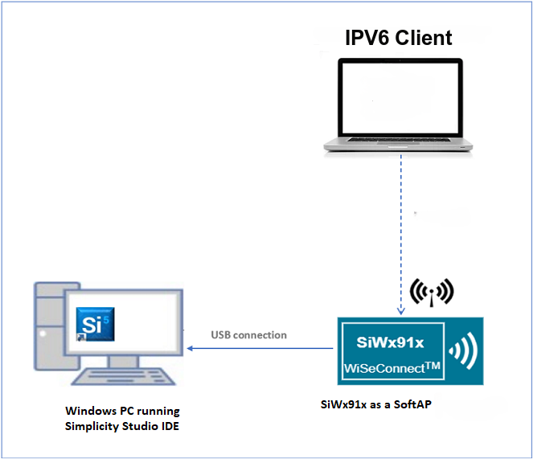
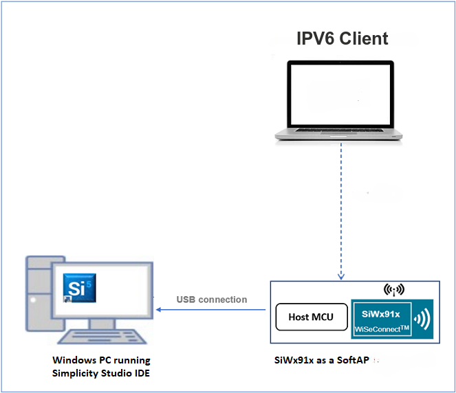
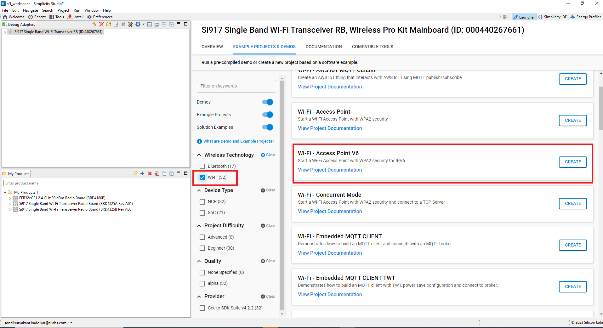
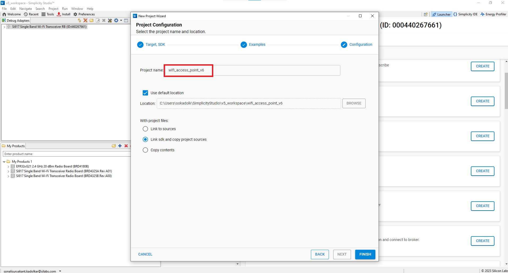
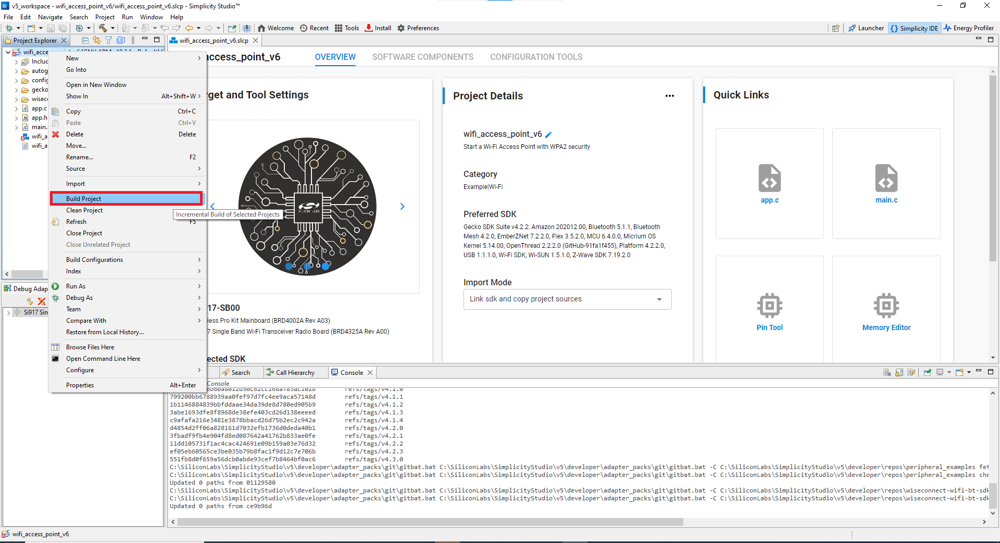
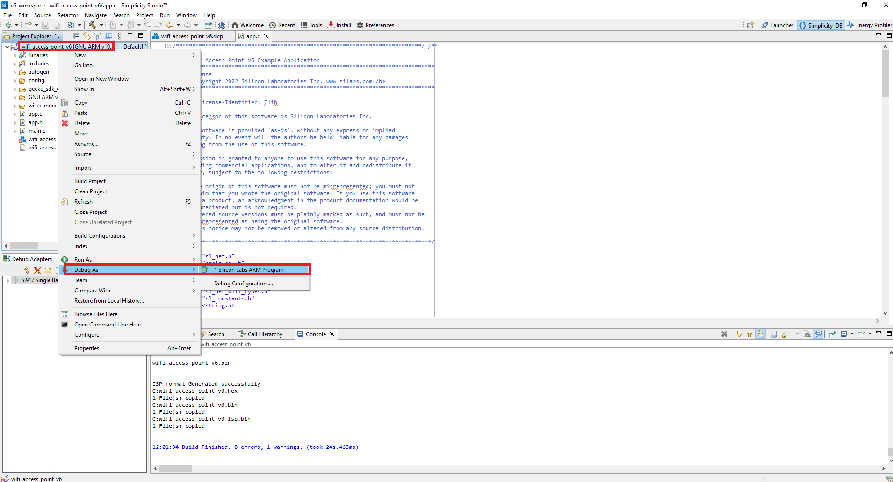
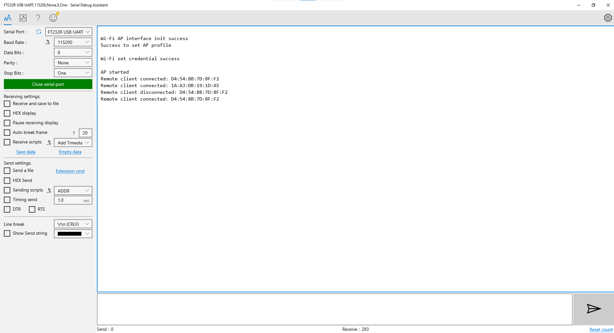

# Access Point IPv6

## 1 Purpose/Scope

This application demonstrates how to configure the SiWx91x as a soft Access point and allows stations to connect to it.

## 2 Prerequisites/Setup Requirements

### 2.1 Hardware Requirements

- A Windows PC.
- **SoC Mode**:
  - Silicon Labs [BRD4325A, BRD4325B, BRD4325C, BRD4325G, BRD4338A](https://www.silabs.com/)
- **NCP Mode**:
  - Silicon Labs [BRD4180B](https://www.silabs.com/) **AND**
  - Host MCU Eval Kit. This example has been tested with:
    - Silicon Labs [WSTK + EFR32MG21](https://www.silabs.com/development-tools/wireless/efr32xg21-bluetooth-starter-kit)

### 2.2 Software Requirements

- Simplicity Studio IDE

	- Download the latest [Simplicity Studio IDE](https://www.silabs.com/developers/simplicity-studio)
	- Follow the [Simplicity Studio user guide](https://docs.silabs.com/simplicity-studio-5-users-guide/1.1.0/ss-5-users-guide-getting-started/install-ss-5-and-software#install-ssv5) to install Simplicity Studio IDE

### 2.3 Setup Diagram

#### SoC Mode

Follow the [Getting Started with SiWx91x SoC](https://docs.silabs.com/) guide to set up the hardware connections and Simplicity Studio IDE.

#### NCP Mode

Follow the [Getting Started with EFx32](https://docs.silabs.com/rs9116-wiseconnect/latest/wifibt-wc-getting-started-with-efx32/) guide to setup the hardware connections and Simplicity Studio IDE.

## 3 Project Environment

1. Ensure the SiWx91x loaded with the latest firmware following the [Getting started with a PC](https://docs.silabs.com/rs9116/latest/wiseconnect-getting-started)

2. Ensure the EFx32 and SiWx91x set up is connected to your PC.

3. Ensure the latest Gecko SDK along with the extension WiSeConnect3 is added to Simplicity Studio.

### 3.1 Creating the project

#### 3.1.1 SoC mode

- Connect your board. The Si917 compatible SoC boards are **BRD4325A, BRD4325B, BRD4325C, BRD4325G**.
- Studio should detect your board. Your board will be shown here.

    ****

#### 3.1.2 NCP mode

- Connect your board. The supported NCP boards is BRD4180B
- The EFR32 board will be detected under Debug Adapters pane as shown below.

  ****

#### 3.1.3 Importing the project

  - Go to the 'EXAMPLE PROJECT & DEMOS' tab and select Wi-Fi - Access Point V6 application

  ****

- Click 'Create'. The "New Project Wizard" window appears. Click 'Finish'

   ****

### 3.2 Set up for application prints

  You can use either of the below USB to UART converters for application prints.

1. Set up using USB to UART converter board.

    - Connect Tx (Pin-6) to P27 on WSTK
    - Connect GND (Pin 8 or 10) to GND on WSTK

    ****

2. Set up using USB to UART converter cable.

    - Connect RX (Pin 5) of TTL convertor to P27 on WSTK
    - Connect GND (Pin1) of TTL convertor to GND on WSTK

    ****

**Tera Term set up - for NCP and SoC modes**

1. Open the Tera Term tool.

  - For SoC mode, choose the serial port to which USB to UART converter is connected and click on **OK**.

      ****

	- For NCP mode, choose the J-Link port and click on **OK**.

      ****

2. Navigate to the Setup → Serial port and update the baud rate to **115200** and click on **OK**.

	****

	****

## 4 Application Build Environment

The application can be configured to suit your requirements and development environment.

### 4.1 Configure the application

- The application uses the default configurations as provided in the **default_wifi_ap_profile** in **app.c** and user can choose to configure these parameters as needed.

### 4.2 Build and Run the Application

  ****

  Once the build was successful, right click on project and click on Debug As->Silicon Labs ARM Program as shown in below image.

   ****

### 4.3 Application Output

- After the application gets executed successfully, SiWx91x starts advertizing its SoftAP Wi-Fi network with the specified SSID.
 The MAC addresses of the remote clients that gets connected or disconnected to the newly created Access point are printed on the console.

  ****
