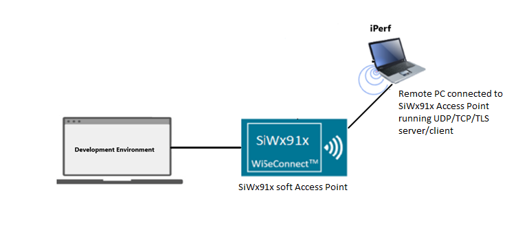
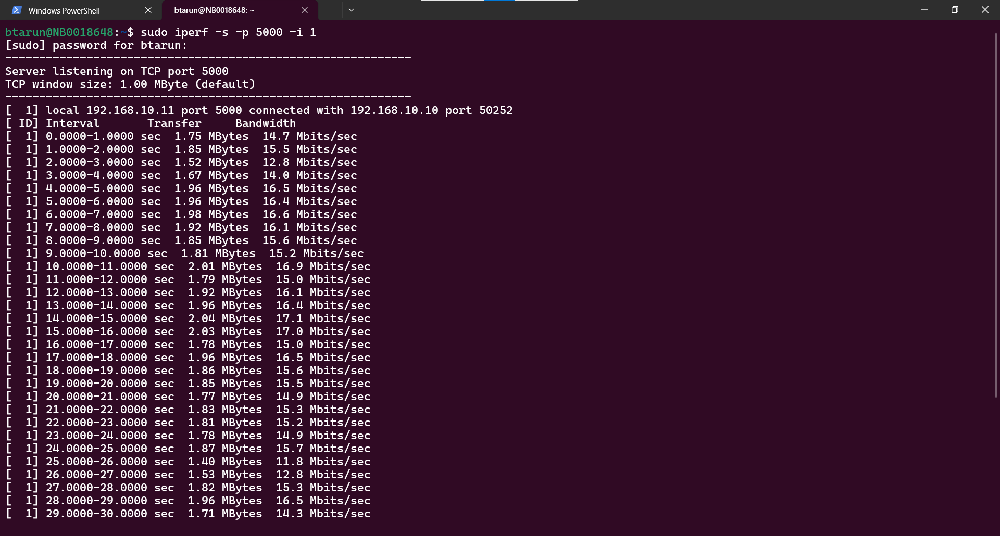
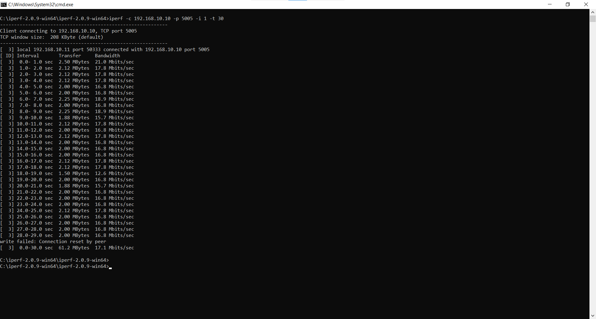

# Wi-Fi - AP Throughput 

## Table of Contents

- [Purpose/Scope](#purposescope) 
- [Prerequisites/Setup Requirements](#prerequisitessetup-requirements)
  - [Hardware Requirements](#hardware-requirements)
  - [Software Requirements](#software-requirements)
  - [Setup Diagram](#setup-diagram)
- [Getting Started](#getting-started)
- [Application Build Environment](#application-build-environment)
- [Test the Application](#test-the-application)
  - [Run the UDP Server](#run-the-udp-server)
    - [UDP Tx Throughput](#udp-tx-throughput)
    - [UDP Rx Throughput](#udp-rx-throughput)
    - [TCP Tx Throughput](#tcp-tx-throughput)
    - [TCP Rx Throughput](#tcp-rx-throughput)
    - [TLS Tx Throughput](#tls-tx-throughput)
    - [TLS Rx Throughput](#tls-rx-throughput)
  
## Purpose/Scope

This application demonstrates the procedure to measure WLAN UDP/TCP/TLS throughput by configuring the SiWx91x Soft Access Point in Client/Server role.
The SiWx91x as a Soft Access Point allows stations to connect and later get connected to an iPerf Server/Client or Python-based TLS scripts running on a remote PC. The SiWx91x then measures throughput for transmitted/received data from the remote PC.

## Prerequisites/Setup Requirements

### Hardware Requirements

- Windows PC
- **SoC Mode**:
  - Standalone
    - BRD4002A Wireless Pro Kit Mainboard [SI-MB4002A]
    - Radio Boards 
  	  - BRD4338A [SiWx917-RB4338A]
      - BRD4342A [SiWx917-RB4342A]
      - BRD4343A [SiWx917-RB4343A]
  - Kits
  	- SiWx917 Pro Kit [Si917-PK6031A](https://www.silabs.com/development-tools/wireless/wi-fi/siwx917-pro-kit?tab=overview)
  	- SiWx917 Pro Kit [Si917-PK6032A]
    - SiWx917 AC1 Module Explorer Kit (BRD2708A)
  	
- **NCP Mode**:
  - Standalone
    - BRD4002A Wireless Pro Kit Mainboard [SI-MB4002A]
    - EFR32xG24 Wireless 2.4 GHz +10 dBm Radio Board [xG24-RB4186C](https://www.silabs.com/development-tools/wireless/xg24-rb4186c-efr32xg24-wireless-gecko-radio-board?tab=overview)
    - NCP Expansion Kit with NCP Radio Boards
      - (BRD4346A + BRD8045A) [SiWx917-EB4346A]
      - (BRD4357A + BRD8045A) [SiWx917-EB4357A]
  - Kits
  	- EFR32xG24 Pro Kit +10 dBm [xG24-PK6009A](https://www.silabs.com/development-tools/wireless/efr32xg24-pro-kit-10-dbm?tab=overview)
  - STM32F411RE MCU
     - [STM32F411RE](https://www.st.com/en/microcontrollers-microprocessors/stm32f411re.html) MCU
     - NCP Expansion Kit with NCP Radio boards
      - (BRD4346A + BRD8045C)
      - (BRD4357A + BRD8045C)
  - Interface and Host MCU Supported
    - SPI - EFR32 & STM32

### Software Requirements

- Simplicity Studio IDE (to be used with Silicon Labs MCU)
- Keil IDE (to be used with STM32F411RE MCU)
- [iPerf Application](https://sourceforge.net/projects/iperf2/files/iperf-2.0.8-win.zip/download). iPerf is a tool for active measurements of the maximum achievable bandwidth on IP networks. It supports tuning of various parameters related to timing, buffers, and protocols (TCP and UDP with IPv4 and IPv6).
- [Python Environment](https://www.python.org/downloads/)
- Serial Terminal - [Docklight](https://docklight.de/)/[Tera Term](https://ttssh2.osdn.jp/index.html.en) (to be used with Keil IDE)/[Serial Debug Assistant](https://apps.microsoft.com/detail/9nblggh43hdm?launch=true&mode=full&hl=en-us&gl=in&ocid=bingwebsearch)

### Setup Diagram

  

## Getting Started

### Instructions for Simplicity Studio IDE and Silicon Labs Devices (SoC and NCP Modes)

Refer to the instructions [here](https://docs.silabs.com/wiseconnect/latest/wiseconnect-getting-started/) to:

- Install Studio and WiSeConnect 3 extension 
- Connect your device to the computer
- Upgrade your connectivity firmware
- Create a Studio project

For details on the project folder structure, see the [WiSeConnect Examples](https://docs.silabs.com/wiseconnect/latest/wiseconnect-examples/#example-folder-structure) page.

### Instructions for Keil IDE and STM32F411RE MCU (NCP Mode)

  - Install the [Keil IDE](https://www.keil.com/).
  - Download [WiSeConnect 3 SDK](https://github.com/SiliconLabs/wiseconnect)
  - Update the device's connectivity firmware as mentioned [here](https://docs.silabs.com/wiseconnect/latest/wiseconnect-getting-started/getting-started-with-ncp-mode).
  - Connect the SiWx91x NCP to STM32F411RE Nucleo Board following the below steps:
   	- Connect the male Arduino compatible header on carrier board to female Arduino compatible header on STM32F411RE Nucleo board.
   	- Mount the NCP radio board (BRD4346A/BRD4357A) onto the radio board socket available on the base board (BRD8045C).
   	- After connecting all the boards, the setup should look like the image shown below:
    
   	- Connect the setup to the computer.
  - Open the FIRMWARE UPDATE µVision project - **ap_throughput.uvprojx** by navigating to **WiSeConnect 3 SDK → examples → snippets → wlan → ap_throughput → keil_project**. 

## Application Build Environment
The application can be configured to suit your requirements and development environment. Read through the following sections and make any changes needed.

- In the Project Explorer pane, expand the **config** folder and open the **sl_net_default_values.h** file. Configure the following parameters to enable your Silicon Labs Wi-Fi device to act as a soft access point.

- AP instance related parameters:

	- DEFAULT_WIFI_AP_PROFILE_SSID refers to the SSID of the WiSeConnect softAP that would be created.

  	```c
  	#define DEFAULT_WIFI_AP_PROFILE_SSID                   "MY_AP_SSID"
  	```

	- DEFAULT_WIFI_AP_CREDENTIAL refers to the secret key of the WiSeConnect softAP that would be created.

  	```c
  	#define DEFAULT_WIFI_AP_CREDENTIAL                     "MY_AP_PASSPHRASE"
    ```
> Note: 
> You can configure default region-specific regulatory information using `sl_wifi_region_db_config.h`.


- Configure the following parameters in `app.c` to test throughput app as per requirements:

  - Client/Server IP Settings

      ```c
      #define LISTENING_PORT     <local_port>       // Local port to use
      #define SERVER_PORT        <remote_port>      // Remote server port
      #define SERVER_IP_ADDRESS  "192.168.10.11"    // Remote server IP address
      #define SOCKET_ASYNC_FEATURE 1                // Type of Socket used. Synchronous = 0, Asynchronous = 1
      ```

- Throughput Measurement Types

    - The application may be configured to measure throughput using UDP, TCP, or TLS packets. Choose the measurement type using the `THROUGHPUT_TYPE` macro.

      ```c
      #define THROUGHPUT_TYPE  TCP_TX     // Selects the throughput option

      #define TCP_TX           0   // SiWx91x transmits packets to remote TCP client
      #define TCP_RX           1   // SiWx91x receives packets from remote TCP server
      #define UDP_TX           2   // SiWx91x transmits packets to remote UDP client
      #define UDP_RX           3   // SiWx91x receives packets from remote UDP server
      #define TLS_TX           4   // SiWx91x transmits packets to remote TLS server
      #define TLS_RX           5   // SiWx91x receives packets from remote TLS server
      ```

  - Throughput Test options

      ```c
      #define BYTES_TO_SEND     (1 << 29)     // To measure TX throughput with 512 MB data transfer
      #define BYTES_TO_RECEIVE  (1 << 20)     // To measure RX throughput with 1 MB data transfer
      #define TEST_TIMEOUT      10000         // Throughput test timeout in ms
      ```
 
  - Configure the TCP RX window size and TCP RX window division factor to 44 in the socket configuration in **app.c** to achieve high throughput for TCP_RX and TLS_RX.
   
    ```c
    static sl_si91x_socket_config_t socket_config = {
      1,  // Total sockets
      1,  // Total TCP sockets
      0,  // Total UDP sockets
      0,  // TCP TX only sockets
      1,  // TCP RX only sockets
      0,  // UDP TX only sockets
      0,  // UDP RX only sockets
      1,  // TCP RX high performance sockets
      44, // TCP RX window size
      44  // TCP RX window division factor
    };
    ```  
### Test the application

### Instructions for Simplicity Studio IDE and Silicon Labs Devices (SoC and NCP Modes)

Refer to the instructions [here](https://docs.silabs.com/simplicity-studio-5-users-guide/5.8.2/ss-5-users-guide-building-and-flashing/building) to:

- Build the application.
- Flash, run, and debug the application.

  > **Note:** AP standalone mode does not support Tx aggregation. Rx aggregation is supported with block acknowledgment (Block Ack) sessions. This constraint will impact throughput, particularly in scenarios other than UDP Rx.

### Instructions for Keil IDE and STM32F411RE MCU

- Build the application.
- Set the Docklight up by connecting STM32's Serial COM port. This enables you to view the application prints.
- Flash, run, and debug the application.

  > **Note:** The SiWx91x, which is configured as a UDP/TCP/TLS server/client, connects to the iPerf server/client and sends/receives data for configured intervals. While the module is transmitting/receiving the data, the application prints the throughput numbers in the serial console.


  

#### Run the UDP Server

##### UDP Tx Throughput

To measure UDP Tx throughput, configure the SiWx91x as a UDP client and start a UDP server on the remote PC. To establish UDP server on the remote PC, open [iPerf Application](https://sourceforge.net/projects/iperf2/files/iperf-2.0.8-win.zip/download) and run the below command from the downloaded folder's path in the command prompt.
The iPerf command to start the UDP server on the PC is:

  > `C:\> iperf.exe -s -u -p <SERVER_PORT> -i 1`
  >
  > For example ...
  >
  > `C:\> iperf.exe -s -u -p 5000 -i 1`

  

##### UDP Rx Throughput

To measure UDP Rx throughput, configure the SiWx91x as a UDP server and start a UDP client on the remote PC.
The iPerf command to start the UDP client is:

  > `C:\> iperf.exe -c <Module_IP> -u -p <Module_Port> -i 1 -b <Bandwidth> -t <time interval in seconds>`
  >
  > For example ...
  >
  > `C:\> iperf.exe -c 192.168.10.10 -u -p 5005 -i 1 -b70M -t 30`  

  

##### TCP Tx Throughput

To measure TCP Tx throughput, configure the SiWx91x as a TCP client and start a TCP server on the remote PC. To establish TCP server on the remote PC, open [iPerf Application](https://sourceforge.net/projects/iperf2/files/iperf-2.0.8-win.zip/download) and run the below command from the downloaded folder's path in the command prompt.
The iPerf command to start the TCP server is:
  
  > `C:\> iperf.exe -s -p <SERVER_PORT> -i 1`
  >
  > For example ...
  >
  > `C:\> iperf.exe -s -p 5000 -i 1`

  

##### TCP Rx Throughput

To measure TCP Rx throughput, configure the SiWx91x as TCP server and start a TCP client on the remote PC.
The iPerf command to start the TCP client is:

  > `C:\> iperf.exe -c <Module_IP> -p <module_PORT> -i 1 -t <time interval in sec>`
  >
  > For example ...
  >
  > `C:\> iperf.exe -c 192.168.10.10 -p 5005 -i 1 -t 30`  

  

##### TLS Tx Throughput

To measure TLS Tx throughput, configure the SiWx91x as a TLS client and start a TLS server on the remote PC as described in the following bullets:

- Copy the `SSL_Server_throughput_d.py` script from the release `/resources/scripts/` directory to the `/resources/certificates/` directory.
- Open a command prompt and cd to the folder `/resources/certificates/`, then run the following command:
  - `C:\> python SSL_Server_throughput_d.py`

    > **Note:** The SSL_Server_throughput_d.py script works only with Python version 2 and above.

    >   The TLSv1_3 works for Python version greater than 3.6.

  

##### TLS Rx Throughput

To measure TLS RX throughput, configure the SiWx91x as a TLS client and open a TLS server on the remote PC as described in the following bullets:

- Copy the `SSL_tx_throughput.py` script from the release `/resources/scripts/` directory to the `/resources/certificates/`.
- Open a command prompt and cd to the folder `/resources/certificates/`, then run the following command:
  - `C:\> python SSL_tx_throughput.py`

    > **Note:** The SSL_tx_throughput.py script works only with Python version 2 and above.

    >   The TLSv1_3 works for python version greater than 3.6.

    
