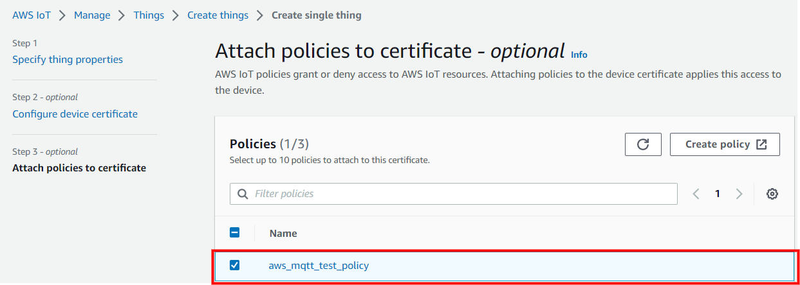

# Wi-Fi - AWS IoT MQTT Client

## Table of Contents

- [Purpose/Scope](#purposescope)
- [Overview of AWS SDK](#overview-of-aws-sdk)
- [Prerequisites/Setup Requirements](#prerequisitessetup-requirements)
  - [Hardware Requirements](#hardware-requirements)
  - [Software Requirements](#software-requirements)
  - [Setup Diagram](#setup-diagram)
- [Getting Started](#getting-started)
- [Application Build Environment](#application-build-environment)
- [Test the Application](#test-the-application)
- [Additional Information](#additional-information)
  - [Current Measurement using Simplicity Studio Energy Profiler](#current-measurement-using-simplicity-studio-energy-profiler)
  - [Setting up Security Certificates](#setting-up-security-certificates)
  - [Create an AWS Thing](#create-an-aws-thing)
  - [Steps to create a policy from AWS console](#steps-to-create-a-policy-from-aws-console)

## Purpose/Scope

This application demonstrates how to configure SiWx91x as an IoT device and securely connect to AWS IoT Cloud to subscribe and publish on a topic by using AWS MQTT library.

In this application, the SiWx91x, which is configured as a Wi-Fi client interface, gets connected to an access point which has internet access. After successful Wi-Fi connection, the application connects to AWS IoT Cloud and subscribes to **SUBSCRIBE_TO_TOPIC** topic. Subsequently, the application publishes the **MQTT_PUBLISH_PAYLOAD** message on the **PUBLISH_ON_TOPIC** topic. After publish, the NWP processor is set into associated power save.  This application works differently in NCP and SoC modes as described below.

## Soc Mode:

If macro **SL_SI91X_TICKLESS_MODE** is enabled, then the M4 processor is set in sleep mode. The M4 processor can be woken in several ways as described below:

### Tickless Mode

In Tickless Mode, the device enters sleep based on the idle time set by the scheduler. The device can be awakened by these methods: SysRTC, a wireless signal, Button press-based (GPIO), and Alarm-based wakeup.

- **System Real-Time Clock (SysRTC)**: By default, the device uses SysRTC as the wakeup source. The device will enter sleep mode and then wake up when the SysRTC matches the idle time set by the scheduler.

- **Wireless Wakeup**: The device can also be awakened by a wireless signal. If this signal is triggered before the idle time set by the scheduler, the device will wake up in response to it.

- **Button-based Wakeup**:The device can also be awakened by a button signal.

- **Alarm-based Wakeup**:The device can also be awakened by setting the timeout to the appropriate duration in the osSemaphoreAcquire function.

After M4 processor wakes up via any of the above processes, the application publishes the **MQTT_PUBLISH_PAYLOAD** message on the **PUBLISH_ON_TOPIC** topic.

If macro **SL_SI91X_TICKLESS_MODE** is disabled, then M4 processor does not go to sleep. A timer is run with a periodicity of **PUBLISH_PERIODICITY** milliseconds. The application publishes the **MQTT_PUBLISH_PAYLOAD** message on the **PUBLISH_ON_TOPIC** topic in the following cases:

1. Once in every **PUBLISH_PERIODICITY** time period.
2. When an incoming publish is received by the application.

**NCP Mode**:

A timer is run with a periodicity of **PUBLISH_PERIODICITY** milliseconds. The application publishes a **MQTT_PUBLISH_PAYLOAD** message on **PUBLISH_ON_TOPIC** topic in the following cases:

- Once in every **PUBLISH_PERIODICITY** time period.
- When an incoming packet is received by the application.

*Note: The bold texts are the macros defined in the application. You can find more details about them in the upcoming section (#section 4).*

## Overview of AWS SDK

AWS IoT Core is a cloud platform which connects devices across AWS cloud services. AWS IoT provides an interface which allows the devices to communicate securely and reliably in bi-directional ways to the AWS touch-points, even when the devices are offline.

The AWS IoT Device SDK allows applications to securely connect to the AWS IoT platform.


## Prerequisites/Setup Requirements

### Hardware Requirements

- Windows PC with Host interface (UART)
- Wi-Fi access point with internet connection
- **SoC Mode**:
  - Standalone
    - BRD4002A Wireless Pro Kit Mainboard [SI-MB4002A]
    - Radio Boards 
  	  - BRD4338A [SiWx917-RB4338A]
  	  - BRD4343A [SiWx917-RB4343A]
  - Kits
  	- SiWx917 Pro Kit [Si917-PK6031A](https://www.silabs.com/development-tools/wireless/wi-fi/siwx917-pro-kit?tab=overview)
  	- SiWx917 Pro Kit [Si917-PK6032A]
    - SiWx917 AC1 Module Explorer Kit (BRD2708A)
  	
- **NCP Mode**:
  - Standalone
    - BRD4002A Wireless Pro Kit Mainboard [SI-MB4002A]
    - EFR32xG24 Wireless 2.4 GHz +10 dBm Radio Board [xG24-RB4186C](https://www.silabs.com/development-tools/wireless/xg24-rb4186c-efr32xg24-wireless-gecko-radio-board?tab=overview)
    - NCP Expansion Kit with NCP Radio Boards
      - (BRD4346A + BRD8045A) [SiWx917-EB4346A]
      - (BRD4357A + BRD8045A) [SiWx917-EB4357A]
  - Kits
  	- EFR32xG24 Pro Kit +10 dBm [xG24-PK6009A](https://www.silabs.com/development-tools/wireless/efr32xg24-pro-kit-10-dbm?tab=overview)
  - Interface and Host MCU Supported
    - SPI - EFR32 

### Software Requirements

- Simplicity Studio

### Setup Diagram


## Getting Started

Refer to the instructions [here](https://docs.silabs.com/wiseconnect/latest/wiseconnect-getting-started/) to:

- [Install Simplicity Studio](https://docs.silabs.com/wiseconnect/latest/wiseconnect-developers-guide-developing-for-silabs-hosts/#install-simplicity-studio)
- [Install WiSeConnect 3 extension](https://docs.silabs.com/wiseconnect/latest/wiseconnect-developers-guide-developing-for-silabs-hosts/#install-the-wi-se-connect-3-extension)
- [Connect your device to the computer](https://docs.silabs.com/wiseconnect/latest/wiseconnect-developers-guide-developing-for-silabs-hosts/#connect-si-wx91x-to-computer)
- [Upgrade your connectivity firmware ](https://docs.silabs.com/wiseconnect/latest/wiseconnect-developers-guide-developing-for-silabs-hosts/#update-si-wx91x-connectivity-firmware)
- [Create a Studio project ](https://docs.silabs.com/wiseconnect/latest/wiseconnect-developers-guide-developing-for-silabs-hosts/#create-a-project)

For details on the project folder structure, see the [WiSeConnect Examples](https://docs.silabs.com/wiseconnect/latest/wiseconnect-examples/#example-folder-structure) page.

## Application Build Environment

The application can be configured to suit your requirements and development environment.

### Configure the Application

#### Configure the follwoing parameters in `app.c`:

- The following parameters are common to SoC and NCP.

 ```c
 #define SUBSCRIBE_TO_TOPIC        "aws_status"      //! Subscribe topic to receive the messages from AWS IoT cloud
 #define PUBLISH_ON_TOPIC          "siwx91x_status"  //! Publish topic to send the messages from application to AWS IoT cloud
 #define MQTT_PUBLISH_PAYLOAD      "Hi from SiWx91x" //! Publish message
 #define SUBSCRIBE_QOS             QOS0              //! Quality of Service for subscribed topic "SUBSCRIBE_TO_TOPIC"
 #define PUBLISH_QOS               QOS0              //! Quality of Service for publish topic "PUBLISH_ON_TOPIC"
 #define PUBLISH_PERIODICITY       30000             //! Publish periodicity in milliseconds
 #define ENABLE_POWER_SAVE         1                 //! Set this macro to 1 for enabling NWP power save
 ```

- `SUBSCRIBE_TO_TOPIC` refers to the topic to which the device subscribes.
- `PUBLISH_ON_TOPIC` refers to the topic to which the device publishes.

### Configure the below parameters in `sl_net_default_values.h` present at `\<project>/config`

By default, the application connects to the remote access point with `default_wifi_client_profile` configuration provided in **sl_net_default_values.h**.

```c
#define DEFAULT_WIFI_CLIENT_PROFILE_SSID "YOUR_AP_SSID"
#define DEFAULT_WIFI_CLIENT_CREDENTIAL   "YOUR_AP_PASSPHRASE"
```
> Note: 
> You can configure default region-specific regulatory information using `sl_wifi_region_db_config.h`.

### Configure the following parameters in `aws_iot_config.h` file present at `<project>/config`:

> - Before configuring the parameters in `aws_iot_config.h`, register the SiWx917 device in the AWS IoT registry by following the steps mentioned in [Create an AWS Thing](#create-an-aws-thing) section.

> - Configure AWS_IOT_MQTT_HOST macro with the device data endpoint to connect to AWS. To get the device data endpoint in the AWS IoT Console, navigate to Settings, copy the Endpoint, and define the AWS_IOT_MQTT_HOST macro with this value.

  

```c
#define AWS_IOT_MQTT_HOST \
  "a2m21kovu9tcsh-ats.iot.us-east-2.amazonaws.com"  ///< Customer-specific MQTT HOST. The same will be used for Thing Shadow
#define AWS_IOT_MQTT_PORT      8883                 ///< Default port for MQTT/S
#define AWS_IOT_MQTT_CLIENT_ID "silicon_labs_thing" ///< MQTT client ID should be unique for every device
#define AWS_IOT_MY_THING_NAME  "silicon_labs_thing" 
```

> - To authenticate and securely connect with AWS, the SiWx917 device requires a unique x.509 security certificate and private key, as well as a CA certificate. At this point, you must have a device certificate, private key, and CA certificate, which are downloaded during the creation/registration of AWS Thing.

> - By default, the certificate and private key that are downloaded from the AWS are in [.pem format](https://en.wikipedia.org/wiki/Privacy-Enhanced_Mail). To load the certificate and private key to the SiWx917, the certificate and private key should be converted into a C-array. For converting the certificates and private key into C-array, refer to [Setting up Security Certificates](#setting-up-security-certificates).

> - By default, the WiSeConnect 3 SDK contains the Starfield Root CA Certificate in C-array format. 

> **Note** :
 The included Cloud connectivity certificates are for reference only. If using default certificates in the release, the cloud connection will not work. You must replace the default certificates with valid certificates while connecting to the appropriate Cloud/OpenSSL Server.

## Test the Application

Refer to the instructions [here](https://docs.silabs.com/wiseconnect/latest/wiseconnect-getting-started/) to:

- Build the application.
- Flash, run, and debug the application.

**Note:**
- To know more about aws mqtt apis error codes, refer to wiseconnect3\third_party\aws_sdk\include\aws_iot_error.h file.
- If the user is calling select and experiencing long wait times in which no data is received, it is the user's responsibility to manage sending the keepalive packets to maintain the connection.

### Application Output

- **SoC Mode**:

  

- In this instance, the SiWx91x has established a secure connection with the AWS Cloud, subscribed to *aws_status* topic, and published a message "Hi from SiWx91x" on *siwx91x_status* topic.
- The NWP processor is then set into associated power save mode.
- Subsequently, the M4 processor is set into power save.
- Later, the application performs the publish through any of the three procedures described below:

  *case 1*: When an incoming publish is received:
  - Suppose the message, "Hi from AWS Cloud!", has been published by a test MQTT Client on *aws_status* topic. Upon reception of incoming publish, the NWP processor triggers the M4 processor to wake up. The application then reads the received data, triggers a publish on *siwx91x_status* topic, and sets the M4 processor back to sleep.

  *case 2*: When **BTN0** is pressed on WPK:
  - The button press triggers the M4 processor to wake from sleep. The application then performs a publish on *siwx91x_status* topic, and sets the M4 processor back to sleep.

  *case 3*: When ALARM-timer elapses
  - By default, the ALARM-timer periodicity is 30 seconds (**ALARM_PERIODIC_TIME**). During every iteration, the ALARM triggers the M4 processor to wake from sleep. The application then performs a publish on *siwx91x_status* topic, and sets the M4 processor back to sleep.

- **NCP Mode**:

  

  - In this instance, the SiWx91x has established a secure connection with the AWS Cloud, subscribed to *aws_status* topic, and published a message, "Hi from SiWx91x" on *siwx91x_status* topic.
  - The NWP processor is then set into associated power save mode.

  *case 1*: When an incoming publish is received:
  - Suppose the message, "Hi from AWS Cloud!", has been published by a test MQTT Client on *aws_status* topic. Upon reception of incoming publish, the NWP processor triggers the M4 processor to wake up. The application then reads the received data, triggers a publish on *siwx91x_status* topic, and sets the M4 processor back to sleep.

  *case 2*: When periodic publish timer elapses:
  - By default, the periodicity of the publish timer is 30 seconds (**PUBLISH_PERIODICITY**). For every **PUBLISH_PERIODICITY**, the application performs a publish on *siwx91x_status* topic.

**Application notes**:

1. Currently, for SoC, the button-based and Alarm-based implementations work in power save enabled mode only.
2. Currently, both QoS0 and QoS1-based publishes are supported.

## Additional Information

- Average current consumption measured in power-meter:

  

  - **NOTE** : The measured current may vary if the scenario is performed in an open environment. AP to AP variation is also observed.
  - **NOTE** : To achieve the lowest power numbers in connected sleep, in SoC mode, configure `RAM_LEVEL` to `SL_SI91X_RAM_LEVEL_NWP_BASIC_MCU_ADV` and M4 to without RAM retention, i.e., `sl_si91x_configure_ram_retention` should not be done.

### Current Measurement using Simplicity Studio Energy Profiler
  
- After flashing the application code to the module, the energy profiler can be used for current consumption measurements.

- From tools, choose Energy Profiler and click "OK".

  

- From Quick Access, choose Start Energy Capture option.

  
 
### Setting up Security Certificates

- The WiSeConnect 3 SDK provides a conversion script (written in Python 3) to make the conversion straightforward. The script is provided in the SDK `<SDK>/resources/scripts` directory and is called [certificate_to_array.py](https://github.com/SiliconLabs/wiseconnect/tree/master/resources/certificates/).

- Copy the downloaded device certificate, private key from AWS, and also the certificate_to_array.py to the `<SDK>/resources/certificates`.

- To convert the device certificate and private key to C arrays, open a system command prompt in the same path and give the following commands.

  ```sh
  $> python3 certificate_to_array.py <input filename> <output arrayname>

  For example:
  $> python3 certificate_to_array.py d8f3a44d3f.pem.crt aws_device_certificate
  $> python3 certificate_to_array.py d8f3a44d3f.pem.key aws_private_key
  ```

- After running the above commands, two new files shall be created as below:

  ```sh
  aws_device_certificate.crt.h
  aws_private_key.key.h
  ```

- After converting the certificate and private key to C - array, it is essential to include the device certificate: aws_device_certificate.crt.h and private key: aws_private_key.key.h in the app.c.

- Ensure to load the certificate and private key to SiWx917 using [sl_net_set_credential()](https://docs.silabs.com/wiseconnect/latest/wiseconnect-api-reference-guide-nwk-mgmt/net-credential-functions#sl-net-set-credential) API.

- Ensure to update the certificate names in the **IoT_Client_Init_Params** structure before calling the **aws_iot_mqtt_init()** API.

- The Starfield Root CA certificate used by your Wi-Fi device to verify the AWS server is already included in the WiSeConnect 3 SDK at `<SDK>/resources/certificates`; no additional setup is required.

> **NOTE :**
> Amazon uses [Starfield Technologies](https://www.starfieldtech.com/) to secure the AWS website. The WiSeConnect SDK includes the [Starfield CA Certificate](https://github.com/SiliconLabs/wiseconnect/tree/master/resources/certificates/aws_starfield_ca.pem.h).
>
> AWS has announced that there will be changes in their root CA chain. More details can be found in the reference link: (https://aws.amazon.com/blogs/security/acm-will-no-longer-cross-sign-certificates-with-starfield-class-2-starting-august-2024/)
>
> We are providing both root CAs (Starfield class-2 and Starfield G2) in aws_starfield_ca.pem.h, which is located in the WiSeConnect directory `<SDK>/resources/certificates/aws_starfield_ca.pem.h`.
>
> For AWS connectivity, StarField Root CA certificate has the highest authority being at the top of the signing hierarchy.
>
> The StarField Root CA certificate is an expected/required certificate which usually comes pre-installed in the operating systems and plays a key part in certificate chain verification when a device is performing TLS authentication with the IoT endpoint.
>
> On SiWx91x device, we do not maintain the root CA trust repository due to memory constraints, so it is mandatory to load Starfield Root CA certificate for successful mutual authentication to the AWS server.
>
> The certificate chain sent by AWS server is as below:
> Starfield Class 2 :
> 
>id-at-commonName=Amazon,RSA 2048 M01,id-at-organizationName=Amazon,id-at-countryName=US
>
> id-at-commonName=Amazon Root CA 1,id-at-organizationName=Amazon,id-at-countryName=US
>
> id-at-commonName=Starfield Services Root Certificate Authority - G2,id-at-organizationName=Starfield Technologies, Inc.,id-at-localityName=Scottsdale,id-at- stateOrProvinceName=Arizona,id-at-countryName=US
>
>id-at-organizationalUnitName=Starfield Class 2 Certification Authority,id-at-organizationName=Starfield Technologies, Inc.,id-at-countryName=US
>
> Starfield G2:
>
> id-at-commonName=Amazon RSA 2048 M01,id-at-organizationName=Amazon,id-at-countryName=US
>
> id-at-commonName=Amazon Root CA 1,id-at-organizationName=Amazon,id-at-countryName=US
>
> id-at-commonName=Starfield Services Root Certificate Authority - G2,id-at-organizationName=Starfield Technologies, Inc.,id-at-localityName=Scottsdale,id-at-stateOrProvinceName=Arizona,id-at-countryName=US
>
> To authenticate the AWS server on SiWx91x, first validate the Root CA (validate the Root CA received with the Root CA loaded on the device). Once the Root CA validation is successful, other certificates sent from the AWS server are validated.
> Alternate certification chains support is added. With this, as opposed to requiring full chain validation, only the peer certificate must validate to a trusted certificate. This allows loading intermediate root CAs as trusted.
> The default CA certificate is the Starfield Combined CA certificate. To use the Intermediate Amazon Root CA 1 certificate, define the `SL_SI91X_AWS_IOT_ROOT_CA1` macro in the application.

### Create an AWS Thing

 **Thing Note**: By default, we provide ThingName as: silicon_labs_thing. If you want to create your own thing name, you can follow the below procedure.

Create a thing in the AWS IoT registry to represent your IoT device.

- In the [AWS IoT console](https://console.aws.amazon.com/iot/home), in the navigation pane, under Manage, choose All devices, and then choose Things.

  

- If **No things** message is displayed, click on **Create things**.

  

- On the **Create things** page, choose **Create a single thing** and click next.

  

- On the **Specify thing properties** page, enter a name for your IoT thing (for example, **Test_IoT**), and choose **Unnamed shadow (classic)** in the Device Shadow section, then choose **Next**. You cannot change the name of a thing after you create it. To change a thing's name, you must create a new thing, give it the new name, and then delete the old thing.

  

- During **Configure device certificate** step, choose **Auto-generate a new certificate (recommended)** option and click next.

  

- To attach an existing policy, choose the policy and click on create thing. If the policy is not yet created, choose **Create policy** and fill in the fields as shown in the following images.

- Choosing an existing policy.

  

- Creating a policy. 
  - Click on create policy. 
  

  - Give the **Name** to your Policy. Fill in the **Action** and **Resource ARN** fields as shown in the image below. Click on **Allow** under **Effect** and click **Create**.
  

  - Choose the created policy and click on **Create thing**.

- Choose the **Download** links to download the device certificate and private key. Note that Root CA certificate is already present in SDK (aws_starfield_ca.pem.h), and can be directly used.
  > **Warning:** This is the only instance in which you can download your device certificate and private key. Make sure to save them securely.

  

- Click **Done**.

- The created thing should now be visible on the AWS console (Manage > All devices > Things).
