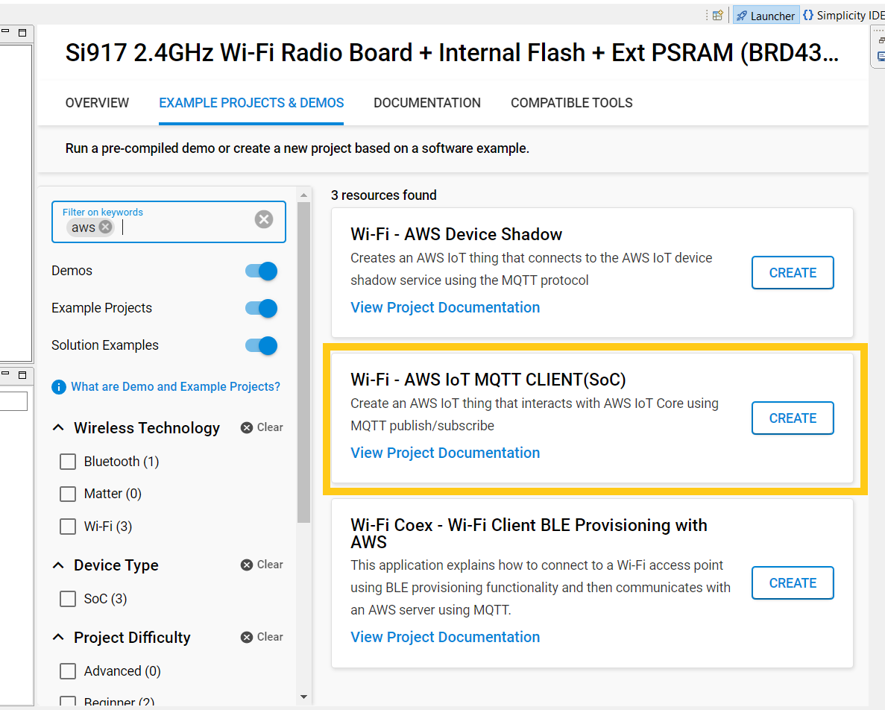
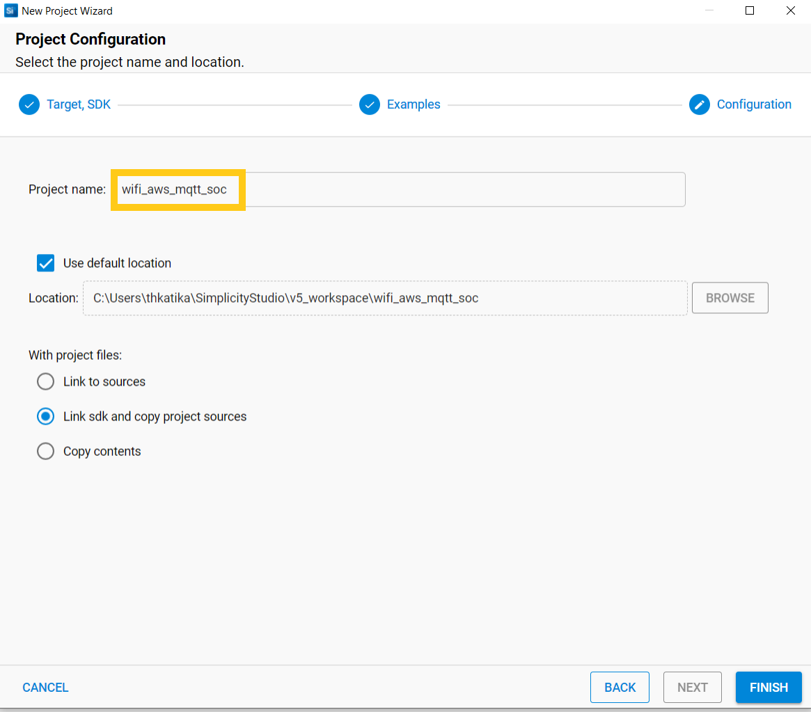
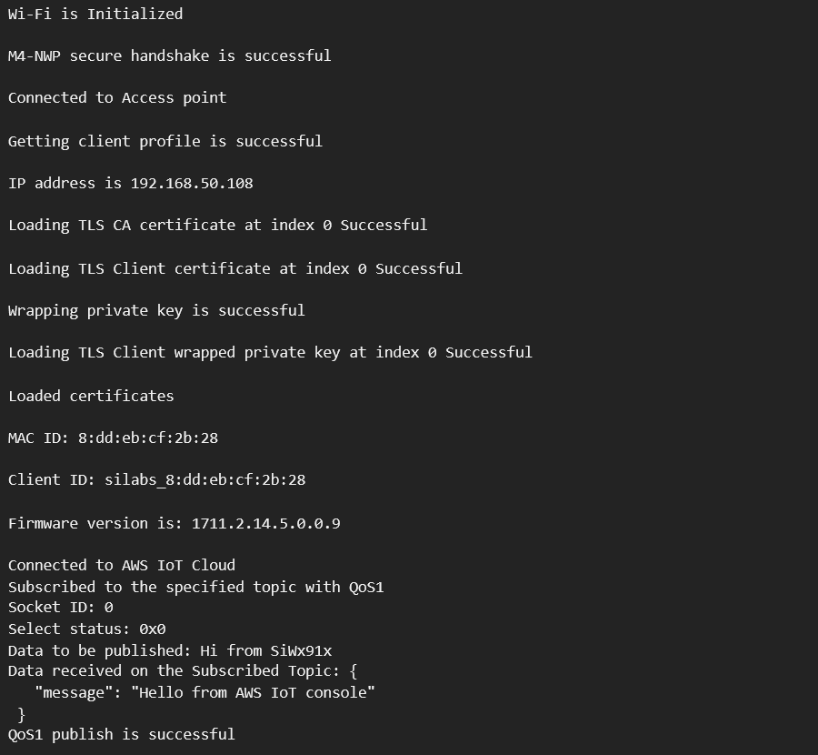
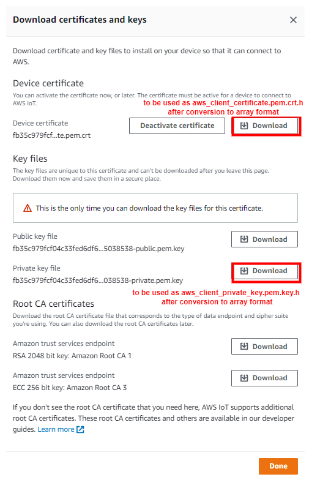

# AWS IoT MQTT Client Example

## 1 Purpose/Scope

This application demonstrates how to configure SiWx91x as an IoT device and securely connect to AWS IoT Cloud to subscribe and publish on a topic by using AWS MQTT library.

In this application, the SiWx91x, which is configured as a Wi-Fi client interface, gets connected to an Access Point which has internet access. After successful Wi-Fi connection, the application connects to AWS IoT Cloud and subscribes to **SUBSCRIBE_TO_TOPIC** topic. Subsequently, the application publishes **MQTT_PUBLISH_PAYLOAD** message on **PUBLISH_ON_TOPIC** topic. After publish, the NWP processor is set in to associated power save.  Next, the application works differently in NCP and SoC modes as defined below.

**Soc Mode**:
The M4 processor is set in sleep mode. The M4 processor can be woken in several ways as mentioned below:
1. ALARM timer-based - In this method, an ALARM timer is run that wakes the M4 processor up periodically every **ALARM_PERIODIC_TIME** time period.
2. Button press-based (GPIO) - In tis method, the M4 processor wakes up upon pressing a button (BTN0).
3. Incoming publish-based - When an incoming publish is to be received by the application, the M4 processor is woken up.

After M4 processor wakes up via any of the above processes, the application publishes **MQTT_PUBLISH_PAYLOAD** message on **PUBLISH_ON_TOPIC** topic.

**NCP Mode**:
A timer is run with a periodicity of **PUBLISH_PERIODICITY** milliseconds. The application publishes **MQTT_PUBLISH_PAYLOAD** message on **PUBLISH_ON_TOPIC** topic in the following cases:
1. Once in every **PUBLISH_PERIODICITY** time period.
2. When an incoming publish is received by the application.

*NOTE*: The bold texts are the macros defined in the application. You can find more details about them in the upcoming section (#section 4).

## Overview of AWS SDK

AWS IoT Core is a cloud platform which connects devices across AWS cloud services. AWS IoT provides a interface which allows the devices to communicate securely and reliably in bi-directional ways to the AWS touch-points, even when the devices are offline.

The AWS IoT Device SDK allow applications to securely connect to the AWS IoT platform.


## 2 Prerequisites/Setup Requirements

### 2.1 Hardware Requirements

- Windows PC
- Wi-Fi Access point with internet connection
- **SoC Mode**:
  - [Silicon Labs BRD4325A/BRD4325B/BRD4325C/BRD4325G/BRD4338A Radio boards](https://www.silabs.com/)
  - [BRD4002A Wireless Pro Kit Mainboard (WPK)](https://www.silabs.com/)
- **NCP Mode**:
  - [Silicon Labs SLWSTK6006A EFR32xG21 Wireless Starter Kit](https://www.silabs.com/development-tools/wireless/efr32xg21-wireless-starter-kit) which includes
      - BRD4001A Wireless Starter Kit Mainboard (WSTK)/BRD4002A Wireless Pro Kit Mainboard (WPK)
      - BRD4180A/BRD4180B Radio Board

### 2.2 Software Requirements

- Simplicity Studio IDE

  - Download the latest version of [Simplicity Studio IDE](https://www.silabs.com/developers/simplicity-studio).
  - Follow the [Simplicity Studio user guide](https://docs.silabs.com/simplicity-studio-5-users-guide/1.1.0/ss-5-users-guide-getting-started/install-ss-5-and-software#install-ssv5) to install Simplicity Studio IDE.

### 2.3 Setup Diagram

#### SoC Mode


#### NCP Mode


**NOTE**:
- The Host MCU platform (EFR32xG21) and the SiWx91x NCP interact with each other through the SPI interface.

Follow the [Getting Started with Wiseconnect3 SDK](https://docs.silabs.com/wiseconnect/latest/wiseconnect-getting-started/) guide to set up the hardware connections and Simplicity Studio IDE.

## 3 Project Environment

1. Ensure the SiWx91x is loaded with the latest firmware following the [Upgrade Si91x firmware](https://docs.silabs.com/wiseconnect/latest/wiseconnect-getting-started/getting-started-with-soc-mode#upgrade-si-wx91x-connectivity-firmware).

2. Ensure the EFx32 and SiWx91x set up is connected to your PC.

3. Ensure the latest Gecko SDK along with the extension WiSeConnect3 is added to Simplicity Studio.

### 3.1 Creating the project

#### 3.1.1 SoC mode

- Connect your board. The Si917 compatible SoC board is **BRD4325A,BRD4325B**.
- The Si917 board will be detected under **Debug Adapters** pane as shown below.

  ****

#### 3.1.2 NCP mode

- Connect your board. The supported NCP boards are: **BRD4180B**
- The EFR32 board will be detected under **Debug Adapters** pane as shown below.

  ****

### 3.2 Importing the project

#### 3.2.1 SOC Mode

- Go to the 'EXAMPLE PROJECT & DEMOS' tab and select **Wi-Fi - AWS IoT MQTT CLIENT(SoC)**.

  ****

- Click 'Create'. The "New Project Wizard" window appears. Click 'Finish'.

  ****

#### 3.2.2 NCP Mode

- Go to the 'EXAMPLE PROJECT & DEMOS' tab and select **Wi-Fi - AWS IoT MQTT CLIENT(NCP)**.

  ****

- Click 'Create'. The "New Project Wizard" window appears. Click 'Finish'.

  ****

### 3.3 Setup for application prints

#### 3.3.1 Teraterm setup - for BRD4325A, BRD4325B, BRD4325C, BRD4325G

You can use either of the below USB to UART converters for application prints.

1. Set up using USB to UART converter board.

   - Connect Tx (Pin-6) to P27 on WSTK
   - Connect GND (Pin 8 or 10) to GND on WSTK

   ****

2. Set up using USB to UART converter cable.

   - Connect RX (Pin 5) of TTL convertor to P27 on WSTK
   - Connect GND (Pin1) of TTL convertor to GND on WSTK

   ****

3. Open the Teraterm tool.

   - For SoC mode, choose the serial port to which USB to UART converter is connected and click on **OK**.

     ****

**Note:** For Other 917 SoC boards please refer section #3.3.2

#### 3.3.2 **Teraterm set up - for NCP and SoC modes**

1. Open the Teraterm tool.

- choose the J-Link port and click on **OK**.
    
    ****

2. Navigate to the Setup → Serial port and update the baud rate to **115200** and click on **OK**.

    ****

    ****

## 4 Application Build Environment

The application can be configured to suit your requirements and development environment.

### 4.1 Configure the application

### 4.1.1 Configure the below parameters in **app.c**

1. The below parameters are common to SoC and NCP.

```c
#define SUBSCRIBE_TO_TOPIC        "aws_status"      //! Subscribe Topic to receive the messages from AWS IoT cloud
#define PUBLISH_ON_TOPIC          "siwx91x_status"  //! Publish Topic to send the messages from application to AWS IoT cloud
#define MQTT_PUBLISH_PAYLOAD      "Hi from SiWx91x" //! Publish message
#define SUBSCRIBE_QOS             QOS0              //! Quality of Service for subscribed topic "SUBSCRIBE_TO_TOPIC"
#define PUBLISH_QOS               QOS0              //! Quality of Service for publish topic "PUBLISH_ON_TOPIC"
#define PUBLISH_PERIODICITY       30000             //! Publish periodicity in milliseconds
#define ENABLE_POWER_SAVE         1                 //! Enable this macro to run application with power save enabled
```
2. The below parameters are only applicable for SoC with power save enabled.
```c
#define ALARM_TIMER_BASED_WAKEUP  1                 //! Enable this macro for M4 processor to wake up based on alarm time period
#define BUTTON_BASED_WAKEUP       1                 //! Enable this macro for M4 processor to wake up when button (BTN0) is pressed
#define ALARM_PERIODIC_TIME       30                //! periodic alarm configuration in seconds
```

- **SUBSCRIBE_TO_TOPIC** refers to the topic to which the device subscribes.
- **PUBLISH_ON_TOPIC** refers to the topic to which the device publishes.

### 4.1.2 Configure the below parameters in **sl_net_default_values.h** present at **\<project>/config**

By default, the application connects to the remote Access point with **default_wifi_client_profile** configuration provided in **sl_net_default_values.h**.

```c
#define DEFAULT_WIFI_CLIENT_PROFILE_SSID "YOUR_AP_SSID"
#define DEFAULT_WIFI_CLIENT_CREDENTIAL   "YOUR_AP_PASSPHRASE"
```
**NOTE**:
1. By default, the AWS IoT MQTT application connects to AWS IoT cloud with AWS Cloud certificates that comes with the project and above configurations. 
2. Should you want to create your own thing on AWS IoT Cloud and use your own configurations, please refer to [5 AWS IoT configuration](#5-aws-iot-configuration) section. 

### 4.1.3 Configure the below parameters in **aws_iot_config.h** file present at **\<project>/config**

```c
#define AWS_IOT_MQTT_HOST \
  "a2m21kovu9tcsh-ats.iot.us-east-2.amazonaws.com"  ///< Customer specific MQTT HOST. The same will be used for Thing Shadow
#define AWS_IOT_MQTT_PORT      8883                 ///< default port for MQTT/S
#define AWS_IOT_MQTT_CLIENT_ID "silicon_labs_thing" ///< MQTT client ID should be unique for every device
#define AWS_IOT_MY_THING_NAME  "silicon_labs_thing" 
```

### 4.2 Build the application

- Right Click on Project name and click on **Build Project**.

  ****

### 4.3 Run and Test the application

- Once the build was successful, right click on project and click on **Debug As -> 1 Silicon Labs ARM Program** as shown in below image.

  

- Run the application by clicking **Resume** icon.
  
- Test the application flow as described in Section 1 **Purpose/Scope**.

### 4.4 Application Output

**SoC mode**:


- In this instance, the SiWx91x has established a secure connection with the AWS Cloud, subscribed to *aws_status* topic, and published a message "Hi from SiWx91x" on *siwx91x_status* topic.
- The NWP processor is then set into associated power save mode.
- Subsequently, the M4 processor is set in to power save.
- Later, the application performs publish through any of the three procedures described below:

  *case 1*: When an incoming publish is received
  - Suppose, the message "Hi from AWS Cloud!" has been published by a test MQTT Client on *aws_status* topic. Upon reception of incoming publish, the NWP processor triggers M4 processor to wake up. The application then reads the received data, triggers a publish on *siwx91x_status* topic, and sets M4 processor back to sleep.

  *case 2*: When **BTN0** is pressed on WPK
  - The button press triggers M4 processor to wake from sleep. The application then performs a publish on *siwx91x_status* topic, and sets M4 processor back to sleep.

  *case 3*: When ALARM-timer elapses
  - By default, the ALARM-timer periodicity is 30 seconds (**ALARM_PERIODIC_TIME**). During every iteration, the ALARM triggers M4 processor to wake from sleep. The application then performs a publish on *siwx91x_status* topic, and sets M4 processor back to sleep.

**NCP Mode**:


- In this instance, the SiWx91x has established a secure connection with the AWS Cloud, subscribed to *aws_status* topic, and published a message "Hi from SiWx91x" on *siwx91x_status* topic.
- The NWP processor is then set into associated power save mode.

  *case 1*: When an incoming publish is received
  - Suppose, the message "Hi from AWS Cloud!" has been published by a test MQTT Client on *aws_status* topic. Upon reception of incoming publish, the NWP processor triggers M4 processor to wake up. The application then reads the received data, triggers a publish on *siwx91x_status* topic, and sets M4 processor back to sleep.

  *case 2*: When periodic publish timer elapses
  - By default, the periodicity of the publish timer is 30 seconds (**PUBLISH_PERIODICITY**). For every **PUBLISH_PERIODICITY**, the application performs a publish on *siwx91x_status* topic.

**Application notes**:
1. Currently, for SoC, the button-based and ALARM-based implementations work in power save enabled mode only.
2. Currently, only QoS0-based publishes are supported.

## 5 AWS IoT configuration

 **Thing Note**: By default we are giving ThingName: silicon_labs_thing, these related configuration we set default If you want your own Thing name you can follow the below procedure

#### 5.1 Create an AWS IoT Thing

Create a thing in the AWS IoT registry to represent your IoT Device.

- In the [AWS IoT console](https://console.aws.amazon.com/iot/home), in the navigation pane, under Manage, choose All devices, and then choose Things.

  

- If a **You don't have any things yet** dialog box is displayed, choose **Register a thing**. Otherwise, choose **Create**.
- Click on **Create things**.

  

- On the **Create things** page, choose **Create a single thing** and click next.

  

- On the **Specify thing properties** page, enter a name for your IoT thing (for example, **Test_IoT**), and choose **Unnamed shadow (classic)** in the Device Shadow section, then choose **Next**. You can't change the name of a thing after you create it. To change a thing's name, you must create a new thing, give it the new name, and then delete the old thing.

  

- During **Configure device certificate** step, choose **Auto-generate a new certificate (recommended)** option and click next.

  

- Choose the **Download** links to download the device certificate, private key, and root CA certificate. Root CA certificate is already present in SDK (aws_starfield_ca.pem.h), and can be directly used.
  > **Warning:** This is the only instance you can download your device certificate and private key. Make sure to save them safely.

  

- To attach an existing policy choose the policy and click on create thing, if policy is not yet created Choose Create policy and fill the fields as mentioned in the following images.

- choosing an existing policy

  

- creating a policy - step 1

  

- creating a policy - step 2 (filling the fields)
  Give the **Name** to your Policy, Fill **Action** and **Resource ARN** as shown in below image, Click on **Allow** under **Effect** and click **Create**.
  

- choose the created policy and click on **Create thing**.

- The created thing should now be visible on the AWS console (Manage > All devices > Things).

#### 5.2 Steps to create a policy from AWS console

- Navigate to **AWS IoT console**.
- Choose **Policies** under **Secure**.

  

- Click on **Create**.

  

- Give the **Name** to your Policy, Fill **Action** and **Resource ARN** as shown in below image, Click on **Allow** under **Effect** and click **Create**.

  

#### 5.3 Setting up Security Certificates

- To authenticate and securely connect with AWS, your Wi-Fi device requires a unique x.509 security certificate and private key, as well as a CA certificate which is used to verify the AWS server. Security credentials need to be converted into a C-array rather than [PEM format](https://en.wikipedia.org/wiki/Privacy-Enhanced_Mail) provided by AWS; they also need to be added to your project.

- The WiSeConnect SDK provides a conversion script (written in Python 3) to make the conversion straightforward. The script is provided in the SDK 'resources' directory and is called [certificate_to_array.py](https://github.com/SiliconLabs/wiseconnect-wifi-bt-sdk/tree/master/resources/certificates/).

- To convert the device certificate and private key to C arrays, open a system command prompt and use the script as indicated in the following examples.

```sh
$> python3 certificate_to_array.py <input filename> <output arrayname>

For example:
$> python3 certificate_to_array.py d8f3a44d3f.cert.pem    aws_client_certificate
$> python3 certificate_to_array.py d8f3a44d3f.private.key aws_client_private_key
```

- After running the script on the certificate and private key, two new files are created.

```sh
aws_client_certificate.pem.crt.h
aws_client_private_key.pem.key.h
```

- Before proceeding, copy both of the new files to the WiSeConnect directory: `<SDK>/resources/certificates`  
  Go ahead and overwrite any existing files with the same name in that directory, the originals are not needed.

- The Root CA certificate used by your Wi-Fi device to verify the AWS server is already included in the WiSeConnect SDK; no additional setup is required.
  For reference, Amazon uses [Starfield Technologies](https://www.starfieldtech.com/) to secure the AWS website, the WiSeConnect SDK includes the [Starfield CA Certificate](https://github.com/SiliconLabs/wiseconnect-wifi-bt-sdk/tree/master/resources/certificates/aws_starfield_ca.pem.h).

> NOTE :
> For AWS connectivity, StarField Root CA Class 2 certificate has the highest authority being at the top of the signing hierarchy.
>
> The StarField Root CA Class 2 certificate is an expected/required certificate which usually comes pre-installed in the operating systems and plays a key part in certificate chain verification when a device is performing TLS authentication with the IoT endpoint.
>
> On SiWx91x device, we do not maintain the root CA trust repository due to memory constraints, so it is mandatory to load Starfield Root CA Class 2 certificate for successful mutual authentication to the AWS server.
>
> The certificate chain sent by AWS server is as below:
> id-at-commonName=Amazon,id-at-organizationalUnitName=Server CA 1B,id-at-organizationName=Amazon,id-at-countryName=US
> id-at-commonName=Amazon Root CA 1,id-at-organizationName=Amazon,id-at-countryName=US
> id-at-commonName=Starfield Services Root Certificate Authority ,id-at-organizationName=Starfield Technologies, Inc.,id-at-localityName=Scottsdale,id-at- stateOrProvinceName=Arizona,id-at-countryName=US)
>
> On SiWx91x to authenticate the AWS server, firstly Root CA is validated (validate the Root CA received with the Root CA loaded on the device). Once the Root CA validation is successful, other certificates sent from the AWS server are validated.
> SiWx91x doesn't authenticate to AWS server if intermediate CA certificates are loaded instead of Starfield Root CA Class 2 certificate and would result in a Handshake error.
> StarField Root CA Class 2 certificate is at <https://certs.secureserver.net/repository/sf-class2-root.crt>
>
> Reference links :
> <https://aws.amazon.com/blogs/security/how-to-prepare-for-aws-move-to-its-own-certificate-authority/>

### 5.4 Additional Information

- **AWS_IOT_MQTT_HOST** parameter can be found as follows:


