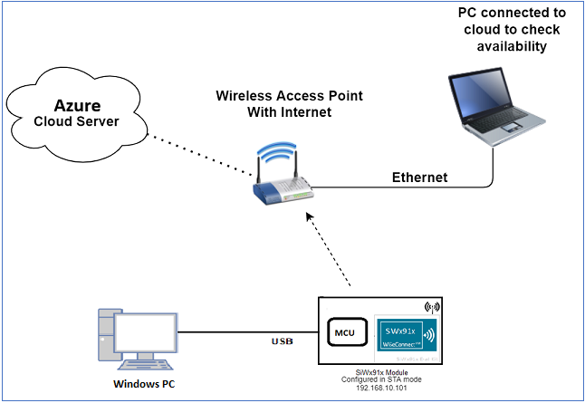
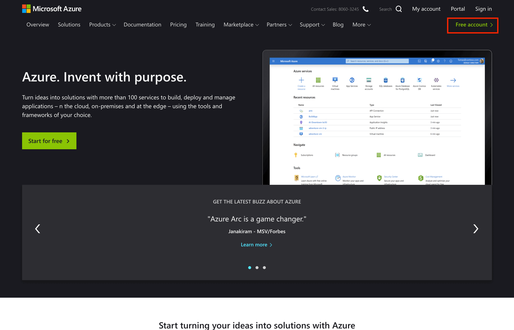
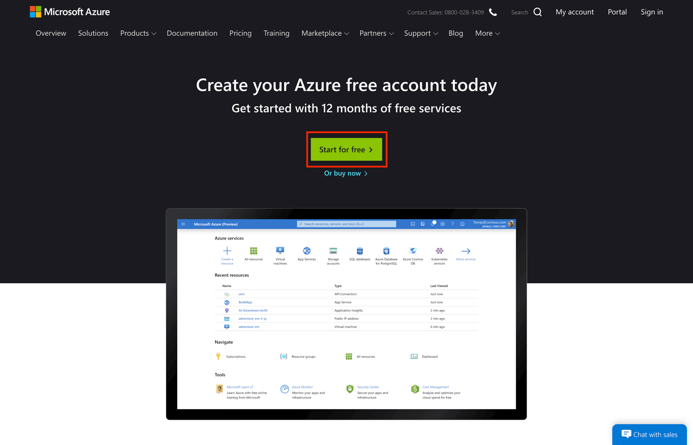
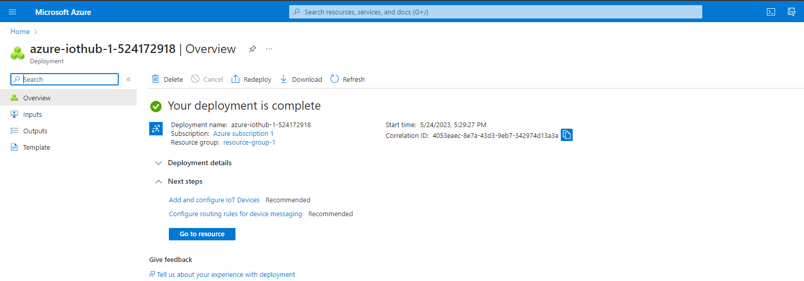
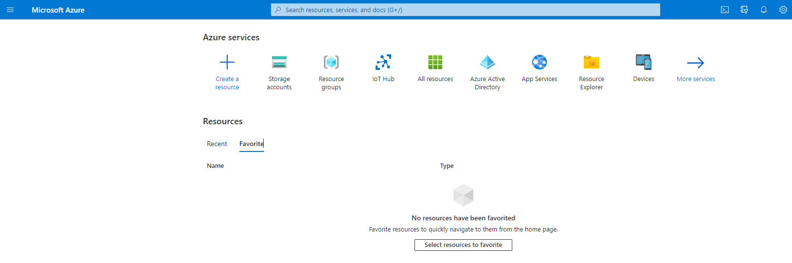

# Wi-Fi - Azure IoT MQTT Client Application

## Table of Contents

- [Purpose/Scope](#purposescope)
- [Prerequisites/Setup Requirements](#prerequisitessetup-requirements)
  - [Hardware Requirements](#hardware-requirements)
  - [Software Requirements](#software-requirements)
  - [Setup Diagram](#setup-diagram)
- [Getting Started](#getting-started)
- [Application Build Environment](#application-build-environment)
- [Test the Application](#test-the-application)
- [Steps to execute application](#follow-the-steps-below-for-successful-execution-of-the-application)
- [Appendix](#appendix)
- [Documentation](#documentation) 
## Purpose/Scope

This application demonstrates how to configure the SiWx91x module as an Azure device endpoint and how to establish a connection with Azure IoT Hub and send telemetry messages to Hub from the device (D2C) and receive the messages from the IoT Hub (C2D).

## Prerequisites/Setup Requirements

### Hardware Requirements  

- A Windows PC
- A Wireless Access Point
- SoC Mode:
  - Silicon Labs [BRD4342A, BRD4338A, BRD4343A](https://www.silabs.com/)
  - For Soc Mode, Simplicity Studio Energy Profiler can be used for the current consumption measurement - [Simplicity Studio Energy Profiler](#using-simplicity-studio-energy-profiler-for-current-measurement).
  - USB to UART converter
- NCP Mode:
  - Silicon Labs [BRD4180B](https://www.silabs.com/) **AND**
  - Host MCU Eval Kit. This example has been tested with:
    - Silicon Labs [WSTK + EFR32MG21](https://www.silabs.com/development-tools/wireless/efr32xg21-bluetooth-starter-kit)
  - Interface and Host MCU Supported
    - SPI - EFR32 

### Software Requirements

- Simplicity Studio
  - Download the [Simplicity Studio IDE](https://www.silabs.com/developers/simplicity-studio).
  - Follow the [Simplicity Studio user guide](https://docs.silabs.com/simplicity-studio-5-users-guide/1.1.0/ss-5-users-guide-getting-started/install-ss-5-and-software#install-ssv5) to install Simplicity Studio IDE.

> **Note:**
>
> - For establishing an AWS connection, it is essential for the user to replace the default certificate ([aws_client_certificate.pem.crt.h](https://github.com/SiliconLabs/wiseconnect/blob/master/resources/certificates/aws_client_certificate.pem.crt.h)) and private key ([aws_client_private_key.pem.key.h](https://github.com/SiliconLabs/wiseconnect/blob/master/resources/certificates/aws_client_private_key.pem.key.h)) with the authentic certificate and private key generated from their designated Certificate Authority (CA).
>
> - Please refer to [Setting up Security Certificates](#setting-up-security-certificates) for a complete end-to-end procedure on how to generate and use authentic certificates.

### Setup Diagram

  - **SoC:**


- **NCP:**




>**NOTE:**
>
>- The Host MCU platform (EFR32MG21) and the SiWx91x interact with each other through the SPI interface.

## Getting Started

Refer to the instructions [here](https://docs.silabs.com/wiseconnect/latest/wiseconnect-getting-started/) to:

- Install Studio and WiSeConnect 3 extension
- Connect your device to the computer
- Upgrade your connectivity firmware
- Create a Studio project

For details on the project folder structure, see the [WiSeConnect Examples](https://docs.silabs.com/wiseconnect/latest/wiseconnect-examples/#example-folder-structure) page.

## Application Build Environment

The application can be configured to suit user requirements and development environment. Read through the following sections and make any changes needed.

In the Project explorer pane, expand the **config** folder and open the ``sl_net_default_values.h`` file. Configure the following parameters to enable your Silicon Labs Wi-Fi device to connect to your Wi-Fi network.

- STA instance related parameters

	- DEFAULT_WIFI_CLIENT_PROFILE_SSID refers to the name with which Wi-Fi network that shall be advertised and Si91X module is connected to it.
	
	```c
  	#define DEFAULT_WIFI_CLIENT_PROFILE_SSID               "YOUR_AP_SSID"      
  	```

	- DEFAULT_WIFI_CLIENT_CREDENTIAL refers to the secret key if the Access point is configured in WPA-PSK/WPA2-PSK security modes.

  	```c 
  	#define DEFAULT_WIFI_CLIENT_CREDENTIAL                 "YOUR_AP_PASSPHRASE" 
  	```
  
	- DEFAULT_WIFI_CLIENT_SECURITY_TYPE refers to the security type if the Access point is configured in WPA/WPA2 or mixed security modes.
  	```c
  	#define DEFAULT_WIFI_CLIENT_SECURITY_TYPE              SL_WIFI_WPA2 
  	```
  
- Other STA instance configurations can be modified if required in `default_wifi_client_profile` configuration structure.

Open the ``demo_config.h`` file. Configure the following parameters.
- Refer to connection string from [Appendix](#appendix) 1.3.1 step 5 to define below macros:
  - IoTHub hostname.
  	```c
  	#define democonfigHOSTNAME              YOUR IOT HUB HOSTNAME HERE 
  	```

  - IoTHub device Id.
  	```c
  	#define democonfigDEVICE_ID              YOUR DEVICE ID HERE
  	```
  > **Note**
  - To Use Symmetric Key
    ```c
      #define USE_SYMMETRIC_KEY   1 
    ```
  - To Use x509 Key
    ```c
      #define USE_SYMMETRIC_KEY   0 
    ```
  > **Note** : By default Symmetric Key is set
  - Device symmetric key.
  	```c
  	#define democonfigDEVICE_SYMMETRIC_KEY              Symmetric key
  	```

  - Client's X509 Certificate.
  	```c
  	#define democonfigCLIENT_CERTIFICATE_PEM            YOUR DEVICE CERT HERE
  	```

  - Client's private key.
  	```c
  	#define democonfigCLIENT_PRIVATE_KEY_PEM            YOUR DEVICE PRIVATE KEY HERE
  	```

- Loading the certificates

  - If SAS authentication is to be used, only the CA ceritificate has to be loaded into the SiWx91x module. The CA certificate is already provided in the SDK in the linear array format (`silabs_dgcert_ca.pem.h`) and no additional configurations are required regarding the certificates.

    ```c
    // Certificate includes
    #include "silabs_dgcert_ca.pem.h"
    ```

  - If X509 authentication is to be used, Three certificates (CA certificate, device certificate and the private key certificate) are required for the authentication process and three certificates have to be loaded into the SiWx91x module. The CA certificate is provided in the SDK, but the device certificate and the private key certificates have to be generated, converted to linear array format and loaded into the module. Refer to [Register IoT Deivice with X.509 Authenticated Device with IoT Hub](#132---register-iot-deivice-with-x509-authenticated-device-with-iot-hub) regarding the process of generating, converting the certificates to linear array format and loading into the module.

    ```c
    // Certificate includes
    #include "silabs_client_cert.pem.h"
    #include "silabs_client_key.pem.h"
    #include "silabs_dgcert_ca.pem.h"
    ```

  > **Note** : This application continuously receives and sends publish messages between the cloud and the IoT Hub.

  > **Note** :
 The included Cloud connectivity certificates are for reference only, using default certificates in the release, cloud connection doesn't work. Please replace the default certificates with valid certificates while connecting to appropriate Cloud/OpenSSL Server.

## Test the Application

Refer to the instructions [here](https://docs.silabs.com/wiseconnect/latest/wiseconnect-getting-started/) to:

- Build the application.
- Flash, run and debug the application.

- SoC and NCP mode

   

   

###  Follow the steps below for successful execution of the application:

1. SiWx917 configured as Wi-Fi staion, connects to the access point with Internet connection in OPEN/WPA-PSK/WPA2-PSK mode
2. Required certificates are loaded, and SiWx917 tries to connect to the Azure IoT hub device using the credentials configured in the application.
3. The SiWx917 upon connection, will send 5 telemetry messages to Azure Hub and waits to receive atleast 5 C2D messages.
4. Refer to Appendix section [Steps to check Telemetry message on Azure cloud](#appendix-2--steps-to-check-telemetry-message-on-azure-cloud) section to check the messages sent by application to cloud in the Azure portal.
5. Refer to Appendix section [Steps to send c2d message from the cloud](#appendix-3--steps-to-send-c2d-message-from-the-cloud) section to how to send C2D messages from Azure Hub

## **Appendix**

***Appendix-1*** : **Azure Account creation and IoT Device Registration**

### 1.1 ***Azure Account creation***

- Azure offers a free 30-day trail account for all new account holders, later depending on the services you will be charged in [Pay-as-you-go way.](https://azure.microsoft.com/en-in/pricing/)

- You can follow the below steps or refer on [how to create an Azure Account.](https://docs.microsoft.com/en-us/learn/modules/create-an-azure-account/)

  **Step 1:** Navigate to <https://azure.microsoft.com/>

  **Step 2:** Click on “Free Account” in the top right



  **Step 3:** Confirm that you wish to "Start for free".



  **Step 4:** Enter the details requested to register to Microsoft Azure account. (Details like email, username, password etc...)

  **Step 5:** Finally, agree to the Microsoft Azure terms and conditions to complete the setup process.


  **Step 6:** At this stage you should be getting an Azure Link for your Azure Account.

You have now successfully created Azure account and you will be able to access all Azure Services.

### 1.2 ***Azure IoT Hub and device creation***

- Follow the steps below or refer [how to create an IoT Hub](https://docs.microsoft.com/en-us/azure/iot-hub/)
- Azure IoT Hub acts as a Gate way between IoT Devices and Azure Cloud Services
- Lets create a new IoT Hub service

- Login to your Azure account at <https://portal.azure.com/#home>

  

- Click on the “Create a resource icon”

  

- Search for “IoT Hub” in the marketplace

  

- This will open a page given below, select IoT Hub select “Create”

  

- Update the Basic details with below information

- If a resource group is already available, choose the available resource group in the Resource group drop-down. If it is not available, then create a resource group as shown in the image and click "Next: Networking >"

  

  

- Configure the following parameters (default settings) and click "Next : Management >"

  

- Configure the following parameters (default settings) and click "Next : Add-ons >"
  
  

- Configure the following parameters (default settings) and click "Next : Tags >"

  

- Configure the following parameters (default settings) and click "Next : Review + create >"

  

- Create the IoT Hub by clicking on create

  

- This should create your IoT Hub.

  

We have IoT Hub ready, now we can proceed with creating a device identity in the identity registry in the created IoT hub. A device cannot connect to a hub unless it has an entry in the identity registry.

  **Step 1:**  Navigate to your IoT Hub resource

  
  
  **Step 2:** Navigate to Device management > Devices and choose "Add Device" option

  

  To enable the device interactions after SAS authentication. Refer [Register IoT Device with symmetric key authentication in IoT Hub](#131---register-iot-device-with-symmetric-key-authentication-in-iot-hub) section.
  
  To enable the device interactions after X509 self-signed certificate authentication. Refer [Register IoT Deivice with X.509 Authenticated Device with IoT Hub](#132---register-iot-deivice-with-x509-authenticated-device-with-iot-hub) section.

### 1.3 - **Register the authentication method**

### 1.3.1 - ***Register IoT Device with symmetric key authentication in IoT Hub:***

  **Step 3:** In **Create a device,** provide a name for your new device and select authentication type as "Symmetric key" and Save. This action creates a device identity for your IoT hub.

  

  **Step 4:** After the device is created, open the device from the list in the **IoT devices** pane. Select Device created  and copy the **Primary Connection String** for use later.

  

  

  **Step 5:** For symmetric key authentication the primary connection string has to be referred.
 For example, consider below sample connection string
 HostName=example.azure-devices.net;DeviceId=example_Device_SymKey;SharedAccessKey=xxxxxx";
 then configure macros as below
 ```c
#define democonfigHOSTNAME "example.azure-devices.net"
#define democonfigDEVICE_ID "example_Device_SymKey"
#define democonfigDEVICE_SYMMETRIC_KEY "xxxxxx"
 ```
Device is now successfully registered to IoT Hub with Symmetric key authentication type.

### 1.3.2 - ***Register IoT Device with X.509 Authenticated Device with IoT Hub***

 For X.509 self-signed authentication, sometimes referred to as thumbprint authentication, you need to create certificates to place on your device. These certificates have a thumbprint in them that you share with IoT Hub for authentication.

 Follow the steps below or refer to the [Register a X.509 Device](https://docs.microsoft.com/en-us/azure/iot-edge/how-to-authenticate-downstream-device?view=iotedge-2021-11#x509-self-signed-authentication)

  **Step 1:** Generating X509 Self Signed certificates

  Generate the IoT device's x509 Certificate and the Private key certificate by using the below OpenSSL command from a Powershell window

  `Openssl req -newkey rsa:2048 -nodes -keyout azure_client_key.pem -x509 -days 365 -out azure_client_cert.pem`

  After executing the above command, user is prompted to enter details like Country Name, click enter for all the fields

 

  The following private key and device certificate files are generated

- `azure_client_key.pem`  is the private key file
- `azure_client_cert.pem` is the x509 device certificate file

 **Step 2:** Capture the x509 certificate's Fingerprint (either SHA1 or SHA256)

  command for SHA-1 : ```openssl x509 -in azure_client_cert.pem -fingerprint -noout```

  Command for SHA-256 : ```openssl x509 -in azure_client_cert.pem -fingerprint -noout -sha256```

  

   Copy the fingerprint hexadecimal number with 40 length [considering SHA1 type] and remove the **':'** from the fingerprint and the end result should look as below:

  `E2927BCA4BEBB41DE54DCCDE3148AE6AD8D175C8`

  **Step 3:** Go to Azure Portal - IoTHub to create new device with authentication type as X.509 Self-signed

  Fill the Device ID field. Choose X.509 Self-Signed as Authentication type. Enter the copied finger prints into both Primary Thumprint and Secondary Thumbprint fields.
  Click Save.

  

  **Step 4:** Converting the certificates to linear array format
  
  Copy the generated certificate file (azure_client_cert.pem) and key file (azure_client_cert.pem) into the <SDK_path>/resources/certificates

  Copy the certificate_to_array.py script from <SDK_path>/resources/scripts to <SDK_path>/resources/certificates

  Execute the following python commands to convert the generated certificate and key files into linear array format

  ```sh
  python certificate_to_array.py azure_client_cert.pem

  python certificate_to_array.py azure_client_key.pem
  ```

  The files "azure_client_cert.pem.h" and "azure_client_key.pem.h" are over-written with the contents of the certificate and keyfiles which we have generated earlier.

  **Step 5:** For X.509 self-signed authentication, there is no connection string available. We can configure as below
  ```c
  #define democonfigHOSTNAME "example.azure-devices.net"
  #define democonfigDEVICE_ID "example_Device_x509_Key"
   ```
   Device is now successfully registered with the IoT Hub with X509 self signed authentication type.

### ***Appendix-2*** : **Steps to check Telemetry message on Azure cloud**

- Login to Azure portal.

  

- Click on Cloud shell in the portal.

  

- To check the telemetry message sent from application, execute the below command in the shell:

  az iot hub monitor-events --hub-name <iot_hub_name> --output table

  eg: az iot hub monitor-events --hub-name azure-iothub-1 --output table

- The received telemetry message will be displayed as follows
  
  

### ***Appendix-3*** : **Steps to send c2d message from the cloud**

- az iot hub monitor-events --hub-name <hub_name> --output table

- Login to Azure portal and navigate to the Hub that the device is created in

  

- Click on Cloud shell in the portal.

  

- To send C2D message from the cloud, execute the following command in the azure cli:

  az iot device c2d-message send -d {YourDeviceName} -n {YourIoTHubName} --data "data sent from cloud"

  eg: az iot device c2d-message send -d device-1 -n azure-iothub-1 --data "data sent from cloud"

  

- The device upon receiving the messages will display on the terminal.

  


   ## Documentation 

- Azure middleware : [Azure middleware document](https://azure.github.io/azure-iot-middleware-freertos/)

- Core MQTT: [Core MQTT document](https://freertos.github.io/coreMQTT-Agent/main/) 
