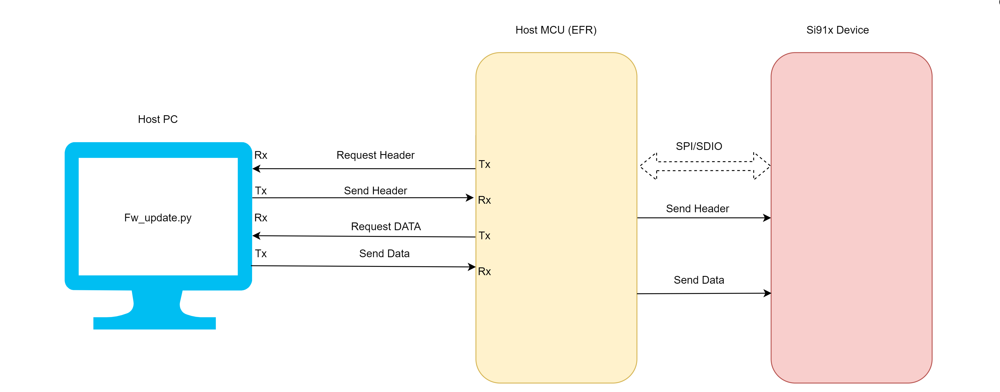
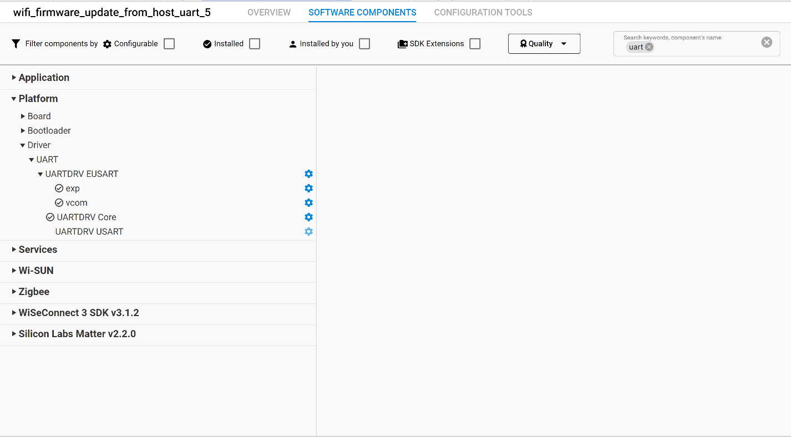
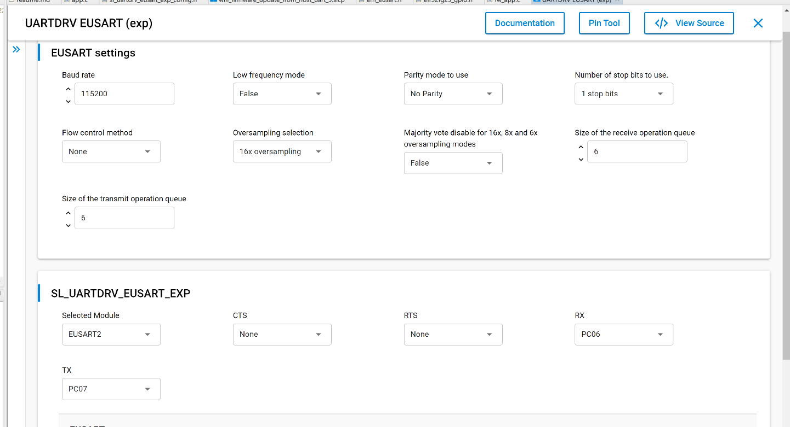
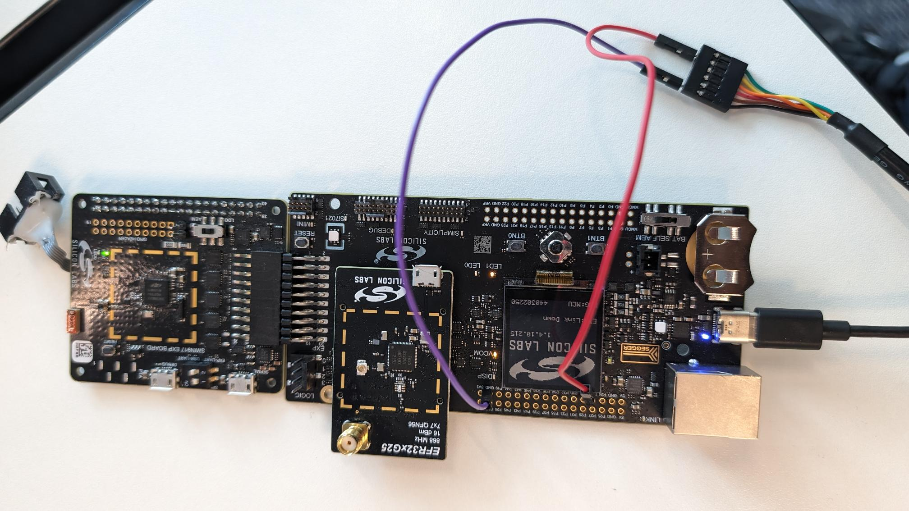
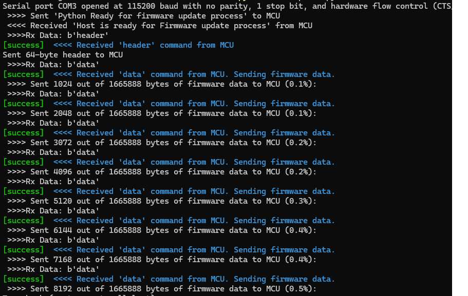
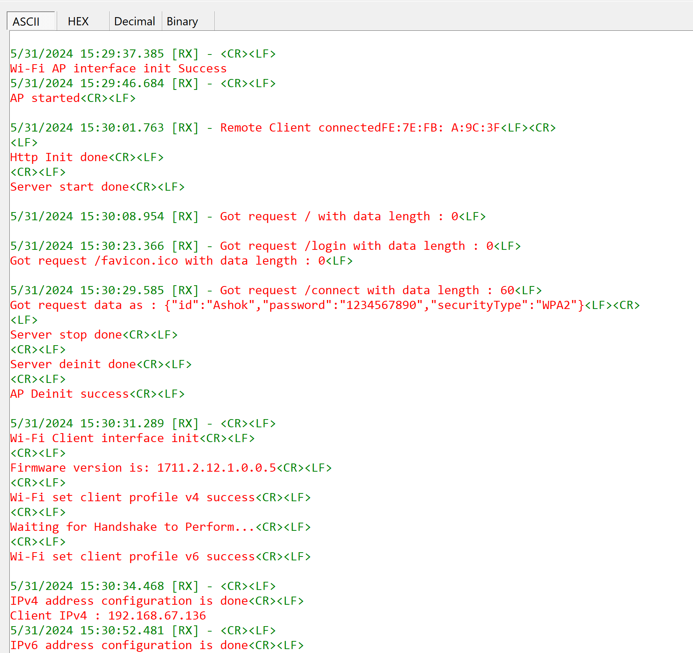
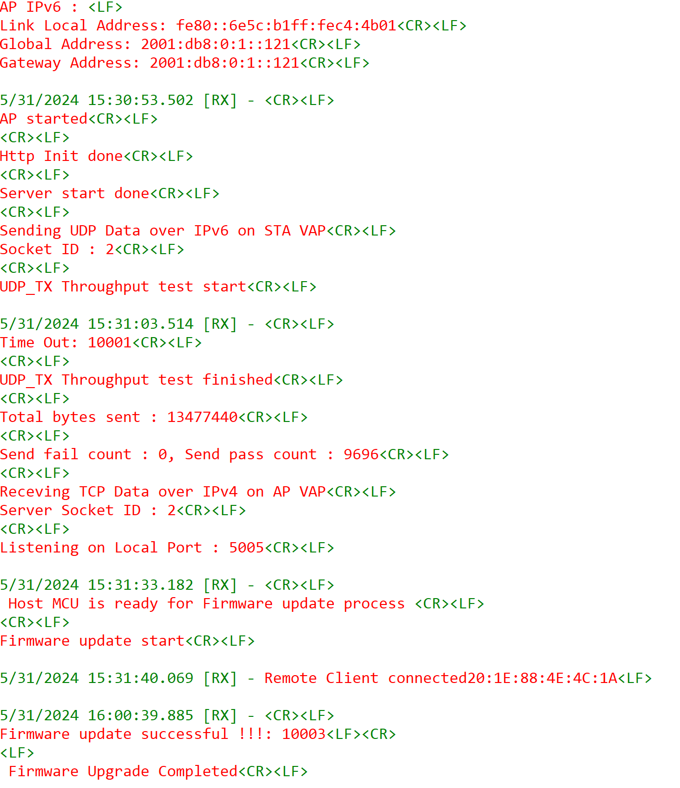

# Wi-Fi - Concurrent Firmware Update from Host UART

## Table of Contents

- [Wi-Fi - Concurrent Firmware Update from Host UART](#wi-fi---concurrent-firmware-update-from-host-uart)
  - [Table of Contents](#table-of-contents)
  - [Purpose/Scope](#purposescope)
  - [Prerequisites/Setup Requirements](#prerequisitessetup-requirements)
    - [Hardware Requirements](#hardware-requirements)
    - [Software Requirements](#software-requirements)
    - [Setup Diagram](#setup-diagram)
  - [Getting Started](#getting-started)
  - [Application Overview](#application-overview)
  - [Application Build Environment](#application-build-environment)
      - [Open **sl\_wifi\_device.h** file. You can also refer to the `sl_wifi_default_concurrent_v6_configuration` and can modify/create configurations as per your needs and requirements](#open-sl_wifi_deviceh-file-user-can-also-refer-the-sl_wifi_default_concurrent_v6_configuration-and-can-modifycreate-configurations-as-per-their-needs-and-requirements)
      - [Configure the following parameters in **app.c** to test throughput app as per requirements](#configure-the-following-parameters-in-appc-to-test-throughput-app-as-per-requirements)
    - [Run the Python script](#run-the-python-script)

## Purpose/Scope

This application showcases a multithreaded program that simultaneously manages WLAN operations (basic Tx and Rx) in concurrent mode and firmware update procedures. The system is composed of three primary elements:
  - Host PC: Contains the firmware file and the Python script for updating firmware
  - Host MCU: Acts as an intermediary between the PC and the Si91x device. It receives firmware data from the PC over UART and transfers it to the Si91x device via SPI.
  - Si91x Device: The target embedded system that needs a firmware update. It receives firmware data from the Host MCU and updates its firmware.
  
## Prerequisites/Setup Requirements

### Hardware Requirements  

- PC or Mac
- Linux PC or Cygwin on Windows (to build and run the python script provided in release_package/utilities/python)
- **NCP Mode**:
  - Standalone
    - BRD4002A Wireless Pro Kit Mainboard [SI-MB4002A]
    - NCP Expansion Kit with NCP Radio Boards
      - (BRD4346A + BRD8045A) [SiWx917-EB4346A]
      - (BRD4357A + BRD8045A) [SiWx917-EB4357A]
    - EFR32FG25 863-876 MHz +16 dBm Radio Board [FG25-RB4271A](https://www.silabs.com/development-tools/wireless/proprietary/fg25-rb4271a-efr32fg25-radio-board?tab=overview)

### Software Requirements

- Simplicity Studio IDE

### Setup Diagram



## Getting Started

Refer to the instructions [here](https://docs.silabs.com/wiseconnect/latest/wiseconnect-getting-started/) to:

- [Install Simplicity Studio](https://docs.silabs.com/wiseconnect/latest/wiseconnect-developers-guide-developing-for-silabs-hosts/#install-simplicity-studio)
- [Install WiSeConnect 3 extension](https://docs.silabs.com/wiseconnect/latest/wiseconnect-developers-guide-developing-for-silabs-hosts/#install-the-wi-se-connect-3-extension)
- [Connect your device to the computer](https://docs.silabs.com/wiseconnect/latest/wiseconnect-developers-guide-developing-for-silabs-hosts/#connect-si-wx91x-to-computer)
- [Upgrade your connectivity firmware ](https://docs.silabs.com/wiseconnect/latest/wiseconnect-developers-guide-developing-for-silabs-hosts/#update-si-wx91x-connectivity-firmware)
- [Create a Studio project ](https://docs.silabs.com/wiseconnect/latest/wiseconnect-developers-guide-developing-for-silabs-hosts/#create-a-project)

For details on the project folder structure, see the [WiSeConnect Examples](https://docs.silabs.com/wiseconnect/latest/wiseconnect-examples/#example-folder-structure) page.

## Application Overview

The application can be configured to suit your requirements and development environment. This application demonstrates how to set up the Access Point mode (SoftAP instance) for the DUT and start HTTP provisioning to obtain server third-party AP credentials through an HTTP 
webpage in order to configure the SiWx91x in both Wi-Fi Station mode (STA instance) and Access Point mode (SoftAP instance). The application thread showcases support for both IPv4 and IPv6 addressing, along with data transfer capabilities in both modes. Another thread will handle the firmware upgrade process after completing the handshake with the Python script.

## Application Build Environment

Refer to the instructions [here](https://docs.silabs.com/wiseconnect/latest/wiseconnect-getting-started/) for getting started information.

- After importing the project: 
  - Open the 'wifi_concurrent_firmware_update_from_host_uart.slcp' file.
  - Navigate to 'Software components' and look for uart as depicted in the following image:
     
  - Open the exp editor under UARTDRV EUSART by clicking on the setting icon and setting the configuration as shown below:
     
- Configure the module to use EUSART2, with the Rx pin set to PC06 and the Tx pin set to PC07.
- Connect 'P26' pin of WPK to TTL Rx and connect GND pins. Refer to the image below:
     
- In the Project explorer pane, open the **app.c** file. Configure the following parameters based on your requirements:

  - Provisioning AP uses DEFAULT_WIFI_AP_PROFILE_SSID.

  - STA connected to Provisioning AP should pass the third-party AP credentials.

  - STA connected to Provisioning AP should access 192.168.10.10/login.

  - Input SSID, PASSWORD, and SECURITY_TYPE (from dropdown).


- **Provisioning AP instance related parameters**

	- WIFI_AP_PROFILE_SSID refers to the SSID of the WiSeConnect concurrent softAP that would be created.

  	```c
  	#define DEFAULT_WIFI_AP_PROFILE_SSID                   "MY_AP_SSID"
  	```

	- WIFI_AP_CREDENTIAL refers to the secret key of the WiSeConnect concurrent softAP that would be created.

  	```c
  	#define DEFAULT_WIFI_AP_CREDENTIAL                     "MY_AP_PASSPHRASE"

  	```c
  	#define HTTP_SERVER_PORT 80
  	```

- **STA instance related parameters**

- STA instance configurations can be modified if required in the `wifi_client_profile_4` and `wifi_client_profile_6` configuration structures in app.c .

- **AP instance related parameters**

	- WIFI_AP_PROFILE_SSID refers to the SSID of the WiSeConnect concurrent softAP that would be created.

  	```c
  	#define WIFI_AP_PROFILE_SSID                   "MY_DUAL_AP_SSID"
  	```

	- WIFI_AP_CREDENTIAL refers to the secret key of the WiSeConnect concurrent softAP that would be created.

  	```c
  	#define WIFI_AP_CREDENTIAL                     "MY_AP_PASSPHRASE"
    ```
- Other AP instance configurations can be modified if required in the `wifi_ap_profile_4` and `wifi_ap_profile_6` configuration structures.

> Note:
>
> 1. In concurrent mode, STA and AP should be configured on the same channel. The STA instance shall first scan for the specified external AP, wherein the channel number of AP is fetched and passed as an argument during SoftAP creation.
> 2. Valid values for CHANNEL_NO are 1 to 11 in 2.4 GHz band and 36 to 48 and 149 to 165 in 5 GHz. In this example, the default configured band is 2.4 GHz.


> Note:
>
> 1. This application provides the facility to configure the access point’s IP Parameters. The IPv4 address for the Silicon Labs access point is **192.168.10.10** and the IPv6 address for the Silicon Labs access point is **2001:db8:0:1::121**
> 2. In concurrent mode, the IP networks of Silicon Labs STA and Silicon Labs access point should both be different. Configure Wireless Access Point IP network (Ex: 192.168.0.1) other than the Silicon Labs access point IP network.

#### Open **sl_wifi_device.h** file. You can also refer to `sl_wifi_default_concurrent_v6_configuration` and modify/create configurations as per your needs and requirements.
>
> Note: In `sl_wifi_default_concurrent_v6_configuration`, `oper_mode` must be `SL_SI91X_CONCURRENT_MODE` for this example.

> Note: 
> You can configure default region-specific regulatory information using `sl_wifi_region_db_config.h`.

#### Configure the following parameters in **app.c** to test throughput app as per requirements

- **Client/Server IP Settings**

    ```c
    #define LISTENING_PORT     <local_port>       // Local port to use
    #define SERVER_PORT        <remote_port>      // Remote server port
    #define SERVER_IP		   "2401:4290:1245:11ed::4"    // Remote 

- **Data Transfer Test options**

    ```c
    #define BYTES_TO_SEND     (1 << 29)     // To measure TX throughput
    #define TEST_TIMEOUT      10000         // Throughput test timeout in ms
- Build the application
- Flash, run, and debug the application
- Note that application should start before python script is initiated.

### Run the Python Script

  1. This demo creates a serial connection with the microcontroller and uses standard baud rate 115200 for communication.
  2. The script initiates a handshake with the HostMCU to confirm its preparedness. If HostMCU is ready, the script will send firmware data.
  3. By default, this script will send the firmware image in 1k chunk till end of file on HostMCU Rx UART port.
  4. Go to the Python script location [fw_update_from_host_uart.py] provided in release packaage/utilities/python. 
  5. Modify the COM port and baudrate as needed.
  6. Open script in command prompt.
  7. Include the Python libraries pyserial and print-color before executing the script.
     1. Install the pyserial library by using the command: 'pip install pyserial'
     2. Install the print-color library by using the command: 'pip install print-color'
      ```c
  	  C:\Users\Downloads\release_package> python fw_update_from_host_uart_script.py <firmware_file_path/SiWx91x.NBZ.WC.GEN.OSI.x.x.x.rps> 
	    ```

        
        
        
     3. When the firmware update completes, the SiWx91x should be rebooted, after which it may take a few minutes to overwrite the old firmware with the new firmware in flash memory.
         
         
         
  8. If users intend to employ different configurations, they must make corresponding adjustments in both the Python script and the Host UART configuration.

Note: Python 3.9.0 version used to test this application.
