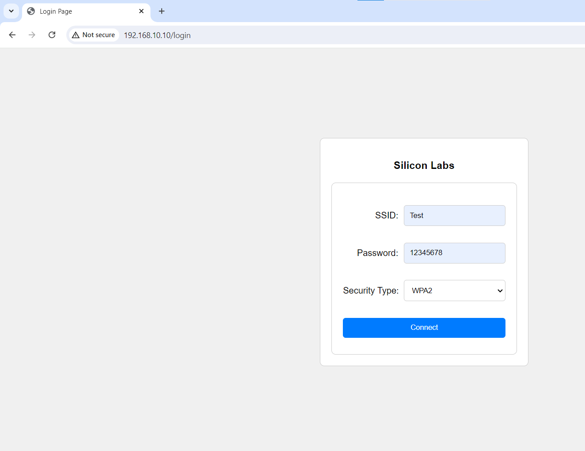
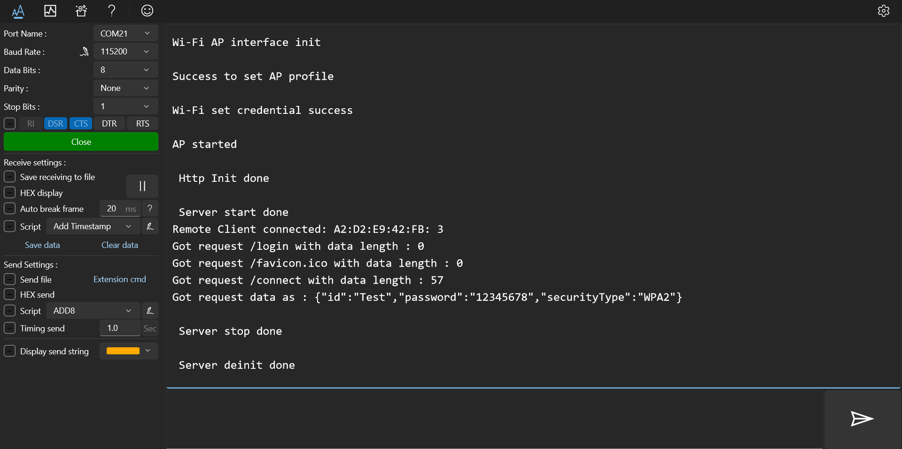
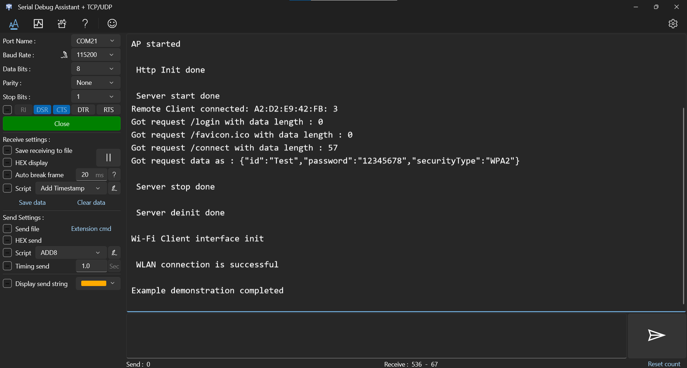

# Wi-Fi - Concurrent HTTP Server

## Table of Contents

- [Wi-Fi - Concurrent HTTP Server](#wi-fi---concurrent-http-server)
  - [Table of Contents](#table-of-contents)
  - [Purpose/Scope](#purposescope)
  - [Prerequisites/Setup Requirements](#prerequisitessetup-requirements)
    - [Hardware Requirements](#hardware-requirements)
    - [Software Requirements](#software-requirements)
  - [Getting Started](#getting-started)
  - [Application Build Environment](#application-build-environment)
  - [Test the Application](#test-the-application)
  - [Steps to create webpage](#steps-to-create-webpage)
  - [Steps to add additional information on webpage](#steps-to-add-additional-information-on-webpage)

## Purpose/Scope

This application demonstrates how to configure the HTTP Server in SiWx91x in concurrent mode, i.e., in both Wi-Fi Station mode (STA instance) and Access Point mode (SoftAP instance).
In this example application, the SiWx91x's AP instance acts as an HTTP Server and the client instance can connect to a wireless Access Point using the webpage that is served by HTTP Server.

## Prerequisites/Setup Requirements

### Hardware Requirements

- Windows PC
- SoC Mode:
  - Silicon Labs [BRD4388A](https://www.silabs.com/)
- NCP Mode:
  - Standalone
    - BRD4002A Wireless Pro Kit Mainboard [SI-MB4002A]
    - EFR32xG24 Wireless 2.4 GHz +10 dBm Radio Board [xG24-RB4186C](https://www.silabs.com/development-tools/wireless/xg24-rb4186c-efr32xg24-wireless-gecko-radio-board?tab=overview)
    - NCP Expansion Kit with NCP Radio Boards
      - (BRD4346A + BRD8045A) [SiWx917-EB4346A]
      - (BRD4357A + BRD8045A) [SiWx917-EB4357A]

### Software Requirements

- Simplicity Studio


## Getting Started

Refer to the instructions [here](https://docs.silabs.com/wiseconnect/latest/wiseconnect-getting-started/) to:

- [Install Simplicity Studio](https://docs.silabs.com/wiseconnect/latest/wiseconnect-developers-guide-developing-for-silabs-hosts/#install-simplicity-studio)
- [Install WiSeConnect 3 extension](https://docs.silabs.com/wiseconnect/latest/wiseconnect-developers-guide-developing-for-silabs-hosts/#install-the-wi-se-connect-3-extension)
- [Connect your device to the computer](https://docs.silabs.com/wiseconnect/latest/wiseconnect-developers-guide-developing-for-silabs-hosts/#connect-si-wx91x-to-computer)
- [Upgrade your connectivity firmware ](https://docs.silabs.com/wiseconnect/latest/wiseconnect-developers-guide-developing-for-silabs-hosts/#update-si-wx91x-connectivity-firmware)
- [Create a Studio project ](https://docs.silabs.com/wiseconnect/latest/wiseconnect-developers-guide-developing-for-silabs-hosts/#create-a-project)

For details on the project folder structure, see the [WiSeConnect Examples](https://docs.silabs.com/wiseconnect/latest/wiseconnect-examples/#example-folder-structure) page.

## Application Build Environment

The application can be configured to suit your requirements and development environment. Read through the following sections and make any changes needed.

  - Configure the following parameters in ``app.c`` to test the HTTP Server app as per requirements:

  - HTTP Server Port and IP Settings

    ```c
    #define HTTP_SERVER_PORT           80                 // Http server port
    ```

- AP instance related parameters

	- CHANNEL_NUMBER refers to the specific frequency band the Access Point operates on, which should match the client mode's AP for successful communication.

  	```c
  	#define CHANNEL_NUMBER                     1
    ```

	- WIFI_AP_PROFILE_SSID refers to the SSID of the WiSeConnect softAP that would be created.

  	```c
  	#define WIFI_AP_PROFILE_SSID                   "MY_AP_SSID"
  	```

	- WIFI_AP_CREDENTIAL refers to the secret key of the WiSeConnect softAP that would be created.

  	```c
  	#define WIFI_AP_CREDENTIAL                     "MY_AP_PASSPHRASE"
    ```

NOTE:
> 1. In concurrent mode, STA and AP should be configured on the same channel. 
> 2. Valid values for CHANNEL_NO are 1 to 11 in 2.4 GHz band and 36 to 48 and 149 to 165 in 5 GHz. In this example, default configured band is 2.4 GHz.
> 3. The `sli_si91x_accept_async` function in sl_http_server_start is not thread-safe.

NOTE:
> Procedure to run the example:
> 1. Flash the application onto your device and run it. Upon successful execution, the SiWx91x will act as an Access Point (AP) with the SSID set to WIFI_AP_PROFILE_SSID and the password set to WIFI_AP_CREDENTIAL.
>
> 2. The application will initialize a server in AP mode and add default request handlers for the "/login" and "/connect" URIs.
>
> 3. Once the server is started, connect a client device to the server. Open a web browser on the client device and navigate to the IP address of the SiWx91x module with the URI set to /login. The default IP address is 192.168.10.10, so you can access it using 192.168.10.10/login.
>
> 4. On the webpage, enter the correct SSID, Password, and Security Type, then click on Connect.
>
> 5. The server will stop, and the credentials from the webpage will be retrieved through a "/connect" POST request.
>
> 6. The SiWx91x will then connect to the AP specified on the webpage in client mode.
>
> 7. After serving the request, the HTTP Server will be stopped and deinitialized.

> **Note**: For recommended settings, see the [recommendations guide](https://docs.silabs.com/wiseconnect/latest/wiseconnect-developers-guide-prog-recommended-settings/).

## Test the Application

Refer to the instructions [here](https://docs.silabs.com/wiseconnect/latest/wiseconnect-getting-started/) to:

- Build the application.
>
> Note: 
> - The default SSID is "MY_AP_SSID" and passphrase is "MY_AP_PASSPHRASE". You may either use these or modify them as described in the [Application Build Environment](#application-build-environment) section.
- Flash, run, and debug the application.

   

   
   

  ## Steps to create webpage
  >Steps to update login handler:
  >1. Develop a new webpage similar to login.h.
  >2. Register the new request handler in  sl_http_server_handler_t structure in app.c.
  >3. Implement a new handler in app.c and update the data field in the server response structure accordingly.

  > Steps to update connect handler
  >1. Modify the open() method in the login.h file.
  >2. Modify the action attribute of the form tag in the login.h file.
  >3. Register the new request handler in  sl_http_server_handler_t structure in app.c.

  ## Steps to add additional information on webpage
  > If the user wants to add additional information to the webpage, they need to update the login.h file.
