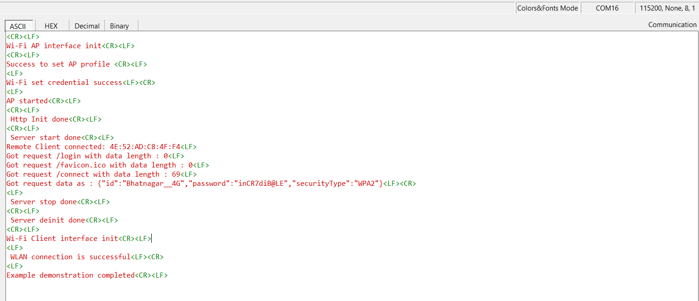

# Wi-Fi - Concurrent HTTP Server

## Table of Contents

- [Purpose/Scope](#purposescope)
- [Prerequisites/Setup Requirements](#prerequisitessetup-requirements)
  - [Hardware Requirements](#hardware-requirements)
  - [Software Requirements](#software-requirements)
  - [Setup Diagram](#setup-diagram)
- [Getting Started](#getting-started)
- [Application Build Environment](#application-build-environment)
- [Procedure to run the example](#procedure-to-run-the-example)
- [Test the Application](#test-the-application)

## Purpose/Scope

This application demonstrates how to configure the HTTP Server in SiWx91x in concurrent mode i.e., in both Wi-Fi Station mode (STA instance) and Access Point mode (SoftAP instance).
In this example application, the SiWx91x's AP instance acts as HTTP Server and the client instance can connect to a wireless Access Point using the webpage that is served by HTTP Server.

## Prerequisites/Setup Requirements

### Hardware Requirements

- A Windows PC.
- SoC Mode:
  - Silicon Labs [BRD4325A, BRD4325B, BRD4325C, BRD4325G, BRD4388A, BRD4339B](https://www.silabs.com/)
- NCP Mode:
  - Standalone
    - BRD4002A Wireless pro kit mainboard [SI-MB4002A]
    - EFR32xG24 Wireless 2.4 GHz +10 dBm Radio Board [xG24-RB4186C](https://www.silabs.com/development-tools/wireless/xg24-rb4186c-efr32xg24-wireless-gecko-radio-board?tab=overview)
    - NCP EFR Expansion Kit with NCP Radio board (BRD4346A + BRD8045A) [SiWx917-EB4346A]

### Software Requirements

- Simplicity Studio


## Getting Started

Refer to the instructions [here](https://docs.silabs.com/wiseconnect/latest/wiseconnect-getting-started/) to:

- Install Studio and WiSeConnect 3 extension
- Connect your device to the computer
- Upgrade your connectivity firmware
- Create a Studio project

For details on the project folder structure, see the [WiSeConnect Examples](https://docs.silabs.com/wiseconnect/latest/wiseconnect-examples/#example-folder-structure) page.

## Application Build Environment

The application can be configured to suit user requirements and development environment. Read through the following sections and make any changes needed.

  - Configure the following parameters in ``app.c`` to test HTTP Server app as per requirements

  - HTTP Server Port and IP Settings

    ```c
    #define HTTP_SERVER_PORT           80                 // Http server port
    ```

- AP instance related parameters

	- CHANNEL_NUMBER refers to the specific frequency band the Access Point operates on, which should match the client mode's AP for successful communication.

  	```c
  	#define CHANNEL_NUMBER                     1
    ```

	- WIFI_AP_PROFILE_SSID refers to the SSID of the WiSeConnect softAP that would be created.

  	```c
  	#define WIFI_AP_PROFILE_SSID                   "MY_AP_SSID"
  	```

	- WIFI_AP_CREDENTIAL refers to the secret key of the WiSeConnect softAP that would be created.

  	```c
  	#define WIFI_AP_CREDENTIAL                     "MY_AP_PASSPHRASE"
    ```

NOTE:
> 1. In concurrent mode, STA and AP should be configured on the same channel. 
> 2. Valid values for CHANNEL_NO are 1 to 11 in 2.4GHz band and 36 to 48 & 149 to 165 in 5GHz. In this example, default configured band is 2.4GHz.
> 3. The `sli_si91x_accept_async` function in sl_http_server_start is not thread-safe.

NOTE:
> Procedure to run the example
> 1. Flash the application onto your device and run it. Upon successful execution, the SiWx91x will act as an Access Point (AP) with the SSID set to WIFI_AP_PROFILE_SSID and the password set to WIFI_AP_CREDENTIAL.
>
> 2. The application will initialize a server in AP mode and add default request handlers for the "/login" and "/connect" URIs.
>
> 3. Once the server is started, connect a client device to the server. Open a web browser on the client device and navigate to the IP address of the SiWx91x module with the URI set to /login. The default IP address is 192.168.10.10, so you can access it using 192.168.10.10/login.
>
> 4. On the webpage, enter the correct SSID, Password, and Security Type, then click on Connect.
>
> 5. The server will stop, and the credentials from the webpage will be retrieved through a "/connect" POST request.
>
> 6. The SiWx91x will then connect to the AP specified on the webpage in client mode.
>
> 7. After serving the request, the HTTP Server will be stopped and deinitialized.

## Test the Application

Refer to the instructions [here](https://docs.silabs.com/wiseconnect/latest/wiseconnect-getting-started/) to:

- Build the application.
>
> Note: 
> - The default SSID is "MY_AP_SSID" and passphrase is "MY_AP_PASSPHRASE". You may either use these or modify them as described in the [Application Build Environment](#application-build-environment) section.
- Flash, run and debug the application.

   

   
