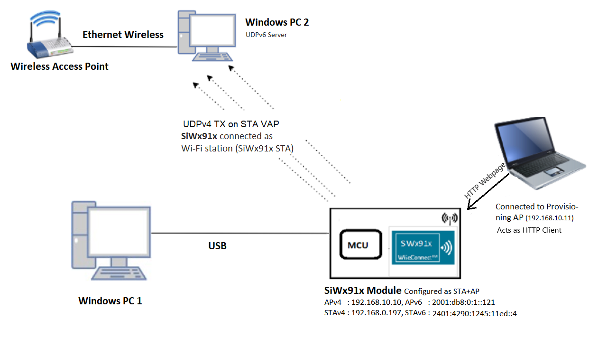
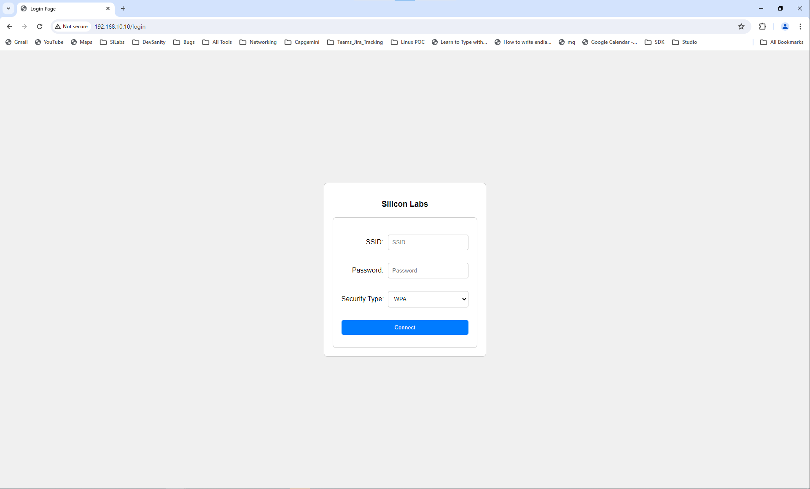
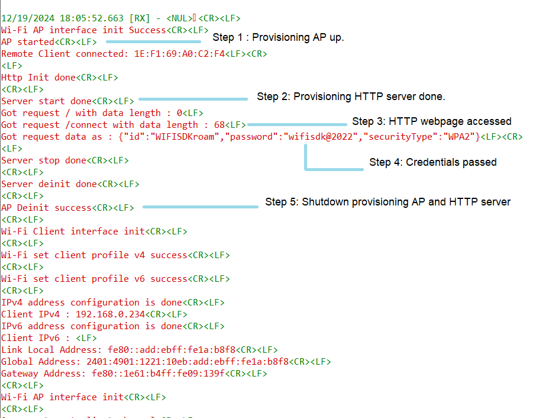

# Wi-Fi - Concurrent HTTP Server Provisioning

## Table of Contents

- [Purpose/Scope](#purposescope)
- [Prerequisites/Setup Requirements](#prerequisitessetup-requirements)
  - [Hardware Requirements](#hardware-requirements)
  - [Software Requirements](#software-requirements)
  - [Setup Diagram](#setup-diagram)
- [Getting Started](#getting-started)
- [Application Build Environment](#application-build-environment)
- [Test the Application](#test-the-application)

## Purpose/Scope

*This application demonstrates how to configure the SiWx91x in concurrent mode, i.e., in both Wi-Fi Station mode (STA instance) and Access Point mode (SoftAP instance) with HTTP Provisioning.*

In this example application, the SiWx91x is configured as Provisioning Access Point (SiWx91x Provisioning AP instance) which acts as an HTTP server (Provisioning HTTP server) to obtain the SSID, PSK, and SECURITY_TYPE of a third-party AP (where SiWx91x STA should be connected). A third-party station connects to the SiWx91x Provisioning AP and using the webpage serverd by the Provisioning HTTP server and provides the third-party AP cerdentials (to which SiWx91x STA should be connected). After obtaining the third-party AP credentials, the Provisioning HTTP server and the SiWx91x Provisioning AP will shutdown.

Now, the SiWx91x will bring-up as Wi-Fi Station mode (SiWx91x STA instance) with the obtained third-party AP credentials and Access Point mode (SoftAP instance). The HTTP server is initialized again on SoftAP instance (SoftAP HTTP server).

It showcases support for both IPv4 and IPv6 addressing, along with data transfer capabilities, i.e., UDPv6 TX data transfer in SiWx91x STA mode and TCPv4 RX data transfer in SoftAP mode. The SiWx91x opens a UDPv6 client socket on the SiWx91x STA instance and sends data to the UDPv6 server connected to the third-party AP. On the SoftAP instance, a TCPv4 server socket is listening to receive data from a TCPv4 client connected to the SoftAP.

If SiWx91x STA disconnects from the third-party AP, then the SoftAP HTTP server and the SoftAP instance are shutdown and the SiWx91x STA tries to reconnect to the third-party AP for a maximum of five times. If SiWx91x STA is unable to connect to the third-party AP, then SiWx91x will deinitialize and start the application from the beginning (From the SoftAP being up as a Provisioning AP).


## Prerequisites/Setup Requirements

### Hardware Requirements

- Windows PC
- Wireless Access Point
- **SoC Mode**:
  - Standalone
    - BRD4002A Wireless Pro Kit Mainboard [SI-MB4002A]
    - Radio Boards 
  	  - BRD4338A [SiWx917-RB4338A]
  	  - BRD4343A [SiWx917-RB4343A]
  - Kits
  	- SiWx917 Pro Kit [Si917-PK6031A](https://www.silabs.com/development-tools/wireless/wi-fi/siwx917-pro-kit?tab=overview)
  	- SiWx917 Pro Kit [Si917-PK6032A]
    - SiWx917 AC1 Module Explorer Kit (BRD2708A)
  	
- **NCP Mode**:
  - Standalone
    - BRD4002A Wireless pro kit mainboard [SI-MB4002A]
    - EFR32xG24 Wireless 2.4 GHz +10 dBm Radio Board [xG24-RB4186C](https://www.silabs.com/development-tools/wireless/xg24-rb4186c-efr32xg24-wireless-gecko-radio-board?tab=overview)
    - EFR32FG25 863-876 MHz +16 dBm Radio Board [FG25-RB4271A](https://www.silabs.com/development-tools/wireless/proprietary/fg25-rb4271a-efr32fg25-radio-board?tab=overview)
    - NCP Expansion Kit with NCP Radio Boards
      - (BRD4346A + BRD8045A) [SiWx917-EB4346A]
      - (BRD4357A + BRD8045A) [SiWx917-EB4357A]
  - Kits
  	- EFR32xG24 Pro Kit +10 dBm [xG24-PK6009A](https://www.silabs.com/development-tools/wireless/efr32xg24-pro-kit-10-dbm?tab=overview)

  **NOTE**:

  - The Host MCU platform (EFR32MG21) and the SiWx91x interact with each other through the SPI interface.

### Software Requirements

- Simplicity Studio

### Setup Diagram



## Getting Started

Refer to the instructions [here](https://docs.silabs.com/wiseconnect/latest/wiseconnect-getting-started/) to:

- [Install Simplicity Studio](https://docs.silabs.com/wiseconnect/latest/wiseconnect-developers-guide-developing-for-silabs-hosts/#install-simplicity-studio)
- [Install WiSeConnect 3 extension](https://docs.silabs.com/wiseconnect/latest/wiseconnect-developers-guide-developing-for-silabs-hosts/#install-the-wi-se-connect-3-extension)
- [Connect your device to the computer](https://docs.silabs.com/wiseconnect/latest/wiseconnect-developers-guide-developing-for-silabs-hosts/#connect-si-wx91x-to-computer)
- [Upgrade your connectivity firmware ](https://docs.silabs.com/wiseconnect/latest/wiseconnect-developers-guide-developing-for-silabs-hosts/#update-si-wx91x-connectivity-firmware)
- [Create a Studio project ](https://docs.silabs.com/wiseconnect/latest/wiseconnect-developers-guide-developing-for-silabs-hosts/#create-a-project)

## Application Build Environment

The application can be configured to suit your requirements and development environment. Read through the following sections and make any changes needed.

1. In the Project explorer pane, expand the **config** folder and open the **sl_net_default_values.h** file.
- **SiWx91x Provisioning AP instance related parameters**

	- DEFAULT_WIFI_AP_PROFILE_SSID refers to the SSID of the SiWx91x Provisioning AP that would be created.

  	```c
  	#define DEFAULT_WIFI_AP_PROFILE_SSID                   "MY_AP_SSID"
  	```

	- DEFAULT_WIFI_AP_CREDENTIAL refers to the secret key of the SiWx91x Provisioning AP that would be created.

  	```c
  	#define DEFAULT_WIFI_AP_CREDENTIAL                     "MY_AP_PASSPHRASE"
  	```

	-  HTTP_SERVER_PORT refers to the port number of the SiWx91x Provisioning AP's HTTP server that would be created.

  	```c
  	#define HTTP_SERVER_PORT 80
  	```
    
2. Configure the following parameters in **app.c** to test Concurrent HTTP Server Provisioning app as per requirements.

- **SiWx91x STA instance related parameters**

    - SiWx91x STA instance configurations are obtained from HTTP Server.

    - Retry refers to the number of retries SiWx917 has to perform if unable to connect.

    ```c
    uint8_t retry                   = 5;
    ```

    - Other SiWx91x STA instance configurations can be modified if required in the `wifi_client_profile_4` and `wifi_client_profile_6` configuration structures in app.c.

- **SiWx91x SoftAP instance related parameters**

	- WIFI_AP_PROFILE_SSID refers to the SSID of the SiWx91x softAP that would be created.

  	```c
  	#define WIFI_AP_PROFILE_SSID                   "MY_DUAL_AP_SSID"
  	```

	- WIFI_AP_CREDENTIAL refers to the secret key of the SiWx91x softAP that would be created.

  	```c
  	#define WIFI_AP_CREDENTIAL                     "MY_AP_PASSPHRASE"
    ```
  - Other SoftAP instance configurations can be modified if required in the `wifi_ap_profile_4` and `wifi_ap_profile_6` configuration structures.

> Note:
>
> 1. In concurrent mode, STA and AP should be configured on the same channel. The STA instance shall first scan for the specified external AP, wherein the channel number of AP is fetched and passed as an argument during SoftAP creation.
> 2. Valid values for CHANNEL_NO are 1 to 11 in 2.4 GHz band and 36 to 48 and 149 to 165 in 5 GHz. In this example, the default configured band is 2.4 GHz.


> Note:
>
> 1. This application provides the facility to configure the Access Point’s IP Parameters. The IPv4 address for the Silicon Labs Access point is **192.168.10.10** and the IPv6 address for the Silicon Labs Access point is **2001:db8:0:1::121**.
> 2. In concurrent mode, the IP networks of Silicon Labs STA and Silicon Labs Access Point should both be different. Configure Wireless Access Point IP network (Ex: IPv4:- 192.168.0.1 and IPv6:- 2401:4290:1245:11ed::121) other than Silicon Labs Access point IP network.

#### Open **sl_wifi_device.h** file. You can also refer to `sl_wifi_default_concurrent_v6_configuration` and modify/create configurations as per your needs and requirements.
>
> Note: In `sl_wifi_default_concurrent_v6_configuration`, `oper_mode` must be `SL_SI91X_CONCURRENT_MODE` for this example.

> Note: 
> You can configure default region-specific regulatory information using `sl_wifi_region_db_config.h`.

#### Configure the following parameters in **app.c** to test throughput app as per requirements

- **Client/Server IP Settings**

    ```c
    #define LISTENING_PORT           5005             // Local port used for TCP_RX on AP VAP
    #define SERVER_PORT              5000             // Remote server's port used for UDP_TX on STA VAP
    #define SERVER_IP		   "2401:4290:1245:11ed::4"   // Remote server's IPv6 address used for UDP_TX on STA VAP
    ```

- **Data Transfer Test options**

    ```c
    #define BYTES_TO_SEND     (1 << 29)               // To measure TX throughput with 512 MB data transfer
    #define TEST_TIMEOUT      10000                   // Throughput test timeout in ms
    ```

## Test the Application

Refer to the instructions [here](https://docs.silabs.com/wiseconnect/latest/wiseconnect-getting-started/) to:

- Build the application.
- Flash, run, and debug the application.

**Step 1** : Upon successful execution, the SiWx91x will act as Provisioning Access Point (SiWx91x Provisioning AP).

**Step 2** : The application will initialize an HTTP server in SiWx91x Provisioning AP mode (Provisioning HTTP server) and add default request handlers for the "/login" and "/connect" URIs.



**Step 3** : Once the Provisioning HTTP server is started, connect a third-party station to the SiWx91x Provisioning AP. Open a web browser on the third-party station and navigate to the IP address of the SiWx91x with the URI set to /login. The default IP address is 192.168.10.10, so you can access it using 192.168.10.10/login.

**Step 4** : On the webpage, enter the correct SSID, Password, and Security Type of the third-party AP credentials, then click on Connect.

**Step 5** : The credentials from the webpage will be retrieved through a "/connect" POST request. Provisioning HTTP server and the SiWx91x Provisioning AP will be shutdown.

**Step 6** : The SiWx91x STA will then connect to the third-party AP specified on the webpage in client mode and SiWx91x SoftAP will start advertising.

**Step 7** : HTTP server is initialized again on SoftAP instance (SoftAP HTTP server).

**Step 8** : IPv6 UDP_TX data transfer is performed on SiWx91x STA and IPv4 TCP_RX data transfer is performed on SiWx91x SoftAP. Client device should connect to the SiWx91x SoftAP to send IPv4 TCP data.

**Step 9** : To trigger rejoin failure on SiWx91x STA, change the SSID, PSK, or CH_NO of the third-party AP by opening it's Admin/login page. Once rejoin is triggered, SiWx91x will shutdown the SoftAP HTTP server and SiWx91x SoftAP. SiWx917 STA then tries to reconnect to the same third-party AP. If unable to reconnect, SiWx917 deinits and goes to Step 1.

>
> Note:
>
> When data transfer occurs, communication happens between the client-side and the server-side. Typically, it's recommended to initiate the server first, as the client immediately attempts to establish a connection to transmit data.

The following sections describe how to run the SiWx91x application together with examples for UDP and TCP iPerf configurations that run on the PC.

### UDP Tx on IPv6

To use IPv6 UDP Tx, the SiWx91x STA is configured as a UDP client and starts a UDP server on the remote PC. 
The iPerf command to start the IPv6 UDP server on remote PC is:

> `C:\> iperf.exe -s -u -V -p <SERVER_PORT> -i 1`
>
> For example ...
>
> `C:\> iperf.exe -s -u -V -p 5000 -i 1`

### TCP Rx on IPv4

To use TCPv4 Rx, the SiWx91x SoftAP is configured as a TCP server and starts a TCP client on the remote PC.
The iPerf command to start the IPv4 TCP client on remote PC is:

> `C:\> iperf.exe -c <Module_IP>-p <module_PORT> -i 1 -t <time interval in sec>`
>
> For example ...
>
> `C:\> iperf.exe -c 192.168.10.10 -p 5005 -i 1 -t 30`

The SiWx91x STA, which is configured as a UDP IPv6 client, connects to the iPerf server and sends data at configured intervals. While the SiWx91x SoftAP is configured as TCP, IPv4 server waits for connection, and the application prints the total number of bytes sent/received on the serial console.

## Application Output

   
   
