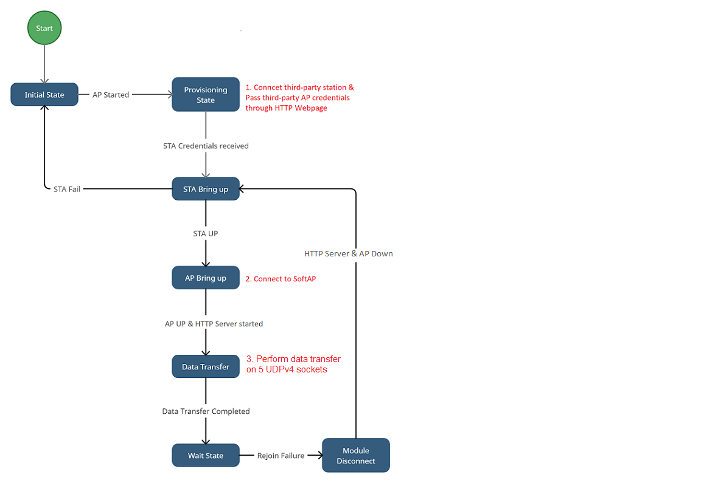
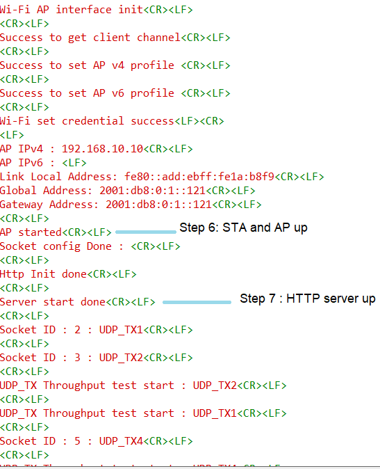

# Wi-Fi - Concurrent HTTP Server Provisioning

## Table of Contents

- [Purpose/Scope](#purposescope)
- [Prerequisites/Setup Requirements](#prerequisitessetup-requirements)
  - [Hardware Requirements](#hardware-requirements)
  - [Software Requirements](#software-requirements)
  - [Setup Diagram](#setup-diagram)
- [Getting Started](#getting-started)
- [Application Build Environment](#application-build-environment)
- [Test the Application](#test-the-application)

## Purpose/Scope

*This application demonstrates how to configure the SiWx91x in concurrent mode, i.e., in both Wi-Fi Station mode (STA instance) and Access Point mode (SoftAP instance) with HTTP Provisioning.*

In this example application, the SiWx91x is configured as Provisioning Access Point (SiWx91x Provisioning AP instance) which acts as an HTTP server (Provisioning HTTP server) to obtain the SSID, PSK, and SECURITY_TYPE of a third-party AP (where SiWx91x STA should be connected). A third-party station connects to the SiWx91x Provisioning AP and using the webpage serverd by the Provisioning HTTP server and provides the third-party AP cerdentials (to which SiWx91x STA should be connected). After obtaining the third-party AP credentials, the Provisioning HTTP server and the SiWx91x Provisioning AP will shutdown.

Now, the SiWx91x will bring-up as Wi-Fi Station mode (SiWx91x STA instance) with the obtained third-party AP credentials and Access Point mode (SoftAP instance). The HTTP server is initialized again on SoftAP instance (SoftAP HTTP server).

It showcases support for both IPv4 and IPv6 addressing, along with data transfer capabilities, i.e., UDPv4 TX data transfer in SiWx91x STA mode . The SiWx91x opens a UDPv6 client socket on the SiWx91x STA instance and sends data to the UDPv4 server connected to the third-party AP. On the SoftAP instance, a UDPv4 server socket is listening to receive data from a UDPv4 client connected to the SoftAP.

If SiWx91x STA disconnects from the third-party AP, then the SoftAP HTTP server and the SoftAP instance are shutdown and the SiWx91x STA tries to reconnect to the third-party AP for a maximum of five times. If SiWx91x STA is unable to connect to the third-party AP, then SiWx91x will deinitialize and start the application from the beginning (From the SoftAP being up as a Provisioning AP).


## Prerequisites/Setup Requirements

### Hardware Requirements

- Windows PC
- Wireless Access Point
- **SoC Mode**:
  - Standalone
    - BRD4002A Wireless Pro Kit Mainboard [SI-MB4002A]
    - Radio Boards 
  	  - BRD4338A [SiWx917-RB4338A]
  	  - BRD4343A [SiWx917-RB4343A]
  - Kits
  	- SiWx917 Pro Kit [Si917-PK6031A](https://www.silabs.com/development-tools/wireless/wi-fi/siwx917-pro-kit?tab=overview)
  	- SiWx917 Pro Kit [Si917-PK6032A]
    - SiWx917 AC1 Module Explorer Kit (BRD2708A)
  	
- **NCP Mode**:
  - Standalone
    - BRD4002A Wireless pro kit mainboard [SI-MB4002A]
    - EFR32xG24 Wireless 2.4 GHz +10 dBm Radio Board [xG24-RB4186C](https://www.silabs.com/development-tools/wireless/xg24-rb4186c-efr32xg24-wireless-gecko-radio-board?tab=overview)
    - EFR32FG25 863-876 MHz +16 dBm Radio Board [FG25-RB4271A](https://www.silabs.com/development-tools/wireless/proprietary/fg25-rb4271a-efr32fg25-radio-board?tab=overview)
    - NCP Expansion Kit with NCP Radio Boards
      - (BRD4346A + BRD8045A) [SiWx917-EB4346A]
      - (BRD4357A + BRD8045A) [SiWx917-EB4357A]
  - Kits
  	- EFR32xG24 Pro Kit +10 dBm [xG24-PK6009A](https://www.silabs.com/development-tools/wireless/efr32xg24-pro-kit-10-dbm?tab=overview)

  **NOTE**:

  - The Host MCU platform (EFR32MG21) and the SiWx91x interact with each other through the SPI interface.

### Software Requirements

- Simplicity Studio

### Setup Diagram


## Getting Started

Refer to the instructions [here](https://docs.silabs.com/wiseconnect/latest/wiseconnect-getting-started/) to:

- [Install Simplicity Studio](https://docs.silabs.com/wiseconnect/latest/wiseconnect-developers-guide-developing-for-silabs-hosts/#install-simplicity-studio)
- [Install WiSeConnect extension](https://docs.silabs.com/wiseconnect/latest/wiseconnect-developers-guide-developing-for-silabs-hosts/#install-the-wi-se-connect-extension)
- [Connect your device to the computer](https://docs.silabs.com/wiseconnect/latest/wiseconnect-developers-guide-developing-for-silabs-hosts/#connect-si-wx91x-to-computer)
- [Upgrade your connectivity firmware ](https://docs.silabs.com/wiseconnect/latest/wiseconnect-developers-guide-developing-for-silabs-hosts/#update-si-wx91x-connectivity-firmware)
- [Create a Studio project ](https://docs.silabs.com/wiseconnect/latest/wiseconnect-developers-guide-developing-for-silabs-hosts/#create-a-project)

> **Note:** The client must set the SNI extension when connecting to an AWS server using TLS 1.3 version.

## Application Build Environment

The application can be configured to suit your requirements and development environment. Read through the following sections and make any changes needed.

1. In the Project explorer pane, expand the **config** folder and open the **sl_net_default_values.h** file.
- **SiWx91x Provisioning AP instance related parameters**

	- DEFAULT_WIFI_AP_PROFILE_SSID refers to the SSID of the SiWx91x Provisioning AP that would be created.

  	```c
  	#define DEFAULT_WIFI_AP_PROFILE_SSID                   "MY_AP_SSID"
  	```

	- DEFAULT_WIFI_AP_CREDENTIAL refers to the secret key of the SiWx91x Provisioning AP that would be created.

  	```c
  	#define DEFAULT_WIFI_AP_CREDENTIAL                     "MY_AP_PASSPHRASE"
  	```

	-  HTTP_SERVER_PORT refers to the port number of the SiWx91x Provisioning AP's HTTP server that would be created.

  	```c
  	#define HTTP_SERVER_PORT 80
  	```
    
2. Configure the following parameters in **app.c** to test Concurrent HTTP Server Provisioning app as per requirements.

- **SiWx91x STA instance related parameters**

    - SiWx91x STA instance configurations are obtained from HTTP Server.

    - Retry refers to the number of retries SiWx917 has to perform if unable to connect.

    ```c
    uint8_t retry                   = 5;
    ```

    - Other SiWx91x STA instance configurations can be modified if required in the `wifi_client_profile_4` and `wifi_client_profile_6` configuration structures in app.c.

- **SiWx91x SoftAP instance related parameters**

	- WIFI_AP_PROFILE_SSID refers to the SSID of the SiWx91x softAP that would be created.

  	```c
  	#define WIFI_AP_PROFILE_SSID                   "MY_DUAL_AP_SSID"
  	```

	- WIFI_AP_CREDENTIAL refers to the secret key of the SiWx91x softAP that would be created.

  	```c
  	#define WIFI_AP_CREDENTIAL                     "MY_AP_PASSPHRASE"
    ```
  - Other SoftAP instance configurations can be modified if required in the `wifi_ap_profile_4` and `wifi_ap_profile_6` configuration structures.

> Note:
>
> 1. In concurrent mode, STA and AP should be configured on the same channel. The STA instance shall first scan for the specified external AP, wherein the channel number of AP is fetched and passed as an argument during SoftAP creation.
> 2. Valid values for CHANNEL_NO are 1 to 11 in 2.4 GHz band and 36 to 48 and 149 to 165 in 5 GHz. In this example, the default configured band is 2.4 GHz.


> Note:
>
> 1. This application provides the facility to configure the Access Point’s IP Parameters. The IPv4 address for the Silicon Labs Access point is **192.168.10.10** and the IPv6 address for the Silicon Labs Access point is **2001:db8:0:1::121**.
> 2. In concurrent mode, the IP networks of Silicon Labs STA and Silicon Labs Access Point should both be different. Configure Wireless Access Point IP network (Ex: IPv4:- 192.168.0.1 and IPv6:- 2401:4290:1245:11ed::121) other than Silicon Labs Access point IP network.

#### Open **sl_wifi_device.h** file. You can also refer to `sl_wifi_default_concurrent_v6_configuration` and modify/create configurations as per your needs and requirements.
>
> Note: In `sl_wifi_default_concurrent_v6_configuration`, `oper_mode` must be `SL_SI91X_CONCURRENT_MODE` for this example.

## Socket Configuration Macros

Configure the sockets using the following macros in `app.h` file.

The following macros are used to configure the socket parameters in the application. These settings should be updated by calling the `sl_si91x_config_socket` API based on the specific requirements of the application, such as the number of TX, RX, and TCP/UDP sockets.

### Macros

- **`TOTAL_SOCKETS`**

  - Total number of sockets (combination of TOTAL_TCP_SOCKETS + TOTAL_UDP_SOCKETS).
  - **Maximum Limit:** The value of `TOTAL_SOCKETS` must be **less than or equal to 10**.
  - **Example:** `#define TOTAL_SOCKETS 6`

- **`TOTAL_TCP_SOCKETS`**
  - Total number of TCP sockets (combination of TCP_TX_ONLY_SOCKETS + TCP_RX_ONLY_SOCKETS + TCP_RX_HIGH_PERFORMANCE_SOCKETS).
  - **Example:** `#define TOTAL_TCP_SOCKETS 1`

- **`TOTAL_UDP_SOCKETS`**
  - Total number of UDP sockets (combination of UDP_TX_ONLY_SOCKETS + UDP_RX_ONLY_SOCKETS).
  - **Example:** `#define TOTAL_UDP_SOCKETS 5`

- **`TCP_TX_ONLY_SOCKETS`**
  - Number of TCP sockets used for TX-only communication.
  - **Example:** `#define TCP_TX_ONLY_SOCKETS 0`

- **`TCP_RX_ONLY_SOCKETS`**
  - Number of TCP sockets used for RX-only communication.
  - **Example:** `#define TCP_RX_ONLY_SOCKETS 0`

- **`UDP_TX_ONLY_SOCKETS`**
  - Number of UDP sockets used for TX-only communication.
  - **Example:** `#define UDP_TX_ONLY_SOCKETS 5`

- **`UDP_RX_ONLY_SOCKETS`**
  - Number of UDP sockets used for RX-only communication.
  - **Example:** `#define UDP_RX_ONLY_SOCKETS 0`

- **`TCP_RX_HIGH_PERFORMANCE_SOCKETS`**
  - Number of high-performance TCP RX sockets. These are configured to handle high data throughput requirements.
  - **Example:** `#define TCP_RX_HIGH_PERFORMANCE_SOCKETS 1`

- **`TCP_RX_WINDOW_SIZE_CAP`**
  - The maximum size of the TCP RX window, specified in KB. This determines the buffer size for receiving TCP data.
  - **Example:** `#define TCP_RX_WINDOW_SIZE_CAP 44`

- **`TCP_RX_WINDOW_DIV_FACTOR`**
  - The division factor for the TCP RX window size. This is used for adjusting the RX window size dynamically.
  - **Example:** `#define TCP_RX_WINDOW_DIV_FACTOR 44`

### Guidelines for Configuration

- **Update values based on usage:**
  - Customize these macros according to the number and type of sockets your application requires.
  - For example, adjust the values of `TCP_TX_ONLY_SOCKETS`, `TCP_RX_ONLY_SOCKETS`, etc., based on your TX and RX requirements for TCP/UDP communication.

- **Maximum sockets:**
  - The total number of sockets (`TOTAL_SOCKETS`) **must not exceed 10**.

- **High-performance sockets:**
  - Use `TCP_RX_HIGH_PERFORMANCE_SOCKETS` for scenarios that demand high throughput.

- **Window configuration:**
  - Configure `TCP_RX_WINDOW_SIZE_CAP` and `TCP_RX_WINDOW_DIV_FACTOR` to optimize RX performance.

- **Path for wifi_app.c in Simplicity Studio IDE:**

  - The `wifi_app.c` file will be located at **concurrent_http_server_provisioning**.

## Socket Type Macros

Configure the following parameters in `wifi_app.c` file.

The following macros are used to define the type of sockets in the application:

### Macros

- **`NONE` (Value: `0`)**
  - Indicates that the socket does not require synchronization or asynchronous handling.
  - **Usage:** This is recommended for **TX sockets** as they do not require sync or async functionality.

- **`ASYNC_SOCKET` (Value: `1`)**
  - Represents an asynchronous socket type.
  - **Usage:** This macro is used for **RX sockets** when the user specifies asynchronous behavior.

- **`SYNC_SOCKET` (Value: `2`)**
  - Represents a synchronous socket type.
  - **Usage:** This macro is used for **RX sockets** when the user specifies synchronous behavior.

### Guidelines for Socket Usage

- **TX Sockets:**  
  Always use the `NONE` macro for TX sockets as synchronization is not required.
  
- **RX Sockets:**  
  Depending on the user requirement, use either `ASYNC_SOCKET` or `SYNC_SOCKET`:
  - Use `ASYNC_SOCKET` for non-blocking operations where data is received asynchronously.
  - Use `SYNC_SOCKET` for blocking operations where data is received synchronously.

### create_newsocket_with_new_osthread API

#### Description

This API creates a new socket and spawns an associated OS thread to handle the specified socket operations. It dynamically allocates memory for socket information, initializes thread attributes, and assigns the given socket handler function to the created thread. The thread runs independently to execute the specified socket operations, enabling concurrent multi-socket communication in the application.

#### Function Prototype

```c
osThreadId_t create_newsocket_with_new_osthread(socket_handler sock_handler,
                                                uint32_t Portnumber,
                                                char *ip_address,
                                                char *thread_name,
                                                uint8_t thread_priority,
                                                uint32_t thread_size,
                                                uint8_t flag);
```

#### Parameters

| **Parameter**       | **Type**             | **Description**                                                                                             |
|---------------------|----------------------|-------------------------------------------------------------------------------------------------------------|
| `sock_handler`      | `socket_handler`    | A callback function pointer for handling the socket operations (for example, sending or receiving data).           |
| `Portnumber`        | `uint32_t`          | The port number on which the socket will operate.                                                          |
| `ip_address`        | `char *`            | The IP address for the socket connection (use `NULL` for server-side sockets that do not require an address).|
| `thread_name`       | `char *`            | The name of the OS thread that will be created for this socket.                                            |
| `thread_priority`   | `uint8_t`           | The priority of the OS thread (for example, `osPriorityLow`).                                                     |
| `thread_size`       | `uint32_t`          | The stack size of the OS thread in bytes (for example, `1024 * 4`).                                               |
| `flag`              | `uint8_t`           | The socket type or behavior flag (for example, `SYNC_SOCKET` for synchronized operations or `ASYNC_SOCKET` for asynchronous). |

#### **Return Value**  

| **Type**        | **Description**                                                                                 |
|------------------|-------------------------------------------------------------------------------------------------|
| `osThreadId_t`   | Returns the ID of the newly created OS thread. On failure, it may return a NULL or error code. |

### Example: Multiple Sockets Over Multiple Threads

Below is an example demonstrating the creation of multiple sockets, each with its own thread, for various TCP/UDP/TLS operations:

#### **Example Usage of `create_newsocket_with_new_osthread` API**

The following examples demonstrate how to create multiple sockets, each handled by a dedicated thread, for various TCP, UDP and TLS operations.

##### **Creating a TCP Transmitter Socket**

Creates a socket to send data to a TCP server running on `192.168.0.156` at port `5001`.  

```c
create_newsocket_with_new_osthread(send_data_to_tcp_server,
                                   5001,
                                   "192.168.0.156", // Server IP
                                   "TCP_TX",        // Thread name
                                   osPriorityLow,   // Thread priority
                                   (1024 * 4),      // Thread stack size
                                   NONE);           // NONE
```

##### **Creating a TCP Receiver Socket**

Creates a socket to receive data from a TCP client on port `5004`.  

```c
create_newsocket_with_new_osthread(receive_data_from_tcp_client,
                                   5004,
                                   NULL,            // NULL for server-side
                                   "TCP_RX",        // Thread name
                                   osPriorityLow,   // Thread priority
                                   (1024 * 4),      // Thread stack size
                                   SYNC_SOCKET);    // Synchronous socket
```

##### **Creating Another TCP Receiver Socket**

Creates another TCP client socket to receiver data from a remote TCP server connection at port `5005` with the server IP `192.168.8.31`.  

```c
create_newsocket_with_new_osthread(receive_data_from_tcp_server,
                                   5005,
                                   "192.168.8.31",  // Server IP
                                   "TCP_RX1",       // Thread name
                                   osPriorityLow,   // Thread priority
                                   (1024 * 4),      // Thread stack size
                                   SYNC_SOCKET);    // Synchronous socket
```

##### Creating UDP Sockets

- **UDP Transmitter Socket**: Sends data to a UDP server at port `5002` with IP `192.168.0.156`.

  ```c
  create_newsocket_with_new_osthread(send_data_to_udp_server,
                                    5002,
                                    "192.168.0.156", // Server IP
                                    "UDP_TX",        // Thread name
                                    osPriorityLow,   // Thread priority
                                    (1024 * 4),      // Thread stack size
                                    NONE);           // NONE
  ```

- **UDP Receiver Socket**: Receives data from a UDP client at port `5004`.

  ```c
  create_newsocket_with_new_osthread(receive_data_from_udp_client,
                                    5004,
                                    NULL,            // NULL for server-side
                                    "UDP_RX",        // Thread name
                                    osPriorityLow,   // Thread priority
                                    (1024 * 4),      // Thread stack size
                                    SYNC_SOCKET);    // Synchronous socket
  ```

##### **Creating a TLS Transmitter Socket**

Creates a socket to send encrypted data to a TLS server running on `192.168.0.156` at port `5010`.  

```c
create_newsocket_with_new_osthread(send_data_to_tls_server,
                                   5010,
                                   "192.168.0.156", // Server IP
                                   "TLS_TX",        // Thread name
                                   osPriorityLow,   // Thread priority
                                   (1024 * 4),      // Thread stack size
                                   NONE);           // NONE 
```

##### Creating a TLS Receiver Socket

Creates a socket to receive encrypted data from a TLS server running on `192.168.0.156` at port `5011`.  

```c
create_newsocket_with_new_osthread(receive_data_from_tls_server,
                                   5011,
                                   "192.168.0.156", // Server IP
                                   "TLS_RX",        // Thread name
                                   osPriorityLow,   // Thread priority
                                   (1024 * 4),      // Thread stack size
                                   SYNC_SOCKET);    // Synchronous socket
```

- Throughput test options

    ```c
      #define BYTES_TO_SEND     (1 << 29)     // To measure TX throughput with 512MB data transfer
      #define BYTES_TO_RECEIVE  (1 << 20)     // To measure RX throughput with 1MB data transfer
      #define TEST_TIMEOUT      30000         // Throughput test timeout in ms
    ```

- Change the `PLL_MODE` to `1` in the `sl_si91x_protocol_types.h` file.

  **File path in Simplicity Studio IDE:**

  - In the Project Explorer pane, navigate to **wiseconnect3_sdk_xxx/components/device/silabs/si91x/wireless/inc** and open the **sl_si91x_protocol_types.h** file.

  ```c
  #define PLL_MODE      1
  ```

> **Note**: For recommended settings, please refer the [recommendations guide](https://docs.silabs.com/wiseconnect/latest/wiseconnect-developers-guide-prog-recommended-settings/).

## Test the Application

Refer to the instructions [here](https://docs.silabs.com/wiseconnect/latest/wiseconnect-getting-started/) to:

- Build the application.
- Flash, run, and debug the application.

**Step 1** : Upon successful execution, the SiWx91x will act as Provisioning Access Point (SiWx91x Provisioning AP).

**Step 2** : The application will initialize an HTTP server in SiWx91x Provisioning AP mode (Provisioning HTTP server) and add default request handlers for the "/login" and "/connect" URIs.


**Step 3** : Once the Provisioning HTTP server is started, connect a third-party station to the SiWx91x Provisioning AP. Open a web browser on the third-party station and navigate to the IP address of the SiWx91x with the URI set to /login. The default IP address is 192.168.10.10, so you can access it using 192.168.10.10/login.

**Step 4** : On the webpage, enter the correct SSID, Password, and Security Type of the third-party AP credentials, then click on Connect.

**Step 5** : The credentials from the webpage will be retrieved through a "/connect" POST request. Provisioning HTTP server and the SiWx91x Provisioning AP will be shutdown.

**Step 6** : The SiWx91x STA will then connect to the third-party AP specified on the webpage in client mode and SiWx91x SoftAP will start advertising.

**Step 7** : HTTP server is initialized again on SoftAP instance (SoftAP HTTP server).

**Step 8** : IPv4 UDP_TX data transfer is performed on SiWx91x STA. Client device should connect to the third party HTTP SiWx91x SoftAP.

**Step 9** : To trigger rejoin failure on SiWx91x STA, change the SSID, PSK, or CH_NO of the third-party AP by opening it's Admin/login page. Once rejoin is triggered, SiWx91x will shutdown the SoftAP HTTP server and SiWx91x SoftAP. SiWx917 STA then tries to reconnect to the same third-party AP. If unable to reconnect, SiWx917 deinits and goes to Step 1.

>
> Note:
>
> When data transfer occurs, communication happens between the client-side and the server-side. Typically, it's recommended to initiate the server first, as the client immediately attempts to establish a connection to transmit data.

The following sections describe how to run the SiWx91x application together with examples for UDP and TCP iPerf configurations that run on the PC.

### UDP Tx on IPv4

To use IPv4 UDP Tx, the SiWx91x STA is configured as a UDP client and starts a UDP server on the remote PC. 
The iPerf command to start the IPv6 UDP server on remote PC is:

> `C:\> iperf.exe -s -u -p <SERVER_PORT> -i 1`
>
> For example ...
>
> `C:\> iperf.exe -s -u -p 5000 -i 1`

## Application Output

   

   
   
   
