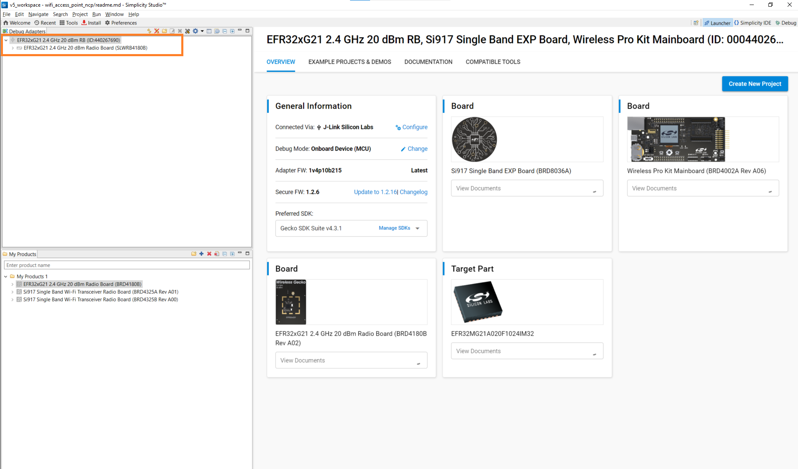
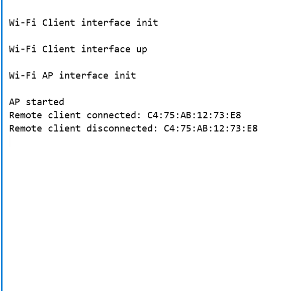

# Concurrent Mode

## 1 Purpose/Scope

This application demonstrates how to configure the SiWx91x in concurrent mode i.e., in both Wi-Fi Station mode (STA instance) and Access Point mode (SoftAP instance).
In this example application, the SiWx91x's STA instance gets connected to a wireless Access Point and gets an IP address.

## 2 Prerequisites/Setup Requirements

### 2.1 Hardware Requirements

- Windows PC
- Wireless Access Point
- **SoC Mode**:
  - Silicon Labs [BRD4325A, BRD4325B, BRD4325C, BRD4325G, BRD4338A](https://www.silabs.com/)
- **NCP Mode**:
  - Silicon Labs [BRD4180B](https://www.silabs.com/); **AND**
  - Host MCU Eval Kit. This example has been tested with:
    - Silicon Labs [WSTK + EFR32MG21](https://www.silabs.com/development-tools/wireless/efr32xg21-bluetooth-starter-kit)

### 2.2 Software Requirements

- Simplicity Studio IDE 
  - Download the [Simplicity Studio IDE](https://www.silabs.com/developers/simplicity-studio).
  - Follow the [Simplicity Studio user guide](https://docs.silabs.com/simplicity-studio-5-users-guide/1.1.0/ss-5-users-guide-getting-started/install-ss-5-and-software#install-ssv5) to install Simplicity Studio IDE.

### 2.3 Set up Diagram

#### SoC Mode

Set up diagram for SoC mode:


#### NCP Mode  

Set up diagram for NCP mode:


**NOTE**:

- The Host MCU platform (EFR32MG21) and the SiWx91x interact with each other through the SPI interface.

Follow the [Getting Started with Wiseconnect3 SDK](https://docs.silabs.com/wiseconnect/latest/wiseconnect-getting-started/) guide to set up the hardware connections and Simplicity Studio IDE.

## 3 Project Environment

- Ensure the SiWx91x loaded with the latest firmware following the [Upgrade Si91x firmware](https://docs.silabs.com/wiseconnect/latest/wiseconnect-getting-started/getting-started-with-soc-mode#upgrade-si-wx91x-connectivity-firmware)

- Ensure the latest Gecko SDK along with the extension WiSeConnect3 is added to Simplicity Studio.

### 3.1 Creating the project

#### 3.1.1 SoC mode

- Ensure the SiWx91x set up is connected to your PC.

- In the Simplicity Studio IDE, the SiWx91x SoC board will be detected under **Debug Adapters** pane as shown below.

  ****

#### 3.1.2 NCP mode

- Ensure the EFx32 and SiWx91x set up is connected to your PC.

- In the Simplicity Studio IDE, the EFR32 board will be detected under **Debug Adapters** pane as shown below.

  ****

### 3.2 Importing the project

- Studio should detect your board. Your board will be shown here. Click on the board detected and go to **EXAMPLE PROJECTS & DEMOS** section 

#### SOC Mode

- Select **Wi-Fi - Concurrent Mode(SOC)** test application

  ****

- Click 'Create'. The "New Project Wizard" window appears. Click 'Finish'

  ****

#### NCP Mode

- Select **Wi-Fi - Concurrent Mode(NCP)** test application

  ****

- Click 'Create'. The "New Project Wizard" window appears. Click 'Finish'

  ****

### 3.3 Set up for application prints

#### 3.3.1 Teraterm set up - for BRD4325A, BRD4325B, BRD4325C, BRD4325G

You can use either of the below USB to UART converters for application prints.

1. Set up using USB to UART converter board.

   - Connect Tx (Pin-6) to P27 on WSTK
   - Connect GND (Pin 8 or 10) to GND on WSTK

   ****

2. Set up using USB to UART converter cable.

   - Connect RX (Pin 5) of TTL convertor to P27 on WSTK
   - Connect GND (Pin1) of TTL convertor to GND on WSTK

   ****

3. Open the Teraterm tool.

   - For SoC mode, choose the serial port to which USB to UART converter is connected and click on **OK**.

     ****

**Note:** For Other 917 SoC boards please refer section #3.3.2

#### 3.3.2 **Teraterm set up - for NCP and SoC modes**

1. Open the Teraterm tool.

- choose the J-Link port and click on **OK**.
    
    ****

2. Navigate to the Setup → Serial port and update the baud rate to **115200** and click on **OK**.

    ****

    ****

## 4 Application Build Environment

### 4.1 Configure the Application

The application can be configured to suit user requirements and development environment. Read through the following sections and make any changes needed.

#### 4.1.1 In the Project explorer pane, open the **app.c** file. Configure the following parameters based on your requirements

- **STA instance related parameters**

  - DEFAULT_WIFI_CLIENT_PROFILE_SSID refers to the name to which the Si91x module gets connected to.

  	```c
  	#define DEFAULT_WIFI_CLIENT_PROFILE_SSID               "YOUR_AP_SSID"
  	```

	- DEFAULT_WIFI_CLIENT_CREDENTIAL refers to the secret key if the Access point is configured in WPA-PSK/WPA2-PSK security modes.

  	```c
  	#define DEFAULT_WIFI_CLIENT_CREDENTIAL                 "YOUR_AP_PASSPHRASE"
  	```
  	
	- DEFAULT_WIFI_CLIENT_SECURITY_TYPE refers to the security type if the Access point is configured in WPA/WPA2 or mixed security modes.

  	```c
  	#define DEFAULT_WIFI_CLIENT_SECURITY_TYPE              SL_WIFI_WPA2 
  	```
- Other STA instance configurations can be modified if required in `wifi_client_profile` configuration structure.

- **AP instance related parameters**

	- DEFAULT_WIFI_AP_PROFILE_SSID refers to the name of the WiSeConnect Access point would be created.

  	```c
  	#define DEFAULT_WIFI_AP_PROFILE_SSID                   "MY_AP_SSID"
  	```

	- DEFAULT_WIFI_AP_CREDENTIAL refers to the secret key of the WiSeConnect Access point would be created.

  	```c
  	#define DEFAULT_WIFI_AP_CREDENTIAL                     "MY_AP_PASSPHRASE"
    ```

> Note:
>
> 1. In concurrent mode, STA and AP should be configured on the same channel. The STA instance shall first scan for the specified external AP, wherein the channel number of AP is fetched and passed as an argument during SoftAP creation.
> 2. Valid values for CHANNEL_NO are 1 to 11 in 2.4GHz band and 36 to 48 & 149 to 165 in 5GHz. In this example, default configured band is 2.4GHz.

- Other STA instance configurations can be modified if required in `default_wifi_ap_profile` configuration structure.

> Note:
>
> 1. This application is not providing the facility to configure the Access Point’s IP Parameters. Default IP address of the Silicon Labs Access point is **192.168.100.76**
> 2. In concurrent mode, the IP networks of Silicon Labs STA and Silicon Labs Access Point both should be different. Configure Wireless Access Point IP network(Ex: 192.168.0.1) other than Silicon Labs Access point IP network.

#### 4.1.2 Open **sl_wifi_device.h** file. User can also refer the `sl_wifi_default_concurrent_configuration` and can modify/create configurations as per their needs and requirements
>
> Note:
>
> - In `sl_wifi_default_concurrent_configuration`, `oper_mode` must be `SL_SI91X_CONCURRENT_MODE` for this example.

### 4.2 Build the Application

#### - SoC Mode : Build as Concurrent_mode Example

   ****

#### - NCP Mode : Build as Concurrent_mode Example

   ****

### 4.3 Run and Test the application

1. Once the build was successful, right click on project and select **Debug As → Silicon Labs ARM Program** to program the device as shown in below image.

#### - SoC Mode

   ****

#### - NCP Mode 

   ****

2. As soon as the debug process is completed, the application control branches to the main().

3. Click on the **Resume** icon in the Simplicity Studio IDE toolbar to run the application.

   ****

4. After the program gets executed, SiWx91x connects to the access point as a Station. On other hand, SiWx91x advertizes itself as an access point with provided configurations mentioned above.

### 4.4 Application Output

- SoC mode & NCP mode:

   ****

### Note

For NCP mode, following defines have to enabled manually in preprocessor setting of example project

- For 917A0 expansion board, enable CHIP_917 = 1
- For 917B0 1.2 expansion board, enable CHIP_917 = 1, CHIP_917B0 = 1
- For 917B0 2.0 expansion board, enable CHIP_917 = 1, CHIP_917B0 = 1, SI917_RADIO_BOARD_V2 = 1 (This is enabled by default for all examples)