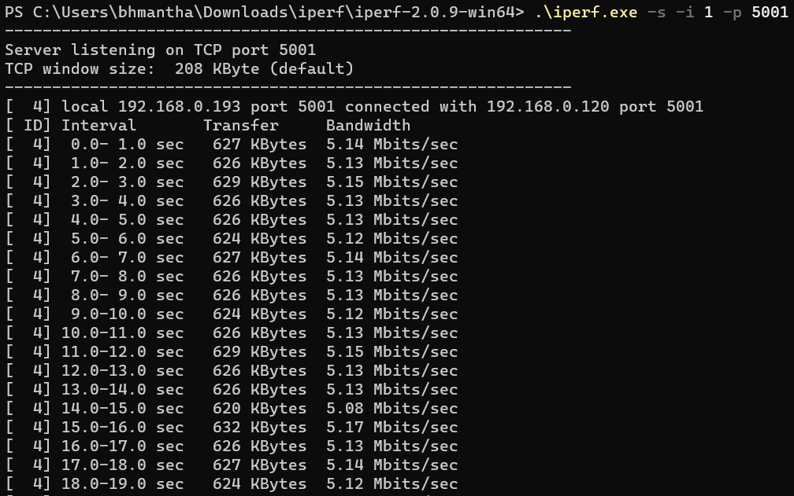

# Wi-Fi - Concurrent Mode

## Table of Contents

- [Purpose/Scope](#purposescope)
- [Prerequisites/Setup Requirements](#prerequisitessetup-requirements)
  - [Hardware Requirements](#hardware-requirements)
  - [Software Requirements](#software-requirements)
  - [Setup Diagram](#setup-diagram)
- [Getting Started](#getting-started)
- [Application Build Environment](#application-build-environment)
- [Test the Application](#test-the-application)

## Purpose/Scope

This application measures the throughput in both AP and Station mode and shows how to configure the SiWx91x in concurrent mode, i.e., in both Wi-Fi Station mode (STA instance) and Access Point mode (SoftAP instance).
In this application, the SiWx91x's STA instance gets connected to a wireless Access Point and gets an IP address.

## Prerequisites/Setup Requirements

### Hardware Requirements

- Windows PC
- Wireless Access Point
- **SoC Mode**:
  - Standalone
    - BRD4002A Wireless Pro Kit Mainboard [SI-MB4002A]
    - Radio Boards 
  	  - BRD4338A [SiWx917-RB4338A]
    	- BRD4343A [SiWx917-RB4343A]
  - Kits
  	- SiWx917 Pro Kit [Si917-PK6031A](https://www.silabs.com/development-tools/wireless/wi-fi/siwx917-pro-kit?tab=overview)
  	- SiWx917 Pro Kit [Si917-PK6032A]
    - SiWx917 AC1 Module Explorer Kit (BRD2708A)
  	
- **NCP Mode**:
  - Standalone
    - BRD4002A Wireless Pro Kit Mainboard [SI-MB4002A]
    - EFR32xG24 Wireless 2.4 GHz +10 dBm Radio Board [xG24-RB4186C](https://www.silabs.com/development-tools/wireless/xg24-rb4186c-efr32xg24-wireless-gecko-radio-board?tab=overview)
	- EFR32FG25 863-876 MHz +16 dBm Radio Board [FG25-RB4271A](https://www.silabs.com/development-tools/wireless/proprietary/fg25-rb4271a-efr32fg25-radio-board?tab=overview)
    - NCP Expansion Kit with NCP Radio Boards
      - (BRD4346A + BRD8045A) [SiWx917-EB4346A]
      - (BRD4357A + BRD8045A) [SiWx917-EB4357A]
  - Kits
  	- EFR32xG24 Pro Kit +10 dBm [xG24-PK6009A](https://www.silabs.com/development-tools/wireless/efr32xg24-pro-kit-10-dbm?tab=overview)
  - Interface and Host MCU Supported
    - SPI - EFR32 
    - UART - EFR32

### Software Requirements

- Simplicity Studio

### Setup Diagram


**NOTE**:

- The Host MCU platform (EFR32MG21) and the SiWx91x interact with each other through the SPI interface.

## Getting Started

Refer to the instructions [here](https://docs.silabs.com/wiseconnect/latest/wiseconnect-getting-started/) to:

- [Install Simplicity Studio](https://docs.silabs.com/wiseconnect/latest/wiseconnect-developers-guide-developing-for-silabs-hosts/#install-simplicity-studio)
- [Install WiSeConnect 3 extension](https://docs.silabs.com/wiseconnect/latest/wiseconnect-developers-guide-developing-for-silabs-hosts/#install-the-wi-se-connect-3-extension)
- [Connect your device to the computer](https://docs.silabs.com/wiseconnect/latest/wiseconnect-developers-guide-developing-for-silabs-hosts/#connect-si-wx91x-to-computer)
- [Upgrade your connectivity firmware ](https://docs.silabs.com/wiseconnect/latest/wiseconnect-developers-guide-developing-for-silabs-hosts/#update-si-wx91x-connectivity-firmware)
- [Create a Studio project ](https://docs.silabs.com/wiseconnect/latest/wiseconnect-developers-guide-developing-for-silabs-hosts/#create-a-project)

For details on the project folder structure, see the [WiSeConnect Examples](https://docs.silabs.com/wiseconnect/latest/wiseconnect-examples/#example-folder-structure) page.

## Application Build Environment

The application can be configured to suit your requirements and development environment. Read through the following sections and make any changes needed.
- In the Project explorer pane, open the **app.c** file. Configure the following parameters based on your requirements:

- STA instance related parameters:

  - DEFAULT_WIFI_CLIENT_PROFILE_SSID refers to the name to which the Si91x module gets connected to.

  	```c
  	#define DEFAULT_WIFI_CLIENT_PROFILE_SSID               "YOUR_AP_SSID"
  	```

  - DEFAULT_WIFI_CLIENT_CREDENTIAL refers to the secret key if the access point is configured in WPA-PSK/WPA2-PSK security modes.

  	```c
  	#define DEFAULT_WIFI_CLIENT_CREDENTIAL            "YOUR_AP_PASSPHRASE"
  	```
  	
  - DEFAULT_WIFI_CLIENT_SECURITY_TYPE refers to the security type if the access point is configured in WPA/WPA2 or mixed security modes.

  	```c
  	#define DEFAULT_WIFI_CLIENT_SECURITY_TYPE              SL_WIFI_WPA2 
  	```
- Other STA instance configurations can be modified if required in `wifi_client_profile` configuration structure.

- AP instance related parameters:

	- DEFAULT_WIFI_AP_PROFILE_SSID refers to the SSID of the WiSeConnect softAP that would be created.

  	```c
  	#define DEFAULT_WIFI_AP_PROFILE_SSID                   "MY_AP_SSID"
  	```

	- DEFAULT_WIFI_AP_CREDENTIAL refers to the secret key of the WiSeConnect softAP that would be created.

  	```c
  	#define DEFAULT_WIFI_AP_CREDENTIAL                     "MY_AP_PASSPHRASE"
    ```

> Note:
>
> 1. In concurrent mode, STA and AP should be configured on the same channel. The STA instance shall first scan for the specified external AP, wherein the channel number of AP is fetched and passed as an argument during SoftAP creation.
> 2. Valid values for CHANNEL_NO are 1 to 11 in 2.4 GHz band and 36 to 48 and 149 to 165 in 5 GHz. In this example, default configured band is 2.4 GHz.

- Other STA instance configurations can be modified if required in `default_wifi_ap_profile` configuration structure.

> Note:
>
> 1. This application is not providing the facility to configure the access point’s IP Parameters. Default IP address of the Silicon Labs access point is **192.168.100.76**.
> 2. In concurrent mode, the IP networks of Silicon Labs STA and Silicon Labs access point both should be different. Configure Wireless Access Point IP network (Ex: 192.168.0.1) other than Silicon Labs access point IP network.

#### Open **sl_wifi_device.h** file. You can also refer to `sl_wifi_default_concurrent_configuration` and modify/create configurations as per your needs and requirements.
>
> Note:
>
> - In `sl_wifi_default_concurrent_configuration`, `oper_mode` must be `SL_SI91X_CONCURRENT_MODE` for this example.

> Note: 
> You can configure default region-specific regulatory information using `sl_wifi_region_db_config.h`.

Configure the following parameters in `app.c` to test throughput app as per requirements:

  - Client/Server IP Settings

      ```c
      #define LISTENING_PORT     <local_port>       // Local port to use
      #define SERVER_PORT        <remote_port>      // Remote server port
      #define SERVER_IP  "192.168.0.100"    // Remote server IP address
      #define SOCKET_ASYNC_FEATURE 1                // Type of socket used. Synchronous = 0, Asynchronous = 1
	  #define LISTEN_ON_AP_INTERFACE 1  // DUT wait on recieve either on STA or AP interface
	  To listen_on_station = 0, listen_on_ap = 1
      ```

  - Throughput Measurement Types

    - The application may be configured to measure throughput using UDP, TCP, or TLS packets. Choose the measurement type using the `THROUGHPUT_TYPE` macro.

      ```c
      #define THROUGHPUT_TYPE  TCP_TX     // Selects the throughput option

      #define TCP_TX           0   // SiWx91x transmits packets to remote TCP client
      #define TCP_RX           1   // SiWx91x receives packets from remote TCP server
      #define UDP_TX           2   // SiWx91x transmits packets to remote UDP client
      #define UDP_RX           3   // SiWx91x receives packets from remote UDP server
      ```

  - Throughput Test options

      ```c
      #define BYTES_TO_SEND     (1 << 29)     // To measure TX throughput with 512 MB data transfer
      #define BYTES_TO_RECEIVE  (1 << 20)     // To measure RX throughput with 1 MB data transfer
      #define TEST_TIMEOUT      10000         // Throughput test timeout in ms
      ```
## Test the Application

Refer to the instructions [here](https://docs.silabs.com/wiseconnect/latest/wiseconnect-getting-started/) to:

- Build the application.
>
> Note: 
> - The default SSID is "MY_AP_SSID" and passphrase is "MY_AP_PASSPHRASE". You may either use these or modify them as described in the [Application Build Environment](#application-build-environment) section.
- Flash, run, and debug the application.

   

### To Run Server

#### UDP Tx Throughput

To measure UDP Tx throughput, configure the SiWx91x as a UDP client and start a UDP server on the remote PC. To establish UDP Server on remote PC, open [iPerf Application](https://sourceforge.net/projects/iperf2/files/iperf-2.0.8-win.zip/download) and run the command below from the downloaded folder's path in the command prompt.
The iPerf command to start the UDP server on the PC is:

  > `C:\> iperf.exe -s -u -p <SERVER_PORT> -i 1`
  >
  > For example ...
  >
  > `C:\> iperf.exe -s -u -p 5001 -i 1`

  

#### UDP Rx Throughput

To measure UDP Rx throughput, configure the SiWx91x as a UDP server and start a UDP client on the remote PC.
The iPerf command to start the UDP client is:

  > `C:\> iperf.exe -c <Module_IP> -u -p <LISTENING_PORT> -i 1 -b <Bandwidth> -t <time interval in seconds>`
  >
  > For example ...
  >
  > `C:\> iperf.exe -c 192.168.0.100 -u -p 5001 -i 1 -b 70M -t 30`  

  

#### TCP Tx Throughput

To measure TCP Tx throughput, configure the SiWx91x as a TCP client and start a TCP server on the remote PC. To establish TCP Server on the remote PC, open [iPerf Application](https://sourceforge.net/projects/iperf2/files/iperf-2.0.8-win.zip/download) and run the command below from the installed folder's path in the command prompt.
The iPerf command to start the TCP server is:
  
  > `C:\> iperf.exe -s -p <SERVER_PORT> -i 1`
  >
  > For example ...
  >
  > `C:\> iperf.exe -s -p 5001 -i 1`

  

#### TCP Rx Throughput

To measure TCP Rx throughput, configure the SiWx91x as TCP server and start a TCP client on the remote PC.
The iPerf command to start the TCP client is:

  > `C:\> iperf.exe -c <Module_IP> -p <LISTENING_PORT> -i 1 -t <time interval in sec>`
  >
  > For example ...
  >
  > `C:\> iperf.exe -c 192.168.0.100 -p 5001 -i 1 -t 30`  

  
