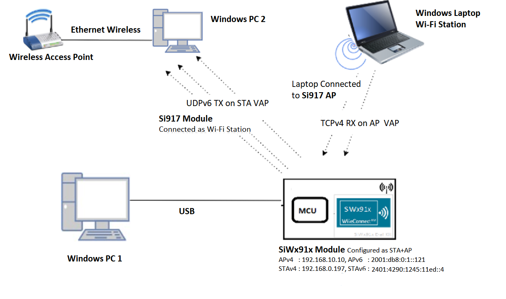
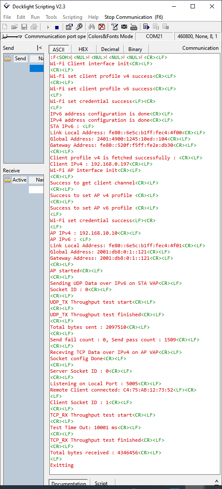

# Wi-Fi - Concurrent Mode Dual IP

## Table of Contents

- [Wi-Fi - Concurrent Mode Dual IP](#wi-fi---concurrent-mode-dual-ip)
  - [Table of Contents](#table-of-contents)
  - [Purpose/Scope](#purposescope)
  - [Prerequisites/Setup Requirements](#prerequisitessetup-requirements)
    - [Hardware Requirements](#hardware-requirements)
    - [Software Requirements](#software-requirements)
    - [Setup Diagram](#setup-diagram)
  - [Getting Started](#getting-started)
  - [Application Build Environment](#application-build-environment)
      - [Open **sl\_wifi\_device.h** file. You can also refer to `sl_wifi_default_concurrent_v6_configuration` and modify/create configurations as per your needs and requirements.](#open-sl_wifi_deviceh-file-you-can-also-refer-to-sl_wifi_default_concurrent_v6_configuration-and-modifycreate-configurations-as-per-your-needs-and-requirements)
      - [Configure the following parameters in **app.c** to test throughput app as per requirements](#configure-the-following-parameters-in-appc-to-test-throughput-app-as-per-requirements)
  - [Test the Application](#test-the-application)
    - [UDP Tx on IPv6](#udp-tx-on-ipv6)
    - [TCP Rx on IPv4](#tcp-rx-on-ipv4)
  - [Application Output](#application-output)

## Purpose/Scope

This application demonstrates how to configure the SiWx91x in concurrent mode, i.e., in both Wi-Fi Station mode (STA instance) and Access Point mode (SoftAP instance).

It showcases support for both IPv4 and IPv6 addressing, along with data transfer capabilities, i.e., UDPv6 TX data transfer in SiWx91x STA mode and TCPv4 RX data transfer in SoftAP mode. The SiWx91x opens a UDPv6 client socket on the SiWx91x STA instance and sends data to the UDPv6 server connected to the third-party AP. On the SoftAP instance, a TCPv4 server socket is listening to receive data from a TCPv4 client connected to the SoftAP.

## Prerequisites/Setup Requirements

### Hardware Requirements

- Windows PC
- Wireless Access Point
- **SoC Mode**:
  - Standalone
    - BRD4002A Wireless Pro Kit Mainboard [SI-MB4002A]
    - Radio Boards 
  	  - BRD4338A [SiWx917-RB4338A]
  	  - BRD4343A [SiWx917-RB4343A]
  - Kits
  	- SiWx917 Pro Kit [Si917-PK6031A](https://www.silabs.com/development-tools/wireless/wi-fi/siwx917-pro-kit?tab=overview)
  	- SiWx917 Pro Kit [Si917-PK6032A]
    - SiWx917 AC1 Module Explorer Kit (BRD2708A)
  	
- **NCP Mode**:
  - Standalone
    - BRD4002A Wireless Pro Kit Mainboard [SI-MB4002A]
    - EFR32xG24 Wireless 2.4 GHz +10 dBm Radio Board [xG24-RB4186C](https://www.silabs.com/development-tools/wireless/xg24-rb4186c-efr32xg24-wireless-gecko-radio-board?tab=overview)
    - EFR32FG25 863-876 MHz +16 dBm Radio Board [FG25-RB4271A](https://www.silabs.com/development-tools/wireless/proprietary/fg25-rb4271a-efr32fg25-radio-board?tab=overview)
    - NCP Expansion Kit with NCP Radio Boards
      - (BRD4346A + BRD8045A) [SiWx917-EB4346A]
      - (BRD4357A + BRD8045A) [SiWx917-EB4357A]
  - Kits
  	- EFR32xG24 Pro Kit +10 dBm [xG24-PK6009A](https://www.silabs.com/development-tools/wireless/efr32xg24-pro-kit-10-dbm?tab=overview)
  - Interface and Host MCU Supported
    - SPI - EFR32 

### Software Requirements

- Simplicity Studio

### Setup Diagram



**NOTE**:

- The Host MCU platform (EFR32MG21) and the SiWx91x interact with each other through the SPI interface.

## Getting Started

Refer to the instructions [here](https://docs.silabs.com/wiseconnect/latest/wiseconnect-getting-started/) to:

- [Install Simplicity Studio](https://docs.silabs.com/wiseconnect/latest/wiseconnect-developers-guide-developing-for-silabs-hosts/#install-simplicity-studio)
- [Install WiSeConnect 3 extension](https://docs.silabs.com/wiseconnect/latest/wiseconnect-developers-guide-developing-for-silabs-hosts/#install-the-wi-se-connect-3-extension)
- [Connect your device to the computer](https://docs.silabs.com/wiseconnect/latest/wiseconnect-developers-guide-developing-for-silabs-hosts/#connect-si-wx91x-to-computer)
- [Upgrade your connectivity firmware ](https://docs.silabs.com/wiseconnect/latest/wiseconnect-developers-guide-developing-for-silabs-hosts/#update-si-wx91x-connectivity-firmware)
- [Create a Studio project ](https://docs.silabs.com/wiseconnect/latest/wiseconnect-developers-guide-developing-for-silabs-hosts/#create-a-project)

For details on the project folder structure, see the [WiSeConnect Examples](https://docs.silabs.com/wiseconnect/latest/wiseconnect-examples/#example-folder-structure) page.

## Application Build Environment

The application can be configured to suit your requirements and development environment. Read through the following sections and make any changes needed.
- In the Project explorer pane, open the **app.c** file. Configure the following parameters based on your requirements

- **SiWx91x STA instance related parameters**

  - WIFI_CLIENT_PROFILE_SSID refers to the name to which the SiWx91x module gets connected to.

  	```c
  	#define WIFI_CLIENT_PROFILE_SSID               "YOUR_AP_SSID"
  	```

  - WIFI_CLIENT_CREDENTIAL refers to the secret key if the access point is configured in WPA-PSK/WPA2-PSK security modes.

  	```c
  	#define WIFI_CLIENT_CREDENTIAL            "YOUR_AP_PASSPHRASE"
  	```
  	
  - WIFI_CLIENT_SECURITY_TYPE refers to the security type if the access point is configured in WPA/WPA2 or mixed security modes.

  	```c
  	#define WIFI_CLIENT_SECURITY_TYPE              SL_WIFI_WPA2 
  	```
- Other SiWx91x STA instance configurations can be modified if required in `wifi_client_profile_4` and `wifi_client_profile_6` configuration structure in app.c.

- **SiWx91x AP instance related parameters**

	- WIFI_AP_PROFILE_SSID refers to the SSID of the WiSeConnect softAP that would be created.

  	```c
  	#define WIFI_AP_PROFILE_SSID                   "MY_DUAL_AP_SSID"
  	```

	- WIFI_AP_CREDENTIAL refers to the secret key of the WiSeConnect softAP that would be created.

  	```c
  	#define WIFI_AP_CREDENTIAL                     "MY_AP_PASSPHRASE"
    ```
- Other SiWx91x AP instance configurations can be modified if required in `wifi_ap_profile_4` and `wifi_ap_profile_6` configuration structure.

> Note:
>
> 1. In concurrent mode, STA and AP should be configured on the same channel. The STA instance shall first scan for the specified external AP, wherein the channel number of AP is fetched and passed as an argument during SoftAP creation.
> 2. Valid values for CHANNEL_NO are 1 to 11 in 2.4 GHz band and 36 to 48 and 149 to 165 in 5 GHz. In this example, default configured band is 2.4 GHz.

> Note:
>
> 1. This application provides the facility to configure the access point’s IP Parameters. The IPv4 address for the Silicon Labs access point is **192.168.10.10** and the IPv6 address for the Silicon Labs access point is **2001:db8:0:1::121**.
> 2. In concurrent mode, the IP networks of Silicon Labs STA and Silicon Labs access point should both be different. Configure Wireless Access Point IP network (Ex: IPv4:- 192.168.0.1 and IPv6:- 2401:4290:1245:11ed::121) other than Silicon Labs access point IP network.

#### Open **sl_wifi_device.h** file. You can also refer to `sl_wifi_default_concurrent_v6_configuration` and modify/create configurations as per your needs and requirements.
>
> Note: In `sl_wifi_default_concurrent_v6_configuration`, `oper_mode` must be `SL_SI91X_CONCURRENT_MODE` for this example.

#### Configure the following parameters in **app.c** to test throughput app as per requirements

- **Client/Server IP Settings**

    ```c
    #define LISTENING_PORT     5005      // Local port used for TCP_RX on SoftAP VAP
    #define SERVER_PORT        5000      // Remote server's port used for UDP_TX on STA VAP
    #define SERVER_IP		   "2401:4901:1290:10de::1004"    // Remote server's IPv6 address used for UDP_TX on STA VAP

- **Data Transfer Test options**

    ```c
    #define BYTES_TO_SEND     (1 << 29)     // To measure TX throughput with 512 MB data transfer
    #define TEST_TIMEOUT      10000         // Throughput test timeout in ms

> **Note**: For recommended settings, see the [recommendations guide](https://docs.silabs.com/wiseconnect/latest/wiseconnect-developers-guide-prog-recommended-settings/).

## Test the Application

Refer to the instructions [here](https://docs.silabs.com/wiseconnect/latest/wiseconnect-getting-started/) to:

- Build the application.
>
> Note: 
> - The default SSID is "MY_AP_SSID" and passphrase is "MY_AP_PASSPHRASE". You may either use these or modify them as described in the [Application Build Environment](#application-build-environment) section.
- Flash, run, and debug the application.

There are two 'ends' involved when data transfer is performed: data is sent between the client end and the server end. In general, it is advisable to start the server before the client since the client will immediately begin to try to connect to the server to send data.

The following sections describe how to run the SiWx91x application together with examples for UDP and TCP iPerf configurations that run on the PC.

### UDP Tx on IPv6

To use IPv6 UDP Tx, the SiWx91x STA is configured as a UDP client and starts a UDP server on the remote PC. 
The iPerf command to start the IPv6 UDP server on remote PC is:

> `C:\> iperf.exe -s -u -V -p <SERVER_PORT> -i 1`
>
> For example ...
>
> `C:\> iperf.exe -s -u -V -p 5000 -i 1`

### TCP Rx on IPv4

To use TCPv4 Rx, the SiWx91x SoftAP is configured as a TCP server and starts a TCP client on the remote PC.
The iPerf command to start the IPv4 TCP client on remote PC is:

> `C:\> iperf.exe -c <Module_IP>-p <module_PORT> -i 1 -t <time interval in sec>`
>
> For example ...
>
> `C:\> iperf.exe -c 192.168.10.10 -p 5005 -i 1 -t 30`

The SiWx91x STA, which is configured as a UDP IPv6 client, connects to the iPerf server and sends data at configured intervals. While the SiWx91x SoftAP is configured as TCP, the IPv4 server waits for connection, and the application prints the total number of bytes sent/received on the serial console.

## Application Output

   
