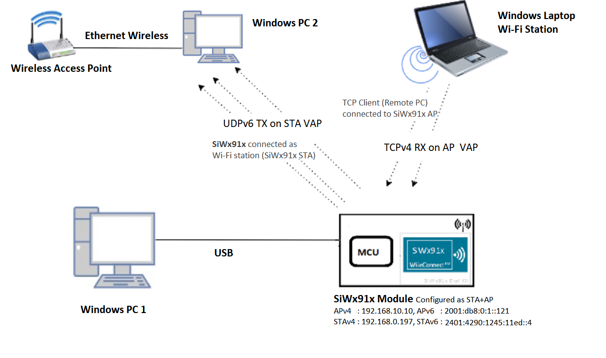

# Wi-Fi - Concurrent Mode Dual IP

## Table of Contents

- [Purpose/Scope](#purposescope)
- [Prerequisites/Setup Requirements](#prerequisitessetup-requirements)
  - [Hardware Requirements](#hardware-requirements)
  - [Software Requirements](#software-requirements)
  - [Setup Diagram](#setup-diagram)
- [Getting Started](#getting-started)
- [Application Build Environment](#application-build-environment)
- [Test the Application](#test-the-application)

## Purpose/Scope

This application demonstrates how to configure the SiWx91x in both Wi-Fi Station mode (STA instance) and Access Point mode (SoftAP instance). It showcases support for both IPv4 and IPv6 addressing, along with data transfer capabilities in both modes.

The module opens a socket on STA VAP and sends the IPv6 UDP data to the Third-Party STA connected to Third-Party AP. Another listening socket is opened on AP VAP to receive the IPv4 TCP data from Third-Party STA connected to AP-UT.

## Prerequisites/Setup Requirements

### Hardware Requirements

- Windows PC
- Wireless Access Point
- **SoC Mode**:
  - Standalone
    - BRD4002A Wireless pro kit mainboard [SI-MB4002A]
    - Radio Boards 
  	  - BRD4338A [SiWx917-RB4338A]
  - Kits
  	- SiWx917 Pro Kit [Si917-PK6031A](https://www.silabs.com/development-tools/wireless/wi-fi/siwx917-pro-kit?tab=overview)
  	- SiWx917 Pro Kit [Si917-PK6032A]
  	
- **NCP Mode**:
  - Standalone
    - BRD4002A Wireless pro kit mainboard [SI-MB4002A]
    - EFR32xG24 Wireless 2.4 GHz +10 dBm Radio Board [xG24-RB4186C](https://www.silabs.com/development-tools/wireless/xg24-rb4186c-efr32xg24-wireless-gecko-radio-board?tab=overview)
    - EFR32FG25 863-876 MHz +16 dBm Radio Board [FG25-RB4271A](https://www.silabs.com/development-tools/wireless/proprietary/fg25-rb4271a-efr32fg25-radio-board?tab=overview)
    - NCP EFR Expansion Kit with NCP Radio board (BRD4346A + BRD8045A) [SiWx917-EB4346A]
  - Kits
  	- EFR32xG24 Pro Kit +10 dBm [xG24-PK6009A](https://www.silabs.com/development-tools/wireless/efr32xg24-pro-kit-10-dbm?tab=overview)

### Software Requirements

- Simplicity Studio

### Setup Diagram



**NOTE**:

- The Host MCU platform (EFR32MG21) and the SiWx91x interact with each other through the SPI interface.

## Getting Started

Refer to the instructions [here](https://docs.silabs.com/wiseconnect/latest/wiseconnect-getting-started/) to:

- Install Studio and WiSeConnect 3 extension
- Connect your device to the computer
- Upgrade your connectivity firmware
- Create a Studio project

For details on the project folder structure, see the [WiSeConnect Examples](https://docs.silabs.com/wiseconnect/latest/wiseconnect-examples/#example-folder-structure) page.

## Application Build Environment

The application can be configured to suit user requirements and development environment. Read through the following sections and make any changes needed.
- In the Project explorer pane, open the **app.c** file. Configure the following parameters based on your requirements

- **STA instance related parameters**

  - DEFAULT_WIFI_CLIENT_PROFILE_SSID refers to the name to which the Si91x module gets connected to.

  	```c
  	#define DEFAULT_WIFI_CLIENT_PROFILE_SSID               "YOUR_AP_SSID"
  	```

  - DEFAULT_WIFI_CLIENT_CREDENTIAL refers to the secret key if the Access point is configured in WPA-PSK/WPA2-PSK security modes.

  	```c
  	#define DEFAULT_WIFI_CLIENT_CREDENTIAL            "YOUR_AP_PASSPHRASE"
  	```
  	
  - DEFAULT_WIFI_CLIENT_SECURITY_TYPE refers to the security type if the Access point is configured in WPA/WPA2 or mixed security modes.

  	```c
  	#define DEFAULT_WIFI_CLIENT_SECURITY_TYPE              SL_WIFI_WPA2 
  	```
- Other STA instance configurations can be modified if required in `wifi_client_profile_4` and `wifi_client_profile_6` configuration structure in app.c .

- **AP instance related parameters**

	- DEFAULT_WIFI_AP_PROFILE_SSID refers to the SSID of the WiSeConnect softAP that would be created.

  	```c
  	#define DEFAULT_WIFI_AP_PROFILE_SSID                   "MY_DUAL_AP_SSID"
  	```

	- DEFAULT_WIFI_AP_CREDENTIAL refers to the secret key of the WiSeConnect softAP that would be created.

  	```c
  	#define DEFAULT_WIFI_AP_CREDENTIAL                     "MY_AP_PASSPHRASE"
    ```
- Other AP instance configurations can be modified if required in `wifi_ap_profile_4` and `wifi_ap_profile_6` configuration structure.

> Note:
>
> 1. In concurrent mode, STA and AP should be configured on the same channel. The STA instance shall first scan for the specified external AP, wherein the channel number of AP is fetched and passed as an argument during SoftAP creation.
> 2. Valid values for CHANNEL_NO are 1 to 11 in 2.4GHz band and 36 to 48 & 149 to 165 in 5GHz. In this example, default configured band is 2.4GHz.


> Note:
>
> 1. This application is providing the facility to configure the Access Point’s IP Parameters. IPv4 address for the Silicon Labs Access point is **192.168.10.10** and IPv6 address for the Silicon Labs Access point is **2001:db8:0:1::121**
> 2. In concurrent mode, the IP networks of Silicon Labs STA and Silicon Labs Access Point both should be different. Configure Wireless Access Point IP network(Ex: 192.168.0.1) other than Silicon Labs Access point IP network.

#### Open **sl_wifi_device.h** file. User can also refer the `sl_wifi_default_concurrent_v6_configuration` and can modify/create configurations as per their needs and requirements
>
> Note:
>
> - In `sl_wifi_default_concurrent_v6_configuration`, `oper_mode` must be `SL_SI91X_CONCURRENT_MODE` for this example.

#### Configure the following parameters in **app.c** to test throughput app as per requirements

- **Client/Server IP Settings**

    ```c
    #define LISTENING_PORT     <local_port>       // Local port to use
    #define SERVER_PORT        <remote_port>      // Remote server port
    #define SERVER_IP		   "2401:4901:1290:10de::1004"    // Remote 

- **Data Transfer Test options**

    ```c
    #define BYTES_TO_SEND     (1 << 29)     // To measure TX throughput
    #define TEST_TIMEOUT      10000         // Throughput test timeout in ms

## Test the Application

Refer to the instructions [here](https://docs.silabs.com/wiseconnect/latest/wiseconnect-getting-started/) to:

- Build the application.
>
> Note: 
> - The default SSID is "MY_AP_SSID" and passphrase is "MY_AP_PASSPHRASE". You may either use these or modify them as described in the [Application Build Environment](#application-build-environment) section.
- Flash, run and debug the application.

There are two 'ends' involved when data transfer is performed, data is sent between the client end and the server end. In general, it is advisable to start the server before the client since the client will immediately begin to try to connect to the server to send data.

The following sections describe how to run the SiWx91x application together with examples for UDP and TCP Iperf configurations that run on the PC.

### UDP Tx on IPv6

To use IPv6 UDP Tx, configure the SiWx91x as a UDP client and start a UDP server on the remote PC.
The Iperf command to start the UDP server on the PC is:

> `C:\> iperf.exe -s -u -V -p <SERVER_PORT> -i 1`
>
> For example ...
>
> `C:\> iperf.exe -s -u -V -p 5000 -i 1`

### TCP Rx on IPv4

To use IPv4 TCP Rx, configure the SiWx91x as TCP server and start a TCP client on the remote PC.
The Iperf command to start the TCP client is:

> `C:\> iperf.exe -c <Module_IP>-p <module_PORT> -i 1 -t <time interval in sec>`
>
> For example ...
>
> `C:\> iperf.exe -c 192.168.10.10 -p 5005 -i 1 -t 30`

The SiWx91x, which is configured as a UDP/TCP server/client, connects to the iperf server/client and sends/receives data for configured intervals. While module is transmitting/receiving the data, application prints the total number of bytes sent/received in serial console.

## Application Output

   