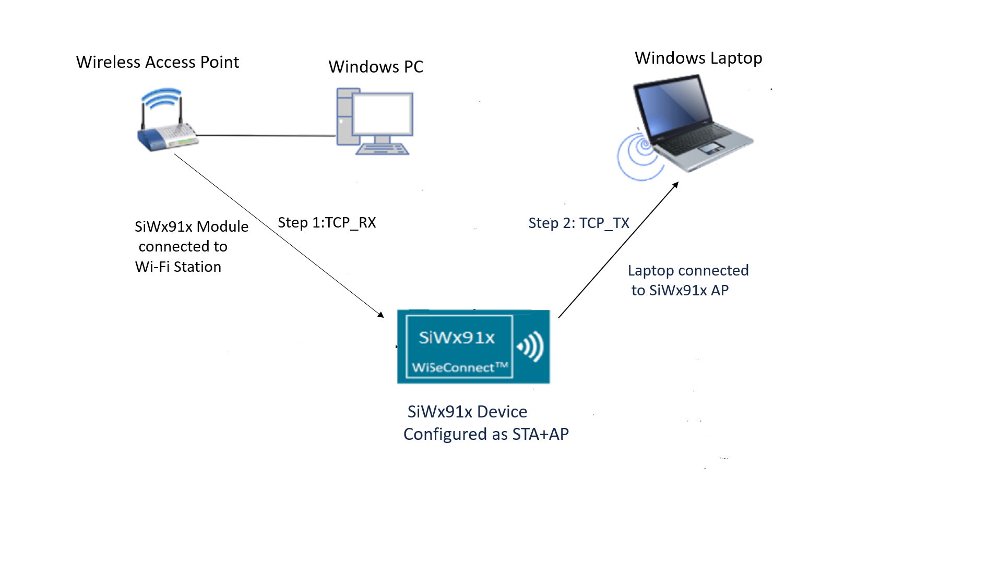
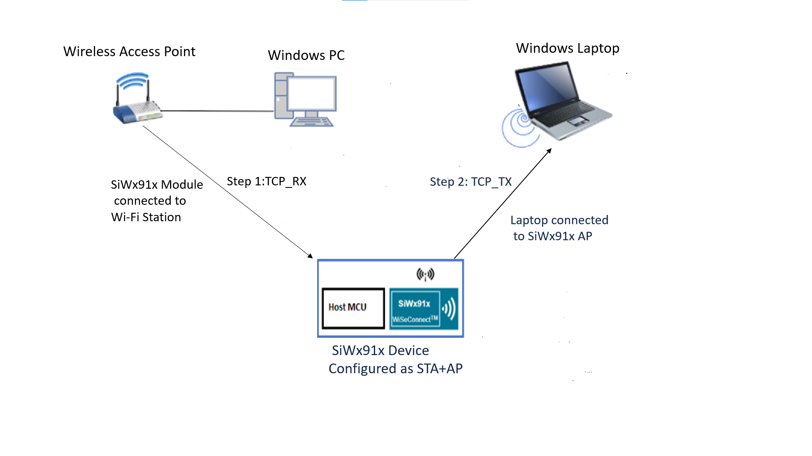
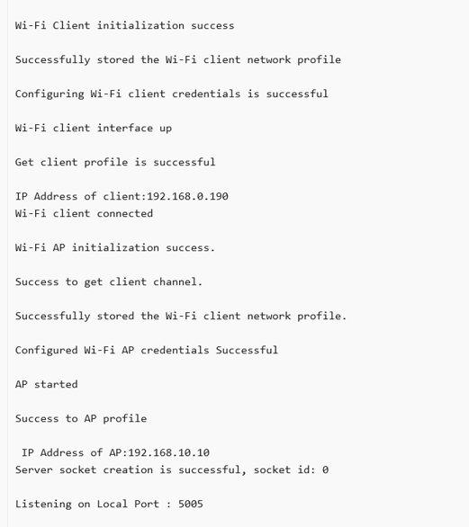
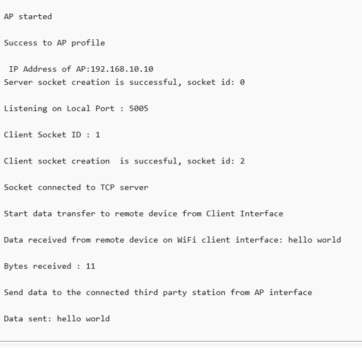
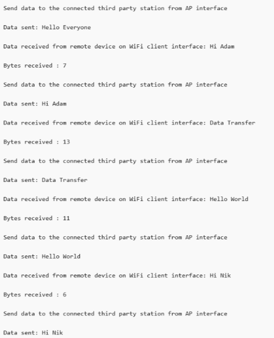

# Wi-Fi - Data Transfer

## Table of Contents

- [Wi-Fi - Data Transfer](#wi-fi---data-transfer)
  - [Table of Contents](#table-of-contents)
  - [Purpose/Scope](#purposescope)
  - [Prerequisites/Setup Requirements](#prerequisitessetup-requirements)
    - [Hardware Requirements](#hardware-requirements)
    - [Software Requirements](#software-requirements)
    - [Setup Diagram](#setup-diagram)
  - [Getting Started](#getting-started)
  - [Application Build Environment](#application-build-environment)
      - [Configure the following TCP/IP parameters in **app.c** to test this app as per requirements](#configure-the-following-tcpip-parameters-in-appc-to-test-this-app-as-per-requirements)
  - [Test the Application](#test-the-application)
    - [TCP RX](#tcp-rx)
    - [TCP TX](#tcp-tx)
  - [Application Output](#application-output)

## Purpose/Scope

This application demonstrates how to configure the SiWx91x device in both Wi-Fi Client mode (STA instance) and Access Point mode (SoftAP instance) concurrently and transfer data in bridge mode. The application creates a TCP server socket on the station interface of the SiWx91x device that receives data from a remote device. The received data is then sent to another remote device that is connected to the AP interface of the SiWx91x device over a TCP client socket.

## Prerequisites/Setup Requirements

### Hardware Requirements

- Windows PC1 (for running TCP client)
- Windows PC2 (for running TCP server)
- Wireless Access Point
- **SoC Mode**:
  - Standalone
    - BRD4002A Wireless Pro Kit Mainboard [SI-MB4002A]
    - Radio Boards 
  	  - BRD4338A [SiWx917-RB4338A](https://www.silabs.com/development-tools/wireless/wi-fi/siwx917-rb4338a-wifi-6-bluetooth-le-soc-radio-board)
  	  - BRD4343A [SiWx917-RB4343A](https://www.silabs.com/development-tools/wireless/wi-fi/siw917y-rb4343a-wi-fi-6-bluetooth-le-8mb-flash-radio-board-for-module)
  - Kits
  	- SiWx917 Pro Kit [Si917-PK6031A](https://www.silabs.com/development-tools/wireless/wi-fi/siwx917-pro-kit?tab=overview)
  	- SiWx917 Pro Kit [Si917-PK6032A]
    - SiWx917 AC1 Module Explorer Kit (BRD2708A)
  	
- **NCP Mode**:
  - Standalone
    - BRD4002A Wireless Pro Kit Mainboard [SI-MB4002A]
    - EFR32xG24 Wireless 2.4 GHz +10 dBm Radio Board [xG24-RB4186C](https://www.silabs.com/development-tools/wireless/xg24-rb4186c-efr32xg24-wireless-gecko-radio-board?tab=overview)
    - NCP Expansion Kit with NCP Radio Boards
      - (BRD4346A + BRD8045A) [SiWx917-EB4346A]
      - (BRD4357A + BRD8045A) [SiWx917-EB4357A]
  - Kits
  	- EFR32xG24 Pro Kit +10 dBm [xG24-PK6009A](https://www.silabs.com/development-tools/wireless/efr32xg24-pro-kit-10-dbm?tab=overview)
  - Interface and Host MCU Supported
    - SPI - EFR32 

### Software Requirements

- Simplicity Studio
- [iPerf Application](https://sourceforge.net/projects/iperf2/files/iperf-2.0.8-win.zip/download). iPerf is a tool for active measurements of the maximum achievable bandwidth on IP networks. It supports tuning of various parameters related to timing, buffers, and protocols (TCP and UDP with IPv4 and IPv6).

### Setup Diagram

**SoC Mode**:


**NCP Mode**:


**NOTE**:

- The Host MCU platform (EFR32MG21) and the SiWx91x interact with each other through the SPI interface.

## Getting Started

Refer to the instructions [here](https://docs.silabs.com/wiseconnect/latest/wiseconnect-getting-started/) to:

- [Install Simplicity Studio](https://docs.silabs.com/wiseconnect/latest/wiseconnect-developers-guide-developing-for-silabs-hosts/#install-simplicity-studio)
- [Install WiSeConnect extension](https://docs.silabs.com/wiseconnect/latest/wiseconnect-developers-guide-developing-for-silabs-hosts/#install-the-wi-se-connect-extension)
- [Connect your device to the computer](https://docs.silabs.com/wiseconnect/latest/wiseconnect-developers-guide-developing-for-silabs-hosts/#connect-si-wx91x-to-computer)
- [Upgrade your connectivity firmware ](https://docs.silabs.com/wiseconnect/latest/wiseconnect-developers-guide-developing-for-silabs-hosts/#update-si-wx91x-connectivity-firmware)
- [Create a Studio project ](https://docs.silabs.com/wiseconnect/latest/wiseconnect-developers-guide-developing-for-silabs-hosts/#create-a-project)

For details on the project folder structure, see the [WiSeConnect Examples](https://docs.silabs.com/wiseconnect/latest/wiseconnect-examples/#example-folder-structure) page.

## Application Build Environment

The application can be configured to suit your requirements and development environment. Read through the following sections and make any changes needed.
- In the Project explorer pane, open the **app.c** file. Configure the following parameters based on your requirements:

- **STA instance related parameters**

  - WIFI_CLIENT_PROFILE_SSID refers to the name to which the Si91x device gets connected to.

  	```c
    #define WIFI_CLIENT_PROFILE_SSID               "YOUR_AP_SSID"
  	```

  - WIFI_CLIENT_CREDENTIAL refers to the secret key if the Access point is configured in WPA-PSK/WPA2-PSK security modes.

  	```c
    #define WIFI_CLIENT_CREDENTIAL                "YOUR_AP_PASSPHRASE"
  	```
  	
  - WIFI_CLIENT_SECURITY_TYPE refers to the security type if the access point is configured in WPA/WPA2 or mixed security modes.

  	```c
    #define WIFI_CLIENT_SECURITY_TYPE              SL_WIFI_WPA_WPA2_MIXED
  	```
- **AP instance related parameters**

	- WIFI_AP_PROFILE_SSID refers to the SSID of the WiSeConnect softAP that would be created.

  	```c
   #define WIFI_AP_PROFILE_SSID                   "MY_DUAL_AP_SSID"
  	```

	- WIFI_AP_CREDENTIAL refers to the secret key of the WiSeConnect softAP that would be created.

  	```c
   #define WIFI_AP_CREDENTIAL                     "MY_AP_PASSPHRASE"
    ```
> Note:
>
> 1. In concurrent mode, STA and AP should be configured on the same channel. The STA instance shall first scan for the specified external AP, wherein the channel number of AP is fetched and passed as an argument during SoftAP creation.
> 2. Valid values for CHANNEL_NO are 1 to 11 as the supported band is 2.4 GHz.

#### Configure the following TCP/IP parameters in **app.c** to test this app as per requirements

This application is providing the facility to configure the Access Point’s IP Parameters. The default IPv4 address for the Silicon Labs Access point is defined to **192.168.10.10**.

- **Access Point IP Configurations**

 ```c
//! IP address of the module
//! E.g: 0x0A0AA8C0 == 192.168.10.10
#define DEFAULT_WIFI_MODULE_IP_ADDRESS 0x0A0AA8C0

//! IP address of netmask
//! E.g: 0x00FFFFFF == 255.255.255.0
#define DEFAULT_WIFI_SN_MASK_ADDRESS 0x00FFFFFF

//! IP address of Gateway
//! E.g: 0x0A0AA8C0 == 192.168.10.10
#define DEFAULT_WIFI_GATEWAY_ADDRESS 0x0A0AA8C0
```

- **Access Point/Wi-Fi Client TCP/IP Port Settings**

    ```c
    #define LISTENING_PORT     5005  // Default port on which the SiWx91x device STA interface listens for remote connection
    #define SERVER_PORT        5000  // Default port number on which SiWx91x device AP interface connects remote device
    ```

> **Note**: For recommended settings, please refer the [recommendations guide](https://docs.silabs.com/wiseconnect/latest/wiseconnect-developers-guide-prog-recommended-settings/).

## Test the Application

Refer to the instructions [here](https://docs.silabs.com/wiseconnect/latest/wiseconnect-getting-started/) to:

- Build the application.
- Flash, run, and debug the application.

When data transfer is performed, data is sent between the client and server. It is advisable to start the server before the client, since the client will immediately begin connecting to the server to send data.

### TCP RX

To use TCP RX, configure the SiWx91x device client interface as TCP server and start a TCP client on the remote PC.
The iPerf command to start the TCP client on the remote PC:

> `C:\> iperf.exe -c <Module_IP> -p <module_PORT> -i 1 -t <time interval in sec>`
  >
  > For example ...
  >
  > `C:\> iperf.exe -c 192.168.1.10 -p 5005 -i 1 -t 30`

### TCP TX

To use TCP TX, configure the SiWx91x device AP interface as a TCP client and start a TCP server on the remote PC. To establish TCP server on the remote PC, open [iPerf Application](https://sourceforge.net/projects/iperf2/files/iperf-2.0.8-win.zip/download) and run the below command from the installed folder's path in the command prompt.
The iPerf command to start the TCP server on remote PC:

  > `C:\> iperf.exe -s -p <SERVER_PORT> -i 1`
  >
  > For example ...
  >
  > `C:\> iperf.exe -s -p 5000 -i 1`

The SiWx91x device, which is configured as a TCP server/client, connects to the TCP server/client on the remote PC and sends/receives data continuously. While device is transmitting/receiving the data, the application prints the total number of bytes sent/received in the serial console.

## Application Output

   
   
   
