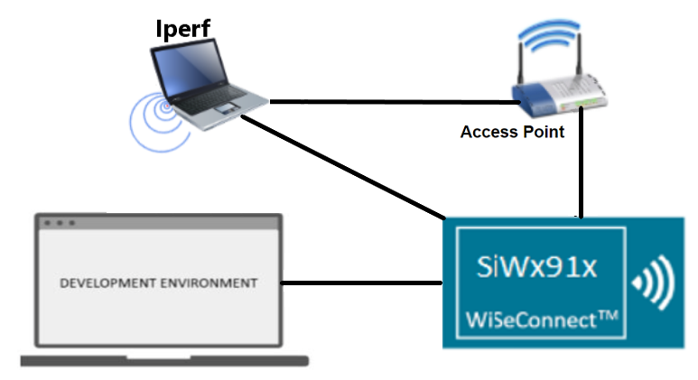
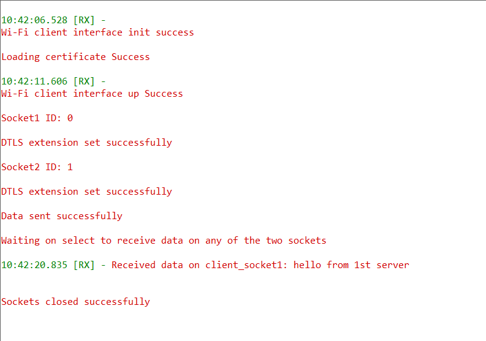
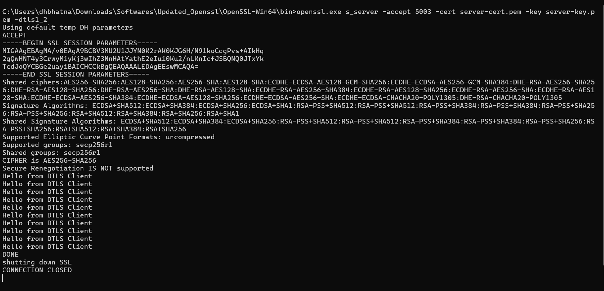

# Wi-Fi - DTLS Client

## Table of Contents

- [Wi-Fi - DTLS Client](#wi-fi---dtls-client)
  - [Table of Contents](#table-of-contents)
  - [Purpose/Scope](#purposescope)
  - [Prerequisites/Setup Requirements](#prerequisitessetup-requirements)
    - [Hardware Requirements](#hardware-requirements)
    - [Software Requirements](#software-requirements)
    - [Setup Diagram](#setup-diagram)
  - [Getting Started](#getting-started)
  - [Application Build Environment](#application-build-environment)
  - [Test the Application](#test-the-application)

## Purpose/Scope

This application demonstrates how to open a UDP client socket on SiWx917 module and use this UDP client socket with a secure connection using Datagram Transport Layer Security (DTLS) to transmit data over the socket.

- Two UDP sockets are opened over DTLS. Both the sockets uses DTLS v1.2 protocol.
- CA certificate and device certificates are loaded into module flash, because they are necessary for the key exchanges involved while using DTLS.

## Prerequisites/Setup Requirements

### Hardware Requirements

- A Windows PC
- SoC Mode:
  - Silicon Labs [BRD4388A](https://www.silabs.com/)
- NCP Mode:
  - Silicon Labs [BRD4180B](https://www.silabs.com/) **AND**
  - Host MCU Eval Kit. This example has been tested with:
    - Silicon Labs [WSTK + EFR32MG21](https://www.silabs.com/development-tools/wireless/efr32xg21-bluetooth-starter-kit)
  - Interface and Host MCU Supported
    - SPI - EFR32

### Software Requirements

- Simplicity Studio
- Windows PC (Remote PC) with openssl application

### Setup Diagram

  

## Getting Started

Refer to the instructions [here](https://docs.silabs.com/wiseconnect/latest/wiseconnect-getting-started/) to:

- [Install Simplicity Studio](https://docs.silabs.com/wiseconnect/latest/wiseconnect-developers-guide-developing-for-silabs-hosts/#install-simplicity-studio)
- [Install WiSeConnect 3 extension](https://docs.silabs.com/wiseconnect/latest/wiseconnect-developers-guide-developing-for-silabs-hosts/#install-the-wi-se-connect-3-extension)
- [Connect your device to the computer](https://docs.silabs.com/wiseconnect/latest/wiseconnect-developers-guide-developing-for-silabs-hosts/#connect-si-wx91x-to-computer)
- [Upgrade your connectivity firmware](https://docs.silabs.com/wiseconnect/latest/wiseconnect-developers-guide-developing-for-silabs-hosts/#update-si-wx91x-connectivity-firmware)
- [Create a Studio project](https://docs.silabs.com/wiseconnect/latest/wiseconnect-developers-guide-developing-for-silabs-hosts/#create-a-project)

For details on the project folder structure, see the [WiSeConnect Examples](https://docs.silabs.com/wiseconnect/latest/wiseconnect-examples/#example-folder-structure) page.

## Application Build Environment

The application can be configured to suit user requirements and development environment. Read through the following sections and make any changes needed.

The application uses the default configurations as provided in the **default_wifi_ap_profile** in ``sl_net_default_values.h`` and the user can choose to configure these parameters as needed.

1. In the Project Explorer pane, expand the **config** folder and open the **sl_net_default_values.h** file. Configure the following parameters to enable your Silicon Labs Wi-Fi device to connect to your Wi-Fi network.

   - STA instance related parameters:

     - DEFAULT_WIFI_CLIENT_PROFILE_SSID refers to the name with which Wi-Fi network that shall be advertised and Si91X module is connected to it.

       ```c
       #define DEFAULT_WIFI_CLIENT_PROFILE_SSID               "YOUR_AP_SSID"      
       ```

     - DEFAULT_WIFI_CLIENT_CREDENTIAL refers to the secret key if the Access point is configured in WPA-PSK/WPA2-PSK security modes.

       ```c
       #define DEFAULT_WIFI_CLIENT_CREDENTIAL                 "YOUR_AP_PASSPHRASE" 
       ```

     - DEFAULT_WIFI_CLIENT_SECURITY_TYPE refers to the security type if the Access point is configured in WPA/WPA2 or mixed security modes.

        ```c
        #define DEFAULT_WIFI_CLIENT_SECURITY_TYPE              SL_WIFI_WPA2 
        ```
  
   - Other STA instance configurations can be modified if required in the `default_wifi_client_profile` configuration structure.

2. Configure the following parameters in **app.c** to test the tls client app as per requirements.

   - Client/Server IP Settings

     ```c
     #define SERVER_PORT1        <remote_port>      // Remote server port
     #define SERVER_PORT2        <remote_port>      // Remote server port
     #define SERVER_IP          "192.168.0.100"     // Remote server IP address
     ```

   - `sl_wifi_device_configuration_t` from **app.c** should be modified as per the following requirements:

      - The [sl_net_set_credential()](https://docs.silabs.com/wiseconnect/3.0.13/wiseconnect-api-reference-guide-nwk-mgmt/net-credential-functions#sl-net-set-credential) API expects the certificate in the form of linear array. Convert the pem certificate into linear array form using python script provided in the SDK `<SDK>/resources/scripts/certificate_script.py`.

        For example, if the certificate is `ca-certificate.pem`, enter the command in the following way:

        `python certificate_script.py ca-certificate.pem`

      - The script will generate `ca-certificate.pem` in which one linear array named ca-certificate contains the certificate.

         The root CA certificate needs to be converted as mentioned above.

      - After the conversion, place the converted file in `<SDK>/resources/certificates/` path and include the certificate file in **app.c**.

         ```c
        // Certificate includes
        #include "ca-certificate.pem.h"
       
        // Load Security Certificates
        status = sl_net_set_credential(SL_NET_TLS_SERVER_CREDENTIAL_ID(0), SL_NET_SIGNING_CERTIFICATE, ca-certificate, sizeof(ca-certificate) - 1);
         ```

> **Note** :
 The included self-signed certificates will work for local OpenSSL server. For cloud servers, using default certificates for a cloud connection does not work. Replace the default certificates with valid certificates when connecting to Cloud Server.

> **Note**: For recommended settings, see the [recommendations guide](https://docs.silabs.com/wiseconnect/latest/wiseconnect-developers-guide-prog-recommended-settings/).

## Test the Application

Refer to the instructions [here](https://docs.silabs.com/wiseconnect/latest/wiseconnect-getting-started/) to:

1. Build the application.
2. Flash, run, and debug the application.

    

3. After making any custom configuration changes required, build, download, and run the application as below.

   - Copy the certificates server-cert and server-key into Openssl/bin folder in the Windows PC2 (Remote PC).
   - In Windows PC2 (Remote PC) which is connected to AP, run the Openssl and run two DTLS servers by giving the following command:

     ```sh
      > openssl.exe s_server -accept<SERVER_PORT> -cert <server_certificate_file_path> -key <server_key_file_path> -dtls<tls_version>

         Example:
      > openssl.exe s_server -accept 5002 -cert server-cert.pem -key server-key.pem -dtls1_2
     ```

4. After the program gets executed, SiWx91x EVK would be connected to access point having the configuration same as that of in the application and get IP.
   - The SiWx91x EVK which is configured as DTLS client will connect to remote DTLS server and sends number of packets configured in NUMBER_OF_PACKETS.
   - After sending the packets, the application calls `select` and waits until it receives any packet from the server.

   - EVK connects to remote DTLS server-1.

     

   - EVK connects to remote DTLS server-2.
  
     
